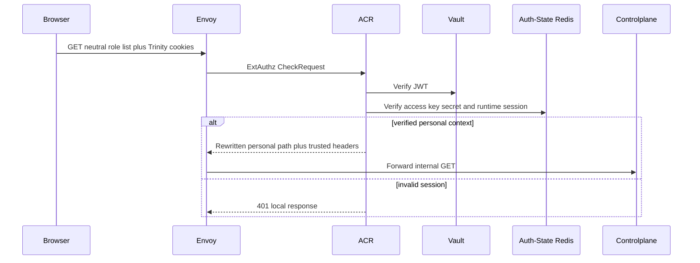
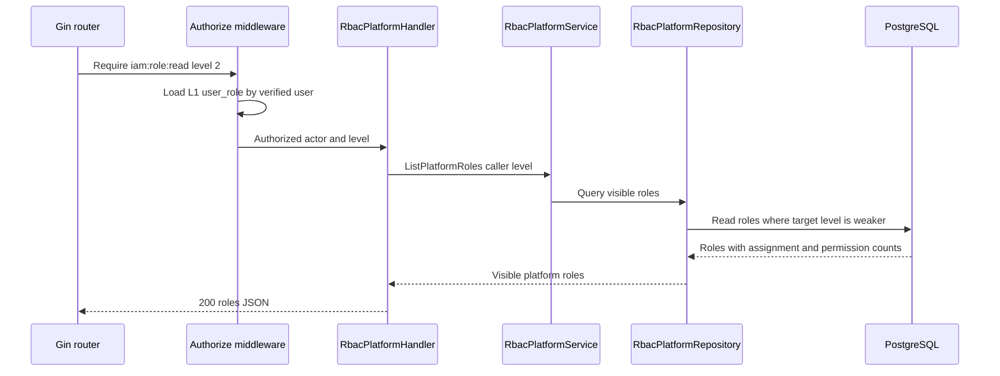

# Platform Role List — God View

Đây là workflow đọc các platform role mà platform actor được phép quản lý. Nó
không đọc tenant role và không có fallback từ tenant sang personal.

## API scope and contract

| Part | Contract |
|---|---|
| Browser API | `GET /api/v1/iam/rbac/role` |
| Payload | None |
| ACR | With verified personal context, rewrite to `/api/v1/personal/iam/rbac/role`, overwrite `:path`, set `x-original-path`, inject verified identity/context headers |
| Authorization | `Authorize("iam:role:read", L1Registry, "2")` loads `user_role`; role list is restricted to `role_level > caller_level` |

Direct `/personal/**` browser access is denied. This is a platform-owned route,
not `/me`.

## Phase 1 — Client → Envoy → ACR

## Phase 2 — Controlplane authorizes and lists visible roles

| Result | Response |
|---|---|
| Authorized | `200 {"roles":[...]}` |
| Missing role grant or level | `403` |
| L1/repository failure | `500`; no tenant fallback |
