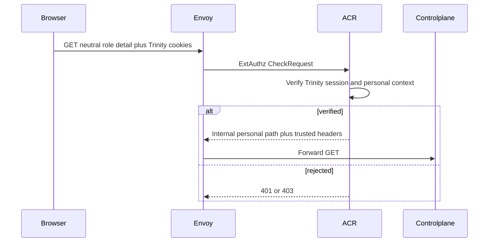
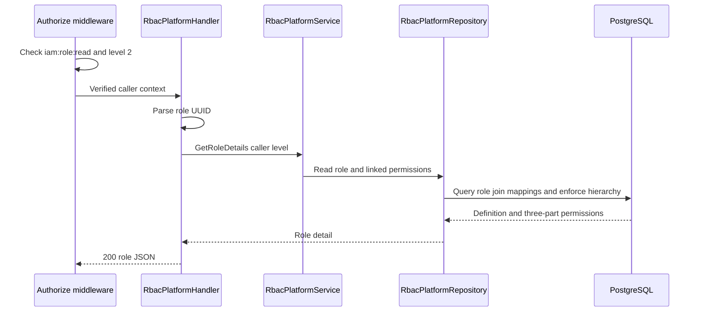

# Platform Role Detail Read — God View

Workflow này đọc một platform role và catalog permissions đã gắn với role đó.
Actor chỉ được đọc role có authority thấp hơn mình theo numeric hierarchy.

## API scope and contract

| Part | Contract |
|---|---|
| Browser API | `GET /api/v1/iam/rbac/role/:role_id` |
| Path input | `role_id` UUID |
| ACR | Verify personal session then rewrite to `/api/v1/personal/iam/rbac/role/:role_id`, set `x-original-path`, overwrite trusted headers |
| Authorization | `Authorize("iam:role:read", L1Registry, "2")` over `user_role`; repository requires `target.role_level > caller_level` |

## Phase 1 — Client → Envoy → ACR

## Phase 2 — Controlplane reads the hierarchy-scoped role

| Result | Response |
|---|---|
| Found and visible | `200 {"role":{...,"permissions":[...]}}` |
| Invalid UUID | `400` |
| Absent role | `404` |
| Equal or stronger target role | `403` |
| Store failure | `500` |

