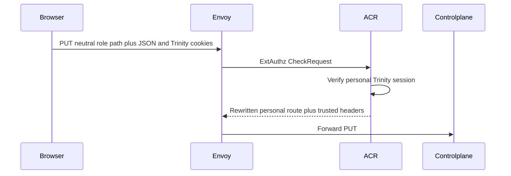
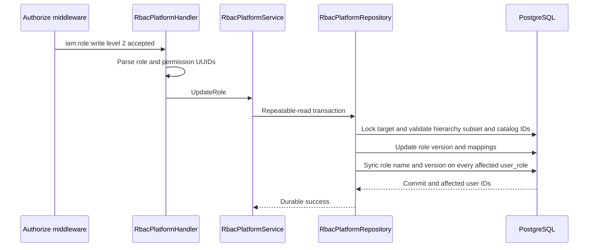
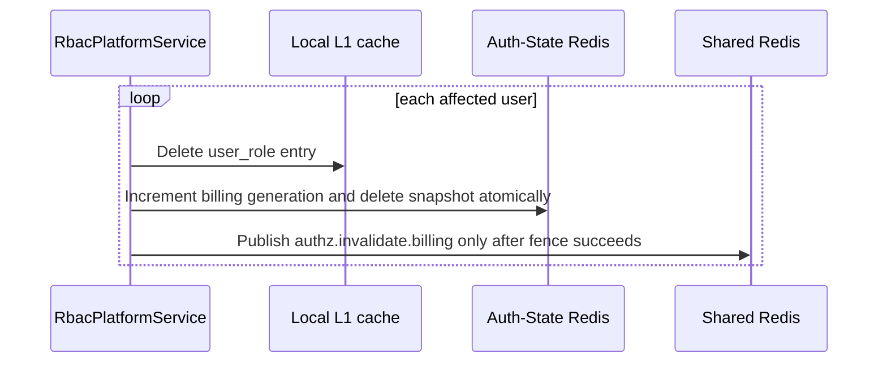

# Platform Role Update — God View

Workflow này thay name, description và permission set của một platform role,
đồng bộ role metadata trên affected `user_role`, rồi invalidate authorization
state sau durable commit. Permission projection được compile JIT ở lần load kế tiếp.

## API scope and contract

| Part | Contract |
|---|---|
| Browser API | `PUT /api/v1/iam/rbac/role/:role_id` |
| Payload | `name`, `description`, non-empty `permission_ids` UUID list |
| ACR | Verify personal session, rewrite `/api/v1/personal/iam/rbac/role/:role_id`, set `x-original-path`, inject verified actor headers |
| Authorization | `Authorize("iam:role:write", L1Registry, "2")`; repository locks target role, verifies weaker hierarchy and actor permission subset |

## Phase 1 — Client → Envoy → ACR

## Phase 2 — Controlplane commits role and assignment metadata

## Phase 3 — Authorization invalidation after commit

If any post-commit invalidation fails, the handler returns `500`; the durable
role update remains committed. Auth-State generation is the correctness fence;
Shared Redis fanout is only best-effort replica L1 invalidation.

| Other result | Response |
|---|---|
| Invalid ID/body or invalid permission selection | `400` |
| Role absent | `404` |
| Permission subset or hierarchy denied | `403` |
