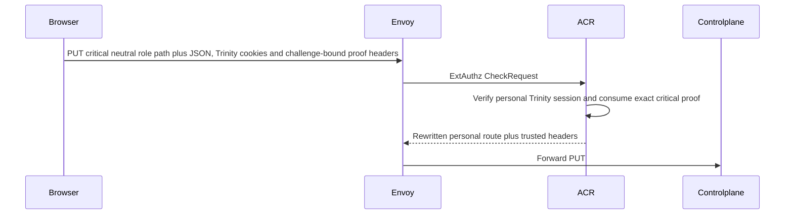
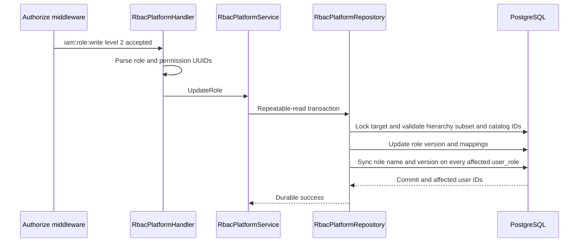
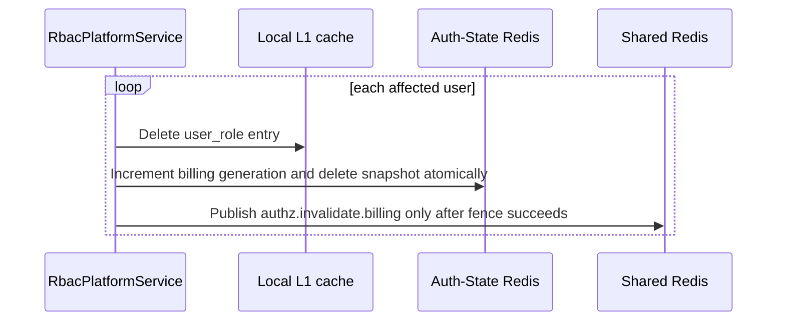

# Platform Role Update — God View

Workflow này thay name, description và permission set của một platform role,
đồng bộ role metadata trên affected `user_role`, rồi invalidate authorization
state sau durable commit. Permission projection được compile JIT ở lần load kế tiếp.

## API scope and contract

| Part | Contract |
|---|---|
| Browser API | `PUT /api/v1/critical/iam/rbac/role/:role_id` |
| Payload | `name`, `description`, non-empty `permission_ids` UUID list |
| ACR | Verify personal session and one-time session proof over the exact method, public critical path and raw body; rewrite `/api/v1/personal/critical/iam/rbac/role/:role_id`, set `x-original-path`, remove/overwrite trusted headers, and inject verified actor plus `x-session-proof-verified=true` |
| Authorization | `Authorize("iam:role:write", L1Registry, "2")`; repository locks target role, verifies weaker hierarchy and actor permission subset |

## Phase 1 — Client → Envoy → ACR

The browser first obtains `POST /api/v1/auth/session-proof/challenge`, then sends
the mutation below. There is no browser-selected owner header or direct
`/personal` path.

| Boundary | Exact contract |
|---|---|
| Browser → Envoy | `PUT /api/v1/critical/iam/rbac/role/:role_id`; JSON `{name, description, permission_ids}`; Trinity cookies; `Content-Type: application/json`, `X-Aurora-Requested-With: cloud-console`, `x-session-proof-challenge-id`, `x-session-proof-timestamp`, `x-session-proof-signature` |
| Envoy → ACR | ext-authz `CheckRequest` contains the original method, authority, path, request headers and the complete raw body; body is bounded to 2 MiB and partial buffering is rejected |
| ACR local gates | Apply CORS policy at Envoy, user-critical rate budget, CSRF marker, verified Trinity session and Auth-State session lookup; load the session-bound durable device key; verify and consume the one-time proof over method, original query-free path and SHA-256 of the exact raw body |
| ACR deny | Missing session/key, invalid/replayed/expired proof, rate/session/CSRF failure or local-state outage returns locally through Envoy; there is no upstream request |
| ACR → Controlplane | Preserve `PUT` and the exact body; overwrite `:path=/api/v1/personal/critical/iam/rbac/role/:role_id`; set `x-original-path` to the public path; remove client proof signature/timestamp plus every unverified proof marker, identity/context and runtime-authority copy; inject verified `x-user-id`, `x-user-name`, `x-user-level`, `x-tenant-id=platform`, `x-zone-id`, `x-client-device-id`, `x-session-proof-verified=true` and the consumed proof challenge UUID. ACR never puts an injected proof header into Envoy's removal list, because Envoy applies sets before removals. `x-workspace-id` is present only when derived from the context cookie boundary and is not role-update authority. |

## Phase 2 — Controlplane commits role and assignment metadata

## Phase 3 — Authorization invalidation after commit

If any post-commit invalidation fails, the handler returns `500`; the durable
role update remains committed. Auth-State generation is the correctness fence;
Shared Redis fanout is only best-effort replica L1 invalidation.

| Other result | Response |
|---|---|
| Invalid ID/body or invalid permission selection | `400` |
| Role absent | `404` |
| Permission subset or hierarchy denied | `403` |
