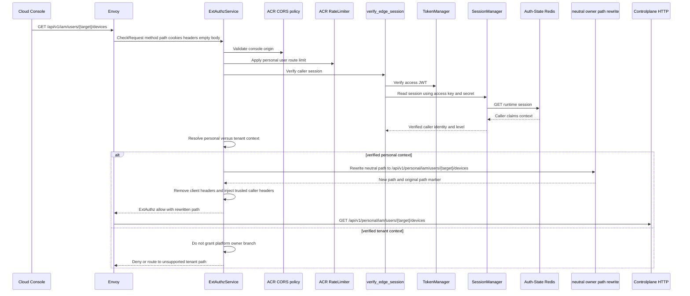
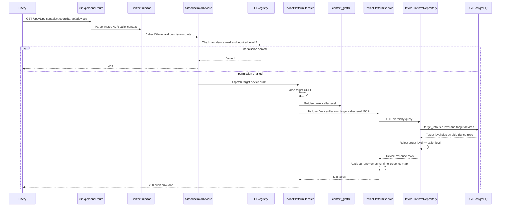
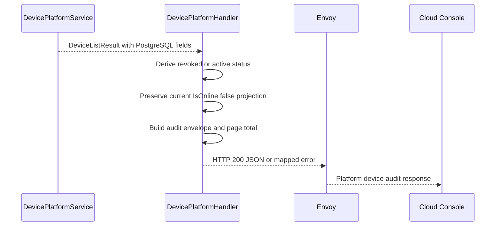

# Platform User Device Audit — God View

This document is the end-to-end Source of Truth for a platform operator reading
the registered devices of another user. It is a platform-owned `/personal`
workflow, not a self-user workflow and not a tenant workflow. The target user
is selected by the path parameter, while authorization is determined by the
verified caller's permission and hierarchy level.

The current implementation is read-only. It does not revoke a device, query ACR
presence, or touch Auth-State Redis. PostgreSQL is the only data source for this
workflow.

## API-scope contract

| Property | Contract |
|---|---|
| Browser-facing neutral route | `GET /api/v1/iam/users/:id/devices` |
| ACR internal owner route | `GET /api/v1/personal/iam/users/:id/devices` |
| Controlplane route | `GET /api/v1/personal/iam/users/:id/devices` |
| Owner branch | `/personal`, platform-owned |
| Target owner | `:id` path parameter, parsed as UUID |
| Caller authority | ACR verified `x-user-id`, `x-user-level`, and platform permission context |
| ACR rewrite | Neutral `/api/v1/iam/users/...` is rewritten to `/api/v1/personal/iam/users/...` only when the verified session resolves to personal/platform context. |
| Tenant behavior | A tenant session is not a valid platform audit context. ACR may select `/tenant/...`; no tenant device-audit route exists, so the caller must return to personal before retrying. |
| CP authorization | `Authorize("iam:device:read", L1Registry, "2")` |
| Durable hierarchy fence | Repository CTE requires target role level strictly greater than caller level. |
| Runtime presence | Not queried. Current platform `is_online` is always false because the service presence map is never populated. |
| Mutation | None |

## REST input contract

### Request headers

| Header/cookie | Source | Consumer | Contract |
|---|---|---|---|
| `Origin` | Browser | Envoy/ACR | Allowed console origin check |
| `Cookie` | Browser | ACR | Access JWT, access key/secret, personal context/session cookies |
| `Accept` | Browser | HTTP stack | Normal response negotiation |
| `x-user-id` | ACR output | CP middleware | Verified caller, never client-selected |
| `x-user-level` | ACR output | `Authorize` and handler | Verified caller hierarchy level |
| `x-tenant-id` | ACR output | Owner routing context | Must be `platform` for personal audit |
| `x-zone-id` | ACR output | Context metadata | Verified Zone or global fallback |
| `x-client-device-id` | ACR output | Generic context only | Not used to select target or authorize this read |
| `x-workspace-id` | ACR | CP | Removed from direct input and irrelevant to platform audit |
| Raw proof headers | ACR | ACR only | Removed before upstream |

### Path, query, and payload

| Part | Contract |
|---|---|
| Path parameter | `id` is the target user's UUID. It is not the caller ID. |
| Query | None used by the handler; the handler passes fixed `limit=100`, `offset=0`. |
| Body | Empty. |

## REST output contract

Success uses the common JSON envelope:

```json
{
  "message": "success",
  "data": {
    "items": [
      {
        "device": {
          "id": "<device-id>",
          "device_name": "Chrome",
          "status": "active|online|revoked"
        },
        "is_online": false,
        "last_seen_at": "2026-08-12T10:00:00Z",
        "last_seen_ip": "203.0.113.10",
        "last_seen_user_agent": "..."
      }
    ],
    "total": 1
  }
}
```

### Response headers

| Result | Headers |
|---|---|
| Success or CP error | JSON content type; no `Set-Cookie` mutation |
| ACR denial | ExtAuthz denial headers; no CP response |

### Response payload

| Result | Status | Body |
|---|---:|---|
| Authorized target hierarchy and query success | `200` | Envelope above |
| Target UUID malformed | `400` | `{ "error": "bad request", "message": "invalid target user id format" }` |
| Permission or level fence fails | `403` | `{ "error": "forbidden", "message": "insufficient_level_hierarchy" }` |
| Target role missing, schema/query failure, or unexpected service error | `500` | Common internal-error envelope |
| ACR context/session/CORS/rate failure | Local `401`, `403`, `429`, or `503` | No CP request |

No cookies or runtime session state are changed by this read.

## Phase 1 — Client → Envoy → ACR personal-owner admission

The browser calls the neutral public path. ACR is responsible for selecting the
owner branch from the verified session; the browser cannot place `/personal` or
`/tenant` in a trusted header to bypass this decision.

1. Envoy sends an ExtAuthz `CheckRequest` containing method/path/cookies and an
   empty body.
2. ACR resolves the path from Envoy HTTP attributes and applies CORS and the
   user-personal rate-limit group.
3. ACR verifies the access JWT, access key, access secret, and current session
   in Auth-State Redis. The verified claim supplies caller identity and level.
4. ACR resolves the verified tenant context. A personal/platform session has
   no active tenant or uses the platform sentinel; a tenant session is not a
   valid owner for this route and must first switch to personal.
5. ACR runs `rewrite_neutral_owner_path`, changing
   `/api/v1/iam/users/{id}/devices` to
   `/api/v1/personal/iam/users/{id}/devices` for a personal session. It emits
   `x-original-path` for traceability and overwrites `:path`.
6. ACR removes direct identity, workspace, proof, and owner markers, then
   injects verified `x-user-id`, `x-user-level`, `x-tenant-id=platform`,
   `x-zone-id`, and `x-client-device-id`.
7. ACR does not call an ACR-local device endpoint and does not query device
   presence. The request is forwarded to Controlplane after admission.



### Exact header mutation

| Action | Header/value |
|---|---|
| Remove | `x-admin-signature`, `x-admin-timestamp`, `x-admin-nonce`, `x-admin-stepup-code` |
| Remove | `x-session-proof-signature`, `x-session-proof-timestamp`, `x-session-proof-challenge-id`, `x-session-proof-verified` |
| Remove | `x-workspace-id` direct client value |
| Overwrite | `x-user-id`, `x-user-name`, `x-user-level`, `x-tenant-id`, `x-zone-id`, `x-client-device-id` |
| Inject | `x-session-proof-verified: false` unless a separate critical route requested proof |
| Inject on rewrite | `x-original-path: /api/v1/iam/users/{id}/devices` |
| Rewrite | `:path: /api/v1/personal/iam/users/{id}/devices` |

## Phase 2 — Controlplane permission and hierarchy query

The internal `/personal` route has two authorization boundaries: the middleware
capability check and the repository's durable hierarchy check.

1. Global `ContextInjector` parses ACR caller headers. It does not trust a
   browser-supplied user level.
2. `middleware.Authorize("iam:device:read", L1Registry, "2")` checks the
   caller's permission and required level before the handler runs.
3. `DevicePlatformHandler.ListUserDevicesPlatform` starts a five-second
   operation, parses target `id`, and obtains caller level through
   `pkg/context.GetUserLevel`.
4. The handler invokes `DevicePlatformService.ListUserDevicesPlatform` with
   target UUID, caller level, fixed limit 100, and offset 0.
5. `DevicePlatformRepository.ListDevicesByUserIDWithHierarchy` executes one
   CTE. `target_info` obtains the target role level; `devs` selects target
   devices only when `target_level > caller_level`, ordered by last seen and
   creation time.
6. The repository scans the target level before returning rows. Equal or lower
   target level returns `ErrActionNotAllowed`; no target role returns a query
   error. The CTE is the durable anti-confused-deputy fence even if middleware
   configuration is stale.
7. The service currently allocates `presenceByTracked` but never fills it.
   Therefore `IsOnline` remains false and `LastSeenAt` remains the PostgreSQL
   value. It does not call ACR or Shared Redis.



## Phase 3 — Presentation boundary and audit response

The handler derives status from the durable `revoked_at` field. Since this
workflow does not have an ACR presence branch, `online` is not currently
reachable from this code path unless another future implementation populates the
service's presence map.



| Field | Source | Rule |
|---|---|---|
| `device.id` | PostgreSQL `devices.id` as returned by platform repository | Platform repository currently selects `d.id`, not the self-list canonical `client_device_id`. |
| `device.device_name` | PostgreSQL | Direct projection |
| `device.status` | `revoked_at` and `IsOnline` | `revoked` first, then `online`, else `active` |
| `is_online` | `DevicePresence.IsOnline` | Currently false due to empty `presenceByTracked` map |
| `last_seen_at`, IP, UA | PostgreSQL | Last durable projection |
| `total` | `len(items)` | Page length, not a count query |

This discrepancy is intentional documentation of current behavior. It must be
resolved as a separate workflow change if live platform presence is required;
this God View does not silently claim that platform audit reads Auth-State Redis.

## Key and contract inventory

| Key/record | Store | Purpose |
|---|---|---|
| `iam:device:read` permission | L1 registry / IAM role catalog | Middleware capability |
| `x-user-id` and `x-user-level` | Envoy-to-CP trusted headers | Verified caller context |
| `x-original-path` | Envoy-to-CP header | Rewrite trace only |
| `iam.devices` | IAM PostgreSQL | Target device audit data |
| `target_info.role_level` | CTE result | Durable hierarchy comparison |
| `platform_roles` and user-role relation | IAM PostgreSQL | Caller/target level source |

## Failure, security, and consistency invariants

- A caller must be in personal/platform context before this workflow can reach
  the registered `/personal` route. Tenant context must return to personal; a
  tenant cannot use the platform audit branch.
- The target user UUID is not an authority grant. Permission middleware and the
  repository CTE both enforce caller authority.
- Required hierarchy is strict: target level must be greater than caller level.
- No target devices are modified, no refresh token is revoked, and no Redis
  runtime state is read or written.
- ACR strips client-provided identity and level headers before forwarding.
- The current service does not provide live `is_online`; UI must treat the field
  as a current implementation limitation, not a real-time security signal.
- The repository query currently references `%s.user_roles`. The IAM migrations
  must be checked against this relation name before production deployment; this
  God View records the code boundary without silently changing the schema.

## Code map

| Boundary | Source |
|---|---|
| Neutral path and owner rewrite | `acr/src/gateway/ext_authz.rs` |
| Route and `Authorize` middleware | `controlplane/internal/iam/route.go` |
| Context injection | `controlplane/internal/http/middleware/context_injector.go` |
| HTTP handler | `controlplane/internal/iam/transport/http/handler/device_platform_handler.go` |
| Service | `controlplane/internal/iam/service/device_platform_service.go` |
| Hierarchy repository | `controlplane/internal/iam/repository/device_platform_repo.go` |
| Console audit client | `cloud-console/src/features/iam/devices-api.ts` |
