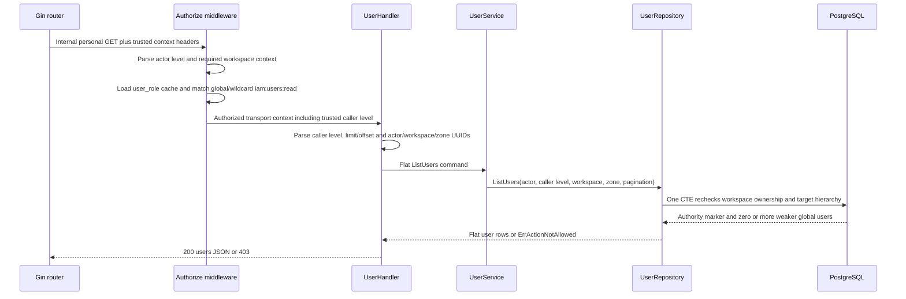

# Platform User Directory List — God View

Workflow này cho platform operator đọc danh sách global users thấp hơn actor
trong platform hierarchy. Đây là một personal/platform-owned administrative
workflow; selected personal workspace chỉ là context-integrity fence và không
biến permission global thành workspace-scoped permission.

## API scope and contract

| Part | Contract |
|---|---|
| Browser API | `GET /api/v1/iam/users?limit=<1..100>&offset=<0..>` |
| Payload | Không có body |
| Owner branch | Personal only. Browser không được gọi trực tiếp `/api/v1/personal/**` |
| Workspace selector | Browser gửi cookie `workspace_id`; ACR không tra ownership/cache/Redis cho selector này |
| Authorization | `Authorize("iam:users:read", L1Registry, "2")` yêu cầu workspace context tồn tại nhưng chấp nhận global wildcard grant `<username>:*:iam:users:read` |
| Repository fence | Repository CTE recheck personal workspace `(id, owner_id, zone_id)` và chỉ trả target có global `role_level > caller_level` đã đi qua request authorization gate |

`workspace_id` không phải authority do browser tự tuyên bố. ACR chỉ đổi cookie
selector thành trusted upstream header sau khi session đã verified; repository
mới là durable authority cho ownership. Runtime assertion endpoint
`POST /api/v1/runtime/assertions` là workflow khác và không thay đổi bởi contract
này.

## Phase 1 — Client → Envoy → ACR

```mermaid
sequenceDiagram
    participant B as Browser
    participant E as Envoy
    participant A as ACR
    participant V as Vault
    participant AR as Auth-State Redis
    participant CP as Controlplane

    B->>E: GET /api/v1/iam/users?limit=20&offset=0
    Note over B,E: Cookies: access_token, access_key, client_device_id, workspace_id; no body
    E->>A: CheckRequest GET, original :path/:authority/origin/cookie and downstream attributes
    A->>A: Validate allowed origin/CORS and apply route rate limit
    A->>V: Verify access JWT signature/claims
    A->>AR: Verify access-key/session/device runtime state
    A->>A: Select personal owner from verified session
    A-->>E: OK plus trusted request mutations
    E->>CP: GET /api/v1/personal/iam/users?limit=20&offset=0
```

ACR xử lý boundary này như sau:

- Client request method/path là `GET /api/v1/iam/users` với query pagination;
  payload rỗng. `origin`, `:authority` và Trinity cookies đi vào `CheckRequest`.
- ACR xử lý CORS/origin, rate limit, JWT/access-key/session/device verification và
  neutral-to-personal path rewrite. GET này không yêu cầu session proof và không
  phát runtime assertion.
- Direct browser `x-workspace-id` không được tin. Khi cookie `workspace_id` có
  giá trị, ACR dùng `OVERWRITE_IF_EXISTS_OR_ADD` để upstream chỉ nhận đúng một
  `x-workspace-id` từ cookie. Khi cookie thiếu/rỗng, ACR đưa
  `x-workspace-id` vào `headers_to_remove`.
- ACR remove các credential/proof header không dành cho business backend:
  `x-admin-signature`, `x-admin-timestamp`, `x-admin-nonce`,
  `x-admin-stepup-code`, `x-session-proof-signature`,
  `x-session-proof-timestamp`, `x-session-proof-challenge-id`,
  `x-aurora-runtime-assertion`, `x-aurora-runtime-signature` và
  `x-aurora-runtime-key-id`.
- ACR overwrite/inject `:path`, `x-original-path`, `x-user-id`, `x-user-name`,
  `x-user-level`, `x-tenant-id: platform`, `x-client-device-id`, `x-zone-id` và,
  khi cookie selector tồn tại, `x-workspace-id`.
- ACR không query workspace ownership từ Redis và không gọi Controlplane để
  validate workspace. Invalid session trả local `401`; forbidden origin/owner
  input trả local `403`; direct `/personal/**` không được forward. Chỉ response
  OK mới được Envoy forward upstream.

Security invariant của phase: client header không thể thắng cookie-derived
selector, nhưng ACR cũng không biến selector thành ownership authority.

## Phase 2 — Controlplane authorizes and repository rechecks durable facts



The workflow preserves two separate gates:

1. `Authorize` checks the request's trusted caller level (`<= 2`) and compiled
   `iam:users:read` grant before the handler runs. The handler passes that exact
   caller level through the flat workflow entity; it is never accepted from
   query or body input.
2. The repository CTE requires `hierarchy.personal_workspaces.id = workspace_id`,
   workspace `owner_id = actor_user_id`, workspace `zone_id = verified zone_id`,
   and every returned target to have a nil-workspace global role with
   `target.role_level > caller_level`.

The repository deliberately does not resolve the caller's role or permission
again from IAM tables. Doing so would replace the request gate with a different
level source instead of proving that the authorized request context is the one
used for target hierarchy comparison.

The read uses one PostgreSQL statement snapshot. There is no mutation, outbox,
retry, stream settlement or recovery phase. A later request re-evaluates its
session and authorization gates, then rechecks durable workspace ownership and
the current target levels. The repository is Source of Truth for those durable
facts; it does not replace the already-authorized caller-level input.

## Failure semantics

| Boundary | Result |
|---|---|
| Missing/invalid workspace header after ACR | `403 missing/invalid workspace context` in `Authorize` |
| Missing/invalid trusted caller level or caller level above route requirement | `Authorize`/handler returns `403`; repository is not called |
| Fake workspace, other owner's workspace or zone mismatch | Repository returns `ErrActionNotAllowed`; handler returns `403` |
| Invalid pagination | `400` |
| Authorized actor with no weaker targets | `200 {"data":{"users":[]}}` |
| PostgreSQL/internal failure | `500`; no cache-only success and no tenant fallback |
