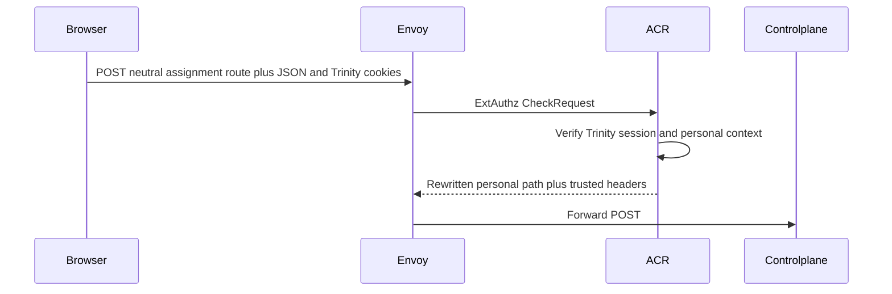
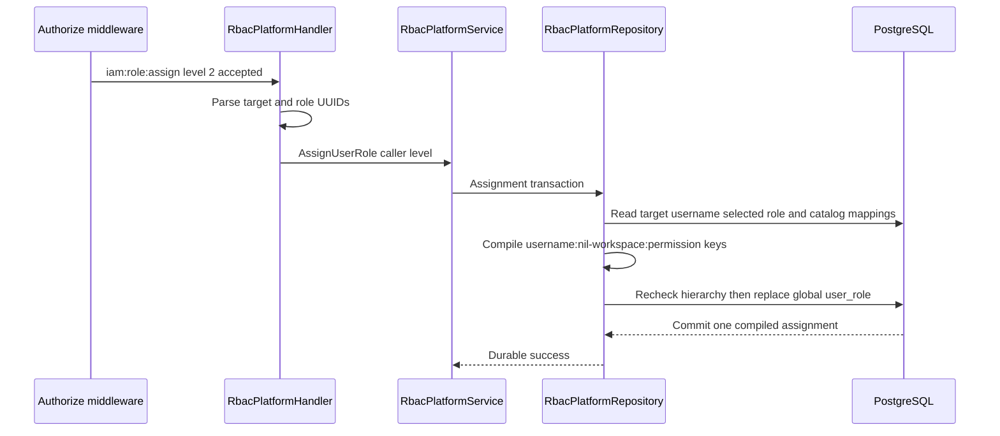
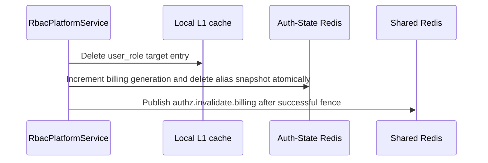

# Platform User Role Assign — God View

Workflow này thay platform global assignment của một target user bằng role được
actor quản lý. Assignment được compile thành deterministic five-part
permissions, rồi authorization state của target bị fenced sau durable commit.

## API scope and contract

| Part | Contract |
|---|---|
| Browser API | `POST /api/v1/iam/rbac/user-role` |
| Payload | `user_id` UUID target and `role_id` UUID |
| ACR | Verify personal session, rewrite `/api/v1/personal/iam/rbac/user-role`, set `x-original-path`, inject verified actor headers |
| Authorization | `Authorize("iam:role:assign", L1Registry, "2")` loads actor `user_role`; repository requires actor level stronger than both target current role and selected role |

This is platform owner administration, never a `/me` route and never tenant
membership assignment.

## Phase 1 — Client → Envoy → ACR

## Phase 2 — Controlplane compiles and persists one assignment

## Phase 3 — Target authorization invalidation

Durable PostgreSQL assignment commits first. If Auth-State fence or Shared Redis
publish errors after commit, response is `500`; retry must not create a second
assignment and Auth-State generation is still the correctness boundary.

| Other result | Response |
|---|---|
| Unknown target user or role | `404` |
| Invalid UUID | `400` |
| Permission or hierarchy denial | `403` |

## Key contract

| Record / key | Rule |
|---|---|
| `user_role` with nil workspace UUID | One global platform assignment for target user |
| `RoleEntry.list_perm` | Deterministically encoded `username:workspace:module:object:behavior` keys |
| `authz:billing:{user_id}:generation` | Auth-State Redis stale-write fence, TTL one day |
| `authz.invalidate.billing` | Shared Redis best-effort L1 invalidation fanout |

