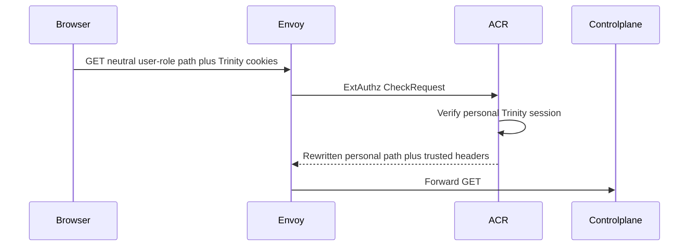
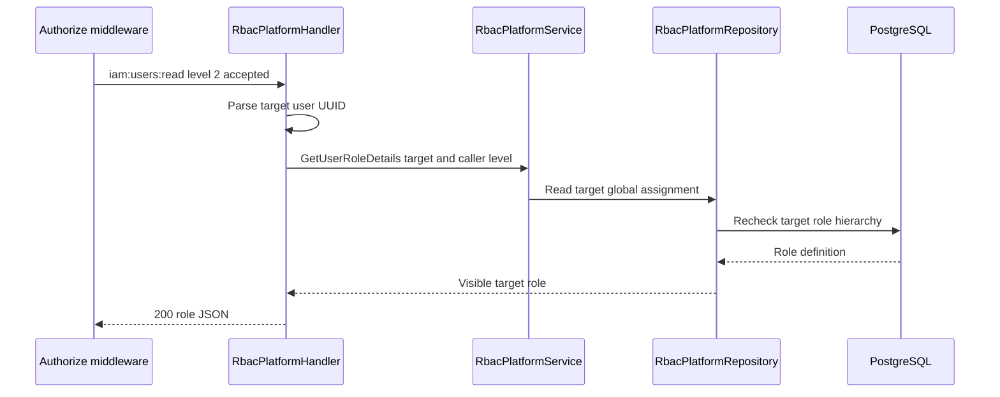

# Platform User Role Read — God View

Workflow này cho platform operator đọc global role assigned cho một target
user. It is an administrative owner workflow, not the target user's `/me`
profile or tenant membership lookup.

## API scope and contract

| Part | Contract |
|---|---|
| Browser API | `GET /api/v1/iam/users/:id/roles` |
| Path input | Target user UUID |
| ACR | Verify personal session, rewrite `/api/v1/personal/iam/users/:id/roles`, set `x-original-path`, inject verified actor context |
| Authorization | `Authorize("iam:users:read", L1Registry, "2")`; service/repository requires actor level stronger than target assignment |

## Phase 1 — Client → Envoy → ACR

## Phase 2 — Controlplane checks hierarchy and reads assignment

| Result | Response |
|---|---|
| Target role visible | `200 {"role":{...}}` |
| Invalid target UUID | `400` |
| No role or target absent | `403` in current handler taxonomy |
| Equal or stronger target role | `403` |
| Store failure | `500` |

