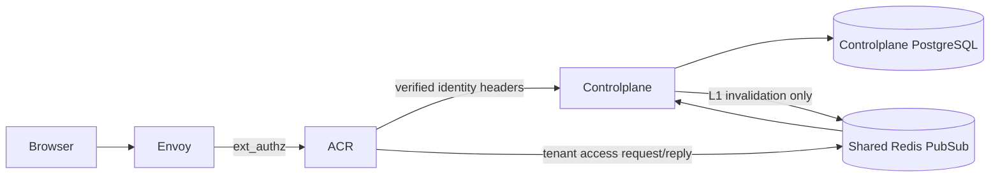
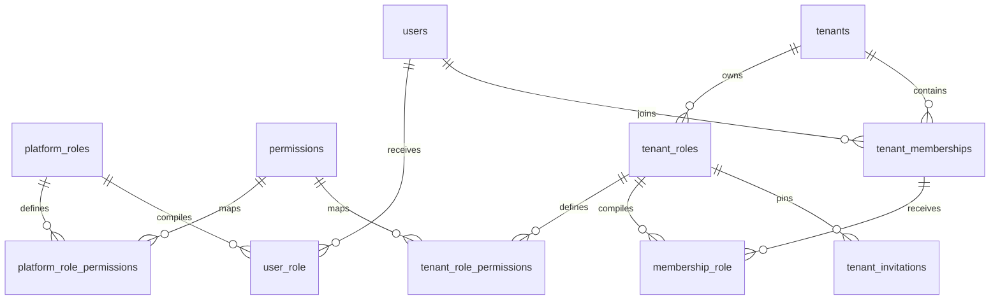
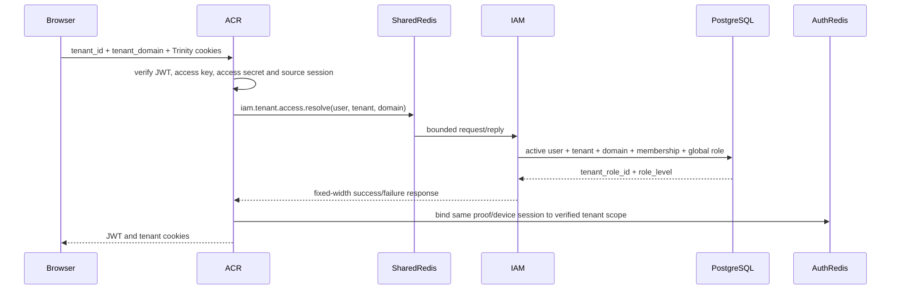

# IAM RBAC — God View

> Đây là Source of Truth cho platform role, tenant role, compiled permission
> assignment, tenant authorization cache, console render context và
> tenant-session resolution. Code,
> migration hoặc route mâu thuẫn với tài liệu này phải được sửa trong cùng
> change-set.

## 1. Mục tiêu

RBAC tách ba khái niệm không được trộn lẫn:

1. `permissions` là catalog hành vi tĩnh ba bậc, không mang owner hoặc scope.
2. Role là định nghĩa có ngữ cảnh và tuân theo hierarchy; số level càng thấp thì
   authority càng cao.
3. Assignment là projection đã compile thành permission key năm bậc để hot path
   không phải JOIN nhiều bảng.

Platform role và tenant role dùng bảng riêng. Tenant role luôn thuộc chính xác
một tenant. Không có `scope` string dùng chung để suy luận ownership.

## 2. Trust boundary



- Browser không được tạo `user_id`, `tenant_id`, `role_id`, level hoặc permission.
- Envoy strip internal headers trước khi ACR inject lại.
- ACR sở hữu authentication, critical session proof và session issuance.
- Controlplane sở hữu durable role/membership state và quyết định tenant access.
- Shared Redis request/reply là bounded transport, không phải business SoT.
- PostgreSQL là authoritative state cho role, membership và invitation.

## 3. Permission catalog ba bậc

Canonical permission:

```text
<module>:<object>:<behavior>
```

Ví dụ:

```text
hierarchy:tenant-invitation:create
iam:role:write
storage:bucket:read
```

Permission không chứa tenant, user hoặc workspace. Khi gán role, repository mới
compile permission thành key năm bậc:

```text
<identity>:<workspace_id>:<module>:<object>:<behavior>
```

Identity theo branch:

| Branch | Bậc 1 |
|---|---|
| Personal/platform | canonical username |
| Tenant | tenant UUID |

`workspace_id` là UUID cụ thể. Nil UUID đại diện global binding của đúng owner:

```text
00000000-0000-0000-0000-000000000000
```

Không lưu permission ba bậc trong assignment. Không compile wildcard `*` vào DB.
Middleware có thể xét nil/global binding như fallback theo contract route, nhưng
durable projection luôn chứa đúng UUID scope.

## 4. Hierarchy

```text
role_level nhỏ hơn = authority lớn hơn
```

Invariant mutation:

- Actor chỉ xem/tạo/gán/revoke role có `target.role_level > actor.role_level`.
- `tenant_root` có level `3`.
- Tenant role do customer tạo bắt đầu từ level `4`.
- Không thể invite một tenant root khác vì strict inequality chặn level bằng nhau.
- Permission là điều kiện cần; hierarchy vẫn phải được repo kiểm tra trong cùng
  transaction/statement với mutation.

## 5. Database SoT



### 5.1 Platform definition

`platform_roles`:

- globally unique `code`;
- hierarchy `role_level`;
- monotonic `version`;
- no tenant owner and no `scope` discriminator.

`platform_role_permissions` maps role to catalog permission.

`user_role` is the compiled assignment:

- `user_id`, cached `username`;
- `workspace_id`;
- `role_id`, `role_name`, `role_level`, `role_version`;
- deterministic Protobuf `RoleEntry` in `list_perm`;
- generated SHA-256 `permission_hash`.

### 5.2 Tenant definition

`tenant_roles`:

- mandatory `tenant_id` ownership;
- unique `(tenant_id, code)`;
- immutable V1 definition for the currently shipped workflow;
- no system/SRE owner field.

`tenant_role_permissions` maps the tenant-owned definition to the shared static
catalog.

`membership_role` is the compiled grant:

- references one `tenant_membership`;
- references one role of the same tenant through repository guards;
- caches role name, level and version;
- contains deterministic five-level `RoleEntry`;
- unique `(membership_id, workspace_id)`.

## 6. Zero-state baseline seed

`000006_iam_seeds.up.sql` is a clean install seed from database state zero. It is
not an incremental patch and contains no conflict-update fallback. IAM migration
runner records filename plus SHA-256 in `iam_schema_migrations`; restart/another
HA replica skips an already-applied file, while checksum drift fails closed.

It creates only these platform definitions:

| Code | Level | Purpose |
|---|---:|---|
| `platform_root` | 0 | highest platform authority |
| `platform_admin` | 1 | platform administration |
| `billing_admin` | 1 | billing administration |
| `platform_support_operator` | 2 | read/support operations |
| `platform_user` | 8 | customer personal scope |

It never seeds `tenant_owner`, `tenant_admin`, `tenant_member` or
`tenant_viewer`. Tenant-owned definitions cannot exist before their tenant.

Migration-local protobuf encoders compile both global and personal workspace
`user_role` rows from normalized mappings. Hard-coded permission blobs are
forbidden.

## 7. Create tenant workflow

Service generates:

- tenant ID;
- owner membership ID;
- tenant-root role ID;
- membership-role assignment ID.

Repository uses one PostgreSQL transaction to:

1. read the permission catalog from one repeatable-read snapshot;
2. compile `<tenant_id>:<nil_workspace>:...` keys;
3. insert tenant;
4. insert active owner membership;
5. create exactly one `tenant_root` role at level 3;
6. map the complete permission catalog to tenant root;
7. insert compiled `membership_role`;
8. insert the billing outbox intent;
9. commit everything together.

No role snapshot list is copied from the seed. A tenant starts with only its
root role; the owner may create weaker tenant roles later.

## 8. Create tenant role workflow

Route:

```text
Browser: POST /api/v1/critical/iam/rbac/role
Internal after verified tenant rewrite: POST /api/v1/tenant/critical/iam/rbac/role
```

The Console never chooses the internal tenant prefix. ACR derives it from the
verified session and rejects direct client access to that target.

Security chain:

1. ACR verifies exact-request session proof.
2. Middleware checks the compiled `iam:role:write` grant.
3. Handler validates canonical code/name/level and permission UUID list.
4. Service generates UUIDv7 and version 1.
5. Repository CTE rechecks active tenant, active membership, normalized write
   permission, hierarchy and complete permission-ID validity.
6. Definition and mappings become visible atomically.

The handler validation is not repeated in service. Repository checks durable
facts and races, not JSON syntax.

## 9. Assignment compilation

Platform assignment:

```text
<username>:<workspace_id>:<module>:<object>:<behavior>
```

Tenant assignment:

```text
<tenant_id>:<workspace_id>:<module>:<object>:<behavior>
```

Arrays are sorted and marshaled with deterministic Protobuf encoding. Updating
a platform role increments its version and recompiles every affected
`user_role` with that assignment's own username/workspace inside one database
transaction.

Tenant invitation pins `role_version`, `role_level` and the compiled
`list_perm`. Join additionally requires the current role version to match, so a
stale grant cannot silently adopt a changed definition.

## 10. Authorization hot path

L1 namespaces:

| Namespace | Param | Durable source |
|---|---|---|
| `user_role` | `<user_id>` | `user_role` |
| `membership_role` | `<user_id>:<tenant_id>` | membership + `membership_role` |

Sensitive authorization snapshots stay in process L1. They are not copied into
Shared Redis L2. On L1 miss, loader queries PostgreSQL and merges deterministic
RoleEntry values.

For tenant requests `middleware.Authorize` uses the verified user and tenant,
not client-provided role ID, to load membership authority. Expected key is
constructed from verified tenant/workspace context plus the route permission.

Mutation invalidation:

1. commit PostgreSQL first;
2. delete local L1 key;
3. publish best-effort fanout invalidation to other CP replicas.

For a newly joined member, missed fanout only yields bounded stale deny. It must
not convert a successfully consumed one-time invitation into an HTTP failure.

## 11. Console Render Context

Browser chỉ gọi một route trung lập:

```text
GET /api/v1/iam/context/read
```

ACR xác minh Trinity hoặc Cost Billing Alias trước, sau đó rewrite từ context
đã được xác minh; cookie/header tenant do client gửi không được dùng để chọn
branch:

| Verified context | Internal Controlplane route |
|---|---|
| Không có tenant | `GET /api/v1/personal/iam/context/read` |
| Concrete tenant UUID | `GET /api/v1/tenant/iam/context/read` |

Hai internal route không phải public API. ACR phải từ chối request client gọi
trực tiếp một trong hai path này, vì nếu không client có thể tự chọn owner
branch trước security boundary.

Controlplane triển khai hai workflow tách biệt:

1. Personal handler chỉ nhận verified user identity, đọc namespace L1
   `user_role`, và không đọc tenant context.
2. Tenant handler bắt buộc nhận verified user + concrete tenant UUID, đọc
   namespace L1 `membership_role`, và không fallback sang platform role.
3. L1 miss mới đi tới repository loader/PostgreSQL. Shared Redis L2 không giữ
   compiled permission nhạy cảm.
4. Loader/repository/cache lỗi trả unavailable; thiếu active assignment trả
   forbidden. Không workflow nào trả navigation rỗng như một personal fallback.

Response là discriminated contract, không dùng boolean mơ hồ:

```json
{"kind":"personal","navigation":[],"capabilities":{}}
```

```json
{"kind":"tenant","tenant_id":"<verified-uuid>","navigation":[],"capabilities":{}}
```

Cloud Console có hai URL/composition root thật `/personal/*` và `/tenant/*`.
Root tương ứng chỉ mount khi `kind` khớp; mismatch phải unmount UI, hủy request
đang chạy, clear query/workspace state và chuyển sang đúng root. Query key mang
session generation, `kind`, tenant ID, Zone và workspace để response trễ từ
context cũ không thể hydrate context mới. Permission client chỉ là presentation
fence; backend vẫn authorize mọi API.

## 12. Tenant-session resolution

`POST /api/v1/tenant/go-to-tenant` is intercepted by ACR.
Đây là ACR-local control endpoint để đổi verified session context, không phải
owner-prefixed Controlplane route và không được forward xuống backend. Ngoại lệ
này không cho phép Console dựng `/api/v1/personal/*` hoặc `/api/v1/tenant/*`
cho bất kỳ business API nào.



The request is fail-closed:

- malformed UUID/domain is rejected at the receiving transport boundary;
- no active CP subscriber, timeout or Redis failure returns unavailable;
- unknown/mismatched membership returns forbidden;
- client tenant data never supplies role claims;
- issued JWT uses only the role ID/level returned by Controlplane.

Shared Redis payload is bounded soft request/reply. Durable membership remains
in PostgreSQL, and a future request can rebuild the decision.

## 13. Failure and concurrency semantics

- All durable business mutation commits in PostgreSQL before cache fanout.
- Duplicate tenant code, role code or active target invitation maps to generic
  already-exists taxonomy.
- Create invitation locks actor assignment and selected role in one snapshot.
- Join locks and consumes one invitation in the same CTE that inserts membership
  and compiled assignment.
- Concurrent joins: at most one transaction can consume the token; other calls
  return not-found/conflict/already-exists without duplicate membership.
- Role hierarchy and normalized permission checks are repeated in repository
  mutation statements to close TOCTOU races.
- Redis failure never grants authority. Cache miss/failure is deny/fail-closed.
- There is no exactly-once claim across HTTP retries; unique constraints and
  one-time token consumption provide the idempotency boundary.

## 14. Forbidden designs

- One shared `roles` table with a mutable `scope` discriminator.
- Tenant definitions without `tenant_id` ownership.
- Seeding tenant roles before a tenant exists.
- Route Render Context dưới `/me`, vì `/me` không đi qua owner rewrite.
- Một handler/service branch theo tenant optional rồi fallback sang personal.
- Dùng `is_personal ?? true` hoặc default personal khi response context lỗi.
- Trusting `x-user-role-id` to select tenant permission cache entries.
- Emitting `x-user-role-id` from ACR or carrying `role_id` in Trinity JWT; the
  effective compiled grant is selected by verified actor and owner context.
- Storing three-level permissions in `user_role` or `membership_role`.
- Letting ACR switch tenant solely from query/cookie values.
- Returning plaintext invitation token after the create response.
- Soft-delete state for a successfully consumed one-time invitation.
- Treating Shared Redis as membership SoT.

## 15. Required verification

- Migration tests enforce zero-state seed semantics and absence of legacy tenant
  role seeds.
- Assignment tests decode Protobuf and assert exactly five key components.
- Middleware tests cover personal/tenant cache namespaces and hierarchy level.
- Invitation tests cover wrong target, wrong tenant, expired token, stale role,
  revoked inviter, equal/stronger role and concurrent consume.
- ACR tests cover `/api/v1/me/critical/` classification, tenant lookup timeout,
  malformed wire response and verified role claim issuance.
