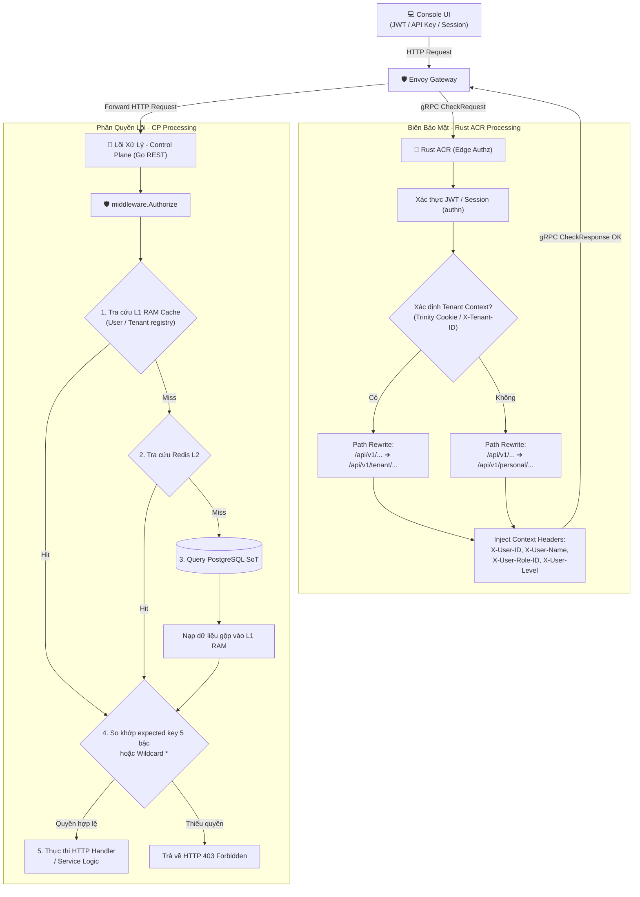
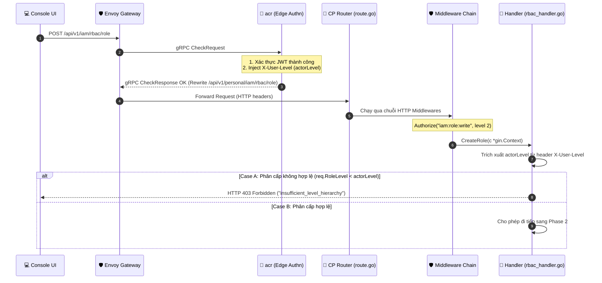
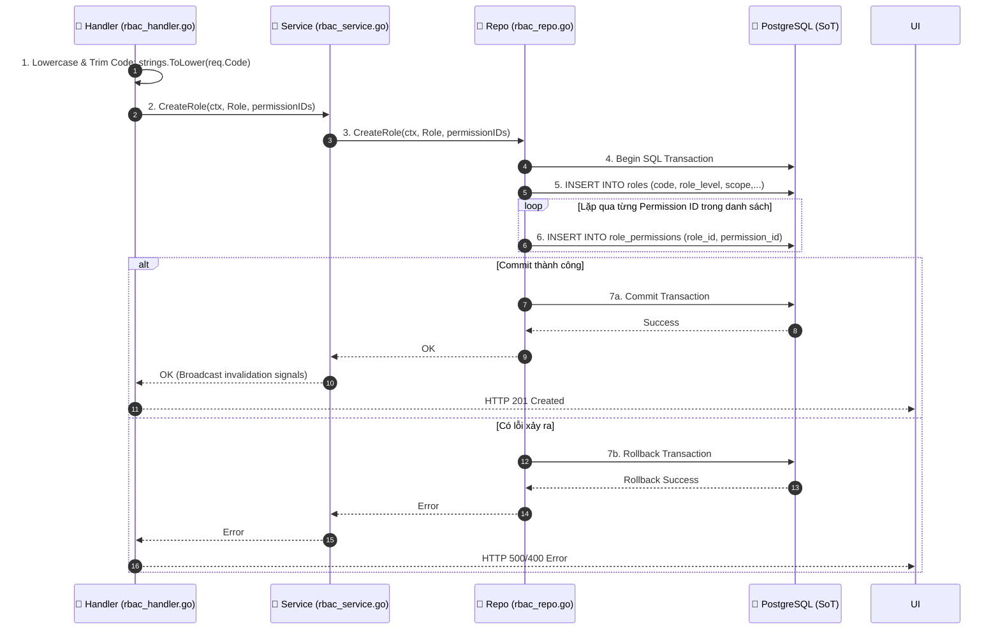
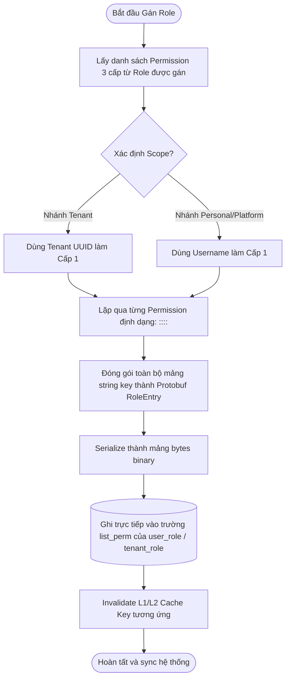
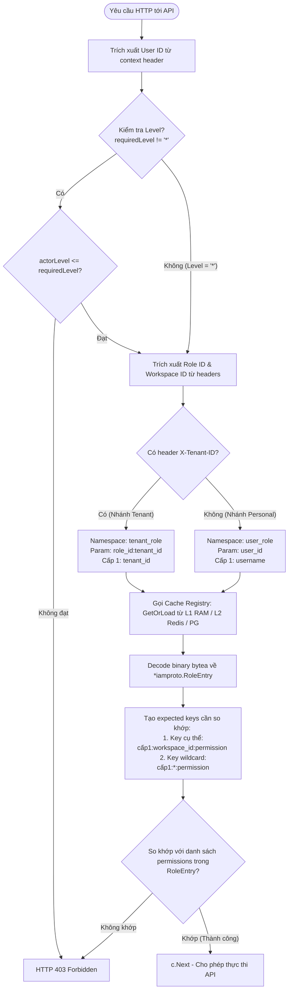

# RBAC (Role-Based Access Control) — God View (Master SoT)

> [!IMPORTANT]
> Tài liệu này là **Source of Truth (SoT) duy nhất** cho toàn bộ hệ thống quản lý phân quyền và kiểm soát truy cập (RBAC / Authz).
> **Mọi thay đổi** liên quan đến: cấu trúc permission 5 bậc, database schema IAM/RBAC, cơ chế L1/L2 cache sync, logic `middleware.Authorize`, hoặc luồng gán/xoay vòng quyền **đều phải tham chiếu và cập nhật** tệp này.

---

## Mục Lục

1. [Tổng Quan Kiến Trúc Bảo Mật](#1-tổng-quan-kiến-trúc-bảo-mật)
2. [Cơ Chế Phân Quyền Tĩnh 5 Bậc (5-Level Permission Key)](#2-cơ-chế-phân-quyền-tĩnh-5-bậc-5-level-permission-key)
3. [Database Schema SoT (IAM Tables)](#3-database-schema-sot-iam-tables)
4. [Hệ Thống Cache Phân Quyền Hợp Nhất (L1/L2 Cache Engine)](#4-hệ-thống-cache-phân-quyền-hợp-nhất-l1l2-cache-engine)
5. [Luồng Nghiệp Vụ: Tạo Vai Trò (Create Role Workflow)](#5-luồng-nghiệp-vụ-tạo-vai-trò-create-role-workflow)
6. [Luồng Nghiệp Vụ: Gán Vai Trò & Biên Dịch list_perm](#6-luồng-nghiệp-vụ-gán-vai-trò--biên-dịch-list_perm)
7. [Luồng Thực Thi: Authorize Middleware Security Chain](#7-luồng-thực-thi-authorize-middleware-security-chain)
8. [Danh Sách Vai Trò & Quyền Hạn Seed Hệ Thống](#8-danh-sách-vai-trò--quyền-hạn-seed-hệ-thống)
9. [Các Quy Tắc Bảo Vệ An Toàn & Race Conditions Inventory](#9-các-quy-tắc-bảo-vệ-an-toàn--race-conditions-inventory)

---

## 1. Tổng Quan Kiến Trúc Bảo Mật

Hệ thống phân tách kiểm soát truy cập thành hai lớp chính: **Xác thực tại Biên (Authn ở Edge Proxy)** và **Phân quyền tại Lõi (Authz ở Control Plane Backend)**.



### 1.1 Phân loại Ngữ cảnh Tác động (Impact Contexts)
Để xác định rõ ràng phạm vi tác động của mỗi request, hệ thống chia thành 3 ngữ cảnh chính:
1. **Ngữ cảnh Personal (Personal Context)**: Khi gọi các API có tiền tố đường dẫn `/api/v1/personal/...`, chủ thể (`username` ở Bậc 1) thực hiện các hành động tác động trực tiếp lên **toàn bộ nền tảng (Platform)**.
2. **Ngữ cảnh User / Me (Self-targeted Context)**: Khi gọi các API thuộc tiền tố đường dẫn `/api/v1/me/...` (bypass Authn/Authz rewrite), hành động chỉ tác động lên **chính bản thân User đó** (ví dụ: cập nhật profile cá nhân, thay đổi mật khẩu của mình).
3. **Ngữ cảnh Tenant (Tenant Context)**: Khi gọi các API có tiền tố đường dẫn `/api/v1/tenant/...`, hành động biểu thị việc chủ thể tác động lên **các tài nguyên thuộc về Tenant** tương ứng (được cô lập trong không gian Tenant ID).

---

## 2. Cơ Chế Phân Quyền Tĩnh 5 Bậc (5-Level Permission Key)

Để tối ưu hóa hiệu năng kiểm tra quyền và loại bỏ hoàn toàn các lệnh `JOIN` SQL phức tạp trong luồng "Hot Path" của API, hệ thống sử dụng cấu trúc **Permission Key 5 bậc tĩnh**:

$$\text{Format Key: } \langle\text{Bậc 1}\rangle : \langle\text{Bậc 2}\rangle : \langle\text{Bậc 3}\rangle : \langle\text{Bậc 4}\rangle : \langle\text{Bậc 5}\rangle$$

### Chi tiết các bậc:

| Bậc | Tên Bậc | Ý nghĩa | Định dạng & Ví dụ |
| :--- | :--- | :--- | :--- |
| **Bậc 1** | **Identity Context** | Định danh chủ thể thực hiện hành động. | <ul><li>**Nhánh Tenant**: UUID của Tenant đại diện cho hành động tác động lên Tenant (Ví dụ: `019f428b-8262-76f6-a368-41956c1c5146`).</li><li>**Nhánh Personal/Platform**: `username` của User đại diện cho hành động tác động lên Platform (Ví dụ: `root` hoặc `sys_admin`).</li></ul> |
| **Bậc 2** | **Workspace Context** | Định danh phạm vi Workspace áp dụng quyền. | <ul><li>UUID của Workspace cụ thể.</li><li>Ký tự wildcard `*` (không quan tâm/không ràng buộc đến workspace ID trong luồng kiểm tra quyền).</li></ul> |
| **Bậc 3** | **Module** | Phân hệ nghiệp vụ trong hệ thống. | `iam`, `hierarchy`, `storage`, `compute`,... |
| **Bậc 4** | **Object** | Đối tượng cụ thể chịu tác động. | `users`, `role`, `workspace`, `bucket`, `credential`,... |
| **Bậc 5** | **Behavior** | Hành động tác động lên đối tượng. | `create`, `read`, `update`, `delete`, `manage`,... |

### Ví dụ thực tế:
* `sys_admin:*:iam:users:read`: User `sys_admin` thực hiện hành động đọc thông tin User mà không quan tâm đến ngữ cảnh workspace ID (việc đọc user cấp hệ thống là do tính chất của permission `iam:users:read` khi được liên kết/binding với context `personal`).
* `019f428b-8262-76f6-a368-41956c1c5146:019f428b-8262-76f4-a2dd-d58d5cf8c9ec:storage:bucket:create`: Tenant `019f428b-8262-76f6...` được phép tạo bucket trong workspace `019f428b-8262-76f4...`.

---

## 3. Database Schema SoT (IAM Tables)

Cấu trúc lưu trữ dữ liệu RBAC được tổ chức tối ưu hóa cho ghi chép (normalization) nhưng lưu trữ quyền dưới dạng đóng gói binary (denormalization) để phục vụ cache.
* **Tệp SQL di trú:** [`000002_iam_tables.up.sql`](../../controlplane/internal/iam/migrations/000002_iam_tables.up.sql)

```mermaid
erDiagram
    users ||--|| user_profiles : "1:1 profiles (user_id PK/FK)"
    users ||--o{ user_role : "1:N user roles (user_id FK)"
    roles ||--o{ user_role : "1:N role assignments (role_id FK)"
    roles ||--o{ role_permissions : "1:N role permission mappings (role_id FK)"
    permissions ||--o{ role_permissions : "1:N mapped permissions (permission_id FK)"
    roles ||--o{ tenant_role : "1:N tenant roles (role_id FK)"
    
    users {
        uuid id PK "gen_random_uuid()"
        varchar username "Unique canonical handle"
        varchar email "Unique login email"
        varchar phone "Nullable phone number"
        varchar password_hash "Argon2id password hash"
        user_status status "pending-active, active, suspended, disabled"
        timestamptz created_at
        timestamptz updated_at
    }
    user_profiles {
        uuid user_id PK_FK "References users(id) ON DELETE CASCADE"
        varchar fullname "Display full name"
        text avatar_url "Nullable URL"
        text bio "Short bio"
        varchar locale "Default: vi-VN"
        varchar timezone "Default: Asia/Ho_Chi_Minh"
        timestamptz created_at
        timestamptz updated_at
    }
    permissions {
        uuid id PK "gen_random_uuid()"
        varchar module "Category: iam, hierarchy, storage..."
        varchar object "Target: users, role, bucket..."
        varchar behavior "Action: read, create, update, delete..."
        timestamptz created_at
        timestamptz updated_at
    }
    roles {
        uuid id PK "gen_random_uuid()"
        varchar code "Unique identifier (e.g. tenant_admin)"
        varchar name "Display name"
        text description "Nullable"
        integer role_level "Hierarchy priority (0 = Root, lower is higher)"
        varchar scope "platform hoặc tenant"
        timestamptz created_at
        timestamptz updated_at
    }
    role_permissions {
        uuid role_id PK_FK "References roles(id) ON DELETE CASCADE"
        uuid permission_id PK_FK "References permissions(id) ON DELETE CASCADE"
        timestamptz created_at
    }
    user_role {
        uuid id PK "gen_random_uuid()"
        uuid user_id FK "References users(id) ON DELETE CASCADE"
        varchar username "Cached static username"
        uuid workspace_id "nil UUID or Workspace ID"
        uuid role_id FK "References roles(id) ON DELETE CASCADE"
        varchar role_name "Cached role name"
        integer role_level "Cached role level"
        bytea list_perm "Protobuf serialized RoleEntry (5-level keys)"
        timestamptz created_at
        timestamptz updated_at
    }
    tenant_role {
        uuid id PK "gen_random_uuid()"
        uuid tenant_id "Tenant context identifier"
        uuid workspace_id "nil UUID or Workspace ID"
        uuid role_id FK "References roles(id) ON DELETE CASCADE"
        varchar role_name "Cached role name"
        integer role_level "Cached role level"
        bytea list_perm "Protobuf serialized RoleEntry (5-level keys)"
        timestamptz created_at
        timestamptz updated_at
    }
```

---

## 4. Hệ Thống Cache Phân Quyền Hợp Nhất (L1/L2 Cache Engine)

Kiến trúc L1/L2 Cache giúp tối đa hóa khả năng phục vụ API với độ trễ cực thấp:
* **Khởi tạo và Cấu hình**: [`l1_builder.go`](../../controlplane/internal/app/l1_builder.go)
* **Thư viện Engine lõi**: [`cacheengine/`](../../controlplane/internal/cacheengine)

### 4.1 L1 In-Memory Loader Registry
Hệ thống sử dụng các callback loaders để tự động nạp dữ liệu từ DB lên RAM khi L1 cache bị miss:

1. **`user_role` Loader**:
   * **Key**: `user_id` (Dạng UUID string).
   * **Nghiệp vụ**: Query tất cả dòng gán vai trò của User đó từ bảng `user_role`, giải mã binary Protobuf `list_perm` từng dòng, gộp toàn bộ mảng string permission lại và trả về thực thể `*iamproto.RoleEntry` duy nhất lưu trên L1 RAM Cache.
2. **`tenant_role` Loader**:
   * **Key**: `<role_id>:<tenant_id>` (Ngăn cách bởi dấu hai chấm).
   * **Nghiệp vụ**: Query các dòng phân quyền tương thích của Tenant và Role cụ thể từ bảng `tenant_role`, giải mã và gộp danh sách quyền về một struct `RoleEntry` duy nhất.

### 4.2 Invalidation & Cluster Sync (Fanout Bus)
Khi có bất kỳ thay đổi nào liên quan đến quyền (ví dụ: gán vai trò mới hoặc thu hồi vai trò):
* Hệ thống thực hiện xoá bản ghi tại PostgreSQL SoT.
* Control Plane gửi lệnh xoá cache cục bộ ở L1/L2.
* Đồng thời publish sự kiện invalidate qua **Redis Pub/Sub Fanout Bus** (`cache:invalidation:channel`).
* Toàn bộ các Control Plane node khác đang chạy trong Cluster nhận được sự kiện sẽ lập tức loại bỏ key đó khỏi bộ nhớ RAM L1 của mình để đảm bảo tính nhất quán (Eventual Consistency với độ trễ < 100ms).

---

## 5. Luồng Nghiệp Vụ: Tạo Vai Trò (Create Role Workflow)

Quy trình khởi tạo một vai trò phân quyền mới (Role Creation) được chia làm 2 Phase rõ ràng nhằm phân tách giữa **Kiểm tra an toàn (Guard)** và **Ghi dữ liệu (Storage)**:

### Sơ đồ Phase 1: Verification & Security Guard (Kiểm tra an toàn & Phân cấp)



### Sơ đồ Phase 2: Core Processing & Persistent Storage (Xử lý nghiệp vụ & Lưu trữ)



### Chi tiết thực thi theo từng Phase:

#### Phase 1: Verification & Security Guard (Kiểm tra an toàn & Phân cấp người gọi)
1. **Xác thực và phân giải Route tại biên (Envoy & ACR)**:
   * Client UI gửi request POST tạo vai trò kèm mảng Permission UUIDs từ trang [Create Role Page](../../cloud-console/src/app/\(console\)/rbac/create/page.tsx).
   * Envoy gửi gRPC yêu cầu kiểm tra đến ACR. ACR xác thực JWT token của admin thành công và thực hiện ghi các headers context mới: `X-User-ID`, `X-User-Name`, `X-User-Role-ID`, và đặc biệt là **`X-User-Level`** (chứa mức phân cấp số nguyên của admin).
   * Request được rewrite đường dẫn về `/api/v1/personal/iam/rbac/role` của Control Plane.
2. **Kiểm tra quyền hạn thực thi (Go Middlewares)**:
    * Đi qua middleware `Authorize("iam:role:write", module.L1Registry, "2")` tại [`route.go`](../../controlplane/internal/iam/route.go#L90). Chỉ những user có quyền ghi/tạo role và có level rank tối thiểu là `2` mới được đi tiếp.
3. **Phòng ngự phân cấp (Hierarchy Level Validation)**:
   * Tại [`rbac_handler.go#CreateRole()`](../../controlplane/internal/iam/transport/http/handler/rbac_handler.go#L173), Handler trích xuất level của người gọi từ header `X-User-Level` (`actorLevel`) và so sánh với level của vai trò định tạo (`req.RoleLevel`).
   * **Quy tắc phân cấp**: Số càng nhỏ quyền càng lớn (ví dụ: Root=0, SystemAdmin=1, TenantOwner=3).
   * Nếu `req.RoleLevel < actorLevel`, nghĩa là người dùng hiện tại đang cố tình tạo ra một vai trò có quyền lực cao hơn cấp độ của chính họ. Hệ thống lập tức từ chối và trả về lỗi **`403 Forbidden`** (`insufficient_level_hierarchy`).

#### Phase 2: Core Processing & Persistent Storage (Xử lý nghiệp vụ & Ghi dữ liệu)
4. **Làm sạch mã định danh (Sanitization)**:
   * Mã định danh vai trò được làm sạch và chuyển về dạng chữ thường không dấu: `codeClean := strings.ToLower(strings.TrimSpace(req.Code))` để đảm bảo tính nhất quán khi đối chiếu.
5. **Giao dịch Cơ sở dữ liệu (Database Transaction)**:
   * Tầng repository [`rbac_repo.go#CreateRole()`](../../controlplane/internal/iam/repository/rbac_repo.go#L276) khởi tạo Transaction `tx.Begin(ctx)`.
   * Ghi thông tin vai trò mới vào bảng `roles`.
   * Lặp qua danh sách UUIDs permissions và insert liên kết vào bảng mapping `role_permissions`.
   * Thực hiện `tx.Commit(ctx)`. Nếu có bất kỳ lỗi nào xảy ra trong loop insert, transaction sẽ tự động Rollback hoàn toàn để đảm bảo tính toàn vẹn dữ liệu, tránh tình trạng "Role mồ côi" không có permission.

---

## 6. Luồng Nghiệp Vụ: Gán Vai Trò & Biên Dịch list_perm

Khi một vai trò được gán cho một chủ thể (User hoặc Tenant) tại một Workspace cụ thể, hệ thống sẽ tiến hành "biên dịch trước" (Pre-compile) danh sách quyền 5 bậc để lưu trực tiếp vào trường `list_perm`.



* **Cách xử lý Workspace đặc biệt**: Nếu vai trò được gán ở cấp độ toàn cục hệ thống (Platform scope), `workspace_id` được điền là nil UUID (`00000000-0000-0000-0000-000000000000`), sau này middleware Authorize sẽ tự động hiểu và map thành ký tự đại diện `*` (wildcard).

---

## 7. Luồng Thực Thi: Authorize Middleware Security Chain

Khi một request HTTP đi tới một endpoint yêu cầu kiểm soát quyền (ví dụ: `hypervisor:vps:create`), `middleware.Authorize` sẽ thực thi chuỗi kiểm tra an toàn theo sơ đồ sau:



* **Tham chiếu code middleware**: [`authorize.go`](../../controlplane/internal/http/middleware/authorize.go#L40) (Hàm `Authorize()`).

---

## 8. Danh Sách Vai Trò & Quyền Hạn Seed Sẵn

Hệ thống đi kèm bộ khung vai trò và quyền hạn được cài đặt tự động từ quá trình cài đặt cơ sở dữ liệu:
* **Tệp SQL seed mặc định:** [`000006_iam_seeds.up.sql`](../../controlplane/internal/iam/migrations/000006_iam_seeds.up.sql)

### 8.1 Hệ thống Permissions Catalog (3 cấp mặc định)

| Capability | Permission catalog |
| :--- | :--- |
| IAM | `iam:users:read`, `iam:users:manage`, `iam:role:read`, `iam:role:write`, `iam:role:assign`, `iam:role:delete`, `iam:permissions:read`, `iam:device:read`, `iam:mfa:view` |
| Object Storage | `storage:bucket:read`, `storage:bucket:write`, `storage:bucket:delete`, `storage:credential:read`, `storage:credential:write`, `storage:credential:delete` |
| Hierarchy | `hierarchy:workspace:create`, `hierarchy:workspace:read`, `hierarchy:workspace:update`, `hierarchy:workspace:delete` |
| Email Delivery / Consumer | `email:consumer:create`, `email:consumer:read`, `email:consumer:update`, `email:consumer:delete` |
| Email Delivery / Template | `email:template:create`, `email:template:read`, `email:template:publish`, `email:template:delete` |
| Managed Service discovery | `managed-service:catalog:read` |
| Billing | `billing:plan:read`, `billing:tier:read`, `billing:tier:publish`, `billing:wallet:read`, `billing:ledger:read`, `billing:subscription:write`, `billing:credit:adjust` |

`email` là tên capability nghiệp vụ được hiển thị cho người dùng và dùng trong RBAC. Các path tương thích
`/mail`, NATS subject `mail.*` và `zone_services.service_type = 'mail'` vẫn là namespace transport/hạ tầng;
chúng không được dùng làm permission key.

### 8.2 Các System Roles được định nghĩa sẵn

| Role Code | Tên hiển thị | Level | Scope | Mô tả quyền hạn mặc định |
| :--- | :--- | :--- | :--- | :--- |
| **`platform_root`** | Root | 0 | platform | Có toàn quyền tuyệt đối trên mọi API của hệ thống. |
| **`platform_admin`** | System Admin | 1 | platform | Quản trị viên hệ thống, có toàn quyền cấu hình và quản lý users. |
| **`billing_admin`** | Billing Admin | 1 | platform | Chỉ có Billing catalog/financial permissions; không mặc nhiên có quyền IAM, Storage hay Email. |
| **`platform_support_operator`** | Support Operator | 2 | platform | Nhân viên hỗ trợ hệ thống, chỉ có quyền read-only trên các module. |
| **`platform_user`** | Platform User | 8 | platform | Quyền mặc định của một tài khoản mới đăng ký khi chưa tham gia Tenant. |
| **`tenant_owner`** | Owner | 3 | tenant | Chủ sở hữu doanh nghiệp (Tenant), có toàn quyền trong phạm vi tenant. |
| **`tenant_admin`** | Admin | 4 | tenant | Quản trị viên của Tenant. |
| **`tenant_manager`** | Manager | 5 | tenant | Quản lý tài nguyên nội bộ Tenant. |
| **`tenant_member`** | Member | 6 | tenant | Thành viên thông thường của Tenant. |
| **`tenant_viewer`** | Viewer | 7 | tenant | Chỉ có quyền xem tài nguyên trong Tenant. |

### 8.3 Ma trận quyền Email Delivery

| Role | Consumer | Template |
| :--- | :--- | :--- |
| `platform_root`, `platform_admin` | create/read/update/delete | create/read/publish/delete |
| `platform_support_operator` | read | read |
| `platform_user` | create/read/update/delete | create/read/publish/delete |
| `tenant_owner`, `tenant_admin`, `tenant_manager` | create/read/update/delete | create/read/publish/delete |
| `tenant_member`, `tenant_viewer` | read | read |

Personal/Tenant Mail routes dùng `middleware.Authorize` với permission tương ứng và bỏ qua level gate bằng
`requiredLevel = "*"`; ownership/workspace vẫn được repository kiểm tra lại trong transaction. Operational
infrastructure đi OTel/Grafana và không tạo permission trong customer/business RBAC catalog.

Năm tài khoản bootstrap `root`, `sys_admin`, `support_operator`, `audit_viewer`, `billing_admin` lưu `RoleEntry` protobuf
precompiled trong `user_role.list_perm`. Seed migration phải rebuild các binary này khi permission catalog đổi;
`ON CONFLICT` cập nhật `list_perm` để chạy lại seed không giữ snapshot quyền cũ. User được activate sau đó được
compile từ `role_permissions` tại runtime, không phụ thuộc các literal binary bootstrap.

### 8.4 Billing authorization projection

ACR chỉ tạo opaque Cost alias và không mang role/permission. Cost resolve permission theo L1 → Auth Redis
projection; khi miss, Cost request IAM qua Shared Redis Pub/Sub channel `iam.authorization.billing.get`.
Chỉ IAM đọc PostgreSQL RBAC.

IAM Shared Redis responder:

1. đọc protobuf `RoleEntry` của active user;
2. nhận runtime platform key ba phần và bootstrap key năm phần chỉ khi workspace là `*` hoặc nil UUID;
3. bỏ mọi năm-phần key có workspace UUID cụ thể để không nâng quyền cục bộ thành quyền Billing global;
4. chuẩn hóa về `billing:object:behavior`, sort và deduplicate;
5. ghi Auth Redis bằng Lua generation fence rồi trả cùng protobuf bytes qua per-request reply channel;
6. fail closed nếu không có Billing permission.

`AssignUserRole`, `UpdateRole`, `UpdateUserStatus` tăng generation, xóa L2 snapshot và fan-out
`authz.invalidate.billing` trên Shared Redis. Cost critical route bỏ cả L1/projection hit và request IAM mới.
Request dùng fixed-width binary `request_uuid + user_uuid`; Cost subscribe reply trước khi publish để đóng reply race,
còn CP replicas dùng bounded concurrency + request lock để chỉ một node query PostgreSQL. Partial unique index
`uq_user_role_platform` vẫn bảo đảm mỗi user chỉ có một platform role. Chi tiết PKCE alias, Redis key và race
matrix nằm ở `god_view/billing/cost_console_domain_trinity_god_view.md`.

---

## 9. Các Quy Tắc Bảo Vệ An Toàn & Race Conditions Inventory

| STT | Loại Rủi Ro / Race Condition | Cơ Chế Bảo Vệ / Khắc Phục | Vị Trí Code / Reference |
| :--- | :--- | :--- | :--- |
| **1** | **Level Hierarchy Escalation** (Hạ cấp tự nâng quyền khi tạo role) | Chặn đứng ở handler bằng so sánh `req.RoleLevel < actorLevel`. | [`rbac_handler.go#L173-L183`](../../controlplane/internal/iam/transport/http/handler/rbac_handler.go#L173-L183) |
| **2** | **Dirty Read Cache** (Quyền thay đổi ở DB nhưng L1 vẫn giữ quyền cũ) | Gửi tín hiệu xoá key đồng thời ở L1/L2 kết hợp broadcast qua Redis Fanout Bus ngay khi cập nhật DB. | [`rbac_service.go` / `cacheengine`](../../controlplane/internal/iam/service/rbac_service.go) |
| **3** | **Spam IOPS read PostgreSQL** (Hàng nghìn request đọc quyền liên tục xuống DB) | L1 cache trong RAM lọc đầu tiên (TTL 15m), nếu miss mới check Redis L2, giảm tối đa tải cho Postgres. | [`authorize.go#L121`](../../controlplane/internal/http/middleware/authorize.go#L121) |
| **4** | **Bypass Authn/Authz bằng Fake Headers** | Toàn bộ các header `X-User-ID`, `X-User-Name`, `X-User-Level` đều bị Envoy Gateway xoá sạch ở biên và chỉ do Rust ACR đáng tin cậy tự động điền lại sau khi verify token. | [`ext_authz.rs`](../../acr/src/service/ext_authz.rs) |
| **5** | **Xử lý trùng khớp vai trò (Duplicate Role)** | Ràng buộc duy nhất `UNIQUE (code)` tại cơ sở dữ liệu. | [`000002_iam_tables.up.sql#L224`](../../controlplane/internal/iam/migrations/000002_iam_tables.up.sql#L224) |
| **6** | **Chênh lệch Level lúc check API** | Enforce kiểm tra mức level của user so với yêu cầu cấu hình tĩnh của API `actorLevel > uint8(reqLevel)` trước khi thực hiện so khớp permission key. | [`authorize.go#L66`](../../controlplane/internal/http/middleware/authorize.go#L66) |
