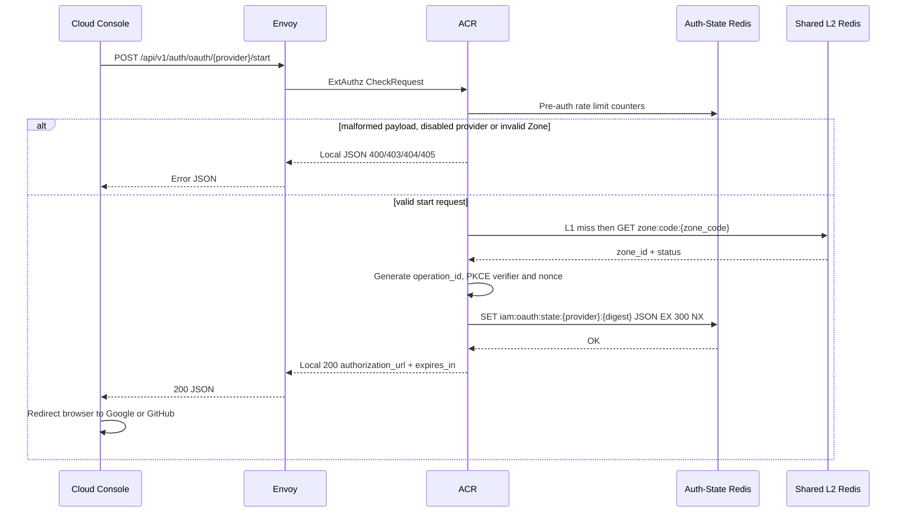
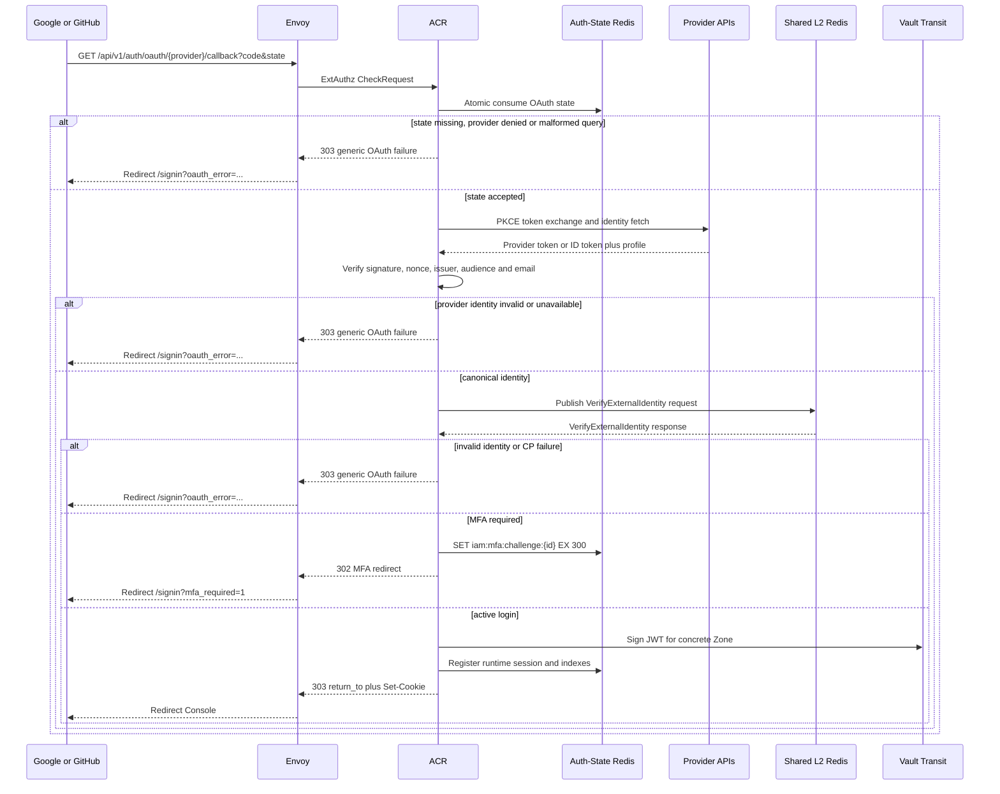
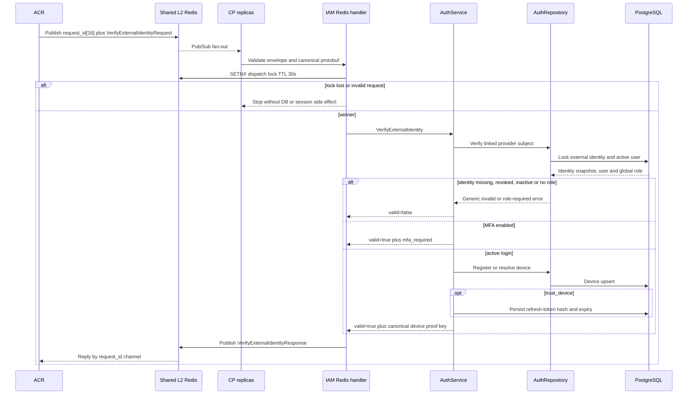

# Social Login — God View (Master SoT)

SoT cho đăng nhập bằng identity đã liên kết từ Google hoặc GitHub. Tài liệu
trace ba boundary: tạo OAuth state ở ACR, provider callback và verification ở
ACR, rồi canonical identity handoff sang Controlplane. Social-link
(authenticated link/unlink) là workflow riêng trong
[`user_settings_god_view_workflow.md`](user_settings_god_view_workflow.md).

## Contract at a glance

| Phase | Owner | Input | Output |
|---|---|---|---|
| 1. OAuth start | Client → Envoy → ACR | REST `POST` + strict JSON (`provider`, `zone_code`, device context) | REST `200` authorization URL hoặc local error |
| 2. Provider callback | Provider → Envoy → ACR | REST `GET` query `state` + `code` | `302/303` redirect về Console, MFA gate hoặc session cookies |
| 3. Controlplane IAM | ACR → Shared L2 Redis → CP | `request_id[16] || VerifyExternalIdentityRequest` | `VerifyExternalIdentityResponse` trên reply channel |

**Identity authority:** PostgreSQL chỉ cho phép login bằng
`external_identities(provider, provider_subject)` đang active và thuộc user
active. Provider email chỉ là verified metadata snapshot; không auto-link, không
tạo account mới.

**OAuth boundary:** ACR giữ client secret, authorization code, provider token,
PKCE verifier, Google nonce/JWKS verification và provider JSON. Controlplane chỉ
nhận `VerifiedExternalIdentity` đã canonicalize.

**Runtime authority:** Auth-State Redis giữ state/MFA/session ngắn hạn. Shared
L2 Redis chỉ là transport và zone catalog cache. PostgreSQL giữ identity, user,
role, device, refresh token và snapshot provider.

**Providers:** chỉ `google` và `github`; provider configuration được đọc từ
Vault tại ACR startup:
`secret/data/acr/oauth/google` hoặc `secret/data/acr/oauth/github`.

## Phase 1 — Issue OAuth authorization URL (Client → ACR)

Phase này kiểm tra context mà client muốn đăng nhập trước khi redirect sang
provider. Mục đích là bind `zone_code`, device proof key, PKCE verifier, nonce
và safe return path vào một state one-time; provider không được tự quyết định
Zone hay redirect đích.

### REST input

| Part | Contract |
|---|---|
| Method/path | `POST /api/v1/auth/oauth/{provider}/start`, `{provider}` là `google` hoặc `github` |
| Headers | `Origin` cho CORS; `Cookie` chỉ đọc `client_device_id`; `X-Forwarded-For` cho pre-auth rate limit |
| Payload | Strict JSON, `deny_unknown_fields`, không chứa provider token hoặc authorization code |

#### JSON payload

```json
{
  "device_public_key": "<base64-ed25519-32-bytes>",
  "trust_device": false,
  "zone_code": "vn",
  "device_name": "Chrome",
  "device_type": "browser",
  "return_to": "/personal"
}
```

| Field | Contract |
|---|---|
| `device_public_key` | Canonical base64 Ed25519 public key, đúng 32 bytes |
| `trust_device` | Chỉ quyết định CP có phát opaque refresh token hay không |
| `zone_code` | Bắt buộc, trim/lowercase, dài tối đa 64, không được `global`; Zone phải `active` hoặc `draining` |
| `device_name` | Optional, tối đa 120, không control character |
| `device_type` | Optional, tối đa 64, không control character |
| `return_to` | Chỉ `/`, `/personal/settings/social-links`, `/tenant/settings/social-links` hoặc billing path đã allowlist |

### ACR processing and REST output

1. Edge chạy CORS và pre-auth rate limit trước local handler.
2. ACR kiểm tra provider đã enable, canonicalize `zone_code` và resolve Zone
   qua L1 rồi Shared L2; không chấp nhận Zone `global`.
3. ACR lấy `client_device_id` hợp lệ từ cookie hoặc tạo UUID mới, sinh
   `operation_id`, PKCE `code_verifier` và provider nonce.
4. ACR lưu JSON state one-time với `SET NX EX 300`, sau đó tạo authorization
   URL. Client chỉ redirect tới URL do ACR trả về.

#### Response headers

| Result | Headers |
|---|---|
| `200/400/403/404/405` local JSON | `Content-Type: application/json` |
| Service/unavailable error | Không phát authorization URL; Envoy trả lỗi dịch vụ generic |

#### Response payload

| Result | Payload fields |
|---|---|
| `200` | `authorization_url`, `expires_in=300` |
| `400` | `error_message`, `error_code` cho payload/device/return path không hợp lệ |
| `403` | `error_message=Zone unavailable` |
| `404` | `error_message=OAUTH_PROVIDER_DISABLED` |
| `405` | `error_message=Method not allowed` |

### Key contract

`{state_token}` là token random gửi cho provider; state Redis key dùng digest,
không ghi raw token trong key. `{normalized_zone_code}` là
`trim().to_ascii_lowercase()`.

| Key / transport name | Store | Type/operation | TTL / timeout | Owner / purpose |
|---|---|---|---|---|
| `secret/data/acr/oauth/{provider}` | Vault KV | Provider client id, secret, callback URL, scope; read at startup | Runtime config lifetime | ACR; client secret không đi qua request hoặc CP |
| `iam:oauth:state:{provider}:{sha256(provider:state_token)}` | Auth-State Redis | JSON `OAuthState`; `SET NX` | `EX 300s` | ACR; bind flow/provider/PKCE/nonce/device/Zone/return path |
| `pre:ip:{client_ip}:auth_public` → `ratelimit:pre:ip:{client_ip}:auth_public` | ACR Moka L1 → Auth-State Redis L2 | L1 block marker; L2 `INCR` + `EXPIRE` | L1 block `30s`; L2 window `60s`, tối đa `30` request/IP | Edge pre-auth limiter |
| `pre:device:{device_id}:auth_public` → `ratelimit:pre:device:{device_id}:auth_public` | ACR Moka L1 → Auth-State Redis L2 | L1 block marker; L2 `INCR` + `EXPIRE` | L1 block `30s`; L2 window `60s`, tối đa `8` request/device | Edge limiter; chỉ khi cookie có device id |
| `code_to_id[{normalized_zone_code}]` | ACR process-local L1 | Zone found/negative snapshot | Found `30s`; negative `180s` | ACR zone resolver |
| `zone:code:{normalized_zone_code}` | Shared L2 Redis | String `zone_id:status`; `GET`, positive `SET EX`, negative `NOT_FOUND` | Positive `86400s`; negative `180s` | Rebuildable Zone L2 cache, không phải identity authority |



## Phase 2 — Consume provider callback and issue session (Provider → ACR)

Phase này là trust boundary của OAuth. ACR consume state atomically, đổi code
lấy provider token, verify provider identity rồi mới gửi canonical identity
sang Phase 3. Provider không được gọi trực tiếp Controlplane và callback không
được tạo account/link identity.

### REST input

| Part | Contract |
|---|---|
| Method/path | `GET /api/v1/auth/oauth/{provider}/callback` |
| Headers | `X-Forwarded-For` và `User-Agent` cho device/audit metadata; callback login không dùng Authorization header |
| Query | `state` và `code`; provider có thể trả `error` thay cho `code` |

#### Query fields

| Field | Contract |
|---|---|
| `state` | Bắt buộc, tối đa 512, không duplicate; consume một lần từ Auth-State Redis |
| `code` | Bắt buộc khi provider chấp thuận, tối đa 4096, không duplicate |
| `error` | Provider denial; ACR trả generic sign-in failure |

### ACR processing and redirect output

1. Giới hạn query 8192 bytes, reject duplicate `state`, `code` hoặc `error`.
2. Atomically consume state. Missing/expired/replayed state đều cùng generic
   failure, không tiết lộ state có từng tồn tại.
3. Google: exchange code bằng PKCE, verify ID token RS256 bằng JWKS, audience,
   issuer, `azp`, nonce và `email_verified`.
4. GitHub: exchange code bằng PKCE, gọi `/user` và `/user/emails`, chỉ nhận
   primary email đã verified.
5. Giới hạn mọi provider response 256 KiB, canonicalize subject/email/name/avatar
   và tạo `VerifyExternalIdentityRequest` cho Phase 3.
6. Với response CP: reject `zone_code` mismatch; MFA chỉ tạo continuation,
   không issue session; success mới gọi `release_user_session`, ký JWT và set
   cookies.

#### Response headers

| Result | Headers |
|---|---|
| Provider/state/identity/CP failure | `Location: /signin?oauth_error=OAUTH_SIGN_IN_FAILED` và optional safe `return_to` |
| MFA required | `Location: /signin?mfa_required=1&challenge_id=...&expires_in=...` |
| Success | `Location: {safe return_to}`; `Set-Cookie` cho `access_token`, `access_key`, `access_secret`, `client_device_id`, `tenant_id`, `zone_code`; optional `refresh_token` |

#### Response payload

| Result | Payload fields |
|---|---|
| Failure `303` | Empty body; outcome chỉ nằm trong generic query redirect |
| MFA `302` | Empty body; query có `mfa_required`, `challenge_id`, `expires_in`, optional `return_to` |
| Success `303` | Empty body; session state chỉ nằm trong HttpOnly/Secure cookies |

### Key contract

| Key / transport name | Store | Type/operation | TTL / timeout | Owner / purpose |
|---|---|---|---|---|
| `iam:oauth:state:{provider}:{sha256(provider:state_token)}` | Auth-State Redis | Lua `GET` + delete state atomically | `EX 300s` | ACR; replay/missing state fail-closed |
| `google_jwks` | ACR process-local L1 | Cached Google RSA JWK set, refresh on missing `kid` | `600s` | ACR provider verifier; no Redis key and no provider token persistence |
| `iam.auth.verify_external_identity` | Shared L2 Redis Pub/Sub | Request channel; publish envelope + protobuf | Request timeout `10s` | ACR sends only canonical verified identity |
| `iam.auth.verify_external_identity.reply.{request_id}` | Shared L2 Redis Pub/Sub | Correlated reply channel | Waiter timeout `10s` | ACR receives CP result |
| `iam:mfa:challenge:{challenge_id}` | Auth-State Redis | JSON MFA continuation; `SET NX`, later `GET` | `EX 300s` | ACR; binds user, MFA setting, Zone, device and public key |
| `iam:user_session:{zone_id}:{tenant_id}:{user_id}:{access_key}` | Auth-State Redis | Prost `UserAccessSession`; `SET` + `EXPIRE` | `SESSION_TTL_SECS` | ACR runtime session authority after CP success |
| `iam:user_access_index:{user_id}` | Auth-State Redis | Set of session keys; `SADD` + `EXPIRE` | `3 × SESSION_TTL_SECS` | ACR user/device-cap index |
| `iam:device_access_index:{device_id}` | Auth-State Redis | Set of session keys; `SADD` + `EXPIRE` | `3 × SESSION_TTL_SECS` | ACR device index |



## Phase 3 — Controlplane IAM processing (ACR → Controlplane)

Controlplane chỉ xử lý identity đã được ACR verify. Handler không nhận raw
provider JSON, authorization code, access token, ID token hoặc client secret.
Chỉ replica thắng dispatch lock được phép đọc/update PostgreSQL và phát một
reply cho ACR.

### Internal input/output

| Part | Contract |
|---|---|
| Channel | `iam.auth.verify_external_identity`; reply `iam.auth.verify_external_identity.reply.{request_id}` |
| Envelope | 16-byte UUID `request_id` + protobuf bytes |
| Request protobuf | `VerifyExternalIdentityRequest`, `schema_version=1` |
| Response protobuf | `VerifyExternalIdentityResponse` |
| Timeout | Handler context `10s`; dispatch lock TTL `30s` |

Request fields used:

| Field | Meaning |
|---|---|
| `provider`, `provider_subject` | Stable Google/GitHub identity đã verify tại ACR |
| `provider_email`, `email_verified_at` | Verified metadata snapshot, không phải account lookup key |
| `display_name`, `avatar_url` | Canonical presentation snapshot |
| `public_key`, `client_device_id` | Device binding input |
| `zone_code`, `device_name`, `device_type` | Login context and device metadata |
| `trust_device` | Refresh-token issuance decision |
| `client_ip`, `user_agent` | Audit/device metadata |

Response fields consumed by ACR: `valid`, `user_id`, `username`, `level`,
`tenant_id`, `client_device_id`, `client_proof_public_key`, `zone_code`,
`refresh_token`, `refresh_token_expires_at`, `mfa_required`,
`mfa_setting_id`.

### Layer processing

1. **Redis transport handler** — validate envelope, protobuf size, schema,
   provider allowlist, canonical strings, timestamps, public key and Zone;
   acquire `SETNX iam:auth:dispatch:verify_external_identity:{request_id}`.
2. **IAM service** — call `VerifyExternalIdentity`; require active linked
   identity and active password-backed user, check MFA before device/refresh
   side effects, then register device and optionally issue refresh token.
3. **Repository transaction** — lock `(provider, provider_subject)` and user,
   reject missing/revoked identity, refresh provider metadata and `last_login_at`,
   require an active global role, then commit. Provider email never auto-links.
4. **Reply adapter** — map domain errors to generic response taxonomy and publish
   one `VerifyExternalIdentityResponse`; raw provider material never leaves ACR.

### Key contract

`{request_id}` là UUID trong envelope. PostgreSQL là durable authority; CP
không có workflow-specific L1 cache cho external identity login.

| Key / transport name | Store | Type/operation | TTL / timeout | Owner / purpose |
|---|---|---|---|---|
| `iam.auth.verify_external_identity` | Shared L2 Redis Pub/Sub | Request channel; fan-out tới CP replicas | Handler context `10s` | CP Redis handler |
| `iam.auth.verify_external_identity.reply.{request_id}` | Shared L2 Redis Pub/Sub | Reply channel; publish protobuf response | ACR waiter `10s` | CP winner trả đúng request |
| `iam:auth:dispatch:verify_external_identity:{request_id}` | Shared L2 Redis | String dispatch fence; `SETNX` value `1` | `30s` | CP handler; chỉ winner chạm DB/phát refresh side effect |
| `(provider, provider_subject)` | PostgreSQL `external_identities` | Unique durable identity ownership; `SELECT FOR UPDATE` | Theo DB retention | Không một provider identity nào thuộc hai users |
| `external_identities.revoked_at` | PostgreSQL | Revocation fence; login chỉ đọc row active | Durable | Unlink không được callback login tự reactivate |
| `users`, `user_role`, `devices`, `refresh_tokens` | Controlplane PostgreSQL | Durable account/role/device/refresh state | Theo domain retention | CP IAM source of truth |
| Không có workflow-specific L1 key | CP process-local L1 | Không cache credential hoặc provider identity cho login | — | Không thay authority PostgreSQL bằng local state |



## State and security invariants

- OAuth state is one-time, provider-bound, PKCE-bound and expires after 300s;
  replay never reaches provider exchange or Phase 3.
- Google identity requires valid RS256 ID token, issuer/audience/`azp`, matching
  nonce and verified email. GitHub identity requires primary verified email.
- Provider subject must already be linked to an active password-backed Aurora
  user. Provider email never creates, links or reassigns an account.
- Raw authorization code, provider access token, ID token, client secret and
  provider JSON remain inside ACR/provider boundary and never enter CP logs,
  protobuf or PostgreSQL.
- ACR rejects any CP response whose `zone_code` differs from state; every
  issued session has one concrete non-nil Zone UUID.
- MFA primary success creates only a short-lived continuation. No device,
  refresh token, runtime session or login cookie is issued before MFA success.
- `trust_device=false` never receives a refresh cookie. `trust_device=true`
  only uses the refresh token and expiry issued by CP.
- Provider, Auth-State Redis, Shared L2 Redis, PostgreSQL or Vault failure is
  fail-closed for authenticated session issuance and returns a generic browser
  outcome.
- Logs and redirects expose no provider subject, account existence, raw token,
  email, code, state value or key material.

## Code map

| Layer | Source |
|---|---|
| Console OAuth start/callback handling | [`cloud-console/src/features/auth/api.ts`](../../cloud-console/src/features/auth/api.ts), [`cloud-console/src/app/signin/signin-form.tsx`](../../cloud-console/src/app/signin/signin-form.tsx), [`cloud-console/src/app/signin/page.tsx`](../../cloud-console/src/app/signin/page.tsx) |
| ACR OAuth state/provider verification/session | [`acr/src/user/oauth.rs`](../../acr/src/user/oauth.rs), [`acr/src/gateway/ext_authz.rs`](../../acr/src/gateway/ext_authz.rs) |
| ACR proof/session/Vault | [`acr/src/user/session_proof.rs`](../../acr/src/user/session_proof.rs), [`acr/src/user/session.rs`](../../acr/src/user/session.rs), [`acr/src/token.rs`](../../acr/src/token.rs) |
| Shared binary contract | [`proto/iam_auth.proto`](../../proto/iam_auth.proto) |
| CP Redis handler | [`controlplane/internal/iam/transport/pubsub/handler/auth.go`](../../controlplane/internal/iam/transport/pubsub/handler/auth.go) |
| CP service/domain | [`controlplane/internal/iam/service/auth_service.go`](../../controlplane/internal/iam/service/auth_service.go), [`controlplane/internal/iam/domain/entity/auth.go`](../../controlplane/internal/iam/domain/entity/auth.go) |
| CP repository/durable identity | [`controlplane/internal/iam/repository/auth_repo.go`](../../controlplane/internal/iam/repository/auth_repo.go), [`controlplane/internal/iam/migrations/000002_iam_tables.up.sql`](../../controlplane/internal/iam/migrations/000002_iam_tables.up.sql) |
| Provider secret/config SoT | [`vault_connection_bootstrap_god_view.md`](../platform/vault_connection_bootstrap_god_view.md) |

## Change rule

Khi đổi provider allowlist, callback path, OAuth state schema, PKCE/nonce
validation, canonical identity protobuf, Zone binding, MFA gate, device/refresh
issuance hoặc dispatch key:

1. cập nhật file này cùng change-set;
2. trace lại đủ ba phase và ba sequence diagram;
3. cập nhật ACR, provider contract, protobuf, Controlplane và UI tests;
4. không thêm auto-link theo email hoặc account-onboarding fallback nếu chưa có
   migration và security review rõ ràng.
