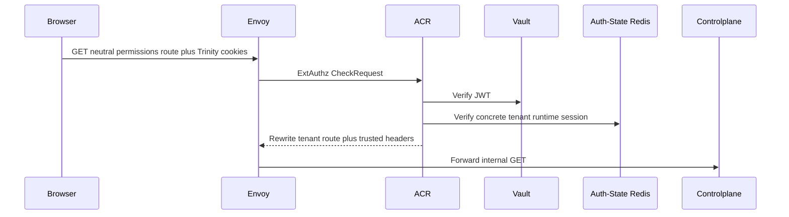
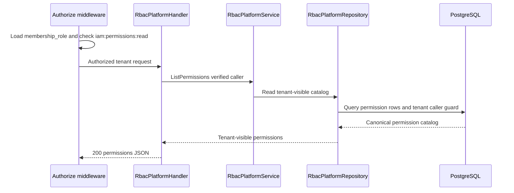

# Tenant Permission Catalog List — God View

Workflow này trả permission catalog cho tenant actor cấu hình tenant-owned role.
Tenant `membership_role` là authority source duy nhất; `user_role` không fallback
vào workflow này.

## API scope and contract

| Part | Contract |
|---|---|
| Browser API | `GET /api/v1/iam/rbac/permissions` |
| Payload | None |
| ACR | With verified concrete tenant session, rewrite to `/api/v1/tenant/iam/rbac/permissions`, overwrite `:path`, set `x-original-path`, inject trusted identity and tenant headers |
| Authorization | `Authorize("iam:permissions:read", L1Registry, "*")` loads `membership_role`; repository rechecks durable tenant caller guard |

Direct tenant internal paths are denied. A personal session belongs to a separate
personal catalog workflow, never fallback authority.

## Phase 1 — Client → Envoy → ACR

## Phase 2 — Controlplane authorizes tenant actor and reads catalog

| Result | Response |
|---|---|
| Authorized | `200 {"permissions":[...]}` |
| Missing tenant membership permission | `403` |
| Dependency failure | `500` |

