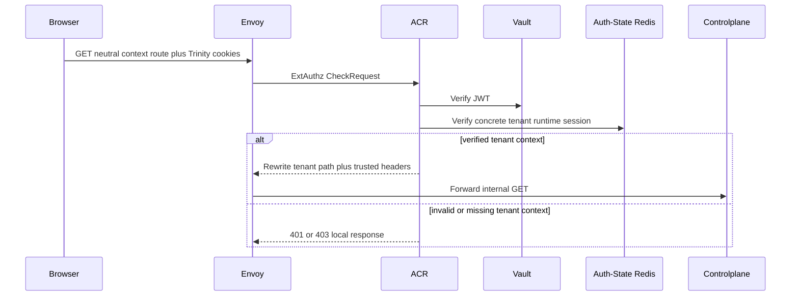
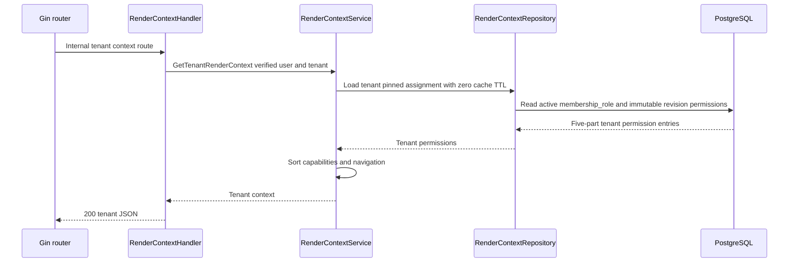

# Tenant Render Context Read — God View

`membership_role.tenant_role_revision_id` alone pins runtime role metadata and authority.
Every read compiles that immutable revision from normalized permission mappings;
it never joins `tenant_roles.current_version` or trusts a duplicated grant blob.

Workflow này trả tenant composition root và capability presentation của một
concrete tenant session. Tenant membership là authority source duy nhất;
personal assignment không bao giờ fallback vào workflow này.

## API scope and contract

| Part | Contract |
|---|---|
| Browser request | `GET /api/v1/iam/context/read` |
| Input | Trinity cookies hoặc Bearer access token; browser không gửi trusted identity, tenant, role hay permission header |
| Payload | None |
| ACR output | `GET /api/v1/tenant/iam/context/read`; overwrite `:path`, set `x-original-path`, inject `x-user-id`, concrete `x-tenant-id`, `x-user-level`, `x-zone-id`, `x-client-device-id` |
| Authorization | Tenant `membership_role` loads permission and required level, then repository rechecks active membership and assignment |

Direct `/tenant/**` browser paths are denied. A session without concrete active
tenant context cannot enter this workflow.

**Implementation gap:** the current tenant route has no
`middleware.Authorize`; handler/repository load compiled membership authority
but do not enforce required middleware permission/level. This docs refactor
changes no code.

## Phase 1 — Client → Envoy → ACR

## Phase 2 — Controlplane reads tenant compiled authority

| Result | Response |
|---|---|
| Success | `200 {"kind":"tenant","tenant_id":"<verified UUID>","navigation":[...],"capabilities":{...}}` |
| Missing/stale membership | `403`; never personal fallback |
| PostgreSQL/compile failure | `503`; never empty-context success |

## Key contract

| Key / record | Purpose |
|---|---|
| `membership_role:{user_id}:{tenant_id}` loader | zero-TTL singleflight; never a surviving authority cache hit |
| PostgreSQL `tenant_memberships`, revision binding and revision mappings | Durable tenant authorization SoT; assignment has no copied name/level/version |
