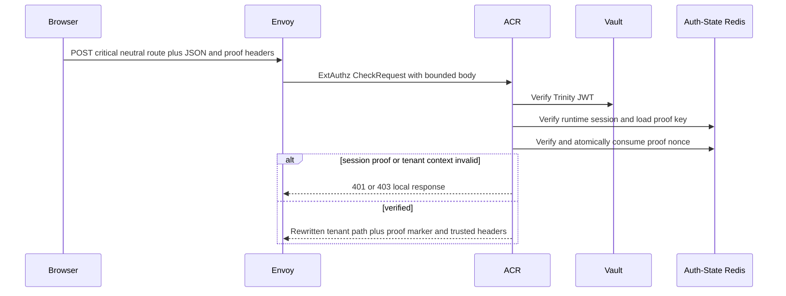
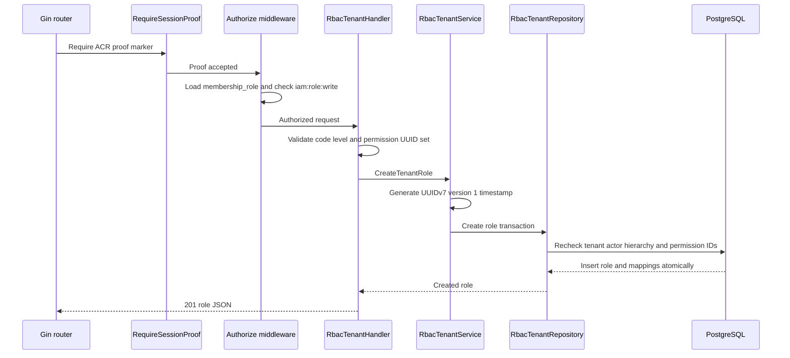

# Tenant Role Create — God View

Workflow này tạo một tenant-owned role definition. Role quyết định future
membership grants nên mutation là critical; hierarchy và selected permissions
phải được recheck trong cùng durable statement.

## API scope and contract

| Part | Contract |
|---|---|
| Browser API | `POST /api/v1/critical/iam/rbac/role` |
| Request headers | Trinity cookies and `x-session-proof-challenge-id`, `x-session-proof-timestamp`, `x-session-proof-signature` |
| Payload | `code`, `name`, optional `description`, `role_level` 4–99, 1–256 unique `permission_ids` UUIDs |
| ACR route action | Verify session proof, then rewrite to `/api/v1/tenant/critical/iam/rbac/role`, overwrite `:path`, set `x-original-path`, inject verified identity/tenant and `x-session-proof-verified: true` |
| Authorization | `RequireSessionProof` then `Authorize("iam:role:write", L1Registry, "*")` over verified `membership_role`; repository rechecks active membership, hierarchy and permission ownership |

`tenant_root` is reserved; code must match `[a-z0-9_]{2,100}`. Browser may not
call the internal route directly or supply owner/role headers.

## Phase 1 — Client → Envoy → ACR

## Phase 2 — Controlplane authorizes and commits the role

| Result | Response |
|---|---|
| Created | `201` with role ID, code, level and version `1` |
| Invalid payload or permission selection | `400` |
| Unknown tenant | `404` |
| Duplicate role code | `409` |
| Proof, permission or hierarchy denial | `401` or `403` |
| Database failure | `500`; no partial role/mapping commit |

## Key contract

| Record | Rule |
|---|---|
| `tenant_roles` | Exactly one `tenant_id`, immutable creation version `1` |
| `tenant_role_permissions` | Maps only validated catalog permission IDs in same transaction |
| L1 `membership_role:{user_id}:{tenant_id}` | Middleware cache; durable repository remains final hierarchy authority |
| `iam:session_proof:critical:{access_key}:{challenge_id}` | Auth-State Redis one-time nonce, TTL 60 seconds |

