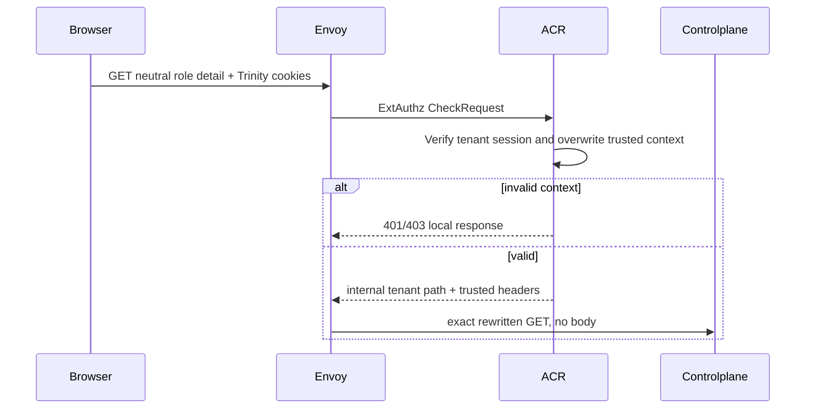

# Tenant Role Detail Read — God View

Workflow này đọc đúng current immutable revision của một tenant role và projection
phẳng của permission catalog, assignment count và outdated assignment count.

## API scope and contract

| Part | Contract |
|---|---|
| Browser API | `GET /api/v1/iam/rbac/role/:role_id`; no body |
| Client headers | Trinity cookies; browser identity/tenant headers are stripped by Envoy |
| ACR | `CheckRequest`; validate session and concrete tenant, remove untrusted context, rewrite exact path to `/api/v1/tenant/iam/rbac/role/:role_id`, inject verified `x-user-id`, `x-tenant-id`, `x-user-level`, `x-zone-id`, `x-client-device-id`, set `x-original-path` |
| Authorization | `Authorize("iam:role:read", membership_role, "*")`; repository rechecks the actor's pinned revision permission and hierarchy |

## Phase 1 — Client → Envoy → ACR

## Phase 2 — Controlplane reads current revision

Repository CTE resolves actor authority from `membership_role.tenant_role_revision_id`,
joins the target head to `tenant_role_revisions.version=current_version`, enforces
`actor.role_level < target.role_level`, and returns flat permissions from
`tenant_role_revision_permissions`. Success is `200`; invisible/missing target is
`404`, missing authority is `403`, storage failure is `500`.

