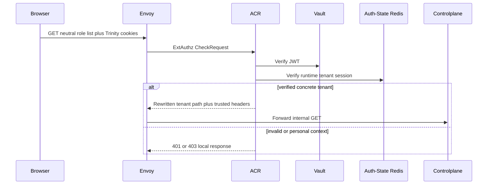
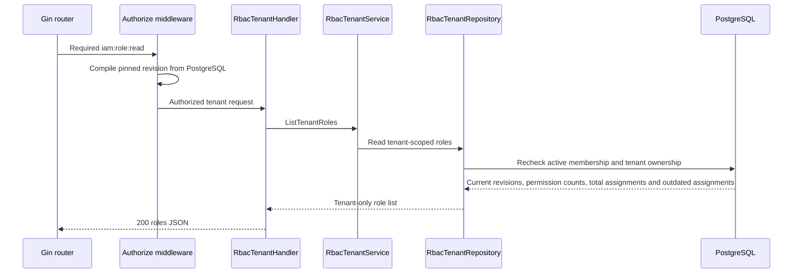

# Tenant Role List — God View

Workflow này đọc role definition thuộc một tenant đã xác minh. Nó không đọc
platform role và không fallback sang personal khi membership tenant vắng mặt.

## API scope and contract

| Part | Contract |
|---|---|
| Browser API | `GET /api/v1/iam/rbac/role` |
| Payload | Không có |
| ACR route action | Verify Trinity session với tenant concrete, rewrite `/api/v1/tenant/iam/rbac/role`, overwrite `:path`, set `x-original-path` |
| Trusted forwarded headers | `x-user-id`, `x-tenant-id`, `x-user-level`, `x-zone-id`, `x-client-device-id` after Envoy strips browser versions |
| Authorization | `middleware.Authorize("iam:role:read", L1Registry, "*")` invokes the zero-TTL durable membership loader; repository rechecks active tenant membership |

Direct browser calls to the internal tenant prefix are denied. This is not
`/me`: the actor may read tenant role definitions only through tenant authority.

## Phase 1 — Client → Envoy → ACR

## Phase 2 — Controlplane authorizes and reads tenant definitions

| Result | Response |
|---|---|
| Authorized list | `200 {"roles":[...]}` |
| Missing permission, membership or tenant | `403` |
| Durable loader/repository failure | `500`; never platform fallback |

List chỉ project revision được `tenant_roles.current_version` chọn. Membership
không adopt head mới ở read path; `outdated_assignments_count` compares the
pinned revision's version with `current_version` để Console quyết định rollout tường minh.
