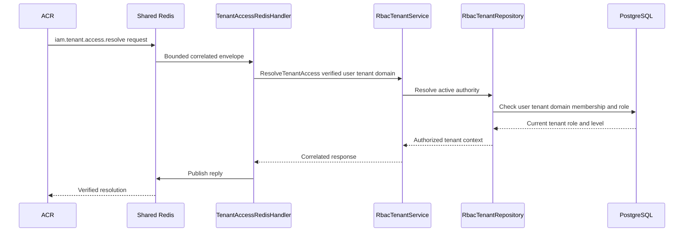

# Tenant Session Switch — God View

Workflow này chuyển session đã xác minh từ Personal sang một concrete tenant.
Đây là ACR-local control API, không phải `/personal`, `/tenant` hay `/me`
business route và không forward HTTP xuống Controlplane.

## API contract

| Part | Contract |
|---|---|
| Method/path | `POST /api/v1/context/go-to-tenant` |
| Input | Trinity cookies, `tenant_id` UUID và `tenant_domain` query fields |
| Trusted input | Không có role ID, level, user ID hoặc tenant header nào từ browser |
| Output | Replacement Trinity JWT/cookies scoped to verified tenant, hoặc `400`, `401`, `403`, `503` |
| Authorization | ACR sends verified user plus requested tenant/domain to IAM. IAM rechecks active user, tenant, domain, membership and current role. No `Authorize` HTTP middleware exists because no CP HTTP business route is entered. |

Precondition: the source JWT must be Personal (`tenant_id` absent or `platform`).
If the source is already a concrete tenant, ACR returns local `409` and does not
publish `iam.tenant.access.resolve`; the user must complete the separate
Tenant → Personal workflow first. The target tenant is never selected from a
client authority header.

## Phase 1 — Client → Envoy → ACR

Envoy sends the complete request to ACR `ext_authz`. ACR validates exact route
and query shape, verifies the source Trinity session against Vault and
Auth-State Redis, and does not trust an existing tenant cookie to issue the new
context.

```mermaid
sequenceDiagram
    participant B as Browser
    participant E as Envoy
    participant A as ACR
    participant V as Vault
    participant AR as Auth-State Redis

    B->>E: POST /api/v1/context/go-to-tenant plus Trinity cookies and tenant query
    E->>A: ExtAuthz CheckRequest
    A->>V: Verify source JWT
    A->>AR: Verify access key secret and device session
    alt source is concrete Tenant A
        A-->>E: Local 409; no resolver or cookie mutation
    else malformed route or invalid source session
        A-->>E: 400 or 401 local response
    else verified source session
        A->>A: Bound decode requested tenant and domain
    end
```

## Phase 2 — ACR → Shared Redis → IAM tenant-access resolver

ACR publishes a bounded correlated request/reply, not a business event. The
resolver's PostgreSQL decision is durable authority; Shared Redis timeout,
missing subscriber or malformed reply fails closed.



## Phase 3 — ACR issues the new tenant-scoped Trinity session

After a success reply only, ACR binds the same proof/device session to the
verified tenant context, signs the replacement JWT using the returned role
level, and returns tenant cookies. It does not forward the original request.

| Result | Settlement |
|---|---|
| Authorized response | `200` plus replacement Trinity cookies |
| Unknown tenant, membership or domain mismatch | `403`; source credentials remain unchanged |
| Resolver timeout or infrastructure error | `503`; source credentials remain for retry |
| Invalid request/session | `400` or `401`; no replacement JWT |

## Key contract

| Key / transport | Purpose |
|---|---|
| `iam:user_session:{zone}:{tenant}:{user}:{access_key}` | Auth-State Redis runtime session checked before and rebound after switch |
| `iam.tenant.access.resolve` request/reply | Bounded Shared Redis transport only, never membership SoT |
| PostgreSQL tenant membership and `membership_role` | Durable authority for issued tenant context |
