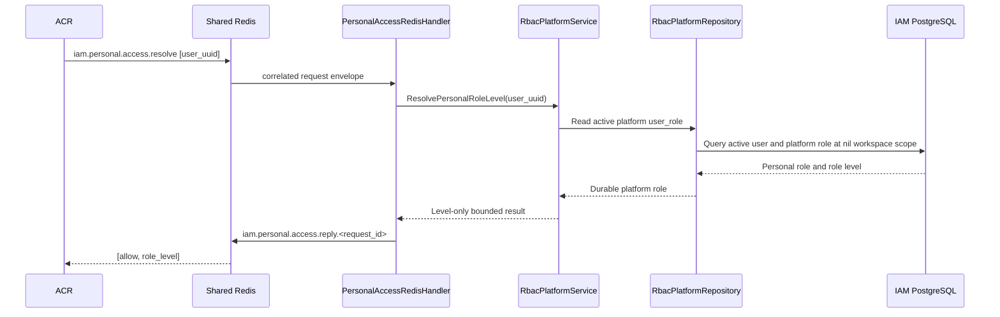

# Tenant → Personal Session Switch — God View

This is the explicit second transition in the context state machine. It
removes the concrete tenant owner from a verified session only after
Controlplane resolves the user's durable platform role. It is ACR-local and
never forwards an HTTP business request to Controlplane.

## API-scope contract

| Item | Contract |
|---|---|
| Method/path | `POST /api/v1/context/go-to-personal` |
| Input headers | Envoy `CheckRequest`; browser sends no authority header or payload |
| Input cookies | `access_token`, `access_key`, `access_secret`; source JWT must contain a concrete tenant |
| Success | ACR returns `200`, replacement JWT with no concrete `tenant_id`, clears tenant cookies |
| Failure | `401` invalid source, `403` personal authority unavailable, `503` resolver/session infrastructure |
| Forward | No upstream HTTP forward; ACR local response only |

### Phase 1 input headers

| Header/cookie | Use |
|---|---|
| `cookie: access_token` | Source JWT presented to ACR |
| `cookie: access_key` | Binds the JWT to Auth-State Redis |
| `cookie: access_secret` | Hash comparison against the stored session |
| Envoy `:method`, `:path` | Exact route match; no client owner header is trusted |

### Phase 1 payload

| Payload | Contract |
|---|---|
| Request body | Empty; user, tenant, role and level are not accepted from the browser |

## Phase 1 — Client → Envoy → ACR

ACR validates the exact neutral context route, verifies Trinity credentials
against Vault/Auth-State Redis, and requires the current JWT tenant claim to be
concrete. Client JavaScript cannot create Personal by deleting cookies.

```mermaid
sequenceDiagram
    participant B as Browser
    participant E as Envoy
    participant A as ACR
    participant V as Vault
    participant R as Auth-State Redis

    B->>E: POST /api/v1/context/go-to-personal with Trinity cookies
    E->>A: ext_authz CheckRequest
    A->>V: Verify access_token signature and claims
    A->>R: Read tenant-scoped session by zone/tenant/user/access_key
    A->>A: Compare access_key and hash(access_secret)
    alt source is Personal or credential invalid
        A-->>E: Local 401; no state mutation
    else source is concrete Tenant
        A->>A: Bind verified user UUID and source tenant scope
    end
```

## Phase 2 — ACR → Shared Redis → platform authority

The request/reply is a bounded relay. Platform RBAC PostgreSQL remains the
authority for the personal role level; tenant membership is never reused.



## Phase 3 — ACR session replacement and local response

ACR signs the new JWT only after the resolver succeeds, registers the personal
Auth-State scope, and clears tenant cookies server-side. The prior context is
not reported as a client-selectable authority.

```mermaid
sequenceDiagram
    participant A as ACR
    participant T as TokenManager
    participant R as Auth-State Redis
    participant E as Envoy
    participant B as Browser

    A->>A: Set claims.tenant_id = absent; set platform role level
    A->>T: Generate replacement Trinity JWT
    T-->>A: Personal-scoped JWT
    A->>R: Register session under tenant=platform
    alt registration or signing fails
        A-->>E: 503 local response; no success cookie set
    else success
        A->>E: 200 local response + replacement access_token
        A->>E: Set-Cookie tenant_id Max-Age=0; tenant_domain Max-Age=0
        E-->>B: Personal context response
    end
```

## Key contract and recovery

| Key | Purpose |
|---|---|
| `iam:user_session:{zone}:{tenant}:{user}:{access_key}` | Source tenant session verification and personal rebind |
| `iam.personal.access.resolve` / `.reply.<request_id>` | Correlated role-level relay; not a source of truth |
| `user_role(user_id, nil workspace)` | Durable Personal RBAC authority |

Resolver timeout, missing subscriber, malformed reply, or session write failure
returns a failure and the browser keeps the current Tenant context for retry.
The UI must clear workspace/query state only after receiving the successful ACR
response and refreshing render context.
