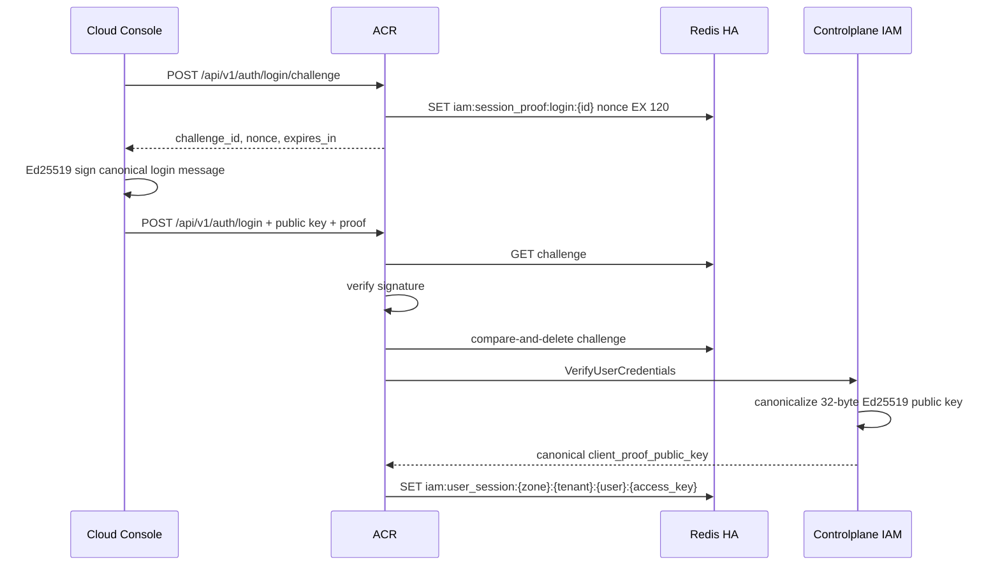
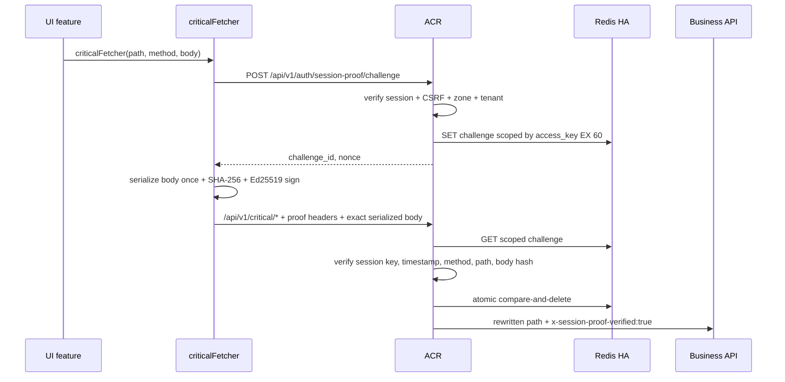

# God View — User Critical Session Proof

## 1. Contract và trust boundary

Luồng này là SOT cho mọi mutation dưới namespace `/api/v1/critical/*`. Backend nghiệp vụ không tự triển khai crypto; ACR xác minh session proof trước khi rewrite route sang `/api/v1/personal/critical/*` hoặc `/api/v1/tenant/critical/*`.

- Login bắt buộc một Ed25519 challenge mới và lưu canonical public key vào Redis L2 session.
- Mỗi critical call bắt buộc một challenge mới, TTL 60 giây và chỉ được consume đúng một lần.
- `access_key` là HttpOnly, không đưa cho JavaScript. Redis key `iam:session_proof:critical:{access_key}:{challenge_id}` bind challenge với session ở server.
- Downstream chỉ tin `x-session-proof-verified: true` do ACR overwrite. Client không thể tự cấp marker này.
- Phiên recovery không có proof key bị fail-closed trên critical route; rotation bình thường carry key từ session cũ.

## 2. Login proof và session binding



Canonical login message, nối bằng LF và không có LF cuối:

```text
aurora.login-proof.v1
challenge_id
nonce
username
tenant_domain
zone_code
remember_me
unix_timestamp_seconds
```

## 3. Critical call



Canonical critical message:

```text
aurora.session-proof.v1
challenge_id
nonce
HTTP_METHOD
/api/v1/critical/path
sha256_hex_of_exact_wire_body
unix_timestamp_seconds
```

Client headers là `x-session-proof-challenge-id`, `x-session-proof-timestamp`, và `x-session-proof-signature`. Phiên bản v1 fail-closed với query parameters để không có query semantics nằm ngoài chữ ký.

## 4. Race, HA và failure modes

- Hai request dùng cùng challenge có thể cùng đọc nonce, nhưng Lua compare-and-delete chỉ cho một request thắng; request còn lại bị từ chối replay.
- Redis unavailable hoặc challenge hết TTL đều fail-closed. Không fallback bỏ qua proof.
- Signature chỉ consume challenge sau khi crypto verify thành công; request sai không phá challenge hợp lệ của client.
- ACR rate-limit riêng group `user_critical` để giới hạn cả việc lấy nonce lẫn mutation nhạy cảm.
- Private key được lưu dưới dạng non-extractable `CryptoKey` trong origin IndexedDB. Cơ chế này giảm khả năng export key nhưng không biến browser nhiễm XSS thành trusted environment; CSP và kiểm soát supply chain vẫn bắt buộc.
- Envoy phải buffer toàn bộ body critical cho ExtAuthz; nếu body vượt giới hạn cấu hình thì request phải bị từ chối, không xác minh partial body.

## 5. Code map

- UI base: `cloud-console/src/shared/api/critical.ts`
- UI key/signing: `cloud-console/src/lib/security/deviceKey.ts`
- ACR proof: `acr/src/user/session_proof.rs`
- ACR enforcement/rewrite: `acr/src/gateway/ext_authz.rs`
- Redis session binary: `acr/src/user/session.rs`
- IAM key canonicalization: `controlplane/internal/iam/service/auth_service.go`

Critical consumers hiện tại gồm self social-link start/unlink trong Cloud Console Settings.
Mỗi mutation tự lấy challenge mới; UI không retry tự động mutation đã ký vì challenge chỉ dùng
một lần và kết quả mutation có thể đã commit dù response bị mất.
