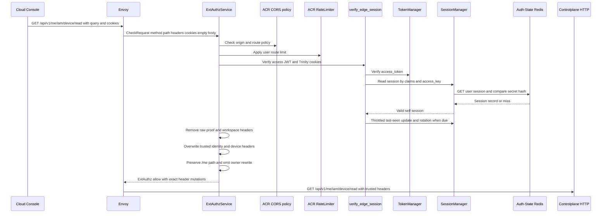
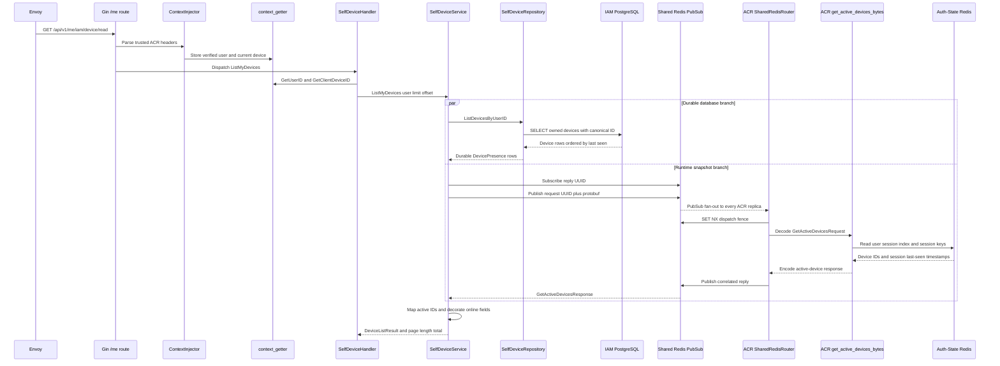
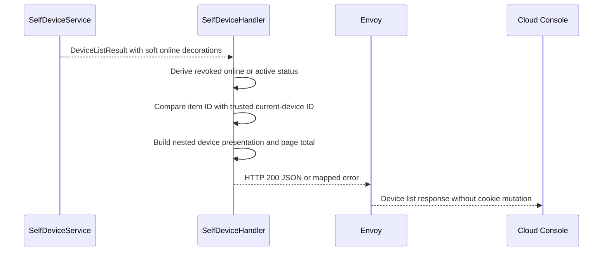

# Self Device List — God View

This document is the end-to-end Source of Truth for the signed-in user reading
their own registered devices. It is a self-user workflow: the target owner is
always the verified `x-user-id` injected by ACR. A browser cannot select another
owner, tenant, workspace, Zone, or device owner through this API.

The durable device record is owned by IAM PostgreSQL. Auth-State Redis contains
ephemeral session records and is queried only to decorate the durable list with
best-effort online state. Online state never grants or denies access.

## API-scope contract

| Property | Contract |
|---|---|
| Public method/path | `GET /api/v1/me/iam/device/read` |
| Owner branch | `/me`, self-user only |
| Neutral route | None. The `/me` path is already the self route and is preserved by ACR. |
| Owner source | Verified session claim mapped to `x-user-id` |
| Current-device source | ACR-issued `x-client-device-id` from the browser cookie, or ACR-generated value when absent |
| Tenant/workspace use | None. `x-tenant-id` and `x-workspace-id` may be present as trusted context headers but this handler does not use them. |
| Permission middleware | No RBAC `Authorize` middleware. Self ownership is enforced by the repository query. |
| Session proof | Normal session verification is required. This route is not a critical-proof route. |
| Path rewrite | No owner rewrite and no `x-original-path`; ACR forwards `/api/v1/me/iam/device/read` unchanged. |
| Durable owner | `iam.devices` in IAM PostgreSQL |
| Runtime owner | ACR Auth-State Redis session keys and indexes |
| Presence consistency | PostgreSQL list is authoritative; Redis online decoration is soft and may be absent. |

## REST input contract

### Request headers

| Header/cookie | Sender | Used by | Contract |
|---|---|---|---|
| `Origin` | Browser | Envoy and ACR CORS policy | Must match an allowed console origin when supplied. |
| `Cookie` | Browser | ACR session verifier | Carries `access_token`, `access_key`, `access_secret`, and `client_device_id`; raw credentials never reach Controlplane. |
| `Accept` | Browser | Envoy/application | Normal content negotiation only. |
| `x-user-id` | Not trusted from browser | ACR overwrites | The only user owner header received by Controlplane. |
| `x-client-device-id` | Not trusted from browser | ACR overwrites | Current-device presentation reference, not a target authorization grant. |
| `x-session-proof-*` | Browser or proxy | ACR consumes/removes | Not used for this non-critical route and never forwarded as raw proof. |
| `x-workspace-id` | Browser or proxy | ACR removes, then optionally derives from cookie | Ignored by this `/me` handler. |

### Query parameters

| Parameter | Default | Current implementation |
|---|---:|---|
| `limit` | `20` | Parsed by the handler and passed to PostgreSQL. The console currently requests `50`. |
| `offset` | `0` | Parsed by the handler and passed to PostgreSQL. |

Malformed numeric values currently become Go's zero value because parse errors
are ignored by `SelfDeviceHandler`. This is a known validation gap, not a reason
to invent a different contract in a refactor.

### Request payload

| Payload | Contract |
|---|---|
| Body | Empty. A non-empty body is not read by the handler. |

## Phase 1 — Client → Envoy → ACR admission

ACR proves that the request belongs to a live self session, removes all
caller-controlled identity material, and forwards the unchanged `/me` path. It
does not choose an owner branch and does not handle this workflow locally.

### ACR processing steps

1. Envoy creates an ExtAuthz `CheckRequest` containing the HTTP method, exact
   path including query, selected headers, cookies, edge metadata, and an empty
   body for this request.
2. `ExtAuthzService::check` resolves method/path from Envoy's HTTP attributes,
   not from an attacker-controlled ordinary header.
3. ACR applies origin/CORS policy and the user route rate limiter. A rate-limit
   denial is local and is not forwarded to Controlplane.
4. ACR runs `verify_edge_session`: it verifies the access JWT, reads the
   `access_key` and `access_secret` cookies, looks up the session in Auth-State
   Redis, and compares the stored secret hash. The verifier also performs its
   normal last-seen throttle and session rotation behavior.
5. A `GET` request does not require a session-proof challenge. Any supplied raw
   proof headers are still removed from the upstream request.
6. ACR reads `client_device_id` only from the cookie. If absent, it generates a
   UUID for the trusted current-device header; the browser cannot override a
   value with a direct header.
7. ACR removes raw proof headers, `x-workspace-id`, and any previous trusted
   marker. It overwrites identity/context headers with verified claims.
8. Because the path begins with `/api/v1/me/`, owner rewrite is bypassed. ACR
   does not emit `x-original-path` and does not change `:path`.
9. Envoy forwards the original method, query, and empty body to Controlplane.

### Exact upstream header contract

| Action | Header | Value |
|---|---|---|
| Remove | `x-admin-signature`, `x-admin-timestamp`, `x-admin-nonce`, `x-admin-stepup-code` | Always removed |
| Remove | `x-session-proof-signature`, `x-session-proof-timestamp`, `x-session-proof-challenge-id`, `x-session-proof-verified` | Always removed before trusted markers are rebuilt |
| Remove | `x-workspace-id` | Direct browser/proxy copy removed; this route does not consume workspace context |
| Overwrite | `x-user-id` | Verified session `uid` |
| Overwrite | `x-user-name` | Verified session subject |
| Overwrite | `x-user-level` | Verified session level |
| Overwrite | `x-tenant-id` | Verified tenant or `platform` fallback |
| Overwrite | `x-zone-id` | Verified Zone or `global` fallback |
| Overwrite | `x-client-device-id` | Cookie value or ACR-generated UUID |
| Inject | `x-session-proof-verified` | `false` |
| Preserve | `:path` | `/api/v1/me/iam/device/read?limit=...&offset=...` |

### Local ACR failure boundary

| Condition | ACR result | Forwarded? |
|---|---:|---|
| Missing/invalid JWT, access key, or access secret | `401` denial | No |
| Auth-State Redis unavailable during session verification | `503` or verifier denial | No |
| Origin/CORS rejection | `403` denial | No |
| Route rate limit exceeded | `429` denial | No |
| Valid session | ExtAuthz allow | Yes, unchanged `/me` path |



## Phase 2 — Controlplane durable list and runtime snapshot

The request enters the Gin `/me` group. No RBAC permission middleware runs. The
global context injector parses ACR headers, and the handler obtains user and
current-device values through the workflow context getters.

### Component chain

1. `ContextInjector` parses `x-user-id`, `x-client-device-id`, and other trusted
   headers into Gin context. It rejects malformed or missing required context.
2. `SelfDeviceHandler.ListMyDevices` creates operation
   `iam.device.list_my_devices` with a five-second timeout.
3. The handler reads user ID and current device ID, parses `limit` and `offset`,
   and calls `SelfDeviceService.ListMyDevices`.
4. The service starts two independent branches:
   - `SelfDeviceRepository.ListDevicesByUserID` reads durable rows from
     PostgreSQL, ordered by `last_seen_at DESC NULLS LAST, created_at DESC`.
   - A Shared Redis request asks one ACR replica for active sessions. The
     request uses a fresh UUID and a two-second child timeout.
5. PostgreSQL returns rows using canonical ID
   `COALESCE(client_device_id, id)`, device name, last-seen IP, user agent,
   timestamp, and `revoked_at`.
6. The service maps the ACR reply by `client_device_id`, sets `IsOnline` and
   replaces `LastSeenAt` only when the runtime reply contains a timestamp.
7. Shared Redis timeout, no subscriber, malformed reply, or ACR runtime failure
   is soft: all devices remain visible with `is_online=false` where no match is
   present. PostgreSQL failure is hard and fails the request.
8. The service records one `iam.device.list_my_devices` workflow observation.
   A successful durable list remains `success/none` when only the advisory
   runtime branch fails. A PostgreSQL timeout/cancellation or other repository
   failure is recorded as a workflow failure.
9. Hard repository errors are returned unchanged. The HTTP handler owns
   logging and the sanitized `500` response for errors outside its known IAM
   taxonomy.

### Shared Redis active-session request contract

| Item | Contract |
|---|---|
| Request channel | `iam.device.get_active_sessions` |
| Reply channel | `iam.device.get_active_sessions.reply.{request_id}` |
| Envelope | 16 raw UUID bytes followed by protobuf `GetActiveDevicesRequest` |
| Request field | `user_id` as UUID string |
| Reply | `GetActiveDevicesResponse.active_devices[]` with `client_device_id` and Unix `last_seen_at` |
| Fan-out fence | Each ACR replica uses `SET NX PX 30000` at `iam:acr:dispatch:{channel}:{request_id}`; one winner reads Auth-State Redis. |
| Timeout | Two seconds in `SelfDeviceService` |
| Security | Online result is decoration only and cannot authorize a target device. |



## Phase 3 — Presentation and HTTP response

`SelfDeviceHandler` derives a display status from durable revocation and the
soft runtime flag. It does not call another service after the service returns.



### Success payload shape

Success uses the common JSON envelope:

```json
{
  "message": "ok",
  "data": {
    "items": [
      {
        "device": {
          "id": "<canonical-client-device-id>",
          "device_name": "Chrome",
          "status": "active|online|revoked"
        },
        "is_online": true,
        "is_current": false,
        "last_seen_at": "2026-08-12T10:00:00Z",
        "last_seen_ip": "203.0.113.10",
        "last_seen_user_agent": "..."
      }
    ],
    "total": 1
  }
}
```

`status` is `revoked` when `revoked_at` is non-null, `online` when not revoked
and runtime `IsOnline` is true, otherwise `active`. `is_current` is a string
comparison with the trusted current-device ID. The current implementation sets
`total` to the returned page length, not a separate database count.

### Response headers

| Result | Headers |
|---|---|
| Success | `Content-Type: application/json`; no `Set-Cookie` mutation |
| `400`, `401`, or `500` | JSON content type; no authentication-cookie mutation |
| ACR denial | ExtAuthz denial headers selected by ACR; no Controlplane response |

### Response payload

| Condition | Status | Body |
|---|---:|---|
| Success | `200` | Common envelope above |
| Invalid query/context argument | `400` | `{ "error": "bad request", "message": "invalid request" }` |
| Invalid session context reaching handler | `401` | `{ "error": "unauthorized", "message": "unauthorized" }` |
| PostgreSQL or unexpected service failure | `500` | `{ "error": "internal_error", "message": "internal server error" }` |

Envoy returns the Controlplane response to the browser without changing the
authenticated session.

## Key and contract inventory

| Key/record | Store | Owner and purpose |
|---|---|---|
| `iam:user_session:{zone}:{tenant}:{user}:{access_key}` | Auth-State Redis | Runtime session read by ACR |
| `iam:user_access_index:{user_id}` | Auth-State Redis Set | Enumerates session keys for active query |
| `iam:device_access_index:{client_device_id}` | Auth-State Redis Set | Reverse runtime session index |
| `iam:acr:dispatch:iam.device.get_active_sessions:{request_id}` | Shared Redis | PubSub single-winner fence, 30 seconds |
| `iam.device.get_active_sessions` | Shared Redis PubSub | Controlplane-to-ACR query |
| `iam.device.get_active_sessions.reply.{request_id}` | Shared Redis PubSub | Correlated ACR reply |
| `iam.devices` | IAM PostgreSQL | Durable device metadata and revocation state |

## Security, consistency, and recovery invariants

- The browser cannot choose `user_id`, `is_current`, or the owner branch.
- ACR authentication is the first security boundary; PostgreSQL ownership is
  the second boundary for the durable list.
- Online state is advisory. Redis outage must not hide a durable device or make
  a device revocable by presence alone.
- ACR PubSub has no durable replay. A missed reply is intentionally handled as
  soft offline state; the next list request can query again.
- The five-second handler budget is independent from the two-second runtime
  snapshot budget. A slow PostgreSQL query still fails the whole list.
- Soft runtime visibility failure does not turn the workflow metric into a
  failure after the durable list succeeds.
- The service preserves hard repository errors; the HTTP handler is the error
  presentation and sanitization boundary.
- Do not log access secrets, JWTs, raw cookies, or full session keys.

## Current implementation discrepancy

`PersonalDeviceService` has a separate presence gap documented in the platform
God View. This self workflow does query ACR and can populate online state, but
the result remains best effort and should not be treated as a durable heartbeat.

## Code map

| Boundary | Source |
|---|---|
| Route | `controlplane/internal/iam/route.go` |
| Context injection | `controlplane/internal/http/middleware/context_injector.go` |
| HTTP handler | `controlplane/internal/iam/transport/http/handler/self_device_handler.go` |
| Self service | `controlplane/internal/iam/service/self_device_service.go` |
| PostgreSQL repository | `controlplane/internal/iam/repository/self_device_repo.go` |
| ACR PubSub router | `acr/src/transport/redis.rs` |
| Active-session reader | `acr/src/user/device.rs` |
| Session indexes | `acr/src/user/session.rs` |
| Console client | `cloud-console/src/features/iam/devices-api.ts` |
