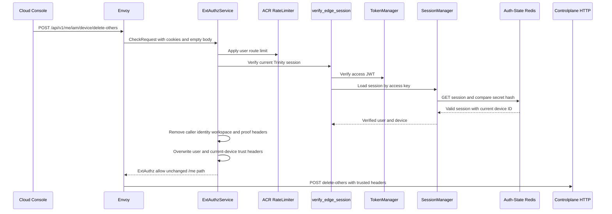
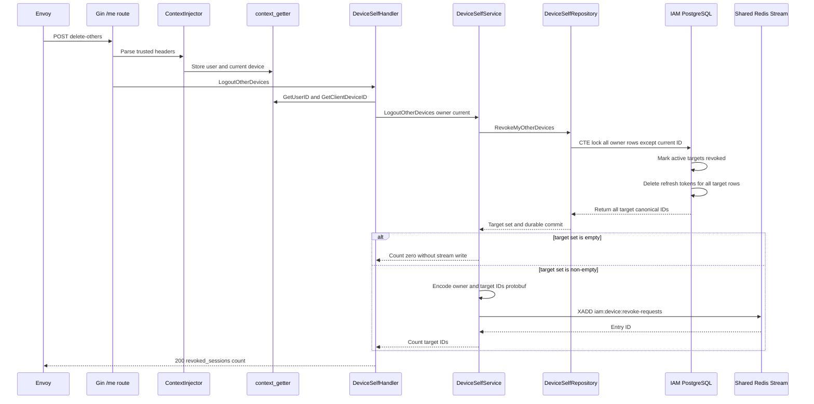
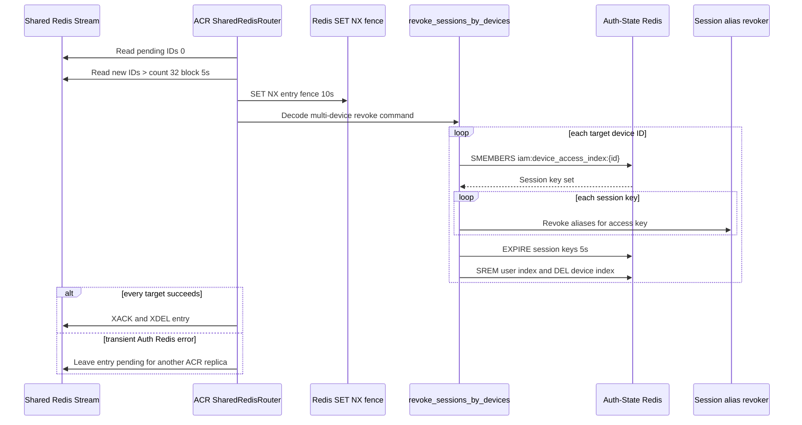

# Self Logout Other Devices — God View

This document is the end-to-end Source of Truth for the current user signing
out every registered device except the device carrying the current verified
session. It is separate from single-device revoke because the target set is
computed by PostgreSQL from the owner and current-device fence.

The workflow is not a global logout and does not revoke the current browser. It
returns the number of target device records selected by the durable transaction,
then asynchronously removes their Auth-State Redis sessions.

## API-scope contract

| Property | Contract |
|---|---|
| Public method/path | `POST /api/v1/me/iam/device/delete-others` |
| Owner branch | `/me`, self-user only |
| Target set | All devices owned by verified `x-user-id` whose canonical ID differs from verified `x-client-device-id` |
| Current-device source | ACR cookie-derived `x-client-device-id`; never from request JSON |
| Permission middleware | None. `/me` is self-user and repository ownership is mandatory. |
| Session proof | Normal session verification only in current route table |
| Path rewrite | None. `/me` path is forwarded unchanged. |
| Durable owner | IAM PostgreSQL `devices`, `refresh_tokens` |
| Runtime bridge | Shared Redis Stream `iam:device:revoke-requests` |
| Current-device guarantee | The CTE excludes the current canonical device, even if the client sends no body. |

## REST input contract

### Headers and cookies

| Input | Used by | Rule |
|---|---|---|
| `Origin` | Envoy/ACR | CORS policy only |
| `Cookie: access_token` | ACR | JWT verification |
| `Cookie: access_key` and `access_secret` | ACR | Auth-State session lookup and secret-hash comparison |
| `Cookie: client_device_id` | ACR | Trusted current-device reference |
| `x-user-id` | ACR output | Client copy removed and overwritten from verified session |
| `x-client-device-id` | ACR output | Client copy removed and overwritten from cookie/generation |
| `x-workspace-id` | ACR | Removed and not consumed by this self workflow |
| Raw proof headers | ACR | Removed; no critical proof is required here |

### Body and query

| Part | Contract |
|---|---|
| Body | Empty. There is no target list in the request. |
| Query | Ignored. |

## REST output contract

Success is a common `200` JSON envelope:

```json
{
  "message": "ok",
  "data": { "revoked_sessions": 3 }
}
```

### Response headers

| Result | Headers |
|---|---|
| Success or CP error | JSON content type; no authentication-cookie mutation |
| ACR denial | ExtAuthz denial headers; no CP response |

### Response payload

| Result | Status | Body |
|---|---:|---|
| Durable target-set revoke and stream enqueue succeeded | `200` | `data.revoked_sessions` equals selected target IDs |
| Invalid/missing handler context | `401` | Common unauthorized envelope |
| Invalid argument | `400` | Common bad-request envelope |
| PostgreSQL or Shared Redis failure | `500` | Common internal-error envelope |
| ACR admission failure | Local `401`, `403`, `429`, or `503` | No CP request |

When there are no other devices, PostgreSQL returns an empty target set and the
service does not write a Redis Stream entry. The HTTP result is still `200` with
`revoked_sessions: 0`.

## Phase 1 — Client → Envoy → ACR admission

ACR authenticates the current browser and forwards no target-selection data.
The absence of a body is a security property: the client cannot ask the server
to revoke an arbitrary list or another user's devices.

1. Envoy sends method/path/cookies/headers in `CheckRequest`.
2. ACR performs CORS and rate-limit checks, then verifies JWT, access key, and
   access-secret hash through Auth-State Redis.
3. ACR performs normal session last-seen/rotation logic. This route is not in
   the session-proof challenge set.
4. ACR removes caller identity, workspace, proof, and trusted-marker headers.
5. ACR overwrites `x-user-id`, `x-user-level`, `x-tenant-id`, `x-zone-id`, and
   `x-client-device-id`, and injects `x-session-proof-verified=false`.
6. ACR preserves `POST /api/v1/me/iam/device/delete-others` exactly and sends
   an empty body upstream. It does not issue `x-original-path`.



### ACR header contract

| Action | Header |
|---|---|
| Remove | `x-admin-signature`, `x-admin-timestamp`, `x-admin-nonce`, `x-admin-stepup-code` |
| Remove | `x-session-proof-signature`, `x-session-proof-timestamp`, `x-session-proof-challenge-id`, `x-session-proof-verified` |
| Remove | `x-workspace-id` direct input |
| Overwrite | `x-user-id`, `x-user-name`, `x-user-level`, `x-tenant-id`, `x-zone-id`, `x-client-device-id` |
| Inject | `x-session-proof-verified: false` |
| Preserve | `:method POST`, `:path /api/v1/me/iam/device/delete-others`, empty body |

## Phase 2 — Controlplane computes and durably revokes the target set

The handler uses only trusted context values. It does not accept a target array
from the browser.

1. `ContextInjector` parses ACR's `x-user-id` and `x-client-device-id`.
2. `DeviceSelfHandler.LogoutOtherDevices` creates a five-second operation
   context and obtains both values through context getters.
3. `DeviceSelfService.LogoutOtherDevices` calls
   `DeviceSelfRepository.RevokeMyOtherDevices`.
4. The repository CTE selects every row for the verified user and excludes the
   canonical current ID with
   `COALESCE(client_device_id, id::text) <> current_device_id`.
5. The same statement locks the target set, sets `revoked_at` for active rows,
   deletes refresh tokens for every target row, and returns all target IDs,
   including rows that were already revoked. Returning already-revoked IDs is
   required so a retry after a Redis failure can repair runtime state.
6. If the target set is empty, the service returns zero without `XADD`.
7. Otherwise the service encodes one protobuf command containing the verified
   owner and all canonical target IDs and writes one `XADD` entry.
8. Only after `XADD` succeeds does the handler return `200`.



## Phase 3 — Shared Redis runtime cleanup for every target

The runtime side is the same command transport as single-device revoke, but the
payload contains multiple device IDs. It must complete all IDs before ACK.

1. ACR `SharedRedisRouter` reads pending entries first and then new entries in
   batches of 32 with a five-second block.
2. A ten-second entry fence prevents duplicate work across ACR replicas.
3. The payload must contain a valid `RevokeUserSessionsByDevicesRequest` and a
   non-empty owner UUID string. Missing/bad payload is poison and is ACKed plus
   deleted; a transient Auth-State Redis failure remains pending.
4. For each target ID, `revoke_sessions_by_devices` reads
   `iam:device_access_index:{id}`. Every access session's aliases are revoked,
   then the session key receives a five-second expiry and is removed from the
   user index. The device index is deleted.
5. Duplicate target IDs are safe because Redis set membership and deletion are
   idempotent. One bad target lookup fails the whole stream entry rather than
   ACKing partial work.
6. ACR acknowledges and deletes the stream entry only after all target IDs
   succeed.



## Key and contract inventory

| Key/record | Store | Purpose |
|---|---|---|
| `iam.devices` | IAM PostgreSQL | Owner device rows and `revoked_at` |
| `iam.refresh_tokens` | IAM PostgreSQL | Refresh credentials deleted in the same CTE |
| `RevokeUserSessionsByDevicesRequest` | Protobuf | Owner plus all canonical target IDs |
| `iam:device:revoke-requests` | Shared Redis Stream | Durable command bridge |
| `acr-device-runtime-v1` | Shared Redis consumer group | Runtime cleanup worker group |
| `iam:device:dispatch:revoke-stream:{entry_id}` | Shared Redis | Ten-second duplicate-work fence |
| `iam:device_access_index:{device}` | Auth-State Redis Set | Sessions for each target device |
| `iam:user_access_index:{user}` | Auth-State Redis Set | User session membership |
| `iam:user_session:{zone}:{tenant}:{user}:{access_key}` | Auth-State Redis | Runtime session keys with five-second grace expiry |

## Failure and security invariants

- The current device is selected only by ACR session state and is excluded in a
  locked PostgreSQL CTE. A request body cannot alter that exclusion.
- The durable revoke and refresh-token delete happen before runtime cleanup.
- An `XADD` failure returns `500` but does not undo PostgreSQL state. A retry
  returns the already-revoked target IDs and repairs the missing command.
- No stream entry is emitted for an empty target set.
- Stream processing is at-least-once, not exactly-once. Redis operations are
  deliberately idempotent.
- ACR never forwards raw cookies, access secrets, or proof signatures.
- The current device remains usable, so the browser can inspect the result and
  retry if runtime cleanup was delayed.

## Code map

| Boundary | Source |
|---|---|
| Route | `controlplane/internal/iam/route.go` |
| Handler | `controlplane/internal/iam/transport/http/handler/device_self_handler.go` |
| Service | `controlplane/internal/iam/service/device_self_service.go` |
| CTE repository | `controlplane/internal/iam/repository/device_self_repo.go` |
| Stream worker | `acr/src/transport/redis.rs` |
| Runtime revoke | `acr/src/user/revoke.rs` |
| Redis session/index state | `acr/src/user/session.rs` |
| Console client | `cloud-console/src/features/iam/devices-api.ts` |
