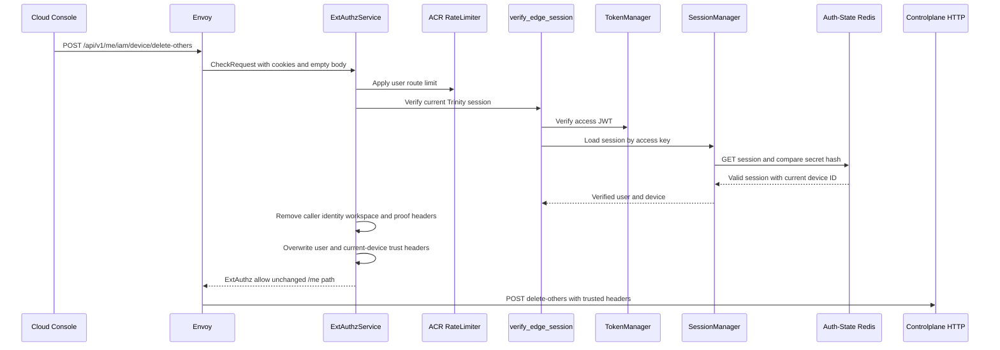
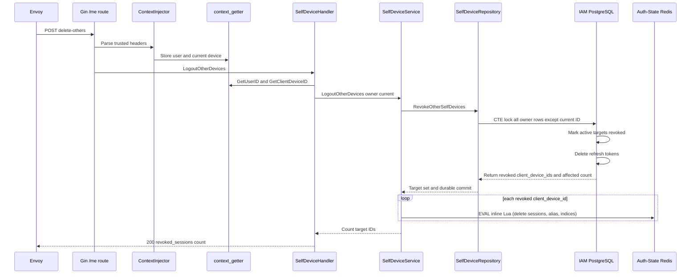

# Self Logout Other Devices — God View

This document is the end-to-end Source of Truth for the current user signing
out every registered device except the device carrying the current verified
session. It is separate from single-device revoke because the target set is
computed by PostgreSQL from the owner and current-device fence.

The workflow is not a global logout and does not revoke the current browser. It
returns the number of target device records selected and revoked by the durable transaction,
and immediately evicts their runtime sessions directly on Auth Redis.

## API-scope contract

| Property | Contract |
|---|---|
| Public method/path | `POST /api/v1/me/iam/device/delete-others` |
| Owner branch | `/me`, self-user only |
| Target set | All devices owned by verified `x-user-id` whose canonical ID differs from verified `x-client-device-id` |
| Current-device source | ACR cookie-derived `x-client-device-id`; never from request JSON |
| Permission middleware | None. `/me` is self-user and repository ownership is mandatory. |
| Session proof | Normal session verification only in current route table |
| Path rewrite | None. `/me` path is forwarded unchanged. |
| Durable owner | IAM PostgreSQL `devices`, `refresh_tokens` |
| Runtime eviction | Direct Auth Redis Lua eviction executed by Controlplane `SelfDeviceService` |
| Current-device guarantee | The CTE excludes the current canonical device, even if the client sends no body. |

## REST input contract

### Headers and cookies

| Input | Used by | Rule |
|---|---|---|
| `Origin` | Envoy/ACR | CORS policy only |
| `Cookie: access_token` | ACR | JWT verification |
| `Cookie: access_key` and `access_secret` | ACR | Auth-State session lookup and secret-hash comparison |
| `Cookie: client_device_id` | ACR | Trusted current-device reference |
| `x-user-id` | ACR output | Client copy removed and overwritten from verified session |
| `x-client-device-id` | ACR output | Client copy removed and overwritten from cookie/generation |
| `x-workspace-id` | ACR | Removed and not consumed by this self workflow |
| Raw proof headers | ACR | Removed; no critical proof is required here |

### Body and query

| Part | Contract |
|---|---|
| Body | Empty. There is no target list in the request. |
| Query | Ignored. |

## REST output contract

Success is a common `200` JSON envelope:

```json
{
  "message": "ok",
  "data": { "revoked_sessions": 3 }
}
```

### Response headers

| Result | Headers |
|---|---|
| Success or CP error | JSON content type; no authentication-cookie mutation |
| ACR denial | ExtAuthz denial headers; no CP response |

### Response payload

| Result | Status | Body |
|---|---:|---|
| Durable target-set revoke and runtime eviction succeeded | `200` | `data.revoked_sessions` equals selected target count |
| Invalid/missing handler context | `401` | Common unauthorized envelope |
| Invalid argument | `400` | Common bad-request envelope |
| PostgreSQL or unexpected service failure | `500` | Common internal-error envelope |
| ACR admission failure | Local `401`, `403`, `429`, or `503` | No CP request |

When there are no other devices, PostgreSQL returns an empty target set and the
service executes no Redis eviction. The HTTP result is still `200` with
`revoked_sessions: 0`.

## Phase 1 — Client → Envoy → ACR admission

ACR authenticates the current browser and forwards no target-selection data.
The absence of a body is a security property: the client cannot ask the server
to revoke an arbitrary list or another user's devices.

1. Envoy sends method/path/cookies/headers in `CheckRequest`.
2. ACR performs CORS and rate-limit checks, then verifies JWT, access key, and
   access-secret hash through Auth-State Redis.
3. ACR performs normal session last-seen/rotation logic. This route is not in
   the session-proof challenge set.
4. ACR removes caller identity, workspace, proof, and trusted-marker headers.
5. ACR overwrites `x-user-id`, `x-user-level`, `x-tenant-id`, `x-zone-id`, and
   `x-client-device-id`, and injects `x-session-proof-verified=false`.
6. ACR preserves `POST /api/v1/me/iam/device/delete-others` exactly and sends
   an empty body upstream. It does not issue `x-original-path`.



### ACR header contract

| Action | Header |
|---|---|
| Remove | `x-admin-signature`, `x-admin-timestamp`, `x-admin-nonce`, `x-admin-stepup-code` |
| Remove | `x-session-proof-signature`, `x-session-proof-timestamp`, `x-session-proof-challenge-id`, `x-session-proof-verified` |
| Remove | `x-workspace-id` direct input |
| Overwrite | `x-user-id`, `x-user-name`, `x-user-level`, `x-tenant-id`, `x-zone-id`, `x-client-device-id` |
| Inject | `x-session-proof-verified: false` |
| Preserve | `:method POST`, `:path /api/v1/me/iam/device/delete-others`, empty body |

## Phase 2 — Controlplane computes, durably revokes target set & evicts Auth Redis sessions

The handler uses only trusted context values. It does not accept a target array
from the browser.

1. `ContextInjector` parses ACR's `x-user-id` and `x-client-device-id`.
2. `SelfDeviceHandler.LogoutOtherDevices` creates a five-second operation
   context and obtains both values through context getters.
3. `SelfDeviceService.LogoutOtherDevices` calls
   `SelfDeviceRepository.RevokeOtherSelfDevices`.
4. The repository CTE selects every row for the verified user and excludes the
   canonical current ID with
   `COALESCE(client_device_id, id) <> current_device_id`.
5. The same statement locks the target set, sets `revoked_at` for active rows,
   deletes refresh tokens for the newly revoked rows, and returns the list of
   revoked `client_device_id`s along with the total affected count.
6. If the target set is empty, the service performs no Redis calls and returns zero.
7. For each revoked `client_device_id`, `SelfDeviceService` executes an inline Lua script
   directly on `authRedis` to evict active runtime sessions:
   - Queries session keys from `iam:device_access_index:{clientDeviceID}`.
   - Deletes each session key, removes it from `iam:user_access_index:{userID}`, and deletes associated session aliases.
   - Deletes the device access index `iam:device_access_index:{clientDeviceID}`.
8. The service records one `iam.device.logout_other_devices` workflow
   observation and returns any repository error unchanged to the HTTP handler.
9. The handler returns `200 OK` with `data.revoked_sessions`.



## Key and contract inventory

| Key/record | Store | Purpose |
|---|---|---|
| `iam.devices` | IAM PostgreSQL | Owner device rows and `revoked_at` |
| `iam.refresh_tokens` | IAM PostgreSQL | Refresh credentials deleted in the same CTE |
| `iam:device_access_index:{device}` | Auth-State Redis Set | Sessions for each target device |
| `iam:user_access_index:{user}` | Auth-State Redis Set | User session membership |
| `iam:session_alias:{access_key}` | Auth-State Redis | Session alias key deleted on eviction |
| `iam:user_session:{zone}:{tenant}:{user}:{access_key}` | Auth-State Redis | Runtime session keys |

## Failure and security invariants

- The current device is selected only by ACR session state and is excluded in a
  locked PostgreSQL CTE. A request body cannot alter that exclusion.
- The durable revoke and refresh-token delete commit before runtime session eviction.
- No Redis eviction is executed for an empty target set.
- Repository failures preserve their original identity until the HTTP handler,
  which logs the cause and returns the sanitized error envelope.
- Runtime session invalidation on Auth Redis is idempotent.
- ACR never forwards raw cookies, access secrets, or proof signatures.
- The current device remains usable, so the browser can inspect the result.

## Code map

| Boundary | Source |
|---|---|
| Route | `controlplane/internal/iam/route.go` |
| Handler | `controlplane/internal/iam/transport/http/handler/self_device_handler.go` |
| Service | `controlplane/internal/iam/service/self_device_service.go` |
| CTE repository | `controlplane/internal/iam/repository/self_device_repo.go` |
| Redis session/index state | `acr/src/user/session.rs` |
| Console client | `cloud-console/src/features/iam/devices-api.ts` |

