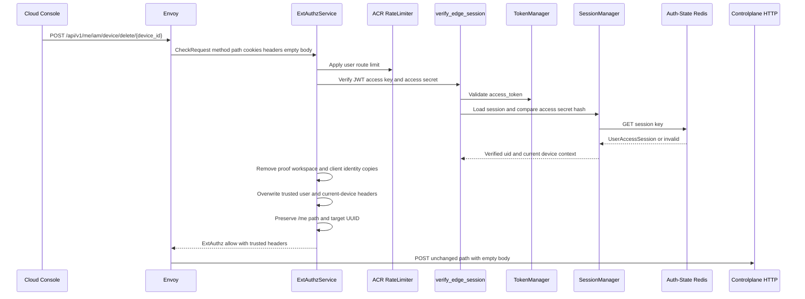
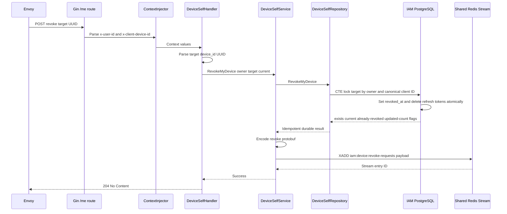
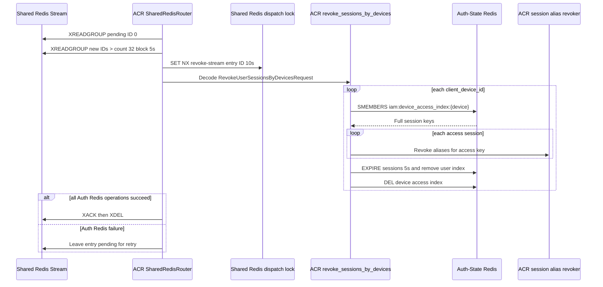

# Self Device Revocation — God View

This document is the end-to-end Source of Truth for revoking one registered
device from the current user's account. The operation is intentionally a
desired-state command: PostgreSQL marks the device revoked and removes its
refresh credentials before ACR asynchronously removes runtime sessions.

The current device is never allowed to revoke itself through this endpoint. A
client-supplied target ID is treated as untrusted until the PostgreSQL ownership
and current-device CTE checks pass.

## API-scope contract

| Property | Contract |
|---|---|
| Public method/path | `POST /api/v1/me/iam/device/delete/:device_id` |
| Owner branch | `/me`, self-user only |
| Target | `:device_id`, parsed as UUID and matched against canonical `client_device_id` |
| Owner source | Verified ACR `x-user-id` |
| Current-device source | Verified ACR `x-client-device-id` |
| Permission middleware | No RBAC `Authorize`; the repository CTE enforces user ownership and self-revocation fence |
| Session proof | Normal session verification only. This endpoint is not marked critical in the current route table. |
| Path rewrite | None. ACR preserves `/api/v1/me/iam/device/delete/:device_id`. |
| Durable owner | IAM PostgreSQL device row and refresh-token rows |
| Runtime cleanup | Shared Redis Stream consumed by ACR replicas |
| Commit boundary | PostgreSQL CTE commit precedes Shared Redis `XADD`; runtime cleanup is at-least-once. |

## REST input contract

### Request headers

| Header/cookie | Sender | Used by | Contract |
|---|---|---|---|
| `Origin` | Browser | Envoy/ACR CORS | Allowed-origin check |
| `Cookie` | Browser | ACR verifier | `access_token`, `access_key`, `access_secret`, `client_device_id` |
| `Content-Type` | Browser | Envoy/HTTP stack | Normally absent because the body is empty |
| `x-user-id` | Untrusted client copy | ACR overwrites | Verified account owner |
| `x-client-device-id` | Untrusted client copy | ACR overwrites | Current device only |
| `x-workspace-id` | Untrusted client copy | ACR removes | Not used by `/me` device ownership |
| `x-session-proof-*` | Untrusted client copy | ACR removes | No raw cryptographic proof reaches CP |

### Path and payload

| Part | Contract |
|---|---|
| Path parameter | `device_id` must parse as UUID. It identifies the target canonical client device. |
| Body | Empty. No JSON target selector is accepted. |
| Query | Not used. |

## REST output contract

### Response headers

| Result | Headers |
|---|---|
| Durable success | `204` with no body and no `Set-Cookie` mutation |
| CP error | JSON content type; no authentication-cookie mutation |
| ACR denial | ExtAuthz denial headers; no CP response |

### Response payload

| Result | Status | Body |
|---|---:|---|
| Durable revoke and stream enqueue succeeded | `204 No Content` | Empty body |
| Malformed target UUID | `400` | `{ "error": "bad request", "message": "invalid device id" }` |
| Target is current device | `403` | `{ "error": "forbidden", "message": "cannot revoke current device" }` |
| Target is not owned or session is invalid | `403` | `{ "error": "forbidden", "message": "forbidden" }` |
| PostgreSQL or Shared Redis failure | `500` | `{ "error": "internal_error", "message": "internal server error" }` |
| ACR admission failure | Local `401`, `403`, `429`, or `503` | No request reaches CP |

The service returns `500` when `XADD` fails after the PostgreSQL commit. That
does not roll the durable revoke back; retry is safe because the repository and
runtime command are idempotent.

## Phase 1 — Client → Envoy → ACR admission

ACR authenticates the caller and forwards the target path unchanged. It does
not inspect or authorize `device_id` against PostgreSQL; that ownership decision
belongs to the Controlplane repository transaction.

### ACR steps

1. Envoy sends a CheckRequest with `POST`, exact path, cookies, headers, and no
   body. ACR reads method/path from HTTP attributes.
2. ACR applies CORS and the user-route rate limiter.
3. `verify_edge_session` verifies the JWT and access-secret hash against the
   Auth-State Redis session. Session rotation/last-seen update follows the
   normal user verification contract.
4. The endpoint is not in the critical proof route set, so ACR does not require
   an Ed25519 session proof. Any proof headers are nevertheless removed.
5. ACR strips all caller copies of identity, workspace, and proof markers.
6. ACR injects verified `x-user-id`, `x-user-level`, `x-tenant-id`, `x-zone-id`,
   `x-client-device-id`, and `x-session-proof-verified=false` with overwrite
   semantics.
7. ACR leaves `:path` and the empty body unchanged. No `x-original-path` is
   emitted because this is `/me`.

### Exact ACR header mutation

| Action | Header/value |
|---|---|
| Remove | `x-admin-signature`, `x-admin-timestamp`, `x-admin-nonce`, `x-admin-stepup-code` |
| Remove | `x-session-proof-signature`, `x-session-proof-timestamp`, `x-session-proof-challenge-id`, `x-session-proof-verified` |
| Remove | `x-workspace-id` direct input |
| Overwrite | `x-user-id` from verified JWT `uid` |
| Overwrite | `x-user-name`, `x-user-level`, `x-tenant-id`, `x-zone-id` from verified claims |
| Overwrite | `x-client-device-id` from `client_device_id` cookie or generated UUID |
| Inject | `x-session-proof-verified: false` |
| Preserve | `:path` and HTTP method |

## Phase 2 — Controlplane ownership transaction

The request enters `DeviceSelfHandler.RevokeMyDevice` through the `/me` Gin
group. The handler, service, and repository have distinct failure boundaries.

1. `ContextInjector` parses the ACR headers. Missing user or current-device
   context stops the handler before any write.
2. The handler starts operation `iam.device.revoke_my_device` with a five-second
   timeout and parses `device_id` as UUID.
3. It obtains `userID` and `currentDeviceID` through `pkg/context` getters and
   calls `DeviceSelfService.RevokeMyDevice`.
4. `DeviceSelfRepository.RevokeMyDevice` executes one PostgreSQL CTE with
   `FOR UPDATE` on the target row. Matching uses
   `COALESCE(client_device_id, id::text) = target` and `user_id = owner`.
5. The CTE updates `revoked_at` only when the target differs from the current
   canonical device and is not already revoked. It deletes refresh-token rows
   for the updated device in the same transaction.
6. The CTE returns target-exists, current-device, already-revoked, and updated
   count flags. Missing owner/target maps to invalid session. Current target
   maps to action-not-allowed. Already-revoked is an idempotent success.
7. After the transaction commits, the service encodes
   `RevokeUserSessionsByDevicesRequest{user_id, [client_device_id]}` as protobuf
   and appends it to Shared Redis stream `iam:device:revoke-requests`.
8. The HTTP handler sends `204` only after `XADD` succeeds.

## Phase 3 — ACR runtime session cleanup

The Shared Redis command is consumed asynchronously by every ACR replica in
consumer group `acr-device-runtime-v1`. The stream is the durable bridge from
the PostgreSQL commit to Auth-State Redis cleanup.

1. `SharedRedisRouter` creates the group if needed and reads pending entries
   with ID `0` before reading new entries with `>`.
2. It processes at most 32 entries per read and blocks for up to five seconds
   when no fresh entry exists.
3. A short `SET NX PX 10000` lock at
   `iam:device:dispatch:revoke-stream:{entry_id}` prevents duplicate work when
   replicas see the same pending entry.
4. Missing payload or malformed protobuf is a poison message. ACR logs the
   contract failure and ACKs plus deletes the entry so one bad producer cannot
   stall the group.
5. A valid request calls `revoke_sessions_by_devices`. For each target device,
   ACR reads `iam:device_access_index:{client_device_id}` from Auth-State Redis.
6. Each indexed session key has its Billing/session aliases revoked first. A
   Redis pipeline then expires session keys for five seconds, removes them from
   `iam:user_access_index:{user_id}`, and deletes the device index.
7. Auth-State Redis failure leaves the stream entry pending. A different ACR
   replica may retry it; no ACK is emitted for partial failure.
8. Only after all target device IDs complete does ACR issue `XACK` and `XDEL`.

## Key and contract inventory

| Key/record | Store | Operation and purpose |
|---|---|---|
| `iam.devices.client_device_id` | IAM PostgreSQL | Durable target identity |
| `iam.devices.revoked_at` | IAM PostgreSQL | Durable revoke state |
| `iam.refresh_tokens.device_id` | IAM PostgreSQL | Deleted in same CTE transaction |
| `RevokeUserSessionsByDevicesRequest` | Protobuf | Runtime command payload |
| `iam:device:revoke-requests` | Shared Redis Stream | Durable command bridge |
| `acr-device-runtime-v1` | Shared Redis consumer group | ACR runtime worker ownership |
| `iam:device:dispatch:revoke-stream:{id}` | Shared Redis | Ten-second duplicate-work fence |
| `iam:device_access_index:{device}` | Auth-State Redis Set | Session keys for one device |
| `iam:user_access_index:{user}` | Auth-State Redis Set | User session cleanup |
| `iam:user_session:{zone}:{tenant}:{user}:{access_key}` | Auth-State Redis | Runtime credential, five-second grace on revoke |

## Failure, retry, and security invariants

- A client cannot revoke another user's device because the CTE includes the
  verified user owner in its target predicate.
- A client cannot revoke the current device because the CTE compares canonical
  target and current IDs while the target row is locked.
- PostgreSQL commit precedes runtime cleanup. A successful HTTP response means
  the durable state and command enqueue completed, not that every ACR replica
  has already removed its session.
- `XADD` failure returns `500` even though PostgreSQL is already revoked. The
  next client retry sees the already-revoked desired state and enqueues the
  runtime command again.
- Runtime cleanup is at-least-once. `EXPIRE`, `SREM`, and `DEL` are safe to
  repeat; no exactly-once claim is made.
- Poison messages are dropped only when their wire contract is invalid. A
  transient Auth Redis failure remains pending for takeover.
- Logs must omit cookies, access secrets, JWTs, and full session keys.

## Code map

| Boundary | Source |
|---|---|
| Route | `controlplane/internal/iam/route.go` |
| Context getters | `controlplane/pkg/context/context_getter.go` |
| HTTP handler | `controlplane/internal/iam/transport/http/handler/device_self_handler.go` |
| Service | `controlplane/internal/iam/service/device_self_service.go` |
| Durable CTE | `controlplane/internal/iam/repository/device_self_repo.go` |
| Stream consumer | `acr/src/transport/redis.rs` |
| Auth-State revoke | `acr/src/user/revoke.rs` |
| Session/index primitives | `acr/src/user/session.rs` |
| Console command | `cloud-console/src/features/iam/devices-api.ts` |
