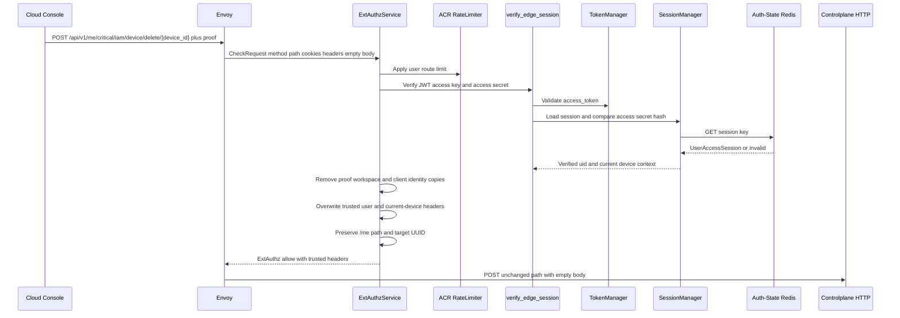
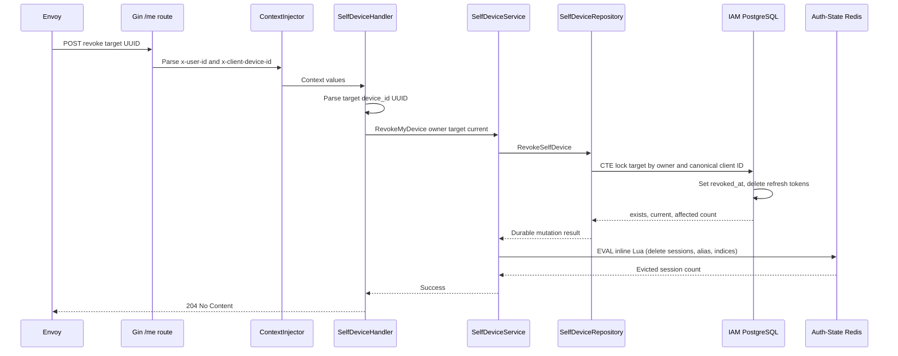

# Self Device Revocation — God View

This document is the end-to-end Source of Truth for revoking one registered
device from the current user's account. The operation is executed in Controlplane:
PostgreSQL marks the device revoked and removes its refresh credentials in an atomic
CTE, followed by immediate direct session eviction on Auth Redis.

The current device is never allowed to revoke itself through this endpoint. A
client-supplied target ID is treated as untrusted until the PostgreSQL ownership
and current-device CTE checks pass.

## API-scope contract

| Property | Contract |
|---|---|
| Public method/path | `POST /api/v1/me/critical/iam/device/delete/:device_id` |
| Owner branch | `/me`, self-user only |
| Target | `:device_id`, parsed as UUID and matched against canonical `client_device_id` |
| Owner source | Verified ACR `x-user-id` |
| Current-device source | Verified ACR `x-client-device-id` |
| Permission middleware | No RBAC `Authorize`; the repository CTE enforces user ownership and self-revocation fence |
| Session proof | Required. ACR verifies and consumes a proof bound to the exact method, critical `/me` path, empty body, timestamp, and challenge. Controlplane requires the verified marker. |
| Path rewrite | None. ACR preserves `/api/v1/me/critical/iam/device/delete/:device_id`. |
| Durable owner | IAM PostgreSQL `devices` and `refresh_tokens` rows |
| Runtime cleanup | Direct Auth Redis Lua eviction executed by Controlplane `SelfDeviceService` |
| Commit boundary | Device revoke and refresh-token deletion commit in one PostgreSQL CTE. Runtime session cleanup follows immediately on Auth Redis. |

## REST input contract

### Request headers

| Header/cookie | Sender | Used by | Contract |
|---|---|---|---|
| `Origin` | Browser | Envoy/ACR CORS | Allowed-origin check |
| `Cookie` | Browser | ACR verifier | `access_token`, `access_key`, `access_secret`, `client_device_id` |
| `Content-Type` | Browser | Envoy/HTTP stack | Normally absent because the body is empty |
| `x-user-id` | Untrusted client copy | ACR overwrites | Verified account owner |
| `x-client-device-id` | Untrusted client copy | ACR overwrites | Current device only |
| `x-workspace-id` | Untrusted client copy | ACR removes | Not used by `/me` device ownership |
| `x-session-proof-*` | Browser proof input / ACR trusted output | ACR removes raw proof inputs, verifies and consumes the nonce, then injects only `x-session-proof-verified: true` plus the verified challenge ID |

### Path and payload

| Part | Contract |
|---|---|
| Path parameter | `device_id` must parse as UUID. It identifies the target canonical client device. |
| Body | Empty. No JSON target selector is accepted. |
| Query | Not used. |

## REST output contract

### Response headers

| Result | Headers |
|---|---|
| Durable success | `204` with no body and no `Set-Cookie` mutation |
| CP error | JSON content type; no authentication-cookie mutation |
| ACR denial | ExtAuthz denial headers; no CP response |

### Response payload

| Result | Status | Body |
|---|---:|---|
| Durable revoke and runtime session eviction succeeded | `204 No Content` | Empty body |
| Malformed target UUID | `400` | `{ "error": "bad request", "message": "invalid device id" }` |
| Target is current device | `403` | `{ "error": "forbidden", "message": "cannot revoke current device" }` |
| Target is not owned or session is invalid | `403` | `{ "error": "forbidden", "message": "forbidden" }` |
| PostgreSQL, Auth Redis, or unexpected service failure | `500` | `{ "error": "internal_error", "message": "internal server error" }` |
| ACR admission failure | Local `401`, `403`, `429`, or `503` | No request reaches CP |

## Phase 1 — Client → Envoy → ACR admission

ACR authenticates the caller and forwards the target path unchanged. It does
not inspect or authorize `device_id` against PostgreSQL; that ownership decision
belongs to the Controlplane repository transaction.

### ACR steps

1. Envoy sends a CheckRequest with `POST`, exact path, cookies, headers, and no
   body. ACR reads method/path from HTTP attributes.
2. ACR applies CORS and the user-route rate limiter.
3. `verify_edge_session` verifies the JWT and access-secret hash against the
   Auth-State Redis session. Session rotation/last-seen update follows the
   normal user verification contract.
4. ACR loads the one-time critical challenge, verifies the Ed25519 proof over
   the exact method/path/body hash/timestamp, and atomically consumes the nonce.
5. ACR strips all caller copies of identity, workspace, and raw proof headers.
6. ACR injects verified `x-user-id`, `x-user-level`, `x-tenant-id`, `x-zone-id`,
   `x-client-device-id`, `x-session-proof-verified=true`, and the verified
   challenge ID with overwrite semantics.
7. ACR leaves `:path` and the empty body unchanged. No `x-original-path` is
   emitted because this is `/me`.

### Exact ACR header mutation

| Action | Header/value |
|---|---|
| Remove | `x-admin-signature`, `x-admin-timestamp`, `x-admin-nonce`, `x-admin-stepup-code` |
| Remove | `x-session-proof-signature`, `x-session-proof-timestamp`, `x-session-proof-challenge-id`, `x-session-proof-verified` |
| Remove | `x-workspace-id` direct input |
| Overwrite | `x-user-id` from verified JWT `uid` |
| Overwrite | `x-user-name`, `x-user-level`, `x-tenant-id`, `x-zone-id` from verified claims |
| Overwrite | `x-client-device-id` from `client_device_id` cookie or generated UUID |
| Inject | `x-session-proof-verified: true`, verified `x-session-proof-challenge-id` |
| Preserve | `:path` and HTTP method |

## Phase 2 — Controlplane ownership transaction & direct runtime session eviction

The request enters `SelfDeviceHandler.RevokeMyDevice` through the `/me` Gin
group. The handler, service, and repository execute the durable change and runtime
invalidation directly.

1. `ContextInjector` parses the ACR headers. Missing user or current-device
   context stops the handler before any write.
2. The handler starts operation `iam.device.revoke_my_device` with a five-second
   timeout and parses `device_id` as UUID.
3. It obtains `userID` and `currentDeviceID` through `pkg/context` getters and
   calls `SelfDeviceService.RevokeMyDevice`.
4. `SelfDeviceRepository.RevokeSelfDevice` executes one PostgreSQL CTE with
   `FOR UPDATE` on the target row. Matching uses
   `COALESCE(client_device_id, id) = target` and `user_id = owner`.
5. The CTE updates `revoked_at` only when the target differs from the current
   canonical device and is not already revoked. It deletes refresh-token rows
   for the updated device.
6. The CTE returns target-exists, current-device, and updated count flags.
   Missing owner/target maps to invalid session (`403`). Current target maps to
   action-not-allowed (`403`).
7. Upon successful database mutation, `SelfDeviceService` executes an inline Lua script
   directly on `authRedis` to evict active runtime sessions:
   - Queries session keys from `iam:device_access_index:{clientDeviceID}`.
   - Deletes each session key, removes it from `iam:user_access_index:{userID}`, and deletes associated session aliases.
   - Deletes the device access index `iam:device_access_index:{clientDeviceID}`.
   An Auth Redis error is returned unchanged to the handler. Retrying is safe:
   the repository still returns the owned already-revoked target, and the Lua
   cleanup is idempotent.
8. The service records one `iam.device.revoke_my_device` workflow observation.
9. The HTTP handler sends `204 No Content`.

## Key and contract inventory

| Key/record | Store | Operation and purpose |
|---|---|---|
| `iam.devices.client_device_id` | IAM PostgreSQL | Durable target identity |
| `iam.devices.revoked_at` | IAM PostgreSQL | Durable revoke state |
| `iam.refresh_tokens.device_id` | IAM PostgreSQL | Deleted in same CTE transaction |
| `iam:device_access_index:{device}` | Auth-State Redis Set | Session keys for one device |
| `iam:user_access_index:{user}` | Auth-State Redis Set | User session cleanup |
| `iam:session_alias:{access_key}` | Auth-State Redis | Session alias key deleted on eviction |
| `iam:user_session:{zone}:{tenant}:{user}:{access_key}` | Auth-State Redis | Runtime credential deleted immediately |

## Failure, retry, and security invariants

- A client cannot revoke another user's device because the CTE includes the
  verified user owner in its target predicate.
- A client cannot revoke the current device because the CTE compares canonical
  target and current IDs while the target row is locked.
- PostgreSQL commit precedes runtime session invalidation on Auth Redis.
- Service-generated ownership/current-device outcomes use IAM taxonomy;
  repository errors retain their original identity until the HTTP handler.
- Runtime session invalidation on Auth Redis is idempotent.
- Logs must omit cookies, access secrets, JWTs, and full session keys.

## Code map

| Boundary | Source |
|---|---|
| Route | `controlplane/internal/iam/route.go` |
| Context getters | `controlplane/pkg/context/context_getter.go` |
| HTTP handler | `controlplane/internal/iam/transport/http/handler/self_device_handler.go` |
| Service | `controlplane/internal/iam/service/self_device_service.go` |
| Durable CTE | `controlplane/internal/iam/repository/self_device_repo.go` |
| Redis session/index state | `acr/src/user/session.rs` |
| Console command | `cloud-console/src/features/iam/devices-api.ts` |
