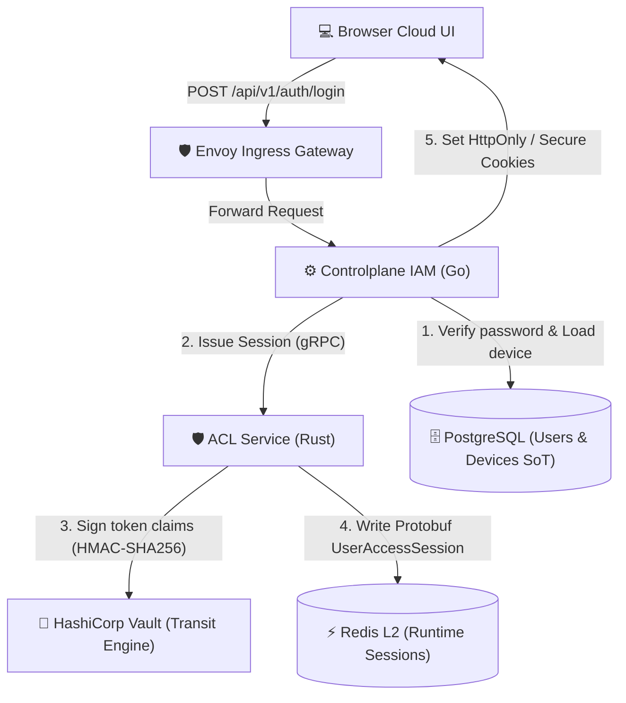
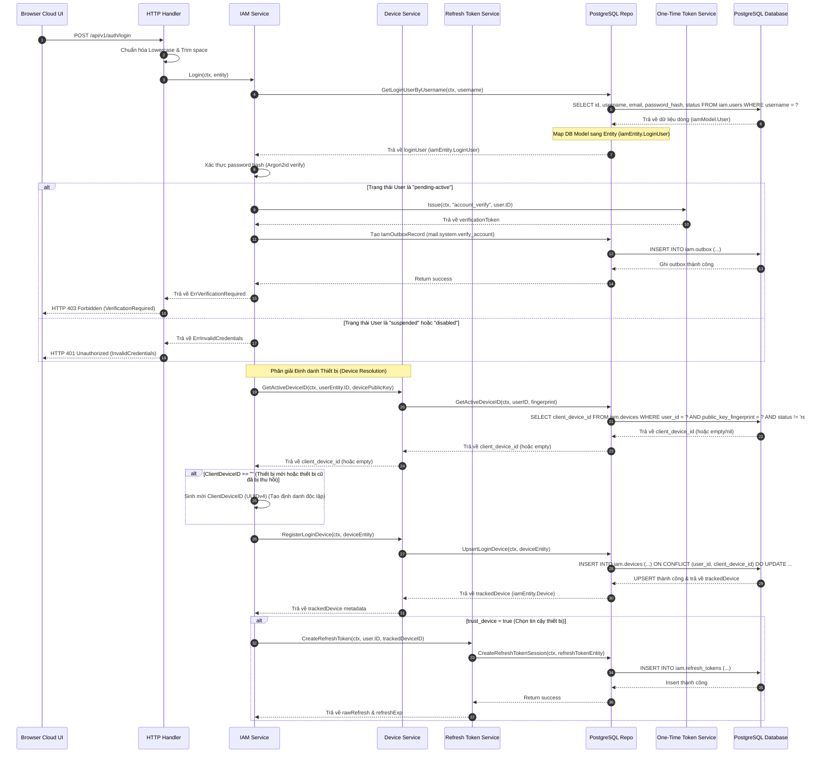
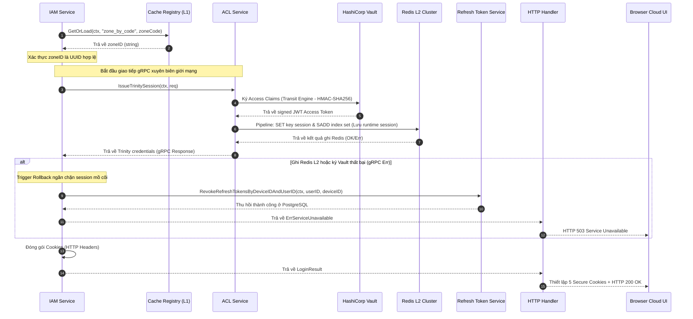

<!-- markdownlint-disable MD033 -->
# End-User Login & Session Initialization - Workflow God View

> [!NOTE]
> Tài liệu này đóng vai trò là **Source of Truth (SoT) / God View** cho luồng Đăng nhập (Login) và Khởi tạo phiên hoạt động của End-User.
> Mọi thay đổi về code liên quan đến xác thực mật khẩu, kiểm tra trạng thái tài khoản, gắn kết thiết bị và ghi nhận phiên chạy lên Redis L2 phải tuân thủ nghiêm ngặt đặc tả này.

---

## 🗺️ 1. Giới Thiệu

### 👥 Tài Liệu Này Dành Cho Ai?

Tài liệu được thiết kế cho các kỹ sư Backend phát triển dịch vụ IAM, đội ngũ chuyên viên Bảo mật giám sát phiên đăng nhập và các kỹ sư SRE chịu trách nhiệm đảm bảo tính khả dụng và khả năng tự rollback/khôi phục khi ghi nhận thông tin phiên lên cụm lưu trữ phân tán.

### ❓ Phân hệ End-User Login là gì?

Đây là quy trình xác thực thông tin định danh (Username/Password), kiểm định trạng thái của tài khoản (Active, Pending-Active, Suspended, Disabled) và đăng ký/gắn kết thiết bị người dùng (Device Binding) dựa trên chữ ký khóa công khai Ed25519. Kết quả thành công sẽ phát hành bộ **Credentials 3 thành phần (Trinity Credentials)** được đồng bộ hóa lên tầng lưu trữ runtime Redis L2 dưới dạng nhị phân tối ưu hóa.

### 📍 Các Biên Công Nghệ Hoạt Động

- **Frontend Cloud UI**: Trang `login` & [auth.ts](file:///home/phucle/Desktop/New/cloud-ui/src/lib/api/auth.ts).
- **Controlplane HTTP Handler**: `Login` handler in [auth_handler.go](file:///home/phucle/Desktop/New/controlplane/internal/iam/transport/http/handler/auth_handler.go).
- **IAM Core Service**: `Login` method in [auth_service.go](file:///home/phucle/Desktop/New/controlplane/internal/iam/service/auth_service.go).
- **Device Service**: [device_service.go](file:///home/phucle/Desktop/New/controlplane/internal/iam/service/device_service.go) (Phân giải thiết bị và tự dọn dẹp thiết bị vượt định mức).
- **Security Signer**: Vault JWT Transit in [jwt.go](file:///home/phucle/Desktop/New/controlplane/internal/security/jwt.go).
- **Database (PostgreSQL)**: Bảng `iam.users` và `iam.devices`.
- **Cache Engine**: Redis Cluster L2 (Lưu thông tin phiên dạng Protobuf `iamproto.UserAccessSession`).

---

## 🏛️ 2. Sơ Đồ Hệ Thống & Ranh Giới Phase



### 🚧 Biên Và Ràng Buộc (Boundaries & Constraints)

- **Đầu Vào (Inputs)**: JSON Payload (`username`, `password`, `device_public_key`, `trust_device`, `zone_code`).
- **Đầu Ra (Outputs)**: HTTP `200 OK` thiết lập 5 Cookies mật mã (`access_token`, `refresh_token`, `access_key`, `access_secret`, `client_device_id`) cùng header `X-Client-Device-Id`.
- **Ngăn Chặn Direct Call**: Việc truy xuất thông tin thiết bị và đăng ký thiết bị bắt buộc thông qua `DeviceService` để đảm bảo ranh giới kiến trúc (Architectural Boundaries), tuyệt đối không cho phép `AuthService` truy cập trực tiếp repository của thiết bị.

---

## 🔍 3. Chi Tiết Thực Thi Nghiệp Vụ Theo Phase

### 🛡️ Chuỗi Middleware Áp Dụng (Security & Observability Pipeline)

Khi một yêu cầu đăng nhập (`POST /api/v1/auth/login`) được gửi đến Controlplane, nó sẽ đi qua chuỗi phòng ngự gồm các middleware sau:

| Middleware | Feature / Vai Trò | Level (App/Route) |
| :--- | :--- | :--- |
| `gin.Recovery()` | Chặn panic bảo vệ tiến trình khỏi sập đột ngột (Fail-Safe). | App (Global) |
| `middleware.RequestID()` | Gắn correlation ID (`X-Request-Id`) vào HTTP response header phục vụ đối chiếu log/trace. | App (Global) |
| `middleware.OTelTraceContext()` | Phục hồi hoặc khởi tạo ngữ cảnh theo vết phân tán OpenTelemetry trace context. | App (Global) |
| `middleware.OTelHTTPMetrics()` | Tự động đo lường tần suất request, latency và status codes đẩy sang Prometheus. | App (Global) |
| `middleware.CookieOriginGuard()` | Kiểm tra nguồn gốc Origin của yêu cầu đính kèm cookie để chống tấn công CSRF. | App (Global) |
| `Envoy Local Rate Limit & Connection Limit` | Chống DDoS/Spam bằng cách lọc chặn IP thô & Max Connection (Inflight) từ tầng Gateway trước khi chạm Controlplane. | Envoy Ingress |
| `middleware.AccessLog()` | Ghi nhật ký truy cập chứa thông tin ngữ cảnh bảo mật và định danh. | App (Global) |
| `middleware.AdminXSSI()` | Chống tấn công XSSI (Cross-Site Script Inclusion) bằng cách chèn tiền tố an toàn vào JSON. | App (Global) |
| `middleware.RateLimitPostAuth()` | Giới hạn brute-force tần suất thử mật khẩu cho endpoint `/api/v1/auth/login` (chạy chế độ fallback KeyIP do chưa có Identity). | Route (Endpoint /login) |

---

### 📌 PHASE 1: Client -> Control Plane (CP) Processing

#### 1. Sơ đồ trình tự (Sequence Diagram - Phase 1)



#### 2. Ranh giới & Ràng buộc (Boundary & Constraints)

- **Biên giới**: Luồng dữ liệu đi qua biên giới mạng từ Client Browser (HTTPS) đến Controlplane Handler (Go). Sau đó, Controlplane IAM Core Service tương tác đồng bộ với PostgreSQL Database (SoT cho Users & Devices).
- **Ràng buộc bảo mật**:
  - Không cho phép `AuthService` truy xuất trực tiếp DB Repository của thiết bị mà bắt buộc phải qua `DeviceService` để giữ vững ranh giới kiến trúc (Architectural Boundary).
  - Khóa công khai `public_key` và `public_key_fingerprint` tuyệt đối không được cho phép cập nhật đè (chỉ ghi một lần khi tạo mới thiết bị) nhằm ngăn chặn cuộc tấn công chiếm quyền thiết bị (Device Takeover).
  - **Cấu trúc Refresh Token**: Token được sinh ra dưới định dạng `<userID>_<random_entropy>` (độ dài tổng cộng khoảng 64 - 72 ký tự, cụ thể là 69 ký tự). Việc nhúng `userID` trực tiếp vào token thô giúp tăng cường bảo mật và triệt tiêu khả năng trùng lặp khóa (Unique Key Collision) vì ID người dùng luôn là duy nhất.

#### 3. Điều kiện thực thi (Conditions)

- **Tài khoản hợp lệ**: `User.Status` bắt buộc phải là `active`. Nếu là `pending-active`, hệ thống sẽ tạm dừng luồng đăng nhập, gửi token kích hoạt qua mail outbox và trả về mã lỗi HTTP 403. Nếu ở trạng thái khác (`suspended`/`disabled`), lập tức từ chối bằng HTTP 401.
- **Thiết bị không bị chặn**: Trạng thái của thiết bị không được phép là `revoked`.

#### 4. Hợp đồng dữ liệu (Data Contract - Phase 1)

##### Request Payload: `requestdto.LoginRequest` (JSON)

```json
{
  "username": "phucle996",
  "password": "SuperSecurePassword123!",
  "device_public_key": "MCowBQYDK2VwAyEAdS5D...",
  "trust_device": true,
  "zone_code": "vn"
}
```

---

### 📌 PHASE 2: ACL Issue Session -> Back to Client

#### 1. Sơ đồ trình tự (Sequence Diagram - Phase 2)



#### 2. Ranh giới & Ràng buộc (Boundary & Constraints)

- **Biên giới**: Giao tiếp gRPC nội bộ tốc độ cao giữa `Controlplane IAM (Go)` và `ACL Service (Rust)`. ACL Service đảm nhận vai trò quản trị viên phiên runtime, trực tiếp tương tác với các hệ thống phân tán HA: Redis L2 Cluster và HashiCorp Vault (Transit Engine).
- **Ràng buộc an toàn**: Quyền hạn tạo, lưu trữ và ký JWT Access Session runtime được chuyển giao hoàn toàn sang ACL Service để tách biệt luồng nghiệp vụ dữ liệu tĩnh (IAM PostgreSQL) và luồng token động (ACL Redis).

#### 3. Điều kiện thực thi & Rollback (Conditions & Rollback Logic)

- **Fail-Close Rollback**: Nếu ACL Service trả về lỗi (như lỗi kết nối Redis L2 hoặc lỗi ký JWT ở Vault), CP IAM bắt buộc phải hủy bỏ Refresh Token đã ghi nhận tại Phase 1 thông qua `RevokeRefreshTokensByDeviceIDAndUserID` nhằm tránh tình trạng rò rỉ phiên mồ côi (Orphaned session token) và phản hồi HTTP 503 lập tức.
- **Dọn dẹp thiết bị (Eviction)**: Chạy bất đồng bộ (best-effort) để dọn dẹp các thiết bị cũ nếu tổng số thiết bị đã lưu của user vượt giới hạn quy chuẩn (50 thiết bị).

#### 4. Hợp đồng dữ liệu (Data Contract - Phase 2)

##### gRPC Request: `iamproto.IssueTrinitySessionRequest`

```protobuf
message IssueTrinitySessionRequest {
  string user_id = 1;
  string device_id = 2;
  string client_device_id = 3;
  string username = 4;
  string role = 5;
  int32 level = 6;
  string tenant_id = 7;
  string zone_id = 8;
  bool trust_device = 9;
  string client_ip = 10;
  string user_agent = 11;
}
```

##### gRPC Response: `iamproto.IssueTrinitySessionResponse`

```protobuf
message IssueTrinitySessionResponse {
  string access_token = 1;
  string refresh_token = 2;
  string access_key = 3;
  string access_secret = 4;
  string client_device_id = 5;
  int64 expires_in_secs = 6;
}
```

##### Cấu trúc lưu trữ Redis L2 (Binary Protobuf `UserAccessSession`)

- **Session Key**: `iam:user_access_session:<user_id>:<access_key>` (TTL 1800 giây).

- **Index Set Key**: `iam:user_access_index:<user_id>` (Dạng Set chứa các `access_key` đang hoạt động).

##### HTTP Cookie Specifications

Các Cookies được set từ HTTP Handler về Browser Client:

- `access_token`: JWT token chứa claims định danh (HttpOnly=true, Secure=true, SameSite=Lax, Path=/).
- `refresh_token`: Opaque token phục vụ phục hồi phiên lâu dài (HttpOnly=true, Secure=true, SameSite=Lax, Path=/).
- `access_key`: Key thô dạng Plain UUIDv7 dùng để tra cứu nhanh L2 Redis (HttpOnly=false, Secure=true, SameSite=Lax, Path=/).
- `access_secret`: Chữ ký xác thực tính toàn vẹn (HttpOnly=true, Secure=true, SameSite=Lax, Path=/).
- `client_device_id`: Mã định danh thiết bị dài hạn (HttpOnly=false, Secure=true, SameSite=Lax, Expires=365 days).

---

## 📋 4. Đặc Tả Thực Thể Domain & CSDL

### 1. Service Domain Entities (`iamEntity`)

Các Entity hoạt động độc lập tại lớp nghiệp vụ (Service layer):

##### A. User Entity

```go
type UserStatus string

const (
    UserStatusPendingActive UserStatus = "pending-active"
    UserStatusActive        UserStatus = "active"
    UserStatusSuspended     UserStatus = "suspended"
    UserStatusDisabled      UserStatus = "disabled"
)

type User struct {
    ID           uuid.UUID
    Username     string
    Email        string
    Phone        *string
    PasswordHash string
    Status       UserStatus
    CreatedAt    time.Time
    UpdatedAt    time.Time
}
```

##### B. Device Entity

```go
type DeviceStatus string

const (
    DeviceStatusNew        DeviceStatus = "new"
    DeviceStatusRecognized DeviceStatus = "recognized"
    DeviceStatusTrusted    DeviceStatus = "trusted"
    DeviceStatusSuspicious DeviceStatus = "suspicious"
    DeviceStatusRevoked    DeviceStatus = "revoked"
)

type Device struct {
    ID                   string
    UserID               uuid.UUID
    DeviceName           string
    DeviceType           *string
    OSName               *string
    BrowserName          *string
    PublicKey            string
    PublicKeyAlg         string
    PublicKeyFingerprint string
    ClientDeviceID       *string
    Status               DeviceStatus
    TrustedAt            *time.Time
    QuarantinedAt        *time.Time
    RiskFlags            map[string]any
    RevokedAt            *time.Time
    LastSeenIP           *string
    LastSeenUserAgent    *string
    LastSeenAt           *time.Time
    CreatedAt            time.Time
    UpdatedAt            time.Time
}
```

### 4. Repository DB Models (`iamModel`)

Mô hình ánh xạ với CSDL PostgreSQL:

##### A. User DB Model

```go
type User struct {
    ID           uuid.UUID `db:"id"`
    Username     string    `db:"username"`
    Email        string    `db:"email"`
    Phone        *string   `db:"phone"`
    PasswordHash string    `db:"password_hash"`
    Status       string    `db:"status"`
    CreatedAt    time.Time `db:"created_at"`
    UpdatedAt    time.Time `db:"updated_at"`
}
```

##### B. Device DB Model

```go
type Device struct {
    ID                   string     `db:"id"`
    UserID               uuid.UUID  `db:"user_id"`
    DeviceName           string     `db:"device_name"`
    DeviceType           *string    `db:"device_type"`
    OSName               *string    `db:"os_name"`
    BrowserName          *string    `db:"browser_name"`
    PublicKey            string     `db:"public_key"`
    PublicKeyAlg         string     `db:"public_key_alg"`
    PublicKeyFingerprint string     `db:"public_key_fingerprint"`
    ClientDeviceID       *string    `db:"client_device_id"`
    Status               string     `db:"status"`
    TrustedAt            *time.Time `db:"trusted_at"`
    QuarantinedAt        *time.Time `db:"quarantined_at"`
    RiskFlags            []byte     `db:"risk_flags"`
    RevokedAt            *time.Time `db:"revoked_at"`
    LastSeenIP           *string    `db:"last_seen_ip"`
    LastSeenUserAgent    *string    `db:"last_seen_user_agent"`
    LastSeenAt           *time.Time `db:"last_seen_at"`
    CreatedAt            time.Time  `db:"created_at"`
    UpdatedAt            time.Time  `db:"updated_at"`
}
```

### 5. PostgreSQL Table Schemas

##### Bảng Người Dùng `iam.users`

```sql
CREATE TABLE IF NOT EXISTS iam.users (
    id UUID PRIMARY KEY DEFAULT gen_random_uuid(),
    username VARCHAR(64) NOT NULL,
    email VARCHAR(255) NOT NULL,
    phone VARCHAR(32) NULL,
    password_hash TEXT NOT NULL,
    status VARCHAR(50) NOT NULL DEFAULT 'pending-active',
    created_at TIMESTAMPTZ NOT NULL DEFAULT NOW(),
    updated_at TIMESTAMPTZ NOT NULL DEFAULT NOW()
);
```

##### Bảng Thiết Bị Đăng Nhập `iam.devices`

```sql
CREATE TABLE IF NOT EXISTS iam.devices (
    id UUID PRIMARY KEY DEFAULT gen_random_uuid(),
    user_id UUID NOT NULL REFERENCES iam.users(id) ON DELETE CASCADE,
    device_name VARCHAR(255) NOT NULL,
    device_type VARCHAR(64) NULL,
    os_name VARCHAR(128) NULL,
    browser_name VARCHAR(128) NULL,
    public_key TEXT NOT NULL,
    public_key_alg VARCHAR(64) NOT NULL DEFAULT 'Ed25519',
    public_key_fingerprint VARCHAR(255) NOT NULL,
    status VARCHAR(50) NOT NULL DEFAULT 'new',
    trusted_at TIMESTAMPTZ NULL,
    quarantined_at TIMESTAMPTZ NULL,
    risk_flags JSONB NOT NULL DEFAULT '{}'::JSONB,
    revoked_at TIMESTAMPTZ NULL,
    client_device_id VARCHAR(128) NULL,
    last_seen_ip INET NULL,
    last_seen_user_agent TEXT NULL,
    last_seen_at TIMESTAMPTZ NULL,
    created_at TIMESTAMPTZ NOT NULL DEFAULT NOW(),
    updated_at TIMESTAMPTZ NOT NULL DEFAULT NOW()
);
CREATE UNIQUE INDEX IF NOT EXISTS devices_user_client_device_uidx ON iam.devices (user_id, client_device_id) WHERE client_device_id IS NOT NULL;
```

---

## 🛡️ 5. Xử Lý Concurrency & Race Condition

### 1. Redis Write Fail-Close Rollback (Chống Rò Rỉ Phiên)

- **Rủi Ro**: Opaque Refresh Token được ghi thành công xuống PostgreSQL nhưng kết nối ghi nhận Access Session lên cụm Redis L2 gặp sự cố (Timeout, network partition). Nếu tiến trình vẫn chạy tiếp, người dùng sẽ có một Refresh Token hợp lệ tồn tại ở DB nhưng không có Access Session ở cache $\rightarrow$ Phục hồi phiên liên tục bị lỗi.
- **Giải Pháp**:
  - Ghi nhận và cấu trúc logic bảo vệ: Nếu ghi Redis thất bại, luồng xử lý lập tức trigger rollback bất đồng bộ:

    ```go
    if req.TrustDevice && s.refreshSvc != nil {
        _ = s.refreshSvc.RevokeRefreshTokensByDeviceIDAndUserID(ctx, user.ID, trackedDeviceID)
    }
    ```

  - Trả về mã lỗi HTTP 503 chặn đứng yêu cầu đăng nhập lỗi.

### 2. Quản Lý Trùng Lặp Thiết Bị Bằng Unique Index (Unique Index Device Deduplication)

- **Rủi Ro**: Trình duyệt vẫn lưu cookie `client_device_id` nhưng đăng nhập với cặp khóa công khai thiết bị khác (ví dụ: sau khi xóa IndexedDB tạo khóa mới hoặc đăng nhập lại). Nếu không xử lý trùng khớp, việc tạo mới liên tục bản ghi cho cùng một `client_device_id` sẽ làm tràn số lượng thiết bị và gây sai lệch thống kê.
- **Giải Pháp**:
  - Cơ sở dữ liệu PostgreSQL định nghĩa chỉ mục duy nhất:

    ```sql
    CREATE UNIQUE INDEX IF NOT EXISTS devices_user_client_device_uidx 
        ON devices(user_id, client_device_id) 
        WHERE client_device_id IS NOT NULL;
    ```

  - Khi thực hiện đăng ký thiết bị đăng nhập (`UpsertLoginDevice`), sử dụng mệnh đề `ON CONFLICT (user_id, client_device_id) WHERE client_device_id IS NOT NULL`.
  - Để bảo mật và tránh các cuộc tấn công chiếm quyền thiết bị (device takeover), khóa công khai `public_key` và `public_key_fingerprint` **chỉ được ghi nhận một lần duy nhất khi tạo mới và tuyệt đối không được cập nhật đè** ở mệnh đề `DO UPDATE SET`.
  - Mệnh đề `DO UPDATE SET` chỉ thực hiện cập nhật các thông tin siêu dữ liệu (metadata) động của thiết bị như `device_name`, `device_type`, `os_name`, `browser_name`, `last_seen_ip`, `last_seen_user_agent` và mốc thời gian hoạt động `last_seen_at`.

---

## 📊 6. Giám Sát Và Truy Vết - Grafana Runbook

### 1. Prometheus Metrics Cảnh Báo

- **Service Outcomes**: `iam_service_calls_total{op="iam.auth.login", outcome}`
- **Postgres Upsert Device Latency**: `iam_downstream_call_duration_seconds{op="iam.auth.login", kind="repo", destination="RegisterLoginDevice"}`

#### 📈 PromQL Cần Thiết

##### A. Đo lường tỷ lệ đăng nhập thành công của hệ thống

```promql
sum(rate(iam_service_calls_total{op="iam.auth.login", outcome="success"}[5m])) / sum(rate(iam_service_calls_total{op="iam.auth.login"}[5m])) * 100
```

##### B. Độ trễ ghi nhận Session lên Redis L2

```promql
histogram_quantile(0.99, sum(rate(iam_downstream_call_duration_seconds_bucket{kind="cache-engine-l2"}[5m])) by (le))
```

### 2. LogsQL (VictoriaLogs) Giám Sát

##### Tìm kiếm các log lỗi xảy ra trong quá trình đăng nhập

```logsql
t="iam.auth.login" level="error" | select(request_id, error_message, client_ip)
```

##### Phát hiện hành vi dò quét đăng nhập trái phép (Brute-force)

```logsql
t="iam.auth.login" "login invalid credentials" | count() by (client_ip)
```

---
*Tài liệu kết thúc.*
<!-- markdownlint-enable MD033 -->
