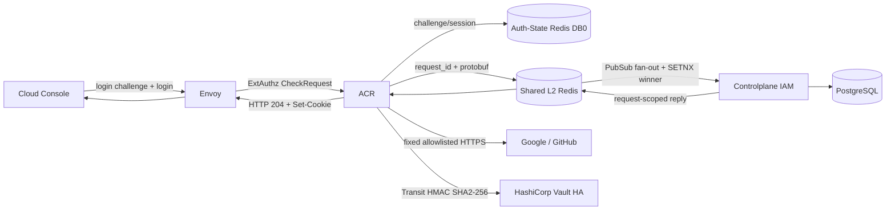
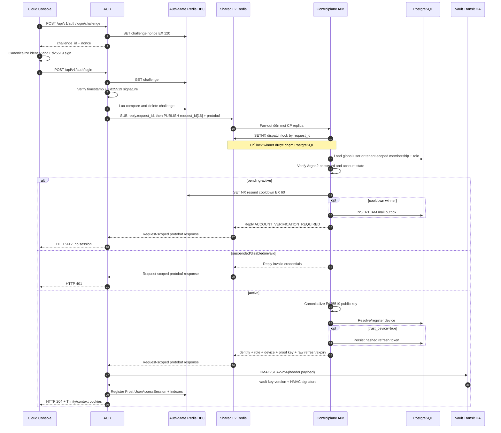
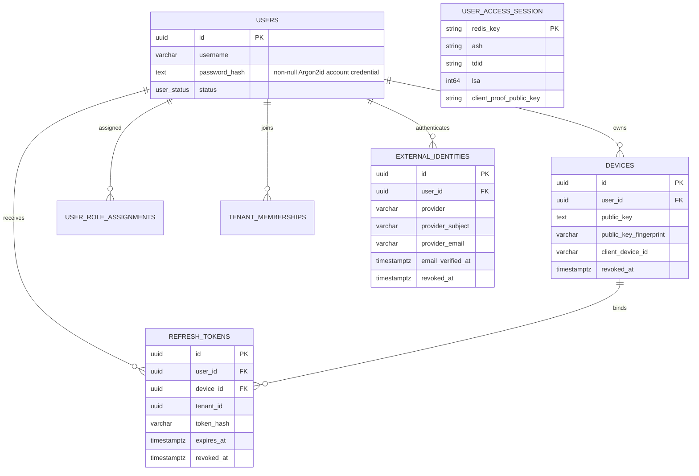

# User Login — God View (Master SoT)

> **IMPORTANT — SINGLE SOURCE OF TRUTH (SoT)**
> Tài liệu này là nguồn chuẩn cho workflow đăng nhập end-user và cấp runtime session. Mọi thay đổi liên quan đến login challenge, JSON contract, tenant identity, password verification, account state, device key, refresh token, Trinity credentials hoặc Auth-State Redis session phải cập nhật tài liệu này trong cùng change-set.

## 0. Control header

| Thuộc tính | Giá trị AS-IS |
|---|---|
| Domain | IAM / End-user authentication |
| Public endpoints | `POST /api/v1/auth/login/challenge`, `POST /api/v1/auth/login`, `POST /api/v1/auth/oauth/{google\|github}/start`, `GET /api/v1/auth/oauth/{google\|github}/callback` |
| UI consumer | Cloud Console sign-in |
| Edge owner | Envoy + ACR ExtAuthz |
| Identity owner | Controlplane IAM |
| Inter-service transport | Shared L2 Redis Pub/Sub request/reply, channels `iam.auth.verify_credentials` và `iam.auth.verify_external_identity`; payload = `request_id[16] || protobuf` |
| Durable SoT | PostgreSQL: users, roles, memberships, devices, refresh tokens, IAM outbox |
| Runtime SoT | Auth-State Redis DB0 user session encoded bằng Prost |
| Crypto | Argon2; Ed25519 login proof; OAuth PKCE S256 + one-time state; Google OIDC RS256/JWKS/nonce; JWT HS256 qua Vault Transit HMAC-SHA256 |
| JWT key custody | HashiCorp Vault Transit; ACR không đọc hoặc giữ raw signing key |
| Login challenge TTL | 120 giây |
| OAuth state TTL | Tối đa 300 giây, atomic consume |
| Pending resend cooldown | Redis `SET NX`, 60 giây |
| Success response | Password: HTTP `204` với cookies; OAuth: HTTP `303` với cùng session cookies |
| Related workflow | [User Critical Session Proof](user_critical_session_proof_workflow.md) |
| Verified against | Working tree, 2026-07-28 |

### 0.1 Những sự thật không được hiểu sai

| Sự thật | Hệ quả |
|---|---|
| UI có thể nhận `username@tenant_domain`, wire contract thì không | Client phải tách thành `username` và `tenant_domain`; ACR từ chối username chứa `@` |
| JSON chỉ nhận `device_public_key` | Không có alias `public_key` legacy |
| Session proof không phải trusted-device assertion | Nó chứng minh request đang giữ private key tương ứng; `trust_device` chỉ quyết định có tạo refresh token hay không |
| Login challenge chỉ dùng một lần | Sau khi chữ ký hợp lệ, ACR atomic compare-and-delete nonce trước khi gọi IAM |
| Pending account không được cấp session | Password đúng chỉ kích hoạt resend có cooldown và trả HTTP 412 |
| IAM trả canonical public key cho ACR | Redis session dùng key đã persist, không dùng lại trực tiếp input chưa tin cậy |
| IAM là issuer và durable owner của refresh token; ACR là HTTP cookie writer | Khi `trust_device=true`, IAM persist hash + trả raw token/expiry đúng một lần; ACR phát HttpOnly cookie theo expiry đó |
| User access JWT được Vault Transit ký | ACR dựng header/payload nhưng gửi signing input sang Vault; Vault key version nằm trong signature để hỗ trợ rotation |
| User session luôn thuộc một Zone thật | Mọi user login/recovery thiếu Zone, dùng `global`, Zone UUID nil hoặc Zone không active/draining đều fail-closed; `global` chỉ dành cho SRE |

### 0.2 Severity gate

| Mức | Ý nghĩa | Release gate |
|---|---|---|
| P0 | Có thể bypass authentication, cấp nhầm tenant/session hoặc lộ credential | Block production |
| P1 | Replay/race làm cấp phiên sai hoặc mất khả năng recovery | Block rollout IAM |
| P2 | HA, latency, observability hoặc abuse control không đạt | Cần owner và deadline |
| P3 | UX/maintainability | Có thể backlog có kiểm soát |

---

## 1. Phạm vi và trust boundaries

### 1.1 In scope / out of scope

| In scope | Out of scope nhưng liên quan |
|---|---|
| Sinh và verify login challenge | Account registration và account verification chi tiết |
| Canonical login JSON contract; Google/GitHub OAuth callback và linked external identity login | OAuth provider linking/unlinking và account recovery detail |
| Global/tenant credential lookup | Tenant switching sau login |
| Account-state handling | Admin/SRE login |
| Device key persistence và refresh-token decision | Device là nguồn tin cậy vật lý; hệ thống không giả định điều đó |
| Access token, access key, access secret, Redis session | Business authorization sau login |
| Pending-account resend trigger | Mail delivery/retry chi tiết |
| Failure, race, HA và security invariants | Critical route proof chi tiết, nằm ở God View riêng |

### 1.1a OAuth user login (zone-bound)

OAuth login is a user flow, not an SRE flow. `POST /api/v1/auth/oauth/{google|github}/start`
requires a non-empty, non-`global` `zone_code`; ACR resolves and stores the active/draining
zone in Auth-State Redis. The callback never accepts a replacement zone from the browser.

ACR owns provider parsing, PKCE/state/nonce, Google JWKS/ID-token verification, GitHub
verified-primary-email lookup, redirect allowlisting and canonicalization. IAM receives only
`VerifyExternalIdentityRequest` with a verified provider subject/email. The provider subject is
the only external identity key; provider email is a mutable verified snapshot and is never the
account identifier or an auto-link key.

Provider client secrets are read from Vault KV at ACR startup. Provider HTTP traffic must use a
fixed egress proxy/domain allowlist; the existing ACR NetworkPolicy does not permit arbitrary
internet egress, so enabling a provider requires the corresponding reviewed egress rule.
Envoy overrides ExtAuthz to 15 seconds only for `/api/v1/auth/oauth/`; ACR cancels callback
work at 13 seconds and bounds each pod to 64 concurrent callbacks. Google JWKS has a
single-flight, bounded per-pod cache. The global ExtAuthz budget for all other routes remains
2 seconds.

The durable identity key is `(provider, provider_subject)`. `users.email` is the canonical
account identifier entered during normal registration; `external_identities.provider_email`
remains provider metadata and must not be copied into `users.email` or used for account lookup.
Every user has a non-null password hash.

OAuth callback is login-only. IAM accepts only an existing, active `external_identities` row
whose user is active and has a password credential. A missing, unlinked or revoked provider
subject never creates a user, never creates an identity row and never starts registration.
Provider linking/unlinking belongs to a separate authenticated re-authentication/MFA workflow;
that workflow is not implemented by these public login endpoints. Provider-email equality
never performs linking.

ACR collapses every callback failure visible to the browser — invalid/replayed state, provider
denial or verification failure, missing/revoked identity, IAM/Redis/Vault failure, invalid
refresh state and Zone mismatch — into `OAUTH_SIGN_IN_FAILED`, redirects to `/signin`, and
preserves only an allowlisted `return_to`. Detailed reason classes remain internal logs/metrics
without provider subject, email or user identifiers.

The callback issues the same Trinity cookies as password login, but redirects with `303` to the
state-bound safe return path. `zone_code` is written to both the JWT/session and the zone cookie,
and a mismatch between state and IAM response fails closed.

Platform user operators at hierarchy level 2 can inspect
`GET /api/v1/personal/iam/users/:id/auth-methods` for subordinate users. The response labels
`users.email` as the account identifier and each `provider_email` as provider metadata, and
returns only `not_linked`, `linked` or `revoked` state plus audit timestamps. The same
server-side hierarchy fence as the user list applies; raw provider subjects and tokens are not
exposed. Cloud Console fetches this endpoint only when the dedicated `Sign-in` user-detail tab
is opened; Overview continues to use the paginated directory row.

### 1.2 Component ownership

| Component | Owns | Không được tự suy diễn |
|---|---|---|
| Cloud Console | Tách identity UI, giữ Ed25519 key, ký challenge, gửi canonical payload | Không tự tạo tenant ID hoặc zone ID |
| Envoy | TLS, body buffering, gọi ExtAuthz | Không xác thực password |
| ACR | CORS/rate limit, challenge, proof verification, Shared Redis request, session issuance, cookies | Không query trực tiếp IAM PostgreSQL |
| Shared L2 Redis | Central request/reply, fan-out, locks và streams | Không chứa runtime session hoặc durable identity |
| Controlplane IAM | User lookup, password/state/role/device/refresh-token business rules | Không phát HTTP cookies |
| PostgreSQL | Durable identity, device, role, membership, refresh token, resend outbox | Không giữ runtime access session |
| Auth-State Redis DB0 | One-time challenges, OAuth state/PKCE/nonce, resend cooldown, binary runtime session, indexes và ACR security outbox | Không làm transport Central-Zone hoặc business DB |
| HashiCorp Vault Transit | Giữ HMAC key, ký và verify JWT bằng SHA2-256 | Không sở hữu user/session business state |

### 1.3 End-to-end topology



---

## 2. Public contract

### 2.1 Route contract

| Method/path | Authentication | Owner | Kết quả |
|---|---|---|---|
| `POST /api/v1/auth/login/challenge` | Public, nhưng qua CORS và pre-auth rate limit | ACR local interceptor | `200` JSON challenge |
| `POST /api/v1/auth/login` | Public login interceptor, bắt buộc proof | ACR → IAM | `204` cookies, `401`, `412`, hoặc `5xx` |
| `POST /api/v1/auth/oauth/{provider}/start` | Public qua CORS/rate limit; bắt buộc device key và Zone cụ thể | ACR local interceptor | `200` authorization URL hoặc `4xx/5xx` |
| `GET /api/v1/auth/oauth/{provider}/callback` | One-time state + PKCE; callback không nhận Zone mới từ browser | ACR → provider → IAM | Thành công: `303` cookies + safe return path; thất bại: `303 /signin?oauth_error=OAUTH_SIGN_IN_FAILED` |

Các endpoint này được xử lý ngay trong ACR. Request login thành công không được forward xuống business HTTP API.

### 2.2 Challenge response

```json
{
  "challenge_id": "<uuid-v7>",
  "nonce": "<base64-32-byte-value>",
  "expires_in": 120
}
```

Redis key:

```text
iam:session_proof:login:{challenge_id} -> nonce, EX 120
```

### 2.3 Canonical login request

```json
{
  "username": "alice",
  "password": "<secret>",
  "device_name": "optional",
  "device_type": "optional",
  "device_public_key": "<base64 Ed25519 32 bytes>",
  "session_proof_challenge_id": "<uuid-v7>",
  "session_proof_timestamp": 1784450000,
  "session_proof_signature": "<base64 Ed25519 signature>",
  "trust_device": true,
  "zone_code": "vn",
  "tenant_domain": "acme.example"
}
```

| Field | Normalize/validation | Security meaning |
|---|---|---|
| `username` | Trim, lowercase, required, không chứa `@` | Identity local part duy nhất |
| `password` | Required, không empty | Chỉ chuyển qua Shared Redis request/reply đến IAM |
| `tenant_domain` | Trim, lowercase, empty = global login | Chọn lookup global hoặc tenant membership |
| `zone_code` | Required, trim/lowercase, cấm `global`, phải resolve thành Zone UUID active/draining | Context Zone bắt buộc của user session |
| `device_public_key` | ACR verify signature; IAM decode Base64 và yêu cầu đúng 32 bytes | Bind public key vào durable device và runtime session |
| `session_proof_*` | Challenge tồn tại, timestamp trong 120s, signature hợp lệ | Chống replay và bind identity fields vào request |
| `trust_device` | Default false | Chỉ là remember-me/refresh-token decision |

### 2.4 Canonical signed message

Các field nối bằng LF, không có LF cuối:

```text
aurora.login-proof.v1
challenge_id
nonce
username
tenant_domain
zone_code
remember_me
unix_timestamp_seconds
```

Client và ACR phải dùng chính giá trị đã canonicalize. Thay đổi username, tenant domain, zone hoặc remember-me sau khi ký làm signature invalid.

### 2.5 Responses

| HTTP | Trường hợp | Session/cookies |
|---:|---|---|
| `200` | Challenge issued | Không |
| `204` | Active account, credentials và proof hợp lệ, session đã ghi Redis | Có |
| `400` | Empty body, JSON sai, username/password contract sai | Không |
| `401` | Proof sai/hết hạn/replay, credentials sai, suspended/disabled | Không |
| `412` | Password đúng nhưng account `pending-active` | Không; direct broker resend được attempt nếu cooldown cho phép |
| `500` | Auth Redis/Shared Redis/token signer/session persistence lỗi | Không được coi là login thành công |

Response `412` canonical:

```json
{
  "error_message": "Account verification required. A verification email has been queued if cooldown allows.",
  "error_code": "ACCOUNT_VERIFICATION_REQUIRED",
  "verification_email_queued": true
}
```

`verification_email_queued=true` biểu đạt pending/resend workflow accepted theo contract của ACR; cooldown loser
không publish message mới. Cooldown winner chỉ trả nhánh này sau direct Redis Stream publish thành công.

---

## 3. Workflow end-to-end



### 3.1 Phase A — UI challenge and signing

1. UI parses `alice@acme.example` only as input convenience.
2. UI generates or loads Ed25519 key from origin IndexedDB.
3. Durable private key is a non-extractable `CryptoKey`; legacy JWK is migrated on first use.
4. UI requests a fresh login challenge.
5. UI signs the canonical message and immediately calls login.
6. Browser không hỗ trợ Ed25519/WebCrypto phải fail-closed; không phát login không có key.

### 3.2 Phase B — ACR edge verification

1. CORS và route-group pre-auth rate limit chạy trước local interceptor.
2. ACR parses raw body buffered bởi Envoy.
3. ACR canonicalizes username/tenant domain; không chấp nhận contract `username@domain` trên wire.
4. ACR loads nonce, kiểm tra timestamp và signature bằng `device_public_key` trong cùng request.
5. Chỉ sau crypto success, Lua compare-and-delete consume challenge. Hai request concurrent cùng challenge chỉ một request được đi tiếp.
6. ACR tạo `client_device_id` candidate mới, thêm client IP/User-Agent, tạo UUID request và gửi `request_id[16] || protobuf` qua Shared Redis.
7. Mọi CP replica đều nhận Pub/Sub message; `SET NX iam:auth:dispatch:verify_credentials:{request_id}` chọn một winner. Redis lỗi thì fail-close, replica thua lock không chạm DB.

### 3.3 Phase C — IAM credential and account-state decision

Lookup path:

- `tenant_domain == ""`: `LoginUserGlobal(username)`.
- `tenant_domain != ""`: `LoginUserTenant(username, tenant_domain)`, yêu cầu membership/role trong scope đó.

IAM verify password trước khi xử lý `pending-active`, vì resend không được trở thành user-enumeration endpoint.

State decision:

| State | Behavior |
|---|---|
| `pending-active` | Redis cooldown + direct append vào reserved verification stream, trả verification required; không cấp session |
| `active` | Tiếp tục device/session issuance |
| `suspended`, `disabled`, unknown | Trả invalid credentials |

### 3.4 Phase D — Device and refresh-token persistence

1. IAM canonicalizes Base64 Ed25519 public key thành standard Base64, đúng 32 bytes.
2. Device service resolve device theo user + public key; nếu không tìm thấy thì tạo ID mới.
3. IAM tính fingerprint SHA-256 trên canonical key và register/upsert device cùng IP/UA.
4. Device row revoked hoặc ID không hợp lệ làm login fail.
5. Khi `trust_device=true`, IAM tạo opaque refresh token và persist hash gắn với user, tracked device và optional tenant.
6. IAM response trả `client_proof_public_key` từ tracked device đã persist; nếu remember-me được chọn thì trả raw refresh token và Unix expiry đúng một lần cho ACR.

### 3.5 Phase E — Vault JWT signing và ACR session issuance

ACR sinh:

- `access_key`: UUIDv7.
- `access_secret`: UUIDv4; Redis chỉ giữ SHA-256 hash `ash`.
- Access token claims: user ID, username, role ID, level, tenant ID, zone ID, access key, JTI, issuer, issued/expiry time.

JWT signing AS-IS:

1. ACR serialize header `{"alg":"HS256","typ":"JWT"}` và user claims, rồi Base64URL encode thành `header.payload`.
2. ACR gọi Vault Transit HMAC endpoint với algorithm `sha2-256`; raw signing key không rời Vault.
3. Vault trả `vault:vN:<base64-signature>`. ACR chuyển signature sang JWT-safe Base64URL và giữ key version trong dạng `vN_<signature>`.
4. Verify token kiểm tra structure/expiry trước. Moka L1 cache hit trả claims đã verify; cache miss gọi Vault Transit verify với đúng key version từ signature.
5. Login không có signing fallback local: Vault timeout, sealed, unauthorized hoặc response invalid đều fail-closed trước Redis session write và trước `Set-Cookie`.

Redis key:

```text
iam:user_session:{zone_id}:{tenant_id}:{user_id}:{access_key}
```

Prost payload:

| Field/tag | Meaning |
|---|---|
| `ash` / 1 | SHA-256 của access secret |
| `tdid` / 2 | Tracked device ID |
| `lsa` / 3 | Last-seen Unix timestamp |
| `client_proof_public_key` / 4 | Canonical Ed25519 key cho critical session proof |

Session manager đồng thời duy trì user/device access indexes và có thể evict session vượt device cap. Khi eviction xảy ra, xóa session và `XADD iam:device:eviction-outbox` được commit trong cùng Auth Redis `MULTI/EXEC`. ACR relay outbox sang Shared Redis Stream `iam:device:evicted-events`; Controlplane consumer group chỉ `XACK` sau khi durable device/refresh cleanup thành công.

### 3.6 Success cookies AS-IS

| Cookie | HttpOnly | Max-Age | Meaning |
|---|---:|---:|---|
| `access_token` | Yes | Session TTL | Signed access claims |
| `access_key` | Yes | Session TTL | Runtime session locator |
| `access_secret` | Yes | Session TTL | Proof checked against `ash` |
| `refresh_token` | Yes | Expiry IAM đã persist | Opaque recovery credential, chỉ có khi `trust_device=true` |
| `client_device_id` | No | 1 year | Client/device context |
| `tenant_id` | No | 1 year | Routing context; `platform` cho global |
| `zone_code` | No | 1 year | Placement context bắt buộc, luôn là Zone user đã chọn và ACR đã resolve |

Tất cả cookies đều `Secure`, `SameSite=Lax`, `Path=/` và dùng optional configured parent domain. ACR fail-closed nếu trusted login nhận token rỗng hoặc expiry không còn ở tương lai; `Max-Age` được tính từ expiry IAM trả về thay vì hard-code TTL riêng ở ACR.

---

## 4. Data lineage



| Output | Source | Consumer |
|---|---|---|
| User/role/level | PostgreSQL login query | ACR access claims và downstream identity headers |
| Tenant ID | Tenant-domain membership query | Claims, Redis namespace, tenant cookie |
| Client device ID | Durable tracked device | Redis session/device index, cookie |
| Canonical proof key | Durable device row | Redis session, critical proof verifier |
| Refresh token + expiry | IAM refresh service và PostgreSQL | ACR phát HttpOnly cookie; recovery flow gửi token về IAM để kiểm tra hash/context |
| Access token/key/secret | ACR runtime generation | Browser cookies và edge session verification |

---

## 5. Race conditions, HA và failure semantics

| Case | Control hiện tại | Kết quả bắt buộc |
|---|---|---|
| Cùng challenge được gửi đồng thời | Redis Lua compare-and-delete | Chỉ một login request qua proof gate |
| Signature sai nhưng challenge còn TTL | Verify trước consume | Client có thể gửi lại signature đúng; attacker không consume hộ |
| Redis challenge unavailable | Fail-closed | Không gọi IAM |
| Hai pending login cùng lúc | `SET NX` cooldown | Tối đa một outbox winner trong window |
| Outbox insert lỗi sau cooldown winner | Best-effort DEL cooldown 500ms | Cho phép retry sớm; không cấp session |
| Shared Redis không có subscriber/timeout | ACR trả authentication unavailable | Không cấp session |
| Nhiều CP replica cùng nhận login | `SET NX` theo request ID, TTL 30s | Chỉ một replica chạy password/device/refresh side effects |
| OAuth callback cho subject chưa link hoặc đã revoke | Lookup `(provider, provider_subject)` trả cùng invalid-credentials class | Không tạo user/identity/handoff; browser chỉ thấy lỗi chung |
| OAuth state expired/replayed | Redis Lua `GET` + `DEL` atomic | Redirect lỗi chung về sign-in, không gọi provider/IAM |
| Provider/IAM callback chậm | Route-only Envoy budget 15s + ACR total budget 13s | Cancel work và redirect lỗi; không tăng timeout ExtAuthz toàn cục |
| OAuth identity đã revoke | IAM không clear `revoked_at` trong login flow | Fail-closed; chỉ link flow có xác thực mới được re-enable |
| IAM replica concurrency register device | Durable constraints/repository quyết định | Không được tạo identity session nếu device persistence fail |
| Vault Transit sign timeout/5xx/sealed | ACR fail trước Redis session write | Không có runtime session và không phát cookies |
| Vault trả signature empty/malformed | Parser fail-closed | Không tạo JWT |
| Redis session write fail sau Vault signing | ACR trả 500, không set cookies | Signed token không tới client; JWT không có matching Redis session |
| ACR chết sau Redis write trước response | Client thấy failure nhưng session orphan có TTL/index cleanup | Retry tạo session mới; cần metric orphan pressure |
| ACR chết sau Auth Redis eviction | Eviction outbox cùng transaction | Relay khác tiếp quản pending và gửi sang Shared Redis Stream |
| Shared Redis/CP tạm mất khi relay eviction | Không ACK Auth Redis outbox | Retry at-least-once; CP cleanup idempotent |

### 5.1 HA assumptions

- Auth-State Redis cần HA, AOF/noeviction và ACL prefix; mất Redis làm login fail-closed, không fallback DB session.
- Shared Redis Pub/Sub là synchronous request transport, không phải durability boundary. ACR subscribe reply trước publish, kiểm tra subscriber count và timeout fail-close.
- CP replicas dùng broadcast + distributed request lock thay queue group. Request không có UUID envelope bị từ chối trước business service.
- Login request/reply không phải outbox; client retry bằng challenge mới. Durable device eviction dùng Auth Redis outbox + Shared Redis Stream riêng.
- PostgreSQL là durability boundary cho device/refresh token/outbox.
- Vault phải chạy HA, initialized và unsealed; ACR startup authenticate bằng AppRole trong production, static token chỉ dành cho dev/test.
- ACR Vault client có request timeout và startup retry hữu hạn. Hết retry thì process gọi `exit(1)`, nên pod không trở thành auth replica thiếu Vault.
- Vault key rotation được nhận diện qua version nằm trong JWT signature; không xóa key version cũ trước khi mọi JWT tương ứng hết TTL.
- Moka JWT verification cache giảm tải Vault cho request sau login, nhưng cache là per-pod và không giúp thao tác ký token mới.
- Clock của UI/ACR cần đồng bộ; login proof chỉ chấp nhận sai lệch trong TTL 120 giây.

---

## 6. Security invariants và production risks

### 6.1 Invariants

1. Không log password, access secret, raw refresh token, signature hoặc private key.
2. Error credential-facing phải chống user enumeration.
3. ACR không được tin `tenant_id`, `zone_id`, user ID hoặc role do browser tự gửi.
4. Public key từ client chỉ trở thành session key sau proof verification và IAM persistence/canonicalization.
5. Challenge expired/replayed/missing và Redis failure đều fail-closed.
6. Backend critical không tự đọc client proof header; chỉ tin marker ACR overwrite theo God View critical.
7. IndexedDB non-extractable key giảm export risk nhưng không bảo vệ khỏi XSS đang chạy trong cùng origin; CSP và dependency integrity vẫn là bắt buộc.
8. ACR không được có local JWT signing secret hoặc fail-open khi Vault unavailable.
9. Vault AppRole SecretID/static token không được log, đưa vào image hoặc expose cho Cloud Console/downstream API.
10. ACR luôn thực thi Vault HMAC SHA2-256; cryptographic operation không bao giờ được chọn động từ giá trị `alg` do token cung cấp.
11. User session issuer chỉ nhận Zone UUID cụ thể; nil/global/không resolve được không bao giờ fallback sang session `global`.
12. Provider code/token/JWT/JSON dừng tại ACR. IAM transport chỉ nhận canonical external identity đã được verify và validate bounds.
13. OAuth callback không được tạo user hoặc link identity; mọi callback failure public phải hội tụ vào cùng một error code chung.

### 6.2 Open risks AS-IS

| Severity | Risk | Impact / required decision |
|---|---|---|
| **P1** | Challenge login không bind IP/device trước signature và Redis namespace là global theo challenge ID | Entropy và signature vẫn chống đoán/replay, nhưng cần quota/capacity monitoring để chống challenge-flood |
| **P1** | Login proof chứng minh giữ key vừa gửi, không phải second factor | Không được quảng bá như trusted device hoặc password-theft prevention |
| **P2** | ACR response dùng ExtAuthz denied response với internal unauthenticated status để trả HTTP 204 | Cần integration test qua Envoy để đảm bảo proxy behavior không drift |
| **P2** | ACR tạo candidate `client_device_id` mới mỗi login rồi IAM resolve theo public key | Cookie device ID cũ không quyết định identity; cần đảm bảo đây là contract mong muốn cho analytics/device UX |
| **P2** | Device-cap selection vẫn đọc/sort session index trước transaction eviction | Concurrent login burst cần stress test để chứng minh cap hội tụ và không orphan index |
| **P2** | UI/ACR canonical message được implement ở hai ngôn ngữ | Cần contract vector test cross-language trong CI để tránh drift field/order/encoding |
| **P2** | JWT verification cache Moka chưa đặt TTL riêng theo remaining token lifetime; code kiểm tra `exp` khi cache hit nhưng entry có thể nằm tới eviction | Không bypass expiry, nhưng expired entries có thể chiếm capacity; nên cấu hình expiry-aware eviction |

---

## 7. Observability và release validation

### 7.1 Signals cần có

| Signal | Dimensions tối thiểu | Alert intent |
|---|---|---|
| Login challenge issue/failure | route, Redis outcome | Redis outage hoặc flood |
| Login proof rejection | reason class, route | Replay/clock drift/signature failures |
| IAM login outcome | success, invalid credential, precondition, unavailable | Auth health và attack pattern |
| Shared Redis request latency/error | channel, subscriber count, timeout | CP saturation, PubSub outage hoặc reply-router disconnect |
| Auth Redis eviction outbox lag | stream/group/pending age | Shared Redis hoặc CP cleanup outage |
| Password verification latency | outcome | CPU pressure/Argon2 regression |
| Device register latency/error | repo operation | PostgreSQL contention |
| Session register latency/error | Redis operation | Runtime session health |
| Vault sign latency/error | operation, HTTP class, timeout, key name không gắn user | Login availability và Vault saturation |
| Vault verify latency/cache hit ratio | operation, outcome | Capacity planning và phát hiện cache regression |
| Vault auth/health/sealed state | pod, attempt, outcome | ACR readiness và Vault incident |
| Pending resend winner/loser/outbox error | cooldown outcome | Mail abuse và delivery trigger health |

Không dùng username/email/public key làm metric label vì cardinality và privacy.

### 7.2 Release checklist

- [ ] Challenge response contract và TTL đúng 120 giây.
- [ ] Login thiếu/sai/replay proof bị từ chối trước Shared Redis IAM call.
- [ ] UI tenant input gửi hai field canonical; legacy combined username bị từ chối.
- [ ] JSON `public_key` legacy không được chấp nhận; chỉ `device_public_key`.
- [ ] Global identity lookup và tenant identity lookup đều trả đúng role/scope, nhưng runtime user session luôn bind một Zone cụ thể.
- [ ] Pending login password sai không queue resend; password đúng trả 412 và không có cookies.
- [ ] Suspended/disabled không lộ trạng thái cụ thể.
- [ ] Auth Redis/Shared Redis/Vault/PostgreSQL failure đều không tạo client-visible authenticated session.
- [ ] Ba CP replica cùng nhận một request nhưng chỉ một replica persist device/refresh side effect.
- [ ] Auth Redis eviction outbox survive ACR restart và CP consumer xử lý idempotent.
- [ ] Vault AppRole, Transit policy và key path cấp least privilege: ACR chỉ được HMAC/verify key JWT cần thiết.
- [ ] Vault key rotation test xác minh được JWT version cũ cho tới hết session TTL.
- [ ] Redis Prost payload chứa canonical `client_proof_public_key`.
- [ ] Cookie flags được integration-test qua Envoy với configured public domain.
- [ ] Critical call sau login verify được session proof theo God View riêng.
- [ ] `trust_device=true` phát HttpOnly refresh cookie với `Max-Age` khớp expiry IAM; false không phát cookie.
- [ ] Password/OAuth/recovery đều từ chối thiếu Zone, `global`, Zone nil và Zone inactive.
- [ ] OAuth state replay/expiry, provider denial, email chưa verify, identity chưa link/revoked và callback Zone mismatch đều fail-closed với cùng public error.
- [ ] OAuth callback cho identity chưa link không ghi `users`, `external_identities`, role, wallet outbox hoặc Auth-State handoff.

---

## 8. Code map

| Concern | Implementation |
|---|---|
| UI sign-in orchestration/error return | [`cloud-console/src/app/signin/signin-form.tsx`](../../cloud-console/src/app/signin/signin-form.tsx), [`page.tsx`](../../cloud-console/src/app/signin/page.tsx) |
| UI login/OAuth API | [`cloud-console/src/features/auth/api.ts`](../../cloud-console/src/features/auth/api.ts) |
| UI Ed25519 key/signing | [`cloud-console/src/lib/security/deviceKey.ts`](../../cloud-console/src/lib/security/deviceKey.ts) |
| ACR ExtAuthz ordering/rate limit và route-only OAuth timeout | [`acr/src/gateway/ext_authz.rs`](../../acr/src/gateway/ext_authz.rs), [`ratelimit.rs`](../../acr/src/gateway/ratelimit.rs), [`controlplane/dev/envoy/routes/cloud_vhost.yaml`](../../controlplane/dev/envoy/routes/cloud_vhost.yaml) |
| ACR login/challenge/session issue | [`acr/src/user/login.rs`](../../acr/src/user/login.rs) |
| ACR Google/GitHub provider verification and zone-bound callback | [`acr/src/user/oauth.rs`](../../acr/src/user/oauth.rs), [`acr/src/config.rs`](../../acr/src/config.rs) |
| ACR proof primitives | [`acr/src/user/session_proof.rs`](../../acr/src/user/session_proof.rs) |
| ACR Redis session binary | [`acr/src/user/session.rs`](../../acr/src/user/session.rs) |
| IAM JWT construction, Vault sign/verify và Moka cache | [`acr/src/user/claims.rs`](../../acr/src/user/claims.rs), [`acr/src/token.rs`](../../acr/src/token.rs) |
| Vault AppRole, health, Transit HTTP client | [`acr/src/infra/vault.rs`](../../acr/src/infra/vault.rs) |
| ACR Vault/TokenManager bootstrap | [`acr/src/main.rs`](../../acr/src/main.rs) |
| Shared Redis request/reply bus + Protobuf contract | [`acr/src/infra/shared_redis.rs`](../../acr/src/infra/shared_redis.rs), [`controlplane/internal/iam/transport/rpc/proto/auth.proto`](../../controlplane/internal/iam/transport/rpc/proto/auth.proto), [`acr/proto/auth.proto`](../../acr/proto/auth.proto) |
| IAM Shared Redis request handler | [`controlplane/internal/iam/transport/pubsub/handler/auth.go`](../../controlplane/internal/iam/transport/pubsub/handler/auth.go) |
| Durable device eviction relay/consumer | [`acr/src/user/session.rs`](../../acr/src/user/session.rs), [`acr/src/user/device.rs`](../../acr/src/user/device.rs), [`controlplane/internal/iam/transport/pubsub/handler/device.go`](../../controlplane/internal/iam/transport/pubsub/handler/device.go) |
| IAM login business logic | [`controlplane/internal/iam/service/auth_service.go`](../../controlplane/internal/iam/service/auth_service.go) |
| IAM linked external identity lookup and provider-email/account-email separation | [`controlplane/internal/iam/repository/auth_repo.go`](../../controlplane/internal/iam/repository/auth_repo.go), [`controlplane/internal/iam/service/auth_service.go`](../../controlplane/internal/iam/service/auth_service.go), [`controlplane/internal/iam/migrations/000011_external_identities.up.sql`](../../controlplane/internal/iam/migrations/000011_external_identities.up.sql) |
| Device persistence | [`controlplane/internal/iam/service/device_self_service.go`](../../controlplane/internal/iam/service/device_self_service.go) |
| PostgreSQL IAM schema | [`controlplane/internal/iam/migrations/000002_iam_tables.up.sql`](../../controlplane/internal/iam/migrations/000002_iam_tables.up.sql) |

---

## 9. Change rule

Khi sửa login workflow:

1. Cập nhật God View này trước hoặc trong cùng change-set.
2. Nếu canonical signed message đổi, bump domain version và cập nhật UI + ACR + cross-language vectors cùng lúc.
3. Nếu Redis session schema đổi, chỉ thêm Prost tag mới; không tái sử dụng tag cũ.
4. Nếu route critical/session-proof đổi, cập nhật cả [User Critical Session Proof](user_critical_session_proof_workflow.md).
5. Không thêm compatibility alias cho identity/security field nếu chưa có migration window và removal date rõ ràng.
