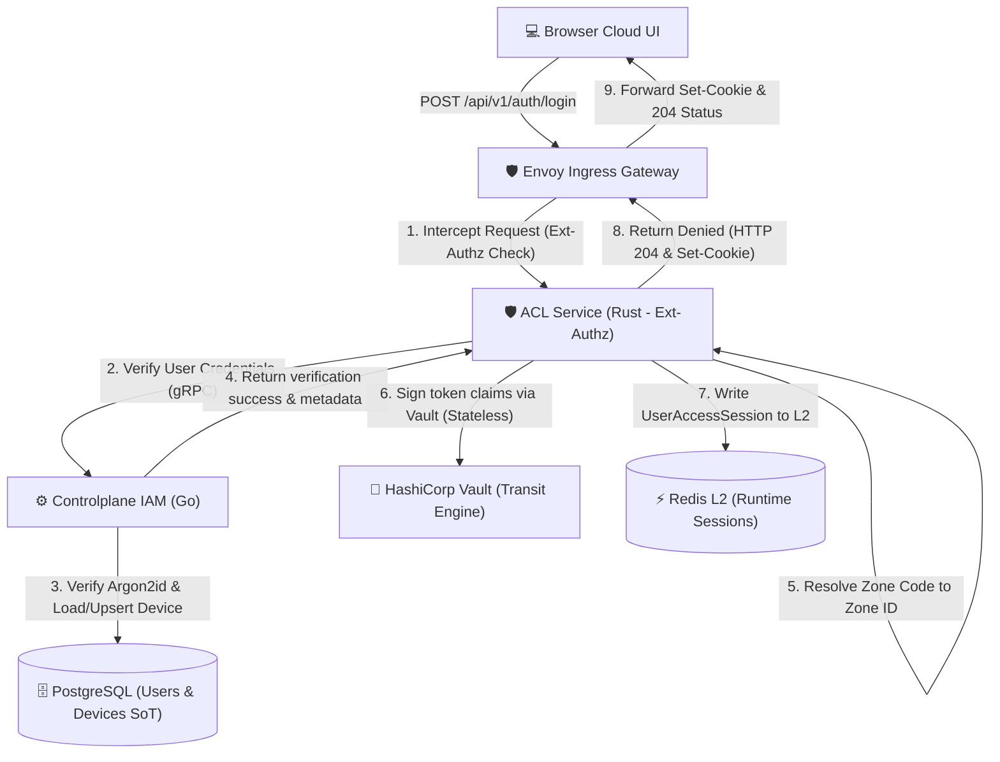
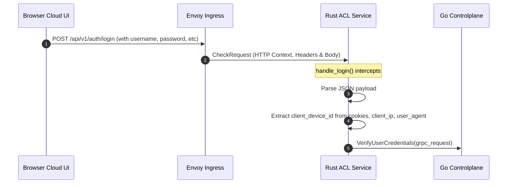
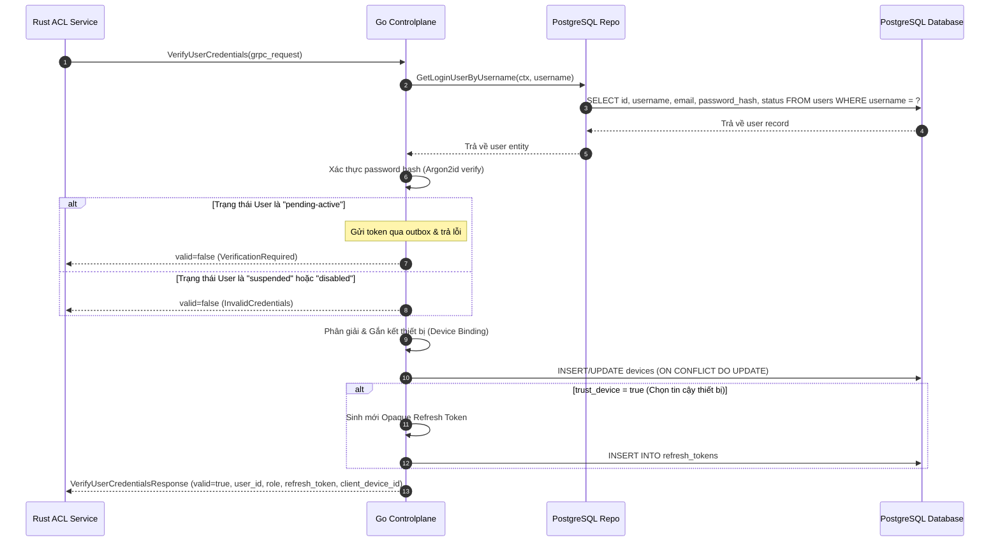
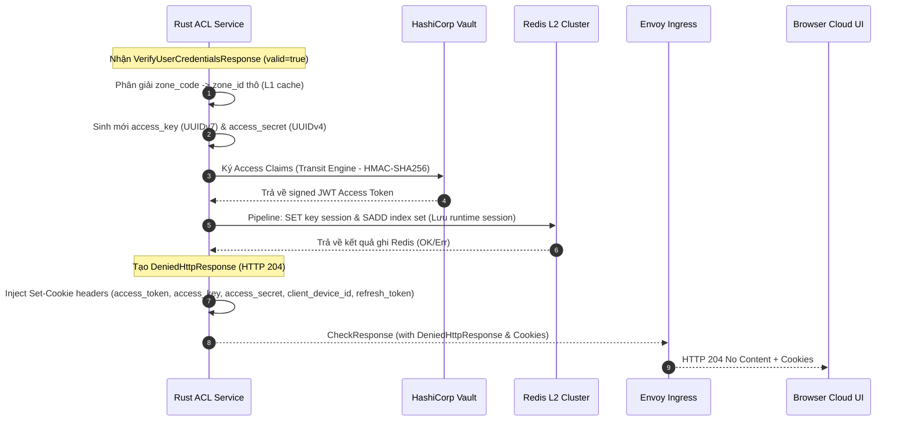
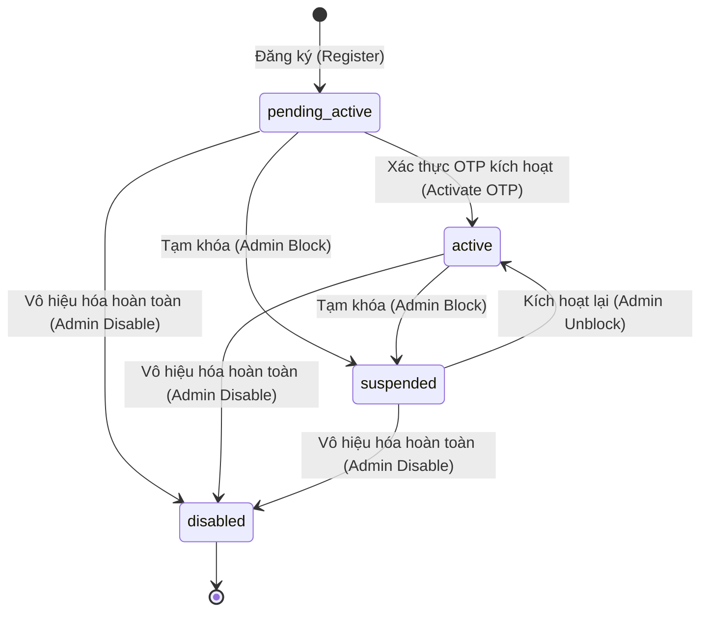
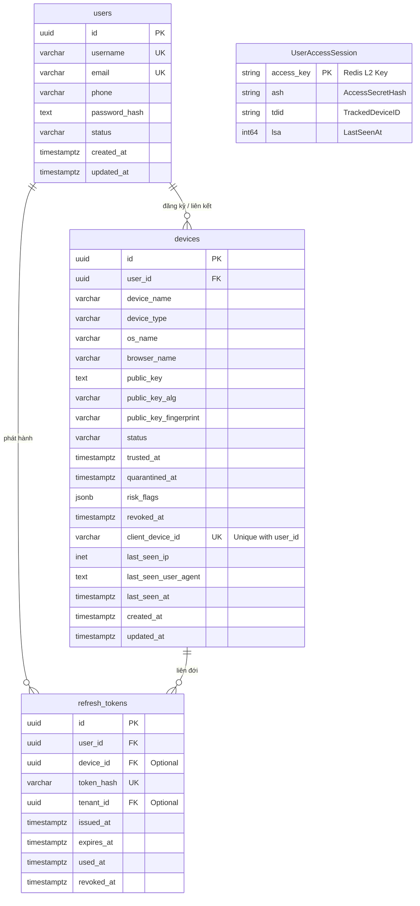

<!-- markdownlint-disable MD033 -->
# End-User Login & Session Initialization - Workflow God View (Gateway-Centric architecture)

> [!NOTE]
> Tài liệu này đóng vai trò là **Source of Truth (SoT) / God View** cho luồng Đăng nhập (Login) và Khởi tạo phiên hoạt động của End-User.
> Mọi thay đổi về code liên quan đến xác thực mật khẩu, kiểm tra trạng thái tài khoản, gắn kết thiết bị và ghi nhận phiên chạy lên Redis L2 phải tuân thủ nghiêm ngặt đặc tả này.

---

## 🗺️ 1. Giới Thiệu

### 👥 Tài Liệu Dành Cho Ai?

Tài liệu được thiết kế cho các kỹ sư Backend phát triển dịch vụ IAM, đội ngũ chuyên viên Bảo mật giám sát phiên đăng nhập và các kỹ sư SRE chịu trách nhiệm đảm bảo tính khả dụng và khả năng tự rollback/khôi phục khi ghi nhận thông tin phiên lên cụm lưu trữ phân tán.

### ❓ Phân hệ End-User Login là gì?

Đây là quy trình xác thực thông tin định danh (Username/Password), kiểm định trạng thái của tài khoản (Active, Pending-Active, Suspended, Disabled) và đăng ký/gắn kết thiết bị người dùng (Device Binding) dựa trên chữ ký khóa công khai Ed25519. Kết quả thành công sẽ phát hành bộ **Credentials 3 thành phần (Trinity Credentials)** được đồng bộ hóa lên tầng lưu trữ runtime Redis L2 dưới dạng nhị phân tối ưu hóa.

### 📍 Các Biên Công Nghệ Hoạt Động

- **Frontend Cloud UI**: Trang `login` & [auth.ts](../../cloud-ui/src/lib/api/auth.ts).
- **Envoy Ingress Gateway**: Cấu hình Ext-Authz chặn bắt `/api/v1/auth/login`.
- **ACL Service (Rust)**: Xử lý chặn bắt Ext-Authz tại biên, phân giải zone_code, ghi nhận phiên chạy lên Redis L2, sinh Trinity Credentials, ký JWT qua Vault, và phát hành Set-Cookie trực tiếp thông qua Denied Response.
- **Controlplane IAM Service (Go)**: Xác thực thông tin đăng nhập và thông tin thiết bị thô của người dùng qua gRPC endpoint `VerifyUserCredentials`.
- **Device Service**: [device_service.go](../../controlplane/internal/iam/service/device_service.go) (Phân giải thiết bị và tự dọn dẹp thiết bị vượt định mức).
- **Security Signer**: Vault JWT Transit in [jwt.go](../../controlplane/internal/security/jwt.go).
- **Database (PostgreSQL)**: Bảng `users`, `devices`, và `refresh_tokens`.
- **Cache Engine**: Redis Cluster L2 (Lưu thông tin phiên dạng Protobuf `iamproto.UserAccessSession`).

---

## 🏛️ 2. Sơ Đồ Hệ Thống & Ranh Giới Phase



---

## 🔍 3. Chi Tiết Thực Thi Nghiệp Vụ Theo Phase

### 🛡️ Chuỗi Middleware Áp Dụng (Security & Observability Pipeline)

Khi một yêu cầu đăng nhập (`POST /api/v1/auth/login`) được gửi đến Ingress, nó đi qua bộ quy tắc của Envoy:

| Middleware | Feature / Vai Trò | Level (App/Route) |
| :--- | :--- | :--- |
| `Envoy Local Rate Limit` | Chống DDoS/Spam bằng cách lọc chặn IP thô & Max Connection (Inflight) từ tầng Ingress. | Envoy Ingress |
| `Ext-Authz Interceptor` | Chuyển hướng các request đăng nhập về phía dịch vụ ACL (Rust) để thực hiện xác thực và phân giải quyền. | Ingress Policy |

---

### 📌 PHASE 1: Interceptor (Chặn bắt & Chuyển tiếp - Rust ACL / Envoy)

#### 1. Sơ đồ trình tự (Sequence Diagram - Phase 1)



#### 2. Mô tả nghiệp vụ

- **Chặn bắt tại Biên (Gateway Interception)**: Envoy Ingress chuyển tiếp toàn bộ request chứa thông tin đăng nhập đến Ext-Authz middleware (Rust ACL).
- **Phân tách và chuẩn bị dữ liệu**: Rust ACL bóc tách JSON payload gửi lên, đồng thời thu thập siêu dữ liệu gồm IP khách (Client IP), User-Agent từ Header của request và `client_device_id` từ HTTP Cookies hiện có (nếu có).
- **Giao tiếp gRPC**: Rust ACL đóng gói các tham số nhận được và gửi yêu cầu xác thực thô đến Go Controlplane thông qua gRPC method `VerifyUserCredentials`.

#### 3. Bản đồ tham chiếu file mã nguồn (Implementation References)
- **Rust Ingress Interceptor / Gateway Auth Handler**: [login_handler.rs](../../acl/src/service/login_handler.rs#L43-L182) - Chặn bắt HTTP POST `/api/v1/auth/login` tại biên, trích xuất cookie/IP/UA và chuyển tiếp qua gRPC.
- **gRPC API Definition (VerifyUserCredentials)**: [auth.proto](../../controlplane/internal/iam/transport/rpc/proto/auth.proto#L12-L28) - Định nghĩa message gRPC dùng để giao tiếp liên dịch vụ.

---

### 📌 PHASE 2: Controlplane (Xác thực & Nghiệp vụ DB - Go CP)

#### 1. Sơ đồ trình tự (Sequence Diagram - Phase 2)



#### 2. Mô tả nghiệp vụ

- **Xác thực tài khoản**: Go Controlplane truy xuất thông tin tài khoản người dùng từ PostgreSQL thông qua username. Sử dụng thuật toán Argon2id để kiểm tra mật khẩu.
- **Kiểm tra trạng thái tài khoản**:
  - Nếu trạng thái là `pending-active`, hệ thống sẽ trả về lỗi `VerificationRequired` và đẩy mã OTP qua luồng outbox.
  - Nếu trạng thái là `suspended` hoặc `disabled`, hệ thống trả về lỗi `InvalidCredentials`.
- **Gắn kết thiết bị (Device Binding)**: Thực hiện logic Upsert thiết bị đăng nhập vào bảng `devices`. Trùng lặp dựa trên index duy nhất `(user_id, client_device_id)`. Các tham số nhạy cảm như `public_key` tuyệt đối không bị ghi đè để tránh tấn công chiếm quyền thiết bị.
- **Phát hành Refresh Token**: Khi tham số `trust_device` là `true`, Controlplane sinh ra Opaque Refresh Token theo cấu trúc bảo mật `<userID>_<random_entropy>` (tổng độ dài khoảng 64 - 72 ký tự) và lưu hash của nó vào bảng `refresh_tokens`.
- **Phản hồi gRPC**: Trả về dữ liệu thành công kèm theo metadata của User, Role, Level, Refresh Token và Device ID về lại cho Rust ACL.

#### 3. Bản đồ tham chiếu file mã nguồn (Implementation References)
- **gRPC Transport Server Handler**: [auth.go](../../controlplane/internal/iam/transport/rpc/handler/auth.go#L128-L179) - Tiếp nhận request gRPC từ ACL Service, ánh xạ sang entity và chuyển giao cho tầng nghiệp vụ.
- **Business AuthService Implementation**: [auth_service.go](../../controlplane/internal/iam/service/auth_service.go#L200-L280) - Thực hiện so khớp mật khẩu bằng Argon2id, kiểm soát trạng thái tài khoản (`pending-active`, `active`, `suspended`, `disabled`), sinh refresh token.
- **Device Management Service**: [device_service.go](../../controlplane/internal/iam/service/device_service.go#L30-L75) - Đăng ký, kiểm tra dấu vân tay thiết bị (Fingerprint) và kiểm soát số lượng thiết bị hoạt động tối đa của user.

---

### 📌 PHASE 3: Token Issuance & Session Storage (Cấp phát & Lưu trữ phiên - Rust ACL)

#### 1. Sơ đồ trình tự (Sequence Diagram - Phase 3)



#### 2. Mô tả nghiệp vụ

- **Phân giải Zone**: Rust ACL ánh xạ `zone_code` sang `zone_id` bằng bộ nhớ đệm L1 cục bộ nhằm tối thiểu hóa độ trễ.
- **Khởi tạo định danh runtime**: Sinh mới cặp khóa truy cập gồm `access_key` (UUIDv7) và `access_secret` (UUIDv4).
- **Ký số Stateless JWT**: Gửi yêu cầu ký JWT Access Token chứa các claims về phân quyền tới HashiCorp Vault Transit Engine.
- **Lưu trữ phiên hoạt động (Session Register)**: Đóng gói session metadata dưới dạng nhị phân Protobuf `UserAccessSession` và đẩy xuống Redis L2 bằng cơ chế Pipeline.
- **Trả về Cookies**: Rust ACL thiết lập HTTP `204 No Content` đi kèm 5 thẻ Set-Cookie an toàn (`access_token`, `refresh_token`, `access_key`, `access_secret`, `client_device_id`) thông qua Ext-Authz Denied Response gửi lại Envoy để chuyển về phía trình duyệt người dùng.

#### 3. Bản đồ tham chiếu file mã nguồn (Implementation References)
- **Zone Code Resolution**: [zone_resolution.rs](../../acl/src/service/zone_resolution.rs) - Phân giải cục bộ mã vùng của tenant.
- **Stateless Token Manager**: [token.rs](../../acl/src/core/token.rs#L151-L184) - Sinh claims và thực hiện ký số Access Token (JWT) qua HashiCorp Vault.
- **L2 Redis Session Manager**: [session.rs](../../acl/src/core/session.rs#L59-L80) - Tuần tự hóa session sang nhị phân Protobuf và ghi nhận vào Redis Cluster L2.
- **HTTP Response Set-Cookie Generator**: [login_handler.rs](../../acl/src/service/login_handler.rs#L259-L330) - Inject các cookie Trinity Credentials vào DeniedHttpResponse để đẩy về trình duyệt.

---

## 🔄 4. Vòng Đời Trạng Thái Người Dùng (User State Machine)

Mọi yêu cầu đăng nhập của người dùng đều chịu ảnh hưởng trực tiếp từ trạng thái tài khoản tại Go Controlplane. Trạng thái người dùng tuân theo sơ đồ chuyển đổi dưới đây:



### 📋 Mô tả chi tiết các trạng thái & Chuyển đổi

- **`pending-active` (Chờ kích hoạt)**:
  - **Ý nghĩa**: Trạng thái mặc định sau khi tạo tài khoản thành công.
  - **Phản ứng khi đăng nhập**: Controlplane trả lỗi `VerificationRequired`. Không cấp access token hay session L2. Đồng thời kích hoạt gửi mã xác minh (OTP) qua Outbox.
  - **Sự kiện chuyển đổi**: Chuyển sang `active` khi người dùng nhập đúng OTP. Hoặc có thể bị khóa (`suspended`/`disabled`) trực tiếp bởi quản trị viên.

- **`active` (Đang hoạt động)**:
  - **Ý nghĩa**: Trạng thái hợp lệ cho phép truy cập toàn bộ dịch vụ.
  - **Phản ứng khi đăng nhập**: Cho phép xác thực, đăng ký thiết bị và cấp phát Trinity Credentials.
  - **Sự kiện chuyển đổi**: Bị tạm khóa (`suspended`) hoặc vô hiệu hóa (`disabled`) bởi các hành động quản trị hệ thống.

- **`suspended` (Tạm khóa)**:
  - **Ý nghĩa**: Khóa tạm thời tài khoản do nghi ngờ vi phạm hoặc yêu cầu khóa khẩn cấp.
  - **Phản ứng khi đăng nhập**: Hệ thống từ chối đăng nhập với lỗi `InvalidCredentials` (hoặc lý do khóa cụ thể).
  - **Sự kiện chuyển đổi**: Mở khóa chuyển về `active` sau khi xác minh thủ công thành công, hoặc chuyển thành `disabled`.

- **`disabled` (Vô hiệu hóa)**:
  - **Ý nghĩa**: Xóa logic tài khoản.
  - **Phản ứng khi đăng nhập**: Hệ thống từ chối hoàn toàn với lỗi `InvalidCredentials` / `NotFound`.
  - **Sự kiện chuyển đổi**: Trạng thái cuối cùng của vòng đời tài khoản.

---

## 🗺️ 5. Khoanh Vùng Mô Hình Dữ Liệu & Bản Đồ Tham Chiếu (ERD & File References)

### 1. Sơ đồ thực thể ERD (Entity Relationship Diagram)



### 🚧 Phân Tách Ranh Giới Lưu Trữ (Storage Boundaries)

- **Ranh Giới Bền Vững (PostgreSQL - Persistence SoT)**:
  - **Mục tiêu**: Lưu trữ vĩnh viễn và đảm bảo tính toàn vẹn tuyệt đối cho dữ liệu định danh (`users`), chứng thư thiết bị (`devices`), và lịch sử token ngoại tuyến (`refresh_tokens`).
  - **Liên kết**: Ràng buộc khóa ngoại (`FK`) chặt chẽ giúp bảo vệ tính nhất quán khi thực hiện xóa hoặc cập nhật thực thể (ví dụ: `ON DELETE CASCADE` khi xóa User).
  - **Duy nhất**: Sử dụng Unique Index trên SQL (`devices_user_client_device_uidx`) làm chốt chặn ngăn chặn việc nhân bản vô tội vạ thiết bị cho cùng một phiên đăng nhập của người dùng.

- **Ranh Giới Runtime (Redis L2 Cluster - High Performance Volatile Session)**:
  - **Mục tiêu**: Phục vụ nhu cầu kiểm chứng quyền hạn và phiên truy cập ở tốc độ microsecond tại API Ingress Gateway mà không cần thực hiện truy vấn trực tiếp vào PostgreSQL.
  - **Dữ liệu**: Lưu trữ phiên rút gọn `UserAccessSession` (được tuần tự hóa dưới dạng Protobuf nhị phân) và lập chỉ mục qua `access_key` (UUIDv7). Phiên chạy này tự động hết hạn thông qua TTL của Redis và hoàn toàn độc lập với liên kết vật lý trong PostgreSQL SQL.

### 2. Bản đồ tham chiếu file mã nguồn & Database Migrations (File Mapping & References)

Nhằm đảm bảo tính nhất quán giữa tài liệu Đặc tả God View (SoT) và mã nguồn thực tế, dưới đây là bản đồ chỉ mục dẫn đến các file định nghĩa mô hình thực thể và cấu trúc DB:

##### A. Thực thể nghiệp vụ (Domain Entities in Go CP)

- **User Status & User Entity Model**: [auth.go](../../controlplane/internal/iam/domain/entity/auth.go#L9-L27) - Định nghĩa struct `User` và enum `UserStatus`.
- **Device Entity Model**: [device_auth.go](../../controlplane/internal/iam/domain/entity/device_auth.go#L9-L50) - Định nghĩa struct `Device` và enum `DeviceStatus`.
- **Refresh Token Entity Model**: [refresh_token.go](../../controlplane/internal/iam/domain/entity/refresh_token.go#L9-L30) - Định nghĩa các struct `RefreshToken` và `RefreshTokenSession`.
- **In-Memory Session Model**: [user_access_session.go](../../controlplane/internal/iam/domain/entity/user_access_session.go#L5-L9) - Định nghĩa runtime cache `UserAccessSession`.

##### B. Cấu trúc cơ sở dữ liệu (PostgreSQL Migrations)

- **Kiểu dữ liệu Enum (User/Device status enums)**: [000001_iam_enums.up.sql](../../controlplane/internal/iam/migrations/000001_iam_enums.up.sql#L6-L47) - Tạo kiểu enum `user_status` và `device_status` trên PostgreSQL.
- **Cấu trúc bảng và ràng buộc vật lý**: [000002_iam_tables.up.sql](../../controlplane/internal/iam/migrations/000002_iam_tables.up.sql#L4-L103) - Khởi tạo các bảng `users`, `devices`, `refresh_tokens` cùng khóa ngoại và chú thích (comment).
- **Chỉ mục unique chống trùng lặp (Device Unique Index)**: [000003_iam_indexes.up.sql](../../controlplane/internal/iam/migrations/000003_iam_indexes.up.sql) - Thiết lập unique index chống trùng lặp client_device_id theo từng user.

##### C. Cấu trúc tầng cache (Protobuf Protocol Buffer)

- **Protobuf UserAccessSession Schema**: [iam_cache.proto](../../controlplane/internal/iam/transport/rpc/proto/iam_cache.proto#L19-L23) - Định nghĩa schema protobuf để chuyển đổi nhị phân lưu trữ Redis.

---

## 📊 6. Giám Sát Và Truy Vết - Grafana Runbook

### 1. Prometheus Metrics Cảnh Báo

- **Service Outcomes**: `iam_service_calls_total{op="iam.auth.login", outcome}`
- **Postgres Upsert Device Latency**: `iam_downstream_call_duration_seconds{op="iam.auth.login", kind="repo", destination="RegisterLoginDevice"}`

#### 📈 PromQL Cần Thiết

##### A. Đo lường tỷ lệ đăng nhập thành công của hệ thống

```promql
sum(rate(iam_service_calls_total{op="iam.auth.login", outcome="success"}[5m])) / sum(rate(iam_service_calls_total{op="iam.auth.login"}[5m])) * 100
```

##### B. Độ trễ ghi nhận Session lên Redis L2

```promql
histogram_quantile(0.99, sum(rate(iam_downstream_call_duration_seconds_bucket{kind="cache-engine-l2"}[5m])) by (le))
```

### 2. LogsQL (VictoriaLogs) Giám Sát

##### Tìm kiếm các log lỗi xảy ra trong quá trình đăng nhập

```logsql
t="iam.auth.login" level="error" | select(request_id, error_message, client_ip)
```

##### Phát hiện hành vi dò quét đăng nhập trái phép (Brute-force)

```logsql
t="iam.auth.login" "login invalid credentials" | count() by (client_ip)
```

---
*Tài liệu kết thúc.*
<!-- markdownlint-enable MD033 -->
