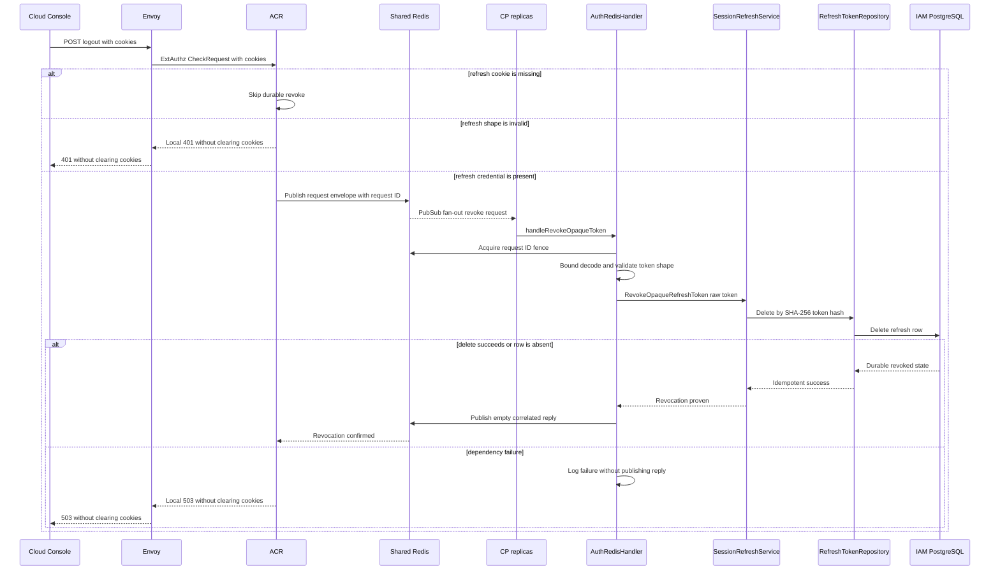
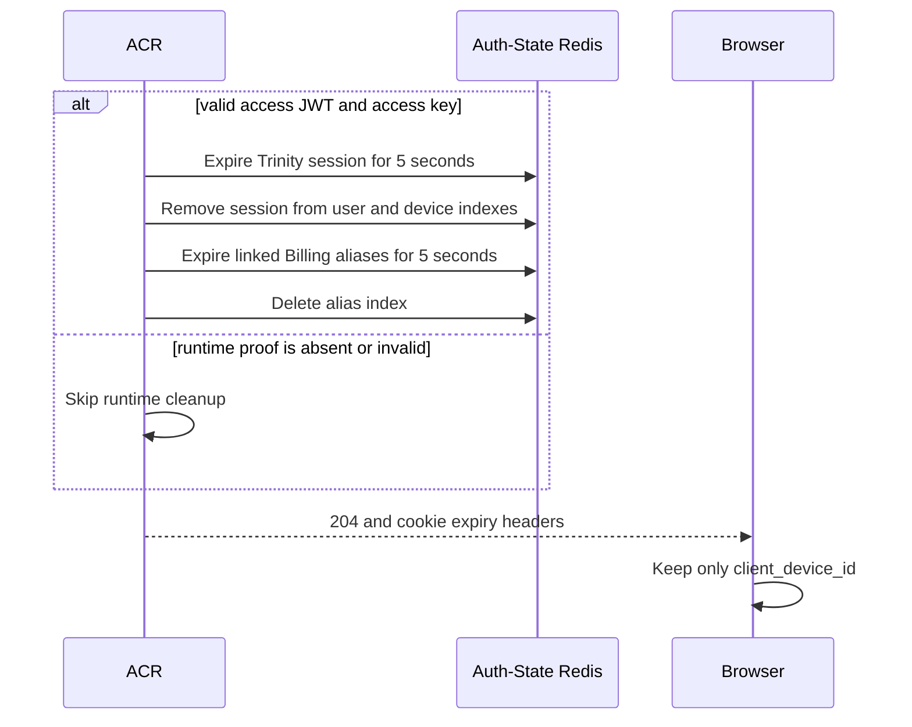
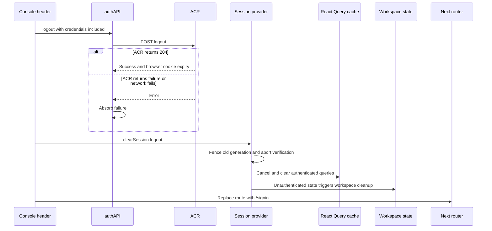

# End-user Logout — God View (Master SoT)

Logout ends the current browser's IAM session. Its security authority is the
durable refresh credential: ACR must receive Controlplane confirmation that the
credential is absent before it clears any authentication cookie. Logout neither
selects nor requires tenant, workspace or Zone context.

| Phase | Owner | Input | Output |
|---|---|---|---|
| 1. ACR proves durable refresh revocation | Browser → Envoy/ACR → Shared Redis → IAM | `POST /api/v1/auth/logout` and optional refresh cookie | Refresh hash is absent in PostgreSQL, or ACR returns failure without clearing cookies |
| 2. ACR revokes runtime and browser credentials | ACR → Auth-State Redis → Browser | Proven durable revoke, or no refresh cookie | Current runtime family expires and ACR returns `204` with cookies cleared |
| 3. Tear down console state | Cloud Console | Logout call resolves or rejects | In-memory session/query/workspace state cleared and browser goes to `/signin` |

## Phase 1 — ACR proves durable refresh revocation

The request is intercepted by ACR, not forwarded to an application HTTP
handler. A refresh token is an opaque bearer credential, so its PostgreSQL row
is the durable security boundary. If no `refresh_token` cookie exists, this
phase is skipped and the workflow continues to Phase 2.

### REST input

| Part | Contract |
|---|---|
| Method/path | `POST /api/v1/auth/logout` |
| Headers used | `Cookie`; ACR reads `refresh_token`, `access_token` and `access_key` |
| Body | None |
| CSRF input | No CSRF header is read by this handler; browser cookies are `Secure; SameSite=Lax` and the route is `POST` |

### ACR and IAM processing/output

1. Envoy sends ACR an ExtAuthz `CheckRequest` carrying method, path, bounded
   body, cookies and edge headers; this endpoint is intercepted and no HTTP
   request is forwarded to Controlplane.
2. ACR rejects a supplied refresh token outside `64..=512` characters with
   `401`; it makes no mutation and does not clear cookies.
3. ACR encodes `RevokeOpaqueRefreshTokenRequest{refresh_token}` and sends a
   request/reply envelope through Shared Redis. It waits at most 800 ms.
4. One Controlplane consumer obtains a 30-second request-ID `SET NX` fence,
   trims and revalidates the token shape, hashes it with SHA-256, and deletes
   the matching `iam.refresh_tokens` row.
5. Zero deleted rows are a successful idempotent revoke. Only after the delete
   succeeds does Controlplane publish the empty protobuf reply.
6. Missing consumer, Redis/Controlplane/PostgreSQL failure, malformed reply or
   timeout produces `503`; ACR leaves runtime and cookies untouched so the
   browser retains its server-side retry capability.

### Controlplane processing

This phase has no Gin router: Shared Redis Pub/Sub fan-out enters
`AuthRedisHandler.handleRevokeOpaqueToken`. The `SET NX` dispatch winner bounds
and unmarshals the protobuf, revalidates refresh-token shape, then calls
`SessionRefreshService.RevokeOpaqueRefreshToken`, which delegates the SHA-256
delete to `RefreshTokenRepository`. Only the handler publishes the empty
correlated reply after that service call succeeds.

#### Response headers

| Result | Headers |
|---|---|
| `401` invalid refresh shape | No logout `Set-Cookie` headers |
| `503` revocation not proven | No logout `Set-Cookie` headers |
| Durable revoke proven | Phase 2 constructs `204` response headers |

#### Response payload

| Result | Payload |
|---|---|
| `401` | Envoy ext_authz unauthenticated denial, no application JSON body contract |
| `503` | Envoy ext_authz unavailable denial, no application JSON body contract |
| Success | No body, continues to Phase 2 |

### Key contract

| Key / record | Store | Operation / TTL | Owner / purpose |
|---|---|---|---|
| `RevokeOpaqueRefreshTokenRequest.refresh_token` | Shared Redis Pub/Sub payload | Protobuf carried after 16-byte request ID | ACR → IAM opaque bearer input |
| `iam.auth.revoke_opaque_token` | Shared Redis Pub/Sub | Request channel | ACR request transport |
| `iam.auth.revoke_opaque_token.reply.{request_id}` | Shared Redis Pub/Sub | Correlated reply channel | ACR response transport |
| `iam:auth:dispatch:revoke_opaque_token:{request_id}` | Shared Redis | `SET NX EX 30s` | Controlplane replica fan-out fence |
| `iam.refresh_tokens.token_hash` | IAM PostgreSQL | `DELETE WHERE SHA-256(raw_token)` | Durable revocation SoT |

## Phase 2 — ACR expires runtime session family and clears cookies

This phase runs only after Phase 1 confirms durable revocation, or immediately
when the browser has no refresh cookie. Runtime cleanup is intentionally best
effort: losing Auth-State Redis after the durable delete cannot turn a completed
logout back into a server error.

### ACR processing and REST output

1. When both access JWT and access key are present and the JWT verifies, ACR
   expires the matching Trinity session for five seconds, removes it from user
   and device indexes, expires all linked Billing aliases for five seconds, and
   deletes the alias index.
2. Invalid/missing JWT or access key simply skips runtime cleanup. Redis errors
   during cleanup are ignored after durable refresh revocation.
3. ACR returns `204 No Content` and emits `Set-Cookie` expiry headers on `/`.
   It clears every supplied cookie except `client_device_id`, and always includes
   Aurora's standard auth/context cookie names even if absent from the request.

#### Response headers

| Result | Headers |
|---|---|
| `204` | `Set-Cookie` expiry for incoming cookies except `client_device_id`, plus standard Aurora auth/context cookies; `Secure`, `SameSite=Lax`, `Max-Age=0` |

#### Response payload

| Result | Payload |
|---|---|
| `204` | Empty body |

### Key contract

| Key / state | Store | Operation / TTL | Owner / purpose |
|---|---|---|---|
| `iam:user_session:{zone_id}:{tenant_id}:{user_id}:{access_key}` | Auth-State Redis | `EXPIRE 5` after valid JWT | Current Trinity runtime session |
| `iam:user_access_index:{user_id}` | Auth-State Redis | `SREM` session key | User session index cleanup |
| `iam:device_access_index:{client_device_id}` | Auth-State Redis | `SREM` session key | Device session index cleanup |
| `iam:session_alias_index:{access_key}` | Auth-State Redis | Expire aliases 5s then `DEL` index | Revoke Billing session family |
| `access_token`, `access_key`, `access_secret`, `refresh_token` | Browser cookies | Expire on `/` | Authentication credentials |
| `tenant_id`, `tenant_domain`, `workspace_id`, `zone_code` | Browser cookies | Expire on `/` | Context only, never revocation input |
| `client_device_id` | Browser cookie | Preserved | Stable non-authentication browser device identifier |

## Phase 3 — Clear Cloud Console memory and redirect

The console cannot prove Phase 1 completed: `authAPI.logout` deliberately
absorbs HTTP/network failures. It still removes client-side authority so stale
queries or a late response cannot render the old principal. A `503` therefore
means local logout is complete but server-side refresh revocation is unknown;
the old cookies were not cleared by ACR and no automatic retry is scheduled.

### Browser processing/output

1. Header calls `authAPI.logout()` with `credentials: include`; the API swallows
   success and failure alike.
2. `clearSession("logout")` increments the generation fence, aborts active
   verification, marks the provider unauthenticated, cancels queries and clears
   React Query cache.
3. The header replaces navigation with `/signin`. Workspace initializer observes
   unauthenticated state and clears workspace state/cookie.
4. Logout does not broadcast a cross-tab teardown. Other tabs lose shared
   browser cookies after a successful `204` and become unauthenticated on their
   next protected request or session verification.

### Key contract

| State | Store | Operation | Owner / purpose |
|---|---|---|---|
| Session generation / in-memory provider | Cloud Console tab | Increment and set unauthenticated | Fence late old-principal completion |
| React Query cache | Cloud Console tab | Cancel then clear | Remove authenticated projections |
| Workspace context | Cloud Console tab | Clear after unauthenticated observation | Remove selected workspace projection |
| Browser cookie jar | Browser profile | Applies Phase 2 `Set-Cookie` response across tabs | Credential boundary, not React state |

## Security and code map

- Raw refresh token, token digest, access JWT, access key and alias secret are
  never logged. Controlplane receives the raw refresh only through the bounded
  Central-internal Shared Redis request/reply contract in order to hash it.
- PostgreSQL delete precedes every runtime and cookie mutation. Idempotent
  absence is success; no exactly-once guarantee crosses Pub/Sub and PostgreSQL.
- ACR does not send tenant, workspace, Zone, role or permission as a revocation
  authority. `client_device_id` is retained but is not an authentication claim.
- Cloud Console local cleanup never proves durable revocation. A failed logout
  needs an explicit later retry if the user must guarantee server-side revoke.

| Responsibility | Source |
|---|---|
| ACR logout interception | `acr/src/user/revoke.rs`, `acr/src/gateway/ext_authz.rs` |
| Shared Redis request/reply envelope | `acr/src/infra/shared_redis.rs`, `proto/iam_auth.proto` |
| IAM Pub/Sub revoke handler | `controlplane/internal/iam/transport/pubsub/handler/auth.go` |
| Refresh revoke service/repository | `controlplane/internal/iam/service/session_refresh_service.go`, `repository/refresh_token_repo.go` |
| Runtime session and alias cleanup | `acr/src/user/session.rs`, `acr/src/billing/session.rs` |
| Cookie expiry | `acr/src/pkg/cookie.rs` |
| Console logout and local teardown | `cloud-console/src/shell/header.tsx`, `features/auth/api.ts`, `session/provider.tsx` |
