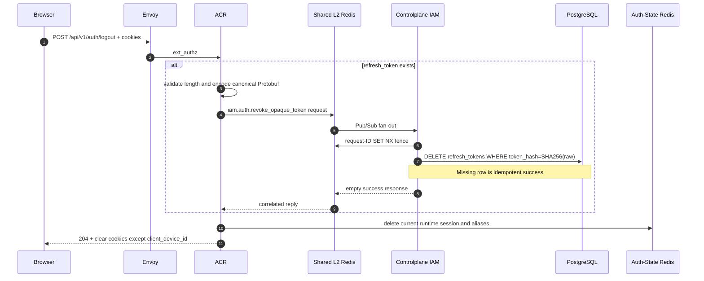

# End-user logout — God View

> Source of Truth for `POST /api/v1/auth/logout`. Durable refresh credential is
> revoked before browser/runtime cleanup. Logout is not tenant switch and does
> not depend on the active tenant context.

## 1. Ownership

| State | Owner | Logout action |
| --- | --- | --- |
| `refresh_token` hash | Controlplane PostgreSQL | Hard delete by SHA-256 hash |
| Trinity session | Auth-State Redis | Delete current session and aliases |
| Browser auth/context cookies | Browser via ACR response | Clear all except `client_device_id` |

The refresh row is bound only to `user_id + device_id`. `tenant_id`, Zone,
workspace, role and permissions are never required to revoke it.

## 2. Workflow

Request/reply uses the canonical `contracts/proto/iam_auth.proto` contract.
This is bounded Central-internal Shared Redis transport, not gRPC, Kafka or
NATS.

## 3. Ordering and failure semantics

1. Durable PostgreSQL revocation runs before runtime/cookie cleanup.
2. If Shared Redis, Controlplane or PostgreSQL cannot prove durable revocation,
   ACR returns `503` and keeps cookies so the user can retry.
3. Controlplane publishes no reply on infrastructure failure; ACR fails closed
   on its bounded 800ms request timeout inside Envoy's auth budget.
4. `DELETE` returning zero rows is the desired state and remains successful.
5. After durable success, Auth-State cleanup is best effort. A remaining active
   session is bounded by its short TTL and browser credentials are removed.
6. Duplicate logout requests are safe. No exactly-once claim crosses Redis and
   PostgreSQL.
7. Raw refresh token, digest, access key and access secret are never logged.

## 4. Cookie result

ACR clears:

- `access_token`
- `access_key`
- `access_secret`
- `refresh_token`
- `tenant_id`
- `tenant_domain`
- `workspace_id`
- `zone_code`

`client_device_id` remains as the stable browser device identifier. Keeping it
does not preserve authentication or authorization.

## 5. Code map

- `contracts/proto/iam_auth.proto`
- `acr/src/user/revoke.rs`
- `acr/src/gateway/ext_authz.rs`
- `controlplane/internal/iam/transport/pubsub/handler/auth.go`
- `controlplane/internal/iam/service/session_refresh_service.go`
- `controlplane/internal/iam/repository/refresh_token_repo.go`
