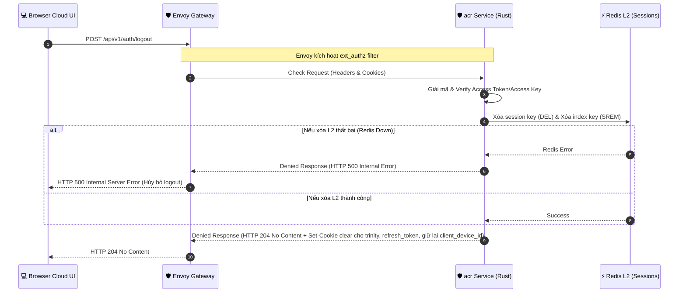
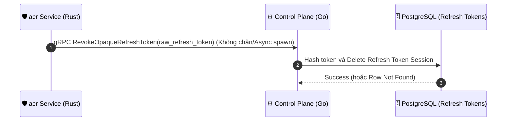

<!-- markdownlint-disable MD033 -->
# End-User Logout & Session Revocation - Workflow God View

> [!NOTE]
> Tài liệu này đóng vai trò là **Source of Truth (SoT) / God View** cho luồng Đăng xuất (Logout) và Thu hồi phiên hoạt động (Session Revocation) của End-User.
> Mọi thay đổi về code liên quan đến việc xóa L2 session trong Redis, thu hồi Refresh Token trong DB PostgreSQL và phản hồi cookies qua Envoy ext_authz và Control Plane phải tuân thủ nghiêm ngặt đặc tả này.

---

## 🗺️ 1. Giới Thiệu

### ❓ Phân hệ End-User Logout là gì?

Phân hệ này đảm nhận vai trò kết thúc phiên làm việc một cách an sau và tối ưu nhất cho hệ thống. Nó giải phóng các tài nguyên phiên làm việc tại hai cấp độ:

1. **Runtime Session (L2 Cache - Redis)**: Xóa bỏ dữ liệu phiên runtime để vô hiệu hóa tức thời quyền truy cập (Access Token).
2. **Persistent Storage (PostgreSQL)**: Thu hồi Refresh Token nếu thiết bị được cấu hình tin cậy (Trust Device).

Để đảm bảo hiệu năng tối đa (HA) và trải nghiệm người dùng tối ưu (sub-millisecond latency), luồng logout được phân tách và thực thi hoàn toàn tại **acr Service (Rust)**. acr Service xóa L2 Redis đồng bộ và trả về HTTP 204 lập tức cho client qua Envoy, sau đó thực hiện gọi gRPC không đồng bộ (non-blocking) sang **Control Plane (CP)** để thu hồi Refresh Token dưới database PostgreSQL nếu tồn tại cookie `refresh_token`.

### 🌐 Sơ đồ Kiến trúc Tổng quan (System Architecture)

Sơ đồ dưới đây mô tả cấu trúc các thành phần tham gia vào luồng Logout và cách chúng tương tác qua các kết nối đồng bộ (đường nét liền) và bất đồng bộ (đường nét đứt):

```mermaid
graph TD
    classDef client fill:#332244,stroke:#8844ff,stroke-width:2px;
    classDef gateway fill:#112233,stroke:#3388ff,stroke-width:2px;
    classDef edgeService fill:#113322,stroke:#33cc88,stroke-width:2px;
    classDef storage fill:#333311,stroke:#cccc33,stroke-width:2px;
    classDef control fill:#331111,stroke:#ff5555,stroke-width:2px;

    UI["💻 Browser UI (Client)"]:::client
    Envoy["🛡️ Envoy Gateway (Edge Proxy)"]:::gateway
    acr["🛡️ acr Service (Rust - Edge Authz)"]:::edgeService
    Redis["⚡ Redis L2 (Runtime Sessions)"]:::storage
    CP["⚙️ Control Plane (Go - CP Core)"]:::control
    DB["🗄️ PostgreSQL (Persistent DB)"]:::storage

    UI -- "1. POST /api/v1/auth/logout" --> Envoy
    Envoy -- "2. ext_authz Check" --> acr
    acr -- "3. DEL session (Sync)" --> Redis
    acr -- "4. 204 response + Cookie clear" --> Envoy
    Envoy -- "5. HTTP 204 No Content" --> UI
    
    acr -. "6. gRPC Revoke (Async/Non-blocking)" .-> CP
    CP -- "7. Delete Refresh Token" --> DB
```

### 🔑 Mô hình Token (Trinity Credentials)

Để hiểu rõ cách thức hoạt động của luồng Logout và Session Revocation, dưới đây là chi tiết cấu trúc, nơi lưu trữ và hành động thu hồi các loại token dưới dạng bảng:

| Tên Token/Cookie | Loại/Định dạng | Nơi Lưu Trữ Gốc (Server) | Hành động khi Logout | Mô tả & Vai trò |
| :--- | :--- | :--- | :--- | :--- |
| **`access_token`** | JWT (Vault signed) | Không lưu (Verify stateless) | **Hủy bỏ** (Clear Cookie) | Chứa các định danh claims (`sub`, `role`, `lvl`, `tenant_id`, `zone_id`) và `access_key`. |
| **`access_key`** | UUIDv7 (Plain) | **Redis L2** (Làm khóa phiên) | **Hủy bỏ** (Clear Cookie) | Định danh phiên làm việc, dùng để đối chiếu trực tiếp dữ liệu phiên runtime tại lớp L2 Redis. |
| **`access_secret`** | Secure Random String (Plain) | **Redis L2** (Lưu băm `ash`) | **Hủy bỏ** (Clear Cookie) | Khóa bí mật thô giúp client/Envoy kiểm tra tính toàn vẹn phiên làm việc nhanh chóng. |
| **`refresh_token`** | Opaque String | **PostgreSQL** (Lưu băm SHA-256) | **Hủy bỏ** (Clear Cookie & Gọi CP thu hồi DB) | Token dài hạn được cấp cho thiết bị tin cậy (`trust_device = true`) để duy trì phiên. |
| **`client_device_id`** | UUID (Plain) | **PostgreSQL** | **GIỮ LẠI (Không xóa)** | Định danh duy nhất của thiết bị phục vụ kiểm tra bảo mật và theo dõi lịch sử thiết bị (Device Tracking). |

👉 **Tổng kết luồng Logout**: Hệ thống sẽ đồng thời vô hiệu hóa bộ ba Trinity Credentials (`access_token`, `access_key`, `access_secret`) và `refresh_token` bằng cách thiết lập cookie `Max-Age=-1` và `Expires=Thu, 01 Jan 1970 00:00:00 GMT` trả về qua Envoy. Đồng thời, phiên runtime tại L2 Redis sẽ bị xóa đồng bộ và `refresh_token` sẽ bị thu hồi bất đồng bộ ở PostgreSQL.

### 🗃️ Các Khóa Lưu Trữ & Bộ Nhớ Được Tương Tác (Storage & Cache Keys Registry)

Dưới đây là toàn bộ các khóa lưu trữ tại mọi phân tầng (L1 Cookies, L2 Redis Cache, DB PostgreSQL) mà luồng Logout này trực tiếp tương tác và xử lý:

| Phân Tầng Lưu Trữ | Tên Khóa / Bảng | Kiểu Dữ Liệu | Hành Động Xử Lý | Chi Tiết & Vai Trò |
| :--- | :--- | :--- | :--- | :--- |
| **L1: Browser Cookies** | `access_token` | HTTP Cookie (JWT) | **Hủy bỏ** (`Max-Age=-1`) | Xóa cookie token truy cập tại client trình duyệt để kết thúc phiên làm việc stateless. |
| **L1: Browser Cookies** | `access_key` | HTTP Cookie (UUIDv7) | **Hủy bỏ** (`Max-Age=-1`) | Xóa cookie khóa truy cập dùng để tra cứu phiên tại L2. |
| **L1: Browser Cookies** | `access_secret` | HTTP Cookie (String) | **Hủy bỏ** (`Max-Age=-1`) | Xóa cookie secret dùng để mã hóa/xác thực phiên. |
| **L1: Browser Cookies** | `refresh_token` | HTTP Cookie (Opaque) | **Hủy bỏ** (`Max-Age=-1`) | Xóa cookie token gia hạn phiên dài hạn. |
| **L1: Browser Cookies** | `client_device_id` | HTTP Cookie (UUID) | **GIỮ LẠI** (Không xóa) | Giữ lại định danh thiết bị cho các hoạt động audit log và bảo mật sau này. |
| **L2: Redis Cache** | `iam:user_access_session:<UserID>:<AccessKey>` | String (Protobuf) | **Xóa bỏ (DEL)** | Xóa đồng bộ payload phiên hoạt động runtime để vô hiệu hóa quyền truy cập ngay lập tức. |
| **L2: Redis Cache** | `iam:user_access_index:<UserID>` | Set | **Loại bỏ phần tử (SREM)** | Loại bỏ `AccessKey` cụ thể ra khỏi tập hợp index quản lý các phiên của người dùng. |
| **DB: PostgreSQL** | Bảng `iam.refresh_tokens` | Hàng dữ liệu (Row) | **Xóa bỏ (DELETE)** | Thu hồi bất đồng bộ (qua gRPC) bản ghi Refresh Token có hash SHA-256 khớp với token được gửi lên. |

---

## 🏛️ 2. Sơ Đồ Hệ Thống & Trình Tự Điều Phối

Luồng Logout được chia thành 2 Phase độc lập với 2 sơ đồ tuần tự riêng biệt để làm rõ ranh giới đồng bộ và bất đồng bộ:

### Sơ đồ 1: Phase 1 - Đăng xuất và xóa L2 Session tại Gateway (Đồng bộ)

**Các file mã nguồn liên quan (Code References):**

- [acr/src/service/ext_authz.rs](../../acr/src/service/ext_authz.rs): Tiếp nhận yêu cầu từ bộ lọc `ext_authz` của Envoy, nhận diện request `/api/v1/auth/logout` và chuyển tiếp xử lý sang dịch vụ Logout.
- [acr/src/service/revoke_session.rs](../../acr/src/service/revoke_session.rs): Xóa đồng bộ session trong L2 Redis, chuẩn bị response 204 kèm xóa Cookies, và spawn tác vụ nền gRPC gửi Control Plane.
- [acr/src/config.rs](../../acr/src/config.rs): Cấu hình chung cho acr Service (nơi định cấu hình bypass route).

### Sơ đồ 2: Phase 2 - Thu hồi Refresh Token tại Control Plane (Bất đồng bộ)

Chỉ active khi có cookie refresh_token và không trả về bất cứ giá trị gì cho client cả.

**Các file mã nguồn liên quan (Code References):**

- [controlplane/internal/iam/transport/rpc/handler/auth.go](../../controlplane/internal/iam/transport/rpc/handler/auth.go): Đăng ký gRPC handler `RevokeOpaqueRefreshToken`, tiếp nhận token thô từ acr Service và ủy nhiệm xử lý xuống tầng Service nghiệp vụ.
- [controlplane/internal/iam/service/auth_service.go](../../controlplane/internal/iam/service/auth_service.go) & [controlplane/internal/iam/service/session_refresh_service.go](../../controlplane/internal/iam/service/session_refresh_service.go): Thực hiện nghiệp vụ băm SHA-256 mã token thô và gọi Repository để thu hồi.
- [controlplane/internal/iam/repository/refresh_token_repo.go](../../controlplane/internal/iam/repository/refresh_token_repo.go): Hiện thực tầng giao tiếp PostgreSQL để xóa bản ghi Refresh Token.

