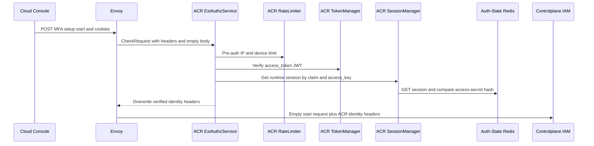
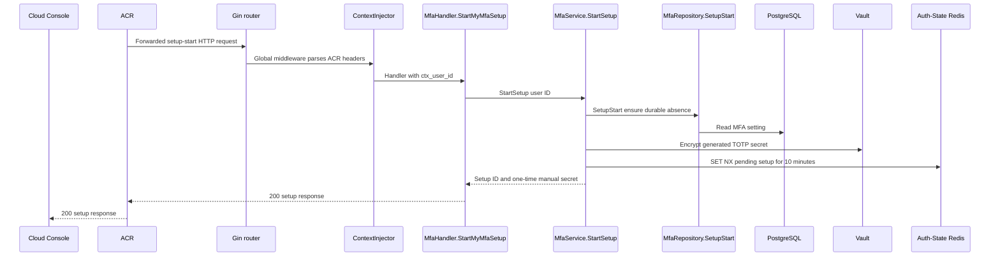
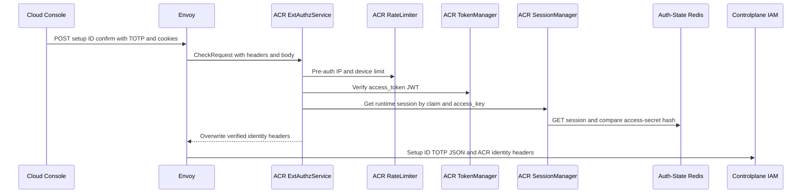
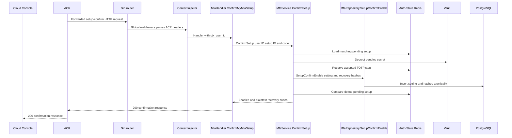

# User MFA Enrollment — God View (Master SoT)

Enrollment is a two-step self-user workflow. The pending secret is short-lived
in Auth-State Redis; an enabled MFA setting and its recovery hashes are one
PostgreSQL durability boundary. No secret or recovery code enters timeline,
logs, browser storage or a URL.

## API scope and edge-routing contract

Both routes are `/me` self mutations. ACR keeps their paths unchanged, never
sets `x-original-path` and never selects `/personal` or `/tenant`. The verified
`x-user-id` is the only target; no permission/role-level `Authorize` middleware
runs in Controlplane. MFA setup is not critical-session-proof gated.

| Phase | Owner | Output |
|---|---|---|
| 1. ACR admits setup start | Console → ACR | Verified self user ID plus empty start request |
| 2. IAM creates pending setup | IAM → Vault → Auth-State Redis | One QR/manual secret and a 10-minute setup ID |
| 3. ACR admits setup confirmation | Console → ACR | Verified self user ID, setup ID and TOTP code |
| 4. IAM confirms TOTP | IAM → PostgreSQL | Enabled setting and the only plaintext recovery-code response |

## Phase 1 — ACR admits authenticated setup start

### REST input and output

| Part | Contract |
|---|---|
| Method/path | `POST /api/v1/me/iam/mfa/setup/start` |
| Headers used | Session cookies |
| Payload | Empty |
| Success | ACR forwards the trusted self context to IAM |
| Failure | Missing or invalid session is denied at ACR before IAM |

### Client → Envoy → ACR processing and forward

| Boundary | What it receives or does |
|---|---|
| Client → Envoy | Empty `POST` setup-start request and browser cookies. Client identity/proof headers are untrusted. |
| Envoy → ACR | ExtAuthz `CheckRequest` with method, path, headers and empty body. |
| ACR local | Applies CORS/rate limit; verifies JWT, key/secret and Auth-State session. Invalid session returns local `401` or `503`. |
| ACR → IAM | Preserves the empty request, removes raw proof headers, and overwrites `x-user-id`, `x-user-name`, `x-user-level`, `x-tenant-id`, `x-zone-id`, `x-client-device-id`, optional `x-workspace-id`, and `x-session-proof-verified=false`. |

The verified `x-user-id` is the only user for whom IAM may create pending MFA
state.

## Phase 2 — IAM creates pending enrollment

### REST output

| Result | Headers used | Payload |
|---|---|---|
| Success | `Content-Type: application/json` | `setup_id`, `provisioning_uri`, `manual_secret`, `expires_at` |
| Existing enrollment | `Content-Type: application/json` | `409` error |
| Vault or Auth-State failure | `Content-Type: application/json` | `500` error |

IAM first proves no durable setting exists. It generates a TOTP secret, encrypts
it with Vault Transit key `iam-mfa-secret`, then writes a protobuf pending record
with `SET NX EX 10m`. The plaintext secret is returned once only.

### Controlplane processing

Gin routes setup start through global middleware; ContextInjector parses the
ACR `x-user-id` into Gin context. `MfaHandler.StartMyMfaSetup` applies a
five-second budget and calls `MfaService.StartSetup`. The service asks
`MfaRepository.SetupStart` to prove no enabled row exists, creates/encrypts the
secret with Vault, then writes `MfaSetupPending` to Auth-State Redis. A Redis
or Vault failure returns `500`; an enabled durable setting returns `409`.

### Key contract

| Key / record | Store | Operation / TTL |
|---|---|---|
| `iam:mfa:setup:{user_id}` | Auth-State Redis | `MfaSetupPending`, `SET NX EX 10m` |
| `mfa_settings` | IAM PostgreSQL | Read-only absence check |
| Vault Transit `iam-mfa-secret` | Vault | Encrypt pending TOTP secret |

## Phase 3 — ACR admits authenticated setup confirmation

### REST input and output

| Part | Contract |
|---|---|
| Method/path | `POST /api/v1/me/iam/mfa/setup/{setup_id}/confirm` |
| Headers used | Session cookies |
| Payload | `{ "code": "123456" }` |
| Success | ACR forwards trusted self context, setup ID and TOTP payload to IAM |
| Failure | Missing or invalid session is denied at ACR before IAM |

### Client → Envoy → ACR processing and forward

| Boundary | What it receives or does |
|---|---|
| Client → Envoy | Confirm path with `setup_id`, TOTP JSON and browser cookies. Client identity/proof headers are untrusted. |
| Envoy → ACR | ExtAuthz `CheckRequest` with method, path, bounded body, headers and edge address. |
| ACR local | Applies CORS/rate limit and verifies JWT, key/secret and Auth-State session. It does not validate or log the TOTP or claim setup ownership. |
| ACR → IAM | Preserves `setup_id` and `{ "code" }`, removes raw proof headers, and overwrites `x-user-id`, `x-user-name`, `x-user-level`, `x-tenant-id`, `x-zone-id`, `x-client-device-id`, optional `x-workspace-id`, and `x-session-proof-verified=false`. |

IAM remains the authority for setup ownership, expiry and code validation.

## Phase 4 — IAM confirms code and enables MFA atomically

### REST output

| Result | Headers used | Payload |
|---|---|---|
| Success | `Content-Type: application/json` | `status=enabled`, `enabled_at`, ten plaintext `recovery_codes` |
| Expired or mismatched setup or code | `Content-Type: application/json` | `400` error |
| Already enabled | `Content-Type: application/json` | `409` error |
| Dependency error | `Content-Type: application/json` | `500` error |

IAM reads and validates the pending user/setup IDs and ciphertext, decrypts in
Vault, accepts only the current adjacent 30-second TOTP window, then reserves
the accepted step with a Redis replay fence. One PostgreSQL statement inserts
the setting and all ten recovery hashes. Pending cleanup is compare-delete best
effort after the durable commit.

### Controlplane processing

Gin global middleware yields `ctx_user_id`; `MfaHandler.ConfirmMyMfaSetup`
applies a five-second budget, parses `setup_id`, strict-binds and length-checks
the code, then calls `MfaService.ConfirmSetup`. The service loads the pending
record, decrypts it through Vault, reserves the accepted step in Auth-State
Redis, and calls `MfaRepository.SetupConfirmEnable` for the setting/recovery
hash transaction. Only after commit does it compare-delete pending state.

### Key contract

| Key / record | Store | Operation / TTL |
|---|---|---|
| `iam:mfa:totp:{user_id}:{setting_id}` | Auth-State Redis | Accepted TOTP step, `EX 120s` replay fence |
| `mfa_settings` | IAM PostgreSQL | One setting per user |
| `mfa_recovery_codes` | IAM PostgreSQL | Ten hashes in same enable transaction |

## Security and code map

- A pending record expiring or a database rollback never enables MFA.
- Recovery plaintext exists only in the confirmation response and component
  memory. Login-time MFA verification is a different workflow.
- Sources: `transport/http/handler/mfa_handler.go`, `service/mfa_service.go`,
  `repository/mfa_repo.go`, `proto/iam/authentication/v1/mfa_setup.proto`.
