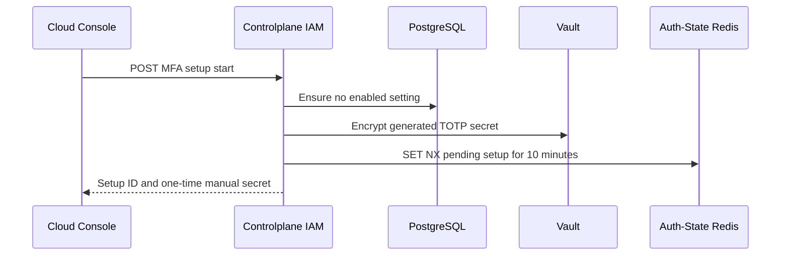
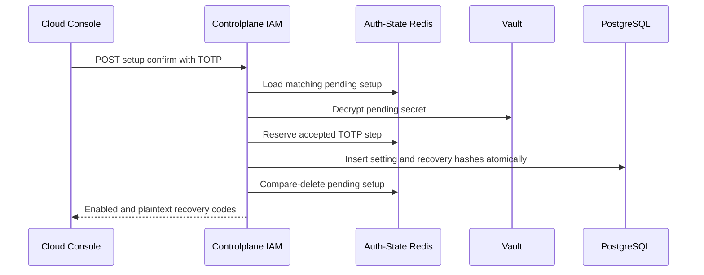

# User MFA Enrollment — God View (Master SoT)

Enrollment is a two-step self-user workflow. The pending secret is short-lived
in Auth-State Redis; an enabled MFA setting and its recovery hashes are one
PostgreSQL durability boundary. No secret or recovery code enters timeline,
logs, browser storage or a URL.

| Phase | Owner | Output |
|---|---|---|
| 1. Start setup | Console → IAM → Vault → Auth-State Redis | One QR/manual secret and a 10-minute setup ID |
| 2. Confirm TOTP | Console → IAM → PostgreSQL | Enabled setting and the only plaintext recovery-code response |

## Phase 1 — Start pending enrollment

### REST input and output

| Part | Contract |
|---|---|
| Method/path | `POST /api/v1/me/iam/mfa/setup/start` |
| Headers used | Verified session cookies |
| Payload | Empty |
| Success payload | `setup_id`, `provisioning_uri`, `manual_secret`, `expires_at` |
| Failure | Existing enrollment `409`; Vault/Auth-State dependency failure `500` |

IAM first proves no durable setting exists. It generates a TOTP secret, encrypts
it with Vault Transit key `iam-mfa-secret`, then writes a protobuf pending record
with `SET NX EX 10m`. The plaintext secret is returned once only.

### Key contract

| Key / record | Store | Operation / TTL |
|---|---|---|
| `iam:mfa:setup:{user_id}` | Auth-State Redis | `MfaSetupPending`, `SET NX EX 10m` |
| `mfa_settings` | IAM PostgreSQL | Read-only absence check |
| Vault Transit `iam-mfa-secret` | Vault | Encrypt pending TOTP secret |

## Phase 2 — Confirm code and enable atomically

### REST input and output

| Part | Contract |
|---|---|
| Method/path | `POST /api/v1/me/iam/mfa/setup/{setup_id}/confirm` |
| Headers used | Verified session cookies |
| Payload | `{ "code": "123456" }` |
| Success payload | `status=enabled`, `enabled_at`, ten plaintext `recovery_codes` |
| Failure | Expired/mismatched setup or code `400`; already enabled `409`; dependency error `500` |

IAM reads and validates the pending user/setup IDs and ciphertext, decrypts in
Vault, accepts only the current adjacent 30-second TOTP window, then reserves
the accepted step with a Redis replay fence. One PostgreSQL statement inserts
the setting and all ten recovery hashes. Pending cleanup is compare-delete best
effort after the durable commit.

### Key contract

| Key / record | Store | Operation / TTL |
|---|---|---|
| `iam:mfa:totp:{user_id}:{setting_id}` | Auth-State Redis | Accepted TOTP step, `EX 120s` replay fence |
| `mfa_settings` | IAM PostgreSQL | One setting per user |
| `mfa_recovery_codes` | IAM PostgreSQL | Ten hashes in same enable transaction |

## Security and code map

- A pending record expiring or a database rollback never enables MFA.
- Recovery plaintext exists only in the confirmation response and component
  memory. Login-time MFA verification is a different workflow.
- Sources: `transport/http/handler/mfa_handler.go`, `service/mfa_service.go`,
  `repository/mfa_repo.go`, `proto/iam_auth.proto`.
