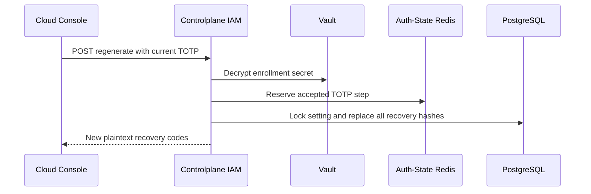

# User MFA Recovery-code Regeneration — God View (Master SoT)

This self-user mutation replaces the entire recovery-code set for an existing
MFA enrollment. It is not MFA enrollment or login verification.

## Phase 1 — Verify current TOTP and replace recovery hashes

### REST input and output

| Part | Contract |
|---|---|
| Method/path | `POST /api/v1/me/iam/mfa/recovery/regenerate` |
| Headers used | Verified session cookies |
| Payload | `{ "code": "123456" }` |
| Success | `200` with ten plaintext `recovery_codes` |
| Failure | Invalid TOTP `401`; MFA absent `400`; dependency failure `500` |

IAM loads the current setting, decrypts its secret with Vault, validates the
current adjacent TOTP window and reserves its accepted step for 120 seconds.
It generates ten new codes and replaces every old hash under a locked setting
in one PostgreSQL statement. Only the new plaintext list is returned.

### Key contract

| Key / record | Store | Operation / TTL |
|---|---|---|
| `iam:mfa:totp:{user_id}:{setting_id}` | Auth-State Redis | TOTP replay fence, `EX 120s` |
| `mfa_settings` | IAM PostgreSQL | Lock current enrollment |
| `mfa_recovery_codes` | IAM PostgreSQL | Delete all old hashes then insert ten new hashes atomically |

## Security and code map

- The old set is invalid immediately after commit. A duplicate TOTP step cannot
  regenerate another set during the replay fence.
- Plaintext codes never enter cache, timeline or logs.
- Sources: `transport/http/handler/mfa_handler.go`, `service/mfa_service.go`,
  `repository/mfa_repo.go`.
