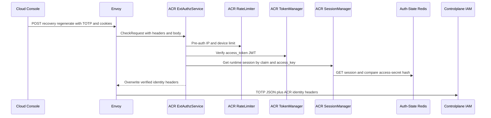
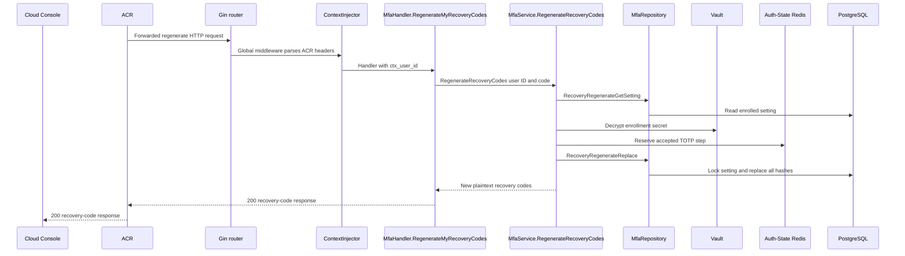

# User MFA Recovery-code Regeneration — God View (Master SoT)

This self-user mutation replaces the entire recovery-code set for an existing
MFA enrollment. It is not MFA enrollment or login verification.

## API scope and edge-routing contract

This is a `/me` self mutation. ACR leaves the path unchanged, does not emit
`x-original-path`, and does not rewrite to `/personal` or `/tenant`. The
verified `x-user-id` is the only target; Controlplane runs no permission/level
`Authorize` middleware for this self workflow.

## Phase 1 — ACR admits the authenticated recovery mutation

### REST input and output

| Part | Contract |
|---|---|
| Method/path | `POST /api/v1/me/iam/mfa/recovery/regenerate` |
| Headers used | Session cookies |
| Payload | `{ "code": "123456" }` |
| Success | ACR forwards trusted self context and the TOTP payload to IAM |
| Failure | Missing or invalid session is denied at ACR before IAM |

### Client → Envoy → ACR processing and forward

| Boundary | What it receives or does |
|---|---|
| Client → Envoy | Route, `Content-Type`, TOTP JSON and browser cookies. Any client identity/proof header is untrusted. |
| Envoy → ACR | ExtAuthz `CheckRequest` with method, path, bounded body, headers and edge address. |
| ACR local | Applies CORS/rate limit and verifies JWT, key/secret and Auth-State session. It does not validate or log the TOTP. Invalid session returns local denial. |
| ACR → IAM | Preserves route and `{ "code" }`, removes raw proof material, and overwrites `x-user-id`, `x-user-name`, `x-user-level`, `x-tenant-id`, `x-zone-id`, `x-client-device-id`, optional `x-workspace-id`, and `x-session-proof-verified=false`. |

The verified `x-user-id` is the `/me` actor/target; IAM does not trust any
client-supplied identity header.

## Phase 2 — IAM verifies current TOTP and replaces recovery hashes

### REST output

| Result | Headers used | Payload |
|---|---|---|
| Success | `Content-Type: application/json` | `200` with ten plaintext `recovery_codes` |
| Invalid TOTP | `Content-Type: application/json` | `401` error |
| MFA absent | `Content-Type: application/json` | `400` error |
| Dependency failure | `Content-Type: application/json` | `500` error |

IAM loads the current setting, decrypts its secret with Vault, validates the
current adjacent TOTP window and reserves its accepted step for 120 seconds.
It generates ten new codes and replaces every old hash under a locked setting
in one PostgreSQL statement. Only the new plaintext list is returned.

### Controlplane processing

Gin global middleware parses the ACR headers before
`MfaHandler.RegenerateMyRecoveryCodes` obtains `ctx_user_id`, applies a
five-second budget and validates the six-digit JSON code. `MfaService`
loads the setting through `MfaRepository.RecoveryRegenerateGetSetting`,
decrypts with Vault, reserves the step in Auth-State Redis, then calls
`RecoveryRegenerateReplace` to lock the setting and replace hashes atomically.

### Key contract

| Key / record | Store | Operation / TTL |
|---|---|---|
| `iam:mfa:totp:{user_id}:{setting_id}` | Auth-State Redis | TOTP replay fence, `EX 120s` |
| `mfa_settings` | IAM PostgreSQL | Lock current enrollment |
| `mfa_recovery_codes` | IAM PostgreSQL | Delete all old hashes then insert ten new hashes atomically |

## Security and code map

- The old set is invalid immediately after commit. A duplicate TOTP step cannot
  regenerate another set during the replay fence.
- Plaintext codes never enter cache, timeline or logs.
- Sources: `transport/http/handler/mfa_handler.go`, `service/mfa_service.go`,
  `repository/mfa_repo.go`.
