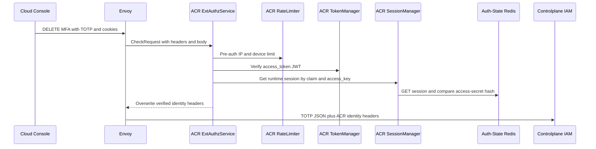
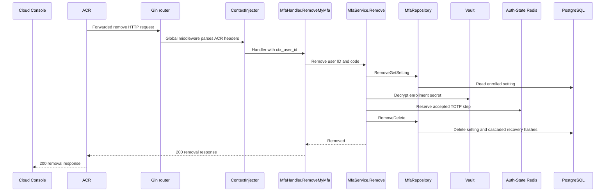

# User MFA Removal — God View (Master SoT)

This self-user workflow hard-removes an enabled MFA enrollment after proof of
the current TOTP. It is distinct from recovery-code regeneration.

## API scope and edge-routing contract

This is a `/me` self mutation. ACR leaves the path unchanged, does not emit
`x-original-path`, and does not rewrite to `/personal` or `/tenant`. The
verified `x-user-id` is the only target; Controlplane runs no permission/level
`Authorize` middleware for this self workflow.

## Phase 1 — ACR admits the authenticated MFA removal

### REST input and output

| Part | Contract |
|---|---|
| Method/path | `DELETE /api/v1/me/iam/mfa` |
| Headers used | Session cookies |
| Payload | `{ "code": "123456" }` |
| Success | ACR forwards trusted self context and TOTP payload to IAM |
| Failure | Missing or invalid session is denied at ACR before IAM |

### Client → Envoy → ACR processing and forward

| Boundary | What it receives or does |
|---|---|
| Client → Envoy | `DELETE` route, `Content-Type`, TOTP JSON and browser cookies. Client identity/proof headers are untrusted. |
| Envoy → ACR | ExtAuthz `CheckRequest` with method, path, bounded body, headers and edge address. |
| ACR local | Applies CORS/rate limit and verifies JWT, key/secret and Auth-State session. It does not validate or log the TOTP. Invalid session returns local denial. |
| ACR → IAM | Preserves route and `{ "code" }`, removes raw proof material, and overwrites `x-user-id`, `x-user-name`, `x-user-level`, `x-tenant-id`, `x-zone-id`, `x-client-device-id`, optional `x-workspace-id`, and `x-session-proof-verified=false`. |

The verified `x-user-id` is the `/me` actor/target. IAM does not trust any
client-supplied identity header to remove another user's enrollment.

## Phase 2 — IAM verifies current TOTP and deletes enrollment

### REST output

| Result | Headers used | Payload |
|---|---|---|
| Success | `Content-Type: application/json` | `200`, `{ "status": "removed" }` |
| Invalid TOTP | `Content-Type: application/json` | `401` error |
| MFA absent | `Content-Type: application/json` | `400` error |
| Dependency failure | `Content-Type: application/json` | `500` error |

IAM decrypts the current enrolled secret, validates the six-digit TOTP within
the adjacent 30-second window, and reserves the accepted step. It then deletes
the MFA setting. Recovery-code rows follow the schema foreign-key delete rule;
no soft-disabled MFA state exists.

### Controlplane processing

Gin global middleware parses ACR headers before `MfaHandler.RemoveMyMfa`
obtains `ctx_user_id`, applies its five-second budget and validates the
six-digit JSON code. `MfaService.Remove` loads the setting through
`MfaRepository.RemoveGetSetting`, decrypts in Vault, reserves the accepted
step in Auth-State Redis, then calls `MfaRepository.RemoveDelete`; the database
foreign key removes recovery hashes.

### Key contract

| Key / record | Store | Operation / TTL |
|---|---|---|
| `iam:mfa:totp:{user_id}:{setting_id}` | Auth-State Redis | TOTP replay fence, `EX 120s` |
| `mfa_settings` | IAM PostgreSQL | Hard delete by user ID |
| `mfa_recovery_codes` | IAM PostgreSQL | Removed with enrollment according to foreign key |

## Security and code map

- Vault or replay-fence failure fails closed before database delete.
- Login MFA gate observes the durable absence on the next login; this workflow
  does not issue or revoke a session itself.
- Sources: `transport/http/handler/mfa_handler.go`, `service/mfa_service.go`,
  `repository/mfa_repo.go`.
