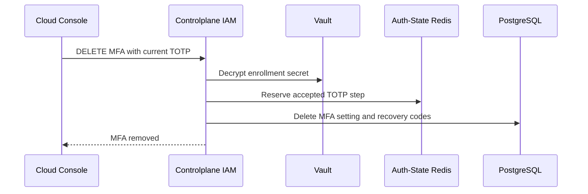

# User MFA Removal — God View (Master SoT)

This self-user workflow hard-removes an enabled MFA enrollment after proof of
the current TOTP. It is distinct from recovery-code regeneration.

## Phase 1 — Verify current TOTP and delete enrollment

### REST input and output

| Part | Contract |
|---|---|
| Method/path | `DELETE /api/v1/me/iam/mfa` |
| Headers used | Verified session cookies |
| Payload | `{ "code": "123456" }` |
| Success | `200`, `{ "status": "removed" }` |
| Failure | Invalid TOTP `401`; MFA absent `400`; dependency failure `500` |

IAM decrypts the current enrolled secret, validates the six-digit TOTP within
the adjacent 30-second window, and reserves the accepted step. It then deletes
the MFA setting. Recovery-code rows follow the schema foreign-key delete rule;
no soft-disabled MFA state exists.

### Key contract

| Key / record | Store | Operation / TTL |
|---|---|---|
| `iam:mfa:totp:{user_id}:{setting_id}` | Auth-State Redis | TOTP replay fence, `EX 120s` |
| `mfa_settings` | IAM PostgreSQL | Hard delete by user ID |
| `mfa_recovery_codes` | IAM PostgreSQL | Removed with enrollment according to foreign key |

## Security and code map

- Vault or replay-fence failure fails closed before database delete.
- Login MFA gate observes the durable absence on the next login; this workflow
  does not issue or revoke a session itself.
- Sources: `transport/http/handler/mfa_handler.go`, `service/mfa_service.go`,
  `repository/mfa_repo.go`.
