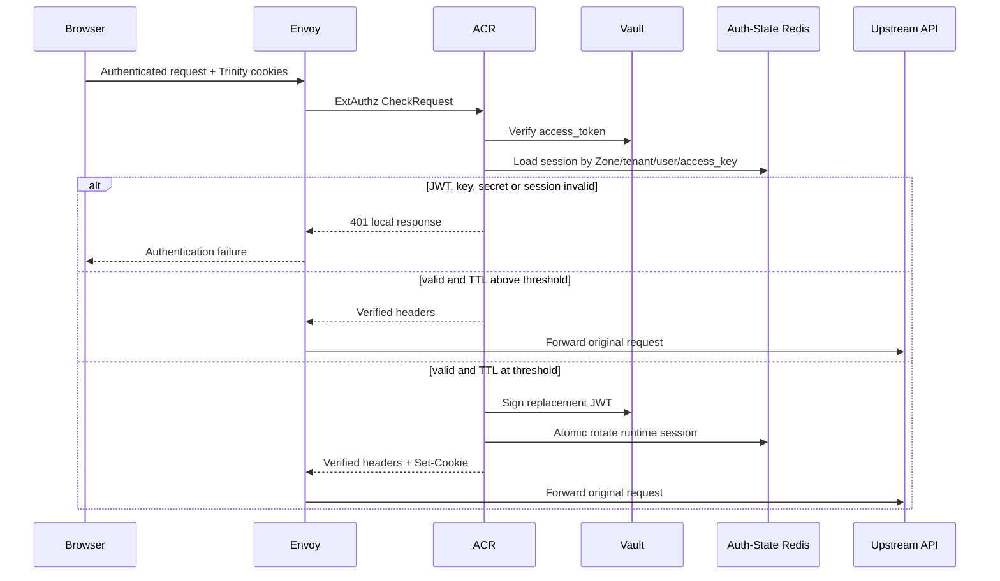
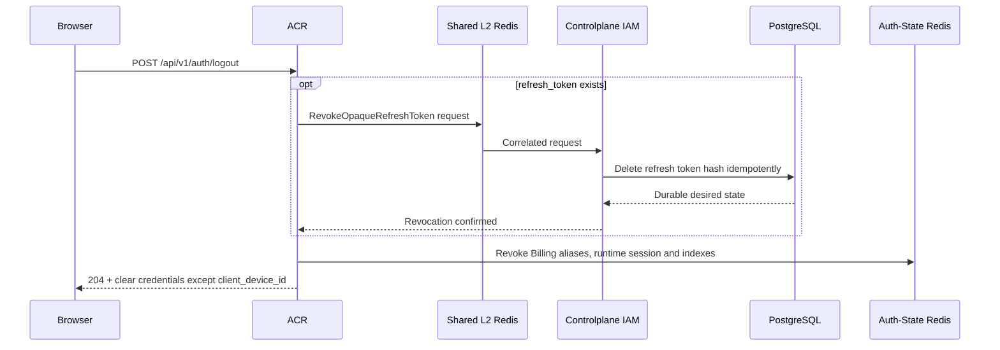

# End-user Post-login Session — God View (Master SoT)

Workflow này giữ, khôi phục và kết thúc session của một end user sau password,
MFA hoặc social login. Mục tiêu là mọi request chỉ chạy dưới một concrete Zone và
authority snapshot hiện thời; refresh credential không bao giờ tự mang tenant,
role hoặc Zone authority.

| Phase | Owner | Input | Output |
|---|---|---|---|
| 1. Verify and renew | Browser → Envoy → ACR | Trinity cookies + authenticated request | Forward request, hoặc replacement Trinity cookies khi sliding renewal |
| 2. Recover context | ACR → Auth-State Redis → CP IAM | Opaque `refresh_token` + requested tenant/Zone cookies | Intercepted `200` + fresh personal/tenant Trinity cookies; browser retries |
| 3. Logout and revoke | Browser → ACR → CP IAM → Auth-State Redis | `POST /api/v1/auth/logout` + cookies | Durable refresh revoke, runtime cleanup, `204` and cleared credentials |

## Session authority at a glance

| Capability | Source of truth | Scope |
|---|---|---|
| `access_token` | Vault-signed JWT, validated by ACR | Short-lived identity, level, active tenant and concrete Zone |
| `access_key` + `access_secret` | Auth-State Redis `UserAccessSession` | Runtime replay/revocation boundary |
| `refresh_token` | PostgreSQL `iam.refresh_tokens` stores only SHA-256 hash | Long-lived user/device recovery credential, only when `trust_device=true` |
| Current tenant authorization | PostgreSQL role/membership snapshot | Evaluated during recovery; not embedded in refresh credential |
| Zone | Trusted `zone_code` cookie → catalog resolution | Concrete active/draining Zone, never `global` |

The browser holds only HttpOnly credentials and display/context cookies. It does
not choose user ID, role, Zone UUID, tenant authority, device identity or runtime
session key. Envoy strips trusted headers before ACR injects verified values.

## Phase 1 — Verify current Trinity session and renew it safely

Every non-public Cloud Console request reaches ACR `ext_authz`. Valid session
verification is the normal path; sliding renewal is an internal replacement of
an already-valid session, not an opaque-token recovery.

### Request input

| Part | Contract |
|---|---|
| Request | Any authenticated, non-public Cloud Console API request |
| Cookies | `access_token`, `access_key`, `access_secret`; `tenant_id`, `zone_code`, `client_device_id` provide context/device hints |
| Optional header | `Authorization: Bearer <access_token>` only as JWT source; runtime key/secret still come from cookies |
| Excluded from input | Expired JWT claims, client-supplied internal identity/owner/proof headers |

### ACR processing and output

1. Verify the Vault JWT. ACR never decodes expired/unverified JWT claims as a
   recovery identity input.
2. Require JWT `access_key` to equal the cookie and load
   `iam:user_session:{zone_id}:{tenant_id}:{user_id}:{access_key}` from Auth-State
   Redis.
3. SHA-256 the cookie `access_secret`; it must equal stored `ash`. Missing,
   mismatched or revoked runtime session fails before upstream forwarding.
4. If JWT lifetime is above `REFRESH_THRESHOLD_SECS`, ACR forwards the request
   with verified identity/context headers.
5. At/below threshold, ACR signs a new JWT and atomically rotates runtime
   session key/secret through the existing rotation fence. The opaque refresh
   credential is not read, rotated or extended.

#### Output headers and cookies

| Result | Output |
|---|---|
| Valid Trinity | Envoy forwards request with ACR-overwritten identity, tenant, Zone, authorization and proof headers |
| Sliding rotation won | Same forwarded request plus replacement `access_token`, `access_key`, `access_secret` cookies |
| JWT/key/secret/session invalid | `401`; no downstream request |
| Auth-State Redis unavailable | `503`; no downstream request |

### Key contract

| Key / credential | Store | Operation / TTL | Owner / purpose |
|---|---|---|---|
| `iam:user_session:{zone_id}:{tenant_id}:{user_id}:{access_key}` | Auth-State Redis | Prost `UserAccessSession`; session TTL | ACR runtime authority: `ash`, device and proof key |
| `iam:user_access_index:{user_id}` | Auth-State Redis | Set of runtime session keys | ACR user-wide revocation index |
| `iam:device_access_index:{client_device_id}` | Auth-State Redis | Set of runtime session keys | ACR device revocation index |
| `iam:lock:refresh:{old_access_key}` | Auth-State Redis | `SET NX EX 5s` | Exactly one sliding rotation winner; old session has 5s grace |



## Phase 2 — Recover a session with opaque user/device credential

This phase begins only after Trinity verification fails or Trinity cookies are
absent. ACR intercepts the original request and issues a replacement session;
the original request is never forwarded under a newly recovered owner context.

### Request input

| Part | Contract |
|---|---|
| Trigger | Missing/expired/invalid Trinity material plus `refresh_token` cookie |
| Cookies used | `refresh_token`, `tenant_id`, `zone_code`, `client_device_id` |
| Refresh token | 64–512 bytes; raw value exists only in HttpOnly cookie |
| Requested tenant | Missing/empty/`platform` = personal; otherwise non-nil UUID only |
| Requested Zone | `zone_code` must resolve active/draining concrete Zone; no `global` fallback |

### ACR and Controlplane processing

1. ACR validates requested tenant and resolves current Zone independently of the
   expired JWT.
2. It hashes the opaque token with resolved Zone and requested context for
   recovery cache/singleflight. A token-only cache key is forbidden because a
   replacement Trinity session includes Zone and tenant context.
3. The lock winner publishes `RecoverUserSessionRequest` over Shared L2 Redis;
   CP replicas contend on request-ID fence then execute one read-only PostgreSQL
   credential and authority snapshot.
4. CP matches SHA-256 token hash, active user and active non-revoked device. It
   resolves current root platform role or tenant membership role in the same
   snapshot; no `role_id` crosses this transport.
5. ACR signs fresh JWT, registers fresh runtime session from CP's canonical
   `client_device_id`, publishes brief recovery cache and returns local `200`
   with cookies. Browser retries the original request.

#### Internal request/reply

| Transport | Contract |
|---|---|
| Request channel | `iam.auth.recover_user_session` |
| Reply channel | `iam.auth.recover_user_session.reply.{request_id}` |
| Request fields | `refresh_token`, optional `requested_tenant_id` |
| Success fields used | `credential_valid`, `context_authorized`, `user_id`, `username`, `client_device_id`, `resolved_tenant_id`, `role_level`, `personal_fallback_authorized` |
| Timeout | ACR request/reply timeout `800ms`; CP infrastructure error sends no success-like reply |

#### Response headers and payload

| Result | Headers / body |
|---|---|
| Recovery success | `200`, XSSI JSON `{"status":"ok"}`, replacement Trinity cookies, `tenant_id`, `zone_code`, canonical `client_device_id` |
| Tenant authority stale, personal fallback valid | Same success cookies for personal context; `x-aurora-context-reset: personal`; clear `tenant_domain` and `workspace_id`; original request remains intercepted |
| Invalid/expired credential | `401`; clear auth/context cookies but retain device identifier |
| Malformed requested tenant or Zone unavailable | `400/403`; retain refresh credential, no session |
| Valid credential but no authorized context | `403`; retain refresh credential, no session |
| Lock/Redis/CP/PostgreSQL/Vault failure | `503`; fail closed and retain refresh credential for retry |

### Key contract

| Key / durable record | Store | Operation / TTL | Owner / purpose |
|---|---|---|---|
| `iam.refresh_tokens.token_hash` | PostgreSQL | SHA-256 only; unique user/device; absolute expiry | IAM durable recovery credential authority |
| `iam:lock:recovery:{sha256(token_hash + zone_id + context)}` | Auth-State Redis | owner UUID, TTL 10s | Cross-pod recovery singleflight |
| `iam:recovery_cache:{sha256(token_hash + zone_id + context)}` | Auth-State Redis | owner-checked cached replacement, TTL 5s | Bounded follower result only; never authorization SoT |
| request-ID dispatch fence | Shared L2 Redis | `SET NX` | One CP replica reads PostgreSQL for a correlated request |

```mermaid
sequenceDiagram
    participant B as Browser
    participant E as Envoy
    participant A as ACR
    participant AR as Auth-State Redis
    participant SR as Shared L2 Redis
    participant CP as Controlplane IAM
    participant DB as PostgreSQL
    participant V as Vault

    B->>E: Request + refresh_token + tenant/Zone cookies
    E->>A: ExtAuthz after Trinity failure
    A->>A: Validate tenant and resolve concrete Zone
    A->>AR: Cache read; acquire recovery owner lock
    A->>SR: RecoverUserSession request
    SR->>CP: Pub/Sub fan-out
    CP->>SR: Acquire request-ID fence
    CP->>DB: Credential + current authority snapshot
    alt requested tenant no longer authorized but personal valid
        CP-->>SR: personal fallback authorization
        SR-->>A: Fallback response
        A->>V: Sign personal JWT
        A->>AR: Register session/cache; release owner lock
        A-->>E: 200 + personal cookies + context-reset
    else authorized context
        CP-->>SR: Authorized user/device/context
        SR-->>A: Correlated response
        A->>V: Sign context JWT
        A->>AR: Register session/cache; release owner lock
        A-->>E: 200 + replacement cookies
    end
    E-->>B: Intercepted recovery response; browser retries
```

## Phase 3 — Revoke durable credential and clear runtime session

Logout has one durable ordering rule: CP must prove opaque refresh credential
revocation before ACR clears browser or runtime state. This prevents a false
logout UI from leaving a replayable long-lived credential behind.

### REST input

| Part | Contract |
|---|---|
| Method/path | `POST /api/v1/auth/logout` |
| Cookies used | Trinity cookies when present; `refresh_token` when trusted-device session exists |
| Payload | None |

### ACR and Controlplane processing/output

1. If refresh cookie exists, ACR validates length and sends
   `RevokeOpaqueRefreshTokenRequest { refresh_token }` over bounded Shared L2
   request/reply.
2. CP hashes token and idempotently deletes its PostgreSQL row. An absent row is
   already the desired durable state.
3. Only after successful/confirmed durable response does ACR delete current
   runtime session, revoke Billing aliases indexed by its source `access_key`,
   and clear auth/context cookies. `client_device_id` remains.
4. If durable revocation cannot be proven, ACR returns `503` without clearing
   credentials so browser can retry. A malformed refresh credential gets `401`.

#### Response headers and payload

| Result | Output |
|---|---|
| Success | `204 No Content`; expire `access_token`, `access_key`, `access_secret`, `refresh_token`, tenant/Zone/workspace context cookies; retain `client_device_id` |
| Invalid refresh credential | `401`; no false-success cleanup |
| CP/Shared Redis unavailable | `503`; cookies remain for retry |

### Key contract

| Key / durable record | Store | Operation | Owner / purpose |
|---|---|---|---|
| `iam.refresh_tokens` | PostgreSQL | Delete by SHA-256 raw refresh token | CP durable logout authority |
| `iam:user_session:{...}:{access_key}` | Auth-State Redis | Delete runtime session and indexes after durable revoke | ACR immediate runtime invalidation |
| `iam:session_alias_index:{access_key}` | Auth-State Redis | Revoke Cost/Billing aliases before source cleanup | No alias survives source logout |



## Invariants and code map

- Refresh token rows never contain tenant ID, workspace, Zone, role, permission,
  `used_at` or `revoked_at`; recovery does not rotate the opaque credential.
- Tenant switch starts from a valid Trinity session and does not call recovery or
  mutate refresh credential. Recovery authorizes the requested cookie context
  from durable facts and never forwards interrupted request under fallback owner.
- Redis recovery cache and locks are rebuildable coordination state, not identity
  or authorization authority. Redis/CP/Vault failures fail closed.
- Raw refresh token, token hash, access secret and recovery cache payload are not
  logged, traced or exposed to JavaScript.
- Device revoke deletes durable refresh credentials by device relationship and
  separately emits runtime-session revoke; it follows the same durable-before-
  runtime ordering as logout.

| Responsibility | Source |
|---|---|
| Trinity issuance | `acr/src/user/login.rs`, `acr/src/user/oauth.rs` |
| Session verification/renewal | `acr/src/user/verify.rs`, `acr/src/user/rotate.rs` |
| Opaque recovery | `acr/src/user/recovery.rs` |
| Logout/runtime revocation | `acr/src/user/revoke.rs`, `acr/src/billing/logout.rs` |
| Runtime session/index store | `acr/src/infra/redis.rs` |
| Recovery/revoke protobuf | `proto/iam_auth.proto` |
| CP durable refresh service/repository | `controlplane/internal/iam/service/session_refresh_service.go`, `controlplane/internal/iam/repository/refresh_token_repo.go` |
| CP transport handlers | `controlplane/internal/iam/transport/pubsub/handler/auth.go` |
| Browser retry/context reset | `cloud-console/src/shared/api/http.ts` |
