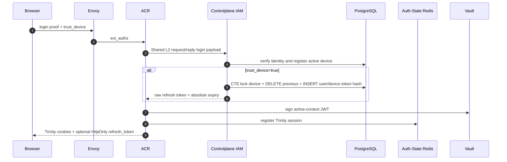

# End-user post-login session lifecycle — God View

> Source of Truth for active-session verification, sliding renewal, opaque
> user/device recovery, context recovery and durable logout. This workflow is
> for end users in one concrete Zone; it is not the SRE authentication flow.

## 1. Ownership and trust boundaries

| Component | Owns | Must not own |
| --- | --- | --- |
| Browser | Cookies and UI retry/reload behavior | User, tenant, role, Zone authority |
| Envoy | Public routing and ACR `ext_authz` enforcement | Identity or session state |
| ACR | JWT proof, Trinity session, recovery singleflight, cookie issuance | IAM durable identity/RBAC data |
| Controlplane IAM | Durable user/device credential and current platform/tenant authority | Browser session or Vault signing key |
| Auth-State Redis | Trinity sessions and bounded recovery lock/cache | Durable business identity |
| Shared L2 Redis | Bounded ACR to Controlplane request/reply transport | Durable cross-Zone jobs or business SoT |
| PostgreSQL | `iam.refresh_tokens`, users, devices and current RBAC assignments | Runtime session cache |
| Vault | JWT signing key | IAM business state |

The expired JWT is never an identity input to recovery. ACR does not decode
unverified claims from it. Controlplane derives `user_id` and `device_id` only
from the SHA-256 hash of the opaque refresh credential.

## 2. Credential and context model

### 2.1 Trinity session

An active user session consists of:

- `access_token`: short-lived Vault-signed JWT containing the currently active
  user, role, tenant and Zone claims.
- `access_key`: opaque runtime session identifier.
- `access_secret`: secret whose hash is stored with the session in Auth-State
  Redis.

Trinity state is short-lived. ACR verifies the JWT, key, secret, current Redis
session and request context before Envoy forwards a request.

### 2.2 Opaque refresh credential

`refresh_token` is a long-lived credential issued only for `trust_device=true`.
The raw value exists only in the HttpOnly cookie. PostgreSQL stores its SHA-256
hash in `iam.refresh_tokens`.

The durable row contains only:

| Column | Invariant |
| --- | --- |
| `id` | UUIDv7 generated by the service |
| `user_id` | Active IAM user |
| `device_id` | Active, non-revoked device owned by the same user |
| `token_hash` | Unique SHA-256 digest of the opaque value |
| `issued_at`, `expires_at` | Absolute credential lifetime |

`UNIQUE(user_id, device_id)` enforces one durable refresh credential per
user/device. Issuing a new credential for the same device locks the device,
hard-deletes the previous row and inserts the replacement in one PostgreSQL CTE.

The row never stores `tenant_id`, `workspace_id`, `zone_id`, role, permission,
`used_at` or `revoked_at`. The opaque credential is stable until replacement,
expiry, logout, device revocation or user deletion; recovery does not rotate it.

### 2.3 Active context

Tenant context is short-lived session state, not refresh-token identity:

- missing/empty/`platform` tenant cookie requests personal context;
- a UUID tenant cookie requests that tenant context;
- Zone is resolved independently from the current trusted Zone flow;
- Controlplane re-resolves the current role and membership on every cache miss.

Tenant switch and recovery are separate workflows. Tenant switch starts from a
valid Trinity session and explicitly changes context. Recovery starts from an
expired Trinity session and never calls the tenant-switch handler, service or
repository.

## 3. Login issuance



Password, MFA and OAuth login use the same `IssueDeviceRefreshToken` workflow.
They do not pass tenant context into issuance.

## 4. Active verification and sliding renewal

For a valid Trinity session, ACR verifies the Vault signature and Auth-State
Redis record. When the configured renewal threshold is reached, ACR creates a
new JWT/key/secret set and transitions the runtime session with its existing
distributed rotation fence. The opaque refresh credential is unchanged.

Sliding renewal is not session recovery: it requires a still-valid active
session and never queries `iam.refresh_tokens`.

## 5. Opaque session recovery

Recovery is automatically attempted by ACR when Trinity verification fails or
Trinity cookies are absent while `refresh_token` is present. The original request is
intercepted while a replacement session is issued; it is not forwarded under a
new context. The browser retries after receiving replacement cookies.

### 5.1 Boundary validation and keying

ACR validates before sending the Controlplane request:

- refresh token length is `64..512` bytes;
- requested tenant is absent/`platform` or a non-nil UUID;
- a concrete active or draining Zone resolves successfully;
- Protobuf request is bounded and serializable.

The recovery cache/singleflight key is a SHA-256 digest of:

```text
token_hash + resolved_zone_id + requested_context(platform|tenant_uuid)
```

A token-only key is forbidden because cached Trinity credentials carry Zone and
tenant context.

### 5.2 Distributed singleflight

Auth-State Redis keys are bounded soft state:

```text
iam:lock:recovery:<recovery_key>   TTL 10 seconds
iam:recovery_cache:<recovery_key> TTL 5 seconds
```

The lock value is a unique owner UUID. Cache publication and lock deletion use
Lua compare-by-owner. An expired leader cannot delete a newer replica's lock.
Followers wait at most 1.2 seconds for the cache, then return retryable `503`.

### 5.3 Controlplane request/reply

The canonical payload is `contracts/proto/iam_auth.proto`:

```text
RecoverUserSessionRequest {
  refresh_token
  optional requested_tenant_id
}

RecoverUserSessionResponse {
  credential_valid
  context_authorized
  user_id, username
  client_device_id
  resolved_tenant_id
  role_id, role_level
  personal_fallback_authorized
}
```

Transport is bounded Shared L2 Redis request/reply, not gRPC and not Kafka:

```text
request: iam.auth.recover_user_session
reply:   iam.auth.recover_user_session.reply.<request_id>
```

Redis Pub/Sub delivers to all Controlplane replicas. A request-ID `SET NX` fence
allows one replica to execute the PostgreSQL read. Dropping an overloaded
replica is safe because another replica can acquire the same request fence; ACR
ultimately fails closed on its two-second timeout.

### 5.4 Atomic authority snapshot

`RecoverUserSession` repository performs one read-only PostgreSQL CTE snapshot:

1. match token hash and unexpired credential;
2. require active user;
3. require matching active, non-revoked device;
4. for personal context, resolve the current root `user_role` and matching
   `platform_roles.version`;
5. for tenant context, require active tenant and membership, then resolve the
   root `membership_role` and matching tenant role/version.

The same snapshot returns the canonical `COALESCE(device.client_device_id,
device.id)` value. ACR uses that value for the new session index and overwrites
the browser device cookie; it never trusts a client-provided device identifier
for recovered session registration.

The repository returns generic taxonomy:

- `ErrInvalidCredential` when steps 1-3 fail;
- `ErrActionNotAllowed` when the credential is valid but requested context is
  no longer authorized;
- wrapped infrastructure error for PostgreSQL failure.

The handler publishes explicit domain outcomes. It publishes no response for
infrastructure failure, so ACR reports retryable unavailability rather than
misclassifying a database outage as invalid credentials.

### 5.5 Successful context

```mermaid
sequenceDiagram
    autonumber
    participant Browser
    participant Envoy
    participant ACR
    participant AuthRedis as Auth-State Redis
    participant Shared as Shared L2 Redis
    participant CP as Controlplane IAM
    participant DB as PostgreSQL
    participant Vault

    Browser->>Envoy: request + expired Trinity + refresh_token + context cookies
    Envoy->>ACR: ext_authz check
    ACR->>ACR: validate tenant and resolve concrete Zone
    ACR->>AuthRedis: GET cache / acquire owner lock
    ACR->>Shared: RecoverUserSession request
    Shared->>CP: Pub/Sub fan-out
    CP->>Shared: request-id SET NX fence
    CP->>DB: one CTE credential + current authority snapshot
    CP-->>Shared: credential_valid=true, context_authorized=true
    Shared-->>ACR: correlated response
    ACR->>Vault: sign new active-context JWT
    ACR->>AuthRedis: register new Trinity session
    ACR->>AuthRedis: owner-checked SET cache + DEL lock
    ACR-->>Envoy: intercepted 200 + replacement cookies
    Envoy-->>Browser: replacement cookies; original request not forwarded
    Browser->>Envoy: retry request with valid Trinity session
```

### 5.6 Stale tenant fallback

If the refresh credential is valid but the requested tenant is no longer
authorized, the same PostgreSQL snapshot also resolves platform authority. It
returns `personal_fallback_authorized=true` and the personal role without
mutating context. This remains recovery, not tenant switch, and avoids a second
round trip inside Envoy's three-second ext-authz budget.

When personal authority succeeds, ACR:

1. issues a personal Trinity session;
2. sets `tenant_id=platform`;
3. clears `tenant_domain` and `workspace_id`;
4. returns `x-aurora-context-reset: personal`;
5. intercepts the original tenant request instead of forwarding it.

The Console HTTP client reloads `/` after the replacement cookies are applied.
It never treats the interrupted tenant response as business success.

## 6. Failure semantics

| Failure | HTTP behavior | Credential/cookie behavior |
| --- | --- | --- |
| Missing or invalid refresh credential | `401` | Clear auth/context cookies; keep device identifier |
| Malformed requested tenant | `400` | Keep credential; require corrected context |
| Zone unavailable | `400/403` | Keep credential; no session issued |
| Valid credential, no personal authority | `403` | Keep credential; no session issued |
| Lock busy or CP/Redis/PostgreSQL/Vault unavailable | `503` | Fail closed; keep refresh credential for retry |
| Malformed CP success response | `503` | No session issued |

At-least-once request delivery is safe: recovery is a read followed by
idempotently keyed runtime session/cache writes. No code claims exactly-once
across Redis, PostgreSQL and Vault.

## 7. Logout and device revocation

Logout revokes the durable credential before clearing runtime state:

```text
ACR -> Shared L2 request/reply -> Controlplane -> DELETE refresh_tokens by hash
ACR -> Auth-State Redis runtime session cleanup -> clear browser cookies
```

The Controlplane delete is idempotent: an absent row is already the desired
state. If durable revocation cannot be proven, ACR returns `503` without clearing
cookies so the user can retry. A successful logout returns `204` and keeps only
`client_device_id`.

Device revocation hard-deletes the durable refresh credential through the
`refresh_tokens.device_id ON DELETE CASCADE` relationship and separately sends
the existing durable runtime-session revoke command.

## 8. Security and observability invariants

- Never log or trace raw refresh token, token hash, access secret or recovery
  cache payload.
- Trace context and operation name may cross the request boundary; business
  metrics use bounded result/reason labels only.
- ACR and Controlplane dependencies fail fast during construction; services do
  not perform nil dependency checks.
- Request payload size and UUID shape are validated at the receiving handler.
- PostgreSQL remains the only durable SoT for the opaque credential and current
  IAM authority.
- Redis recovery cache is rebuildable and must not be used as authorization SoT.
- Tenant switch never mutates the refresh credential.
- Recovery never trusts expired JWT identity and never silently forwards a
  request under a different owner context.

## 9. Code map

- `contracts/proto/iam_auth.proto`
- `acr/src/user/recovery.rs`
- `acr/src/user/verify.rs`
- `acr/src/user/rotate.rs`
- `acr/src/user/revoke.rs`
- `controlplane/internal/iam/domain/entity/refresh_token.go`
- `controlplane/internal/iam/domain/service/session_refresh_service.go`
- `controlplane/internal/iam/domain/repo/refresh_token_repo.go`
- `controlplane/internal/iam/service/session_refresh_service.go`
- `controlplane/internal/iam/repository/refresh_token_repo.go`
- `controlplane/internal/iam/transport/pubsub/handler/auth.go`
- `cloud-console/src/shared/api/http.ts`
