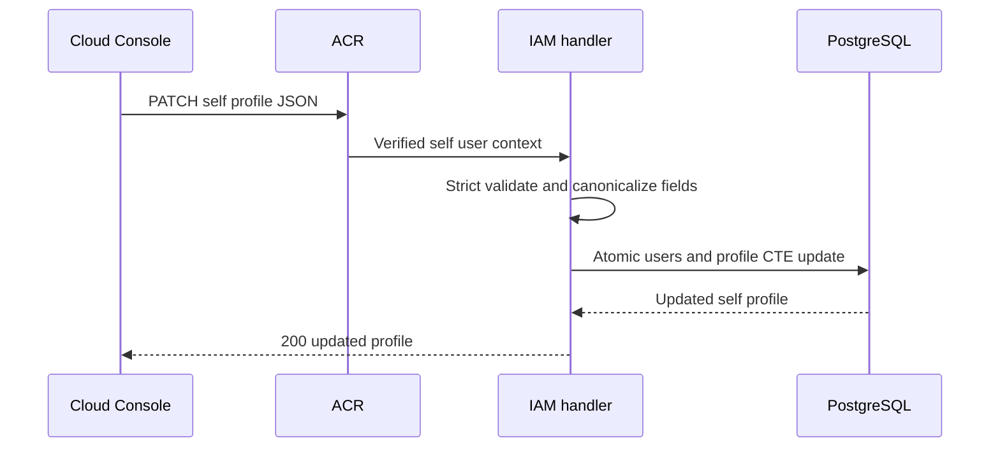

# User Profile Update — God View (Master SoT)

This workflow updates self profile presentation only. Username, account email
and password hash are immutable here; it never changes social identity, tenant,
workspace or Zone.

## Phase 1 — Validate and atomically update self profile

### REST input and output

| Part | Contract |
|---|---|
| Method/path | `PATCH /api/v1/me/iam/profile` |
| Headers used | Verified session cookies and `Content-Type: application/json` |
| Payload | `fullname`, `phone`, `address`, `avatar_url`, `bio`, `locale`, `timezone` only |
| Success | `200` with the updated self profile |
| Failure | Invalid strict JSON/value `400`; unknown user `404`; database failure `500` |

The handler accepts one bounded strict JSON object and canonicalizes fields.
The repository updates `users.phone` and `user_profiles` through one CTE
statement so neither table can become a partial profile update.

### Key contract

| Record | Store | Operation |
|---|---|---|
| `iam.users.phone` | IAM PostgreSQL | Update only the self user's optional phone |
| `iam.user_profiles` | IAM PostgreSQL | Update presentation fields in the same statement |
| Verified session user ID | ACR injected request context | Sole actor and target authority |

## Security and code map

- The client cannot name a different user ID. Social provider email never
  replaces account identifier email.
- Sources: `transport/http/handler/user_handler.go`, `service/user_service.go`,
  `repository/user_repo.go`.
