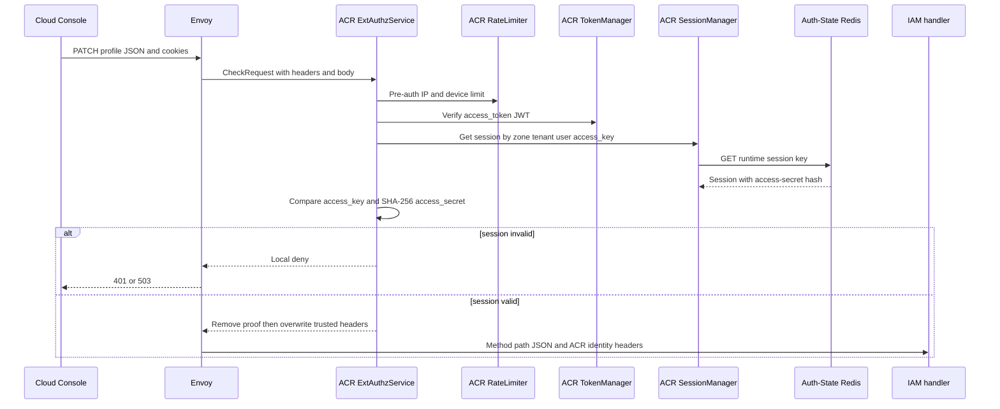
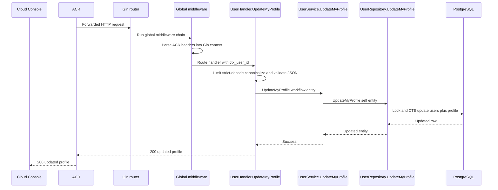

# User Profile Update — God View (Master SoT)

This workflow updates self profile presentation only. Username, account email
and password hash are immutable here; it never changes social identity, tenant,
workspace or Zone.

## API scope and edge-routing contract

This is `/me` self profile. ACR derives the sole actor/target from verified
`x-user-id`, leaves `PATCH /api/v1/me/iam/profile` unchanged and does not set
`x-original-path`. It never rewrites to `/personal` or `/tenant`. Controlplane
uses no permission/role-level `Authorize` middleware; handler/service/repository
operate only on that self ID.

## Phase 1 — ACR admits the authenticated self mutation

### REST input and output

| Part | Contract |
|---|---|
| Method/path | `PATCH /api/v1/me/iam/profile` |
| Headers used | Session cookies and `Content-Type: application/json` |
| Payload | `fullname`, `phone`, `address`, `avatar_url`, `bio`, `locale`, `timezone` only |
| Success | ACR forwards a trusted self-user request to IAM; IAM owns the REST response |
| Failure | Missing or invalid session is denied at ACR before IAM |

### Client → Envoy → ACR processing and forward

| Boundary | What it receives or does |
|---|---|
| Client → Envoy | `PATCH` path, `Content-Type`, profile JSON and browser cookies. Client-provided `x-user-*`, `x-tenant-id`, `x-zone-id` and proof headers are untrusted. |
| Envoy → ACR | ExtAuthz `CheckRequest` carries method, path, bounded body, headers and edge `X-Forwarded-For`; Envoy waits for ACR before upstream routing. |
| ACR local | Applies CORS and pre-auth rate limit; verifies JWT, `access_key`, `access_secret` and runtime session; derives claims and optional sliding-renewal cookies. Missing/invalid session returns local `401` or `503`. |
| ACR → Envoy/IAM | Preserves method, path and JSON. It removes raw proof headers, overwrites trusted headers below, and never lets the body choose the actor/target user. |

| Header ACR overwrites | Value source |
|---|---|
| `x-user-id`, `x-user-name`, `x-user-level` | Verified JWT claims |
| `x-tenant-id`, `x-zone-id` | Verified JWT claims; defaults `platform` and `global` only when absent |
| `x-client-device-id` | Verified browser device cookie, or ACR-generated UUID |
| `x-workspace-id` | Workspace cookie when present; not otherwise injected |
| `x-session-proof-verified` | ACR writes `false`; raw signature, timestamp and challenge headers are removed |

IAM receives only the ACR-overwritten identity context plus the original profile
JSON. The client cannot select a user ID or tenant-scoped target.

### Key contract

| Record | Store | Operation |
|---|---|---|
| `iam.users.phone` | IAM PostgreSQL | Update only the self user's optional phone |
| `iam.user_profiles` | IAM PostgreSQL | Update presentation fields in the same statement |
| Verified session user ID | ACR injected request context | Sole actor and target authority |

## Phase 2 — IAM validates and atomically persists profile

### REST output

| Result | Headers used | Payload |
|---|---|---|
| Success | `Content-Type: application/json` | `200` with updated self profile |
| Invalid strict JSON or value | `Content-Type: application/json` | `400` error |
| Unknown user | `Content-Type: application/json` | `404` error |
| Database failure | `Content-Type: application/json` | `500` error |

The handler accepts one bounded strict JSON object and canonicalizes fields.
The repository updates `users.phone` and `user_profiles` through one CTE
statement so neither table can become a partial profile update.

### Controlplane processing

1. Gin matches `PATCH /api/v1/me/iam/profile`; global middleware runs Recovery,
   RequestID, ContextInjector, tracing/metrics, access log and AdminXSSI.
2. ContextInjector parses ACR-overwritten identity headers into Gin context;
   `UserHandler.UpdateMyProfile` obtains only `ctx_user_id`.
3. The handler applies a 5-second budget, strict one-object JSON decoding with
   a 16 KiB body limit, canonicalizes fields and validates phone, HTTPS avatar,
   locale and timezone.
4. `UserService.UpdateMyProfile` records workflow telemetry and calls
   `UserRepository.UpdateMyProfile` without adding cross-workflow authority.
5. The repository locks the self user/profile and executes its single CTE
   update. Handler maps missing self profile to `404`, validation to `400`, and
   dependency failure to `500`.

## Security and code map

- The client cannot name a different user ID. Social provider email never
  replaces account identifier email.
- Sources: `transport/http/handler/user_handler.go`, `service/user_service.go`,
  `repository/user_repo.go`.
