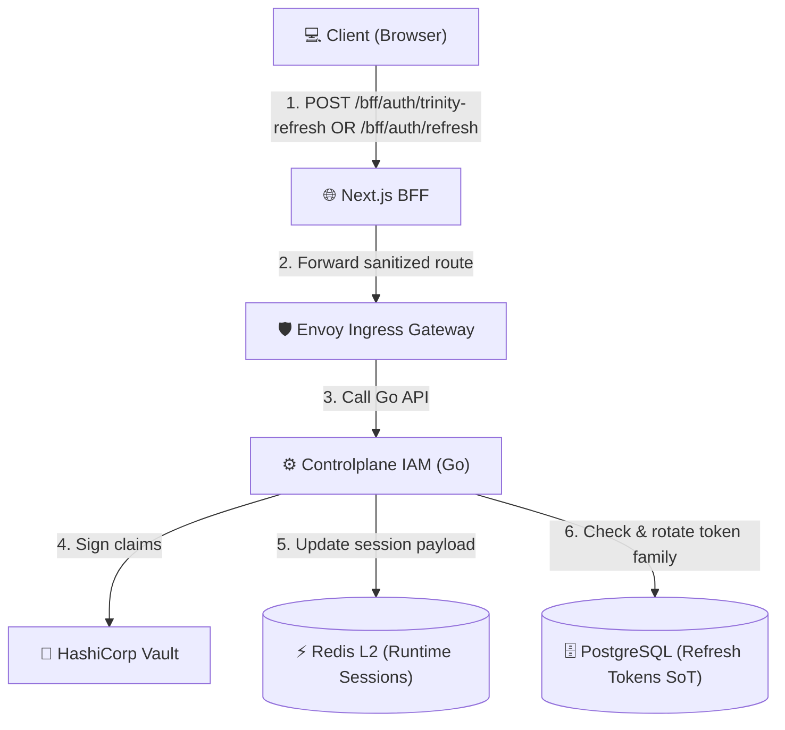
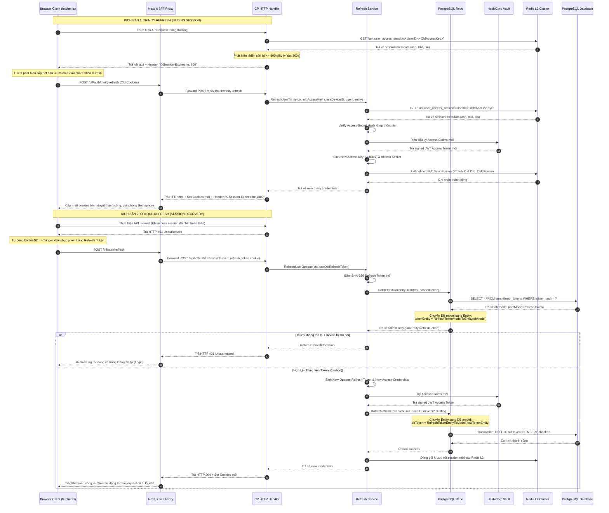

<!-- markdownlint-disable MD033 -->
# End-User Session Refresh & Sliding Session - Workflow God View

> [!NOTE]
> Tài liệu này đóng vai trò là **Source of Truth (SoT) / God View** cho luồng gia hạn và khôi phục phiên chạy (Session Refresh) của End-User.
> Mọi thay đổi về code liên quan đến luồng gia hạn/phục hồi phiên tại BFF, Frontend hoặc Controlplane phải tuân thủ nghiêm ngặt đặc tả này.

---

## 🗺️ 1. Giới Thiệu

### 👥 Tài Liệu Này Dành Cho Ai?
Tài liệu dành cho đội ngũ kỹ sư Frontend phát triển HTTP Client (fetcher), kỹ sư BFF, và Backend IAM chịu trách nhiệm về cơ chế bảo mật phiên và tối ưu trải nghiệm người dùng (UX) không bị gián đoạn.

### ❓ Phân Hệ Session Refresh là gì?
Hệ thống áp dụng mô hình quản lý phiên hai tầng (Multi-tier session renewal) để cân bằng giữa bảo mật và trải nghiệm người dùng:
1. **Kiểu 1 — Trinity Refresh (Sliding Session)**:
   - Khi người dùng đang hoạt động tích cực, nếu thời gian hết hạn của phiên hoạt động còn lại $\le 900$ giây, hệ thống sẽ thực hiện hoán đổi bộ thông tin xác thực cũ lấy bộ thông tin mới (Xoay vòng JWT, Access Key, Access Secret) để trượt cửa sổ phiên dài thêm 30 phút.
2. **Kiểu 2 — Opaque Refresh Token (Session Recovery)**:
   - Dành cho các thiết bị tin cậy (`TrustDevice = true`). Khi phiên hoạt động (Access Session) đã chết hoàn toàn (nhận HTTP 401), Client tự động dùng token đục dài hạn lưu trong cơ sở dữ liệu để phục hồi phiên hoạt động mới mà không buộc người dùng đăng nhập lại từ đầu.

### 📍 Các Biên Công Nghệ Hoạt Động
- **Frontend Cloud UI**: [fetcher.ts](file:///home/phucle/Desktop/New/cloud-ui/src/lib/api/fetcher.ts) (Kiểm soát Semaphore và tự động trigger cuộc gọi gia hạn).
- **Next.js BFF Proxy**: [route.ts](file:///home/phucle/Desktop/New/cloud-ui/src/app/bff/auth/[action]/route.ts) (Nhận cuộc gọi refresh từ browser, ẩn API endpoint của Go và đóng gói cookie).
- **Controlplane HTTP Handler**: [refresh_token_handler.go](file:///home/phucle/Desktop/New/controlplane/internal/iam/transport/http/handler/refresh_token_handler.go).
- **IAM Core Service**: `RefreshUserTrinity` và `RefreshUserOpaque` trong [session_refresh_service.go](file:///home/phucle/Desktop/New/controlplane/internal/iam/service/session_refresh_service.go).
- **Database (PostgreSQL)**: Bảng `iam.refresh_tokens` và `iam.devices`.
- **Cache Engine (Redis L2)**: Kiểm tra thông tin phiên, xoá cũ ghi mới (`iam:user_access_session:<UserID>:<AccessKey>`).

---

## 🏛️ 2. Sơ Đồ Hệ Thống & Ranh Giới Phase



### 🚧 Biên Và Ràng Buộc (Boundaries & Constraints)
- **Bắt buộc qua BFF**: Tuyệt đối không cho phép client gọi trực tiếp API Refresh đến Controlplane. BFF đóng vai trò trung gian xử lý thiết lập cookie bảo mật (`HttpOnly`, `Secure`).
- **XSSI Prefix**: Mọi API trả về từ Controlplane đều đính kèm tiền tố `)]}',\n` ngăn chặn CSRF đọc trộm dữ liệu JSON. BFF/Frontend phải stripping tiền tố này trước khi parse.

---

## 🔍 3. Chi Tiết Thực Thi Nghiệp Vụ & Ánh Xạ

### 🔄 Trực Quan Luồng Sequence Diagram



---

## 📋 4. Đặc Tả Hợp Đồng & Cơ Sở Dữ Liệu

### 1. Cookies Attribute Set-Cookie của Refresh Handler
Các cookies được BFF ghi nhận tại trình duyệt sau khi refresh thành công:
- `access_token`: JWT Token mới (HttpOnly=true, Secure=true, SameSite=Lax, Path=/).
- `refresh_token`: Opaque Refresh Token mới (HttpOnly=true, Secure=true, SameSite=Lax, Path=/).
- `access_key`: Access Key UUIDv7 mới (HttpOnly=false, Secure=true, SameSite=Lax, Path=/).
- `access_secret`: Access Secret mới (HttpOnly=true, Secure=true, SameSite=Lax, Path=/).

### 2. Service Domain Entities (`iamEntity`)
Các Entity hoạt động tại tầng nghiệp vụ logic (Service layer):

##### RefreshToken Entity
```go
type RefreshToken struct {
    ID            uuid.UUID
    UserID        uuid.UUID
    DeviceID      *uuid.UUID
    TokenHash     string
    TokenFamilyID uuid.UUID
    TenantID      *uuid.UUID
    IssuedAt      time.Time
    ExpiresAt     time.Time
}
```

##### RefreshTokenSession Entity
```go
type RefreshTokenSession struct {
	ID            uuid.UUID
	UserID        uuid.UUID
	DeviceID      *uuid.UUID
	TokenHash     string
	TokenFamilyID uuid.UUID
	TenantID      *uuid.UUID
	ExpiresAt     time.Time
}
```

### 3. Repository DB Models (`iamModel`)
Mô hình ánh xạ trực tiếp cơ sở dữ liệu PostgreSQL:

##### RefreshToken DB Model
```go
type RefreshToken struct {
    ID            uuid.UUID  `db:"id"`
    UserID        uuid.UUID  `db:"user_id"`
    DeviceID      *uuid.UUID `db:"device_id"`
    TokenHash     string     `db:"token_hash"`
    TokenFamilyID uuid.UUID  `db:"token_family_id"`
    TenantID      *uuid.UUID `db:"tenant_id"`
    IssuedAt      time.Time  `db:"issued_at"`
    ExpiresAt     time.Time  `db:"expires_at"`
}
```

### 4. Converter & Mapping Layer (Service $\leftrightarrow$ Repository)
Tại ranh giới giữa Service và Repository, hệ thống thực hiện chuyển dịch kiểu dữ liệu thông qua các hàm converter trước khi thực hiện ghi/đọc xuống/từ CSDL:

```go
func RefreshTokenEntityToModel(input iamEntity.RefreshToken) RefreshToken {
    return RefreshToken{
        ID:            input.ID,
        UserID:        input.UserID,
        DeviceID:      input.DeviceID,
        TokenHash:     input.TokenHash,
        TokenFamilyID: input.TokenFamilyID,
        TenantID:      input.TenantID,
        IssuedAt:      input.IssuedAt,
        ExpiresAt:     input.ExpiresAt,
    }
}

func RefreshTokenModelToEntity(input RefreshToken) iamEntity.RefreshToken {
    return iamEntity.RefreshToken{
        ID:            input.ID,
        UserID:        input.UserID,
        DeviceID:      input.DeviceID,
        TokenHash:     input.TokenHash,
        TokenFamilyID: input.TokenFamilyID,
        TenantID:      input.TenantID,
        IssuedAt:      input.IssuedAt,
        ExpiresAt:     input.ExpiresAt,
    }
}
```

### 5. gRPC Verification Contract (gọi nội bộ từ ACL Service)
Dưới đây là giao thức gRPC để ACL Service xác thực Opaque Refresh Token và phân giải vai trò theo Scope:

```protobuf
service AuthService {
  rpc VerifyOpaqueRefreshToken (VerifyOpaqueRefreshTokenRequest) returns (VerifyOpaqueRefreshTokenResponse);
}

message VerifyOpaqueRefreshTokenRequest {
  string refresh_token = 1;
  string scope = 2;
}

message VerifyOpaqueRefreshTokenResponse {
  bool valid = 1;
  string user_id = 2;
  string tenant_id = 3;
  string role = 4;
  int32 level = 5;
  string zone_id = 6;
  string error_message = 7;
}
```

### 5. PostgreSQL Table Schema

##### Bảng Quản Lý Phiên Refresh `iam.refresh_tokens`
```sql
CREATE TABLE IF NOT EXISTS iam.refresh_tokens (
    id UUID PRIMARY KEY DEFAULT gen_random_uuid(),
    user_id UUID NOT NULL REFERENCES iam.users(id) ON DELETE CASCADE,
    device_id UUID NOT NULL REFERENCES iam.devices(id) ON DELETE CASCADE,
    token_hash TEXT NOT NULL,             -- SHA-256 Hash của opaque refresh token
    token_family_id UUID NOT NULL,        -- Dùng để phát hiện tấn công Replay (Token reuse)
    tenant_id UUID NULL,
    issued_at TIMESTAMPTZ NOT NULL DEFAULT NOW(),
    expires_at TIMESTAMPTZ NOT NULL
);
CREATE INDEX IF NOT EXISTS idx_refresh_tokens_hash ON iam.refresh_tokens (token_hash);
```

---

## 🛡️ 5. Xử Lý Concurrency & Race Condition

### 1. Client-Side Semaphore (Chống Race Request Gia Hạn)
- **Rủi Ro**: Trên Dashboard, 5 widgets thực hiện gọi API đồng thời lúc token gần hết hạn. Cả 5 request đều nhận thấy TTL thấp và gửi yêu cầu `trinity-refresh` song song. Server sẽ xoay vòng liên tục 5 lần, làm 4 trong 5 credentials bị xoá ngay lập tức trên Redis L2, dẫn đến lỗi 401 ngẫu nhiên ở các widget sau.
- **Giải Pháp**:
  - Tầng Frontend HTTP client sử dụng một biến Promise dùng chung làm Semaphore khóa luồng:
    ```typescript
    let trinityRefreshPromise: Promise<void> | null = null;
    ```
  - Khi bắt đầu gọi gia hạn, request đầu tiên gán `trinityRefreshPromise = runRefresh()`.
  - Các request tiếp theo thấy biến này khác NULL sẽ thực hiện `await trinityRefreshPromise` mà không gửi thêm bất kỳ request nào lên server.

### 2. Phát Hiện Tấn Công Sử Dụng Lại Token Cũ (Token Reuse Detection / Replay Attack)
- **Rủi Ro**: Kẻ tấn công đánh cắp được Refresh Token cũ đã qua sử dụng và gửi yêu cầu cấp phiên mới.
- **Giải Pháp**:
  - Hệ thống áp dụng **Token Family**. Mỗi lần Opaque Refresh thành công, token cũ bị xoá và một token mới được sinh ra cùng một `token_family_id`.
  - Nếu server nhận được yêu cầu refresh bằng một token cũ đã bị xoá khỏi DB nhưng Family của nó vẫn còn hoạt động $\rightarrow$ Xác nhận bị rò rỉ hoặc tấn công Replay.
  - Hành động xử lý tức thời: Thu hồi (`Revoke`) lập tức toàn bộ các Refresh Tokens cùng nhóm Family ID đó, buộc tất cả các phiên chạy trên thiết bị liên quan đăng xuất lập tức, triệt tiêu nguy cơ chiếm đoạt phiên.

---

## 📊 6. Giám Sát Và Truy Vết - Grafana Runbook

### 1. Prometheus Metrics Cảnh Báo

- **Service Outcomes**: `iam_service_calls_total{op="refresh_user_opaque" | "refresh_user_trinity", outcome}`
- **PostgreSQL Rotate Latency**: `iam_downstream_call_duration_seconds{op="refresh_user_opaque", kind="repo", destination="RotateRefreshToken"}`

#### 📈 PromQL Cần Thiết
##### A. Tần suất xoay vòng sliding session (Trinity Refresh):
```promql
sum(rate(iam_service_calls_total{op="refresh_user_trinity"}[5m]))
```

##### B. Phát hiện lỗi tấn công sử dụng lại token (Token Reuse / Potential Attack):
```promql
sum(rate(iam_service_calls_total{op="refresh_user_opaque", outcome="invalid_session"}[5m]))
```

### 2. LogsQL (VictoriaLogs) Giám Sát

##### Tìm kiếm các trường hợp thu hồi toàn bộ token family do nghi ngờ replay:
```logsql
"token reuse detected" OR "revoking token family" level="warn"
```

---
*Tài liệu kết thúc.*
<!-- markdownlint-enable MD033 -->
