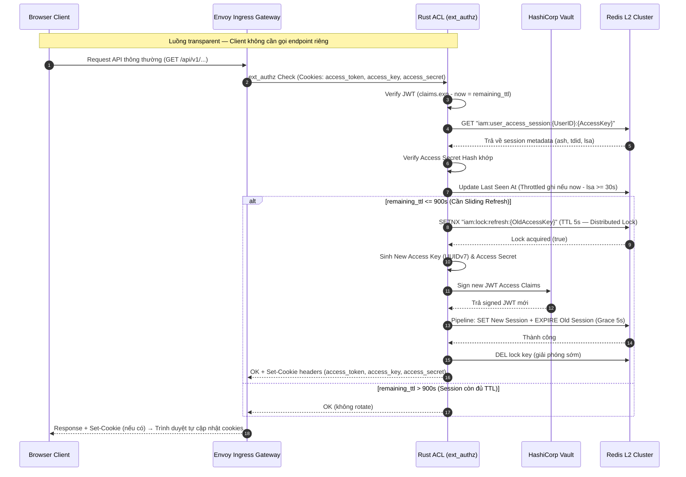
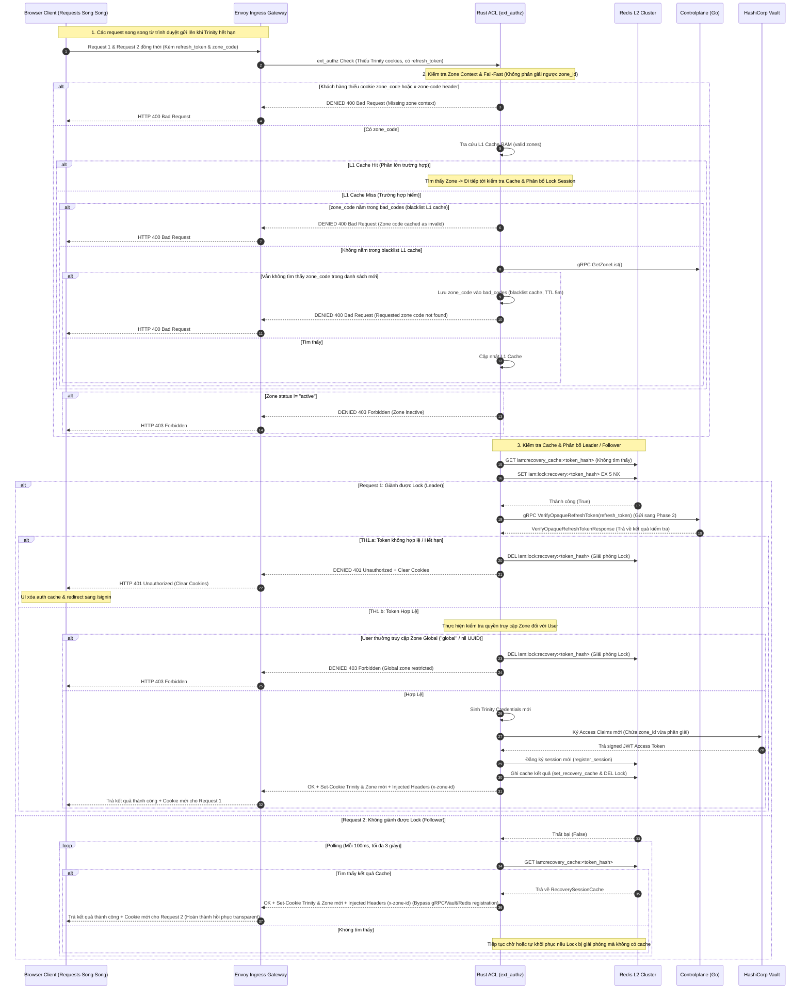
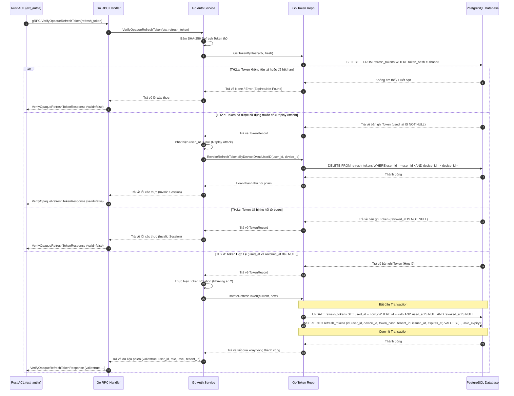

<!-- markdownlint-disable MD033 -->
# End-User Session Refresh & Sliding Session - Workflow God View

> [!NOTE]
> Tài liệu này đóng vai trò là **Source of Truth (SoT) / God View** cho luồng gia hạn và khôi phục phiên chạy (Session Refresh) của End-User.
> Mọi thay đổi về code liên quan đến luồng gia hạn/phục hồi phiên tại Frontend hoặc Controlplane phải tuân thủ nghiêm ngặt đặc tả này.

---

## 🗺️ 1. Giới Thiệu

### 👥 Tài Liệu Này Dành Cho Ai?

Tài liệu dành cho đội ngũ kỹ sư Frontend phát triển HTTP Client (fetcher), và Backend IAM chịu trách nhiệm về cơ chế bảo mật phiên và tối ưu trải nghiệm người dùng (UX) không bị gián đoạn.

### ❓ Phân Hệ Session Refresh là gì?

Hệ thống áp dụng mô hình quản lý phiên hai tầng (Multi-tier session renewal) để cân bằng giữa bảo mật và trải nghiệm người dùng:

1. **Kiểu 1 — Trinity Refresh (Sliding Session)**:
   - Khi người dùng đang hoạt động tích cực, nếu thời gian hết hạn của phiên hoạt động còn lại $\le 900$ giây, hệ thống sẽ thực hiện hoán đổi bộ thông tin xác thực cũ lấy bộ thông tin mới (Xoay vòng JWT, Access Key, Access Secret) để trượt cửa sổ phiên dài thêm 30 phút.
2. **Kiểu 2 — Opaque Refresh Token (Session Recovery)**:
   - Dành cho các thiết bị tin cậy (`TrustDevice = true`). Khi phiên hoạt động (Access Session) đã chết hoàn toàn (nhận HTTP 401), Client tự động dùng token đục dài hạn lưu trong cơ sở dữ liệu để phục hồi phiên hoạt động mới mà không buộc người dùng đăng nhập lại từ đầu.

### 🌐 Sơ đồ Kiến trúc Tổng quan (System Architecture)

Sơ đồ dưới đây mô tả cấu trúc các thành phần tham gia vào luồng Refresh và cách chúng tương tác qua các kết nối đồng bộ (đường nét liền) và bất đồng bộ/tuần tự (đường nét đứt):

```mermaid
graph TD
    classDef client fill:#332244,stroke:#8844ff,stroke-width:2px;
    classDef gateway fill:#112233,stroke:#3388ff,stroke-width:2px;
    classDef edgeService fill:#113322,stroke:#33cc88,stroke-width:2px;
    classDef storage fill:#333311,stroke:#cccc33,stroke-width:2px;
    classDef control fill:#331111,stroke:#ff5555,stroke-width:2px;

    Client["💻 Client (Browser)"]:::client
    Envoy["🛡️ Envoy Ingress Gateway"]:::gateway
    ACL["🦀 Rust ACL (ext_authz)"]:::edgeService
    CP["⚙️ Controlplane IAM (Go)"]:::control
    Vault["🔑 HashiCorp Vault"]:::control
    Redis[("⚡ Redis L2 (Runtime Sessions)")]:::storage
    DB[("🗄️ PostgreSQL (Refresh Tokens SoT)")]:::storage

    Client -- "1. Request bất kỳ" --> Envoy
    Envoy -- "2. ext_authz check" --> ACL
    ACL -- "3a. Verify JWT & Session" --> Redis
    ACL -- "3b. TTL thấp → Sign JWT mới" --> Vault
    ACL -- "3c. Rotate session (SETNX lock)" --> Redis
    ACL -. "3d. Verify Opaque Token (gRPC)" .-> CP
    ACL -- "4. OK + Set-Cookie (nếu rotate/recover)" --> Envoy
    Envoy -- "5. Forward to upstream" --> CP
    Client -- "6. POST /api/v1/auth/refresh (khi 401)" --> Envoy
    Envoy -- "7. Bypass ext_authz" --> CP
    CP -- "8. Rotate Token (Mark Used & INSERT)" --> DB
```



### 🔑 Mô hình Token (Trinity Credentials)

Chi tiết cấu trúc, vai trò và hành vi của các thông tin xác thực/cookies khi thực hiện quá trình gia hạn phiên:

| Tên Token/Cookie | Loại/Định dạng | Nơi Lưu Trữ Gốc (Server) | Hành động khi Refresh | Mô tả & Vai trò |
| :--- | :--- | :--- | :--- | :--- |
| **`access_token`** | JWT (Vault signed) | Không lưu (Verify stateless) | **Xoay vòng** (Cấp JWT mới khi refresh thành công) | Chứa các định danh claims (`sub`, `role`, `lvl`, `tenant_id`, `zone_id`) và `access_key`. |
| **`access_key`** | UUIDv7 (Plain) | **Redis L2** (Làm khóa phiên) | **Xoay vòng** (Thay thế khóa phiên cũ trên L2 và cập nhật cookie) | Định danh phiên làm việc, dùng để đối chiếu trực tiếp dữ liệu phiên runtime tại lớp L2 Redis. |
| **`access_secret`** | Secure Random String (Plain) | **Redis L2** (Lưu băm `ash`) | **Xoay vòng** (Thay thế khóa bí mật cũ trên L2 và cập nhật cookie) | Khóa bí mật thô giúp client/Envoy kiểm tra tính toàn vẹn phiên làm việc nhanh chóng. |
| **`refresh_token`** | Opaque String | **PostgreSQL** (Lưu băm SHA-256) | **Xoay vòng** (Mark used & INSERT mới với old expiry - Kiểu 2) | Token dài hạn dùng để phục hồi phiên Access Session mới khi phiên cũ đã hết hạn. |
| **`client_device_id`** | UUID (Plain) | **PostgreSQL** | **GIỮ NGUYÊN** (Không thay đổi) | Định danh duy nhất của thiết bị phục vụ kiểm tra bảo mật và liên kết session. |

### 🗃️ Các Khóa Lưu Trữ & Bộ Nhớ Được Tương Tác (Storage & Cache Keys Registry)

Dưới đây là toàn bộ các khóa lưu trữ tại mọi phân tầng (L1 Cookies, L2 Redis Cache, DB PostgreSQL) mà luồng Refresh này trực tiếp tương tác và xử lý:

| Phân Tầng Lưu Trữ | Tên Khóa / Bảng | Kiểu Dữ Liệu | Hành Động Xử Lý | Chi Tiết & Vai Trò |
| :--- | :--- | :--- | :--- | :--- |
| **L1: Browser Cookies** | `access_token` | HTTP Cookie (JWT) | **Xoay vòng** (Cập nhật mới) | Xoá/Cấp mới cookie token truy cập tại client trình duyệt khi hết hạn/gia hạn. |
| **L1: Browser Cookies** | `access_key` | HTTP Cookie (UUIDv7) | **Xoay vòng** (Cập nhật mới) | Xoá/Cấp mới cookie khóa truy cập dùng để tra cứu phiên tại L2. |
| **L1: Browser Cookies** | `access_secret` | HTTP Cookie (String) | **Xoay vòng** (Cập nhật mới) | Xoá/Cấp mới cookie secret dùng để xác thực và mã hóa phiên. |
| **L1: Browser Cookies** | `refresh_token` | HTTP Cookie (Opaque) | **Xoay vòng** (Chỉ ở Kiểu 2) | Xoá/Cấp mới cookie refresh_token khi xoay vòng token trên DB. |
| **L1: Browser Cookies** | `client_device_id` | HTTP Cookie (UUID) | **GIỮ NGUYÊN** (Không thay đổi) | Giữ nguyên định danh thiết bị để phục vụ kiểm tra bảo mật và lưu vết thiết bị. |
| **L2: Redis Cache** | `iam:user_access_session:<UserID>:<AccessKey>` | String (Protobuf) | **Gia hạn / Chuyển tiếp** | Tạo session key mới (TTL 30 phút), session key cũ giảm TTL xuống 5 giây (Grace Period - hardcoded). |
| **L2: Redis Cache** | `iam:user_access_index:<UserID>` | Set | **Cập nhật tập hợp (SADD & SREM)** | Thêm `AccessKey` mới và loại bỏ `AccessKey` cũ khỏi danh sách quản lý phiên của người dùng. |
| **L2: Redis Cache** | `iam:lock:refresh:<OldAccessKey>` | String | **Khóa phân tán (SET NX EX / DEL)** | Tạo khóa Mutex Lock tồn tại 5s để chống race condition khi nhiều widget gọi refresh đồng thời. |
| **DB: PostgreSQL** | Bảng `iam.refresh_tokens` | Hàng dữ liệu (Row) | **Token Rotation (Mark used & INSERT)** | Đánh dấu token cũ là used_at = now() và tạo token mới với old_expiry kế thừa thời hạn tuyệt đối. |

### 🚧 Biên Và Ràng Buộc (Boundaries & Constraints)

- **Bảo mật và Định tuyến**: Luồng Sliding Session (Kiểu 1) được xử lý transparent tại Rust ACL (`ext_authz`) trên Envoy Gateway — Client không cần gọi endpoint riêng. Luồng Session Recovery (Kiểu 2) gọi trực tiếp `/api/v1/auth/refresh` qua Envoy. Envoy Gateway chuyển tiếp nguyên trạng HTTP Headers (bao gồm `Set-Cookie`) giữa client và backend.
- **XSSI Prefix**: Mọi API trả về từ Controlplane đều đính kèm tiền tố `)]}',\n` ngăn chặn CSRF đọc trộm dữ liệu JSON. Frontend Client (fetcher) phải tự động stripping tiền tố này trước khi parse JSON.

---

## 🏛️ 2. Chi Tiết Thực Thi Nghiệp Vụ & Sơ Đồ Trình Tự

Quy trình Refresh được chia thành hai nhánh độc lập tùy thuộc vào điều kiện trạng thái phiên làm việc hiện tại của Client:

### Sơ đồ nhánh 1 — Transparent Trinity Refresh (Sliding Session tại ACL)

Áp dụng tự động khi phiên làm việc hiện tại vẫn còn hiệu lực nhưng chuẩn bị hết hạn (thời gian còn lại $\le 900$ giây). Rust ACL (ext_authz) tự động phát hiện JWT sắp hết hạn, xoay vòng Trinity Credentials và inject `Set-Cookie` header vào phản hồi Envoy để trình duyệt tự động cập nhật cookies mà Client hoàn toàn không cần quan tâm.

**Các file mã nguồn liên quan (Code References):**

- [acl/src/service/rotate.rs](../../acl/src/service/rotate.rs): Hàm `handle_session_rotation` phát hiện JWT TTL thấp, sinh bộ trinity mới và inject Set-Cookie.
- [acl/src/service/ext_authz.rs](../../acl/src/service/ext_authz.rs): Hàm `check` gọi `handle_session_rotation` sau khi xác thực thành công.
- [acl/src/core/session.rs](../../acl/src/core/session.rs): Hàm `try_rotate_session` thực hiện xoay vòng Redis L2 có bảo vệ bằng Distributed Lock (SETNX).



---

### Sơ đồ nhánh 2 — Opaque Refresh Token (Session Recovery tại ext_authz với Redis Distributed Lock/Cache)

Áp dụng tự động khi phiên làm việc hiện tại (Trinity Credentials) không hợp lệ hoặc đã hết hạn, nhưng Client vẫn giữ `refresh_token` cookie hợp lệ. Khi đó, Envoy chuyển tiếp yêu cầu xác thực đến Rust ACL (ext_authz).

Để bảo vệ hệ thống và đảm bảo ngữ cảnh nhất quán, **Client bắt buộc phải cung cấp thông tin zone_code** (qua cookie `zone_code` hoặc custom header `x-zone-code` / `X-Zone-Code`). Hệ thống chỉ phân giải từ `zone_code` ra `zone_id`, không hỗ trợ phân giải ngược từ header `x-zone-id` do client gửi lên. Nếu không cung cấp `zone_code` hợp lệ, ACL từ chối ngay lập tức (400 Bad Request).

Để chống hiện tượng **Thundering Herd** (nhiều requests đồng thời từ client kích hoạt hàng loạt cuộc gọi gRPC và truy vấn DB song song gây tải cho hệ thống - Blood Request) cũng như chống spam các zone code không tồn tại, ACL kết hợp cơ chế **Distributed Singleflight** qua Redis L2 và **Negative Caching (bad_codes)** tại L1:

1. **Kiểm tra và Phân giải Zone (Fail-Fast)**: ACL trích xuất `zone_code` từ request. Nếu thiếu, trả lỗi 400 Bad Request ngay.
   - Nếu `zone_code` nằm trong danh sách đen `bad_codes` (blacklist cache trong RAM L1), từ chối ngay lập tức bằng 400 Bad Request mà không gọi gRPC/CP.
   - Nếu miss L1 cache, ACL thực hiện Single-Flight gọi gRPC `GetZoneList` sang Controlplane để cập nhật danh sách zone.
   - Nếu sau khi gọi gRPC vẫn không tìm thấy, `zone_code` đó được đưa vào cache `bad_codes` (blacklist với TTL 5 phút) để chặn spam ở các request sau.
   - Nếu tìm thấy, kiểm tra trạng thái hoạt động (active). Nếu status != "active", trả lỗi 403 Forbidden.
2. **Kiểm tra Cache**: ACL kiểm tra cache kết quả hồi phục `iam:recovery_cache:<token_hash>` trong Redis L2. Nếu có (cache hit), trả về ngay bộ Trinity Credentials mới đã được ký gắn liền với `zone_id` đã phân giải.
3. **Chiếm Lock**: Nếu chưa có, ACL thử chiếm lock phân tán `iam:lock:recovery:<token_hash>` (TTL 5s).
   - **Leader (giành được lock)**: Thực hiện cuộc gọi gRPC `VerifyOpaqueRefreshToken` sang Controlplane (gRPC không còn trả về `zone_id`), kiểm tra phân quyền nâng cao (ví dụ: cấm user thường vào zone global), ký JWT mới có chứa `zone_id` đã phân giải qua Vault, đăng ký session mới trong Redis, lưu kết quả vào `iam:recovery_cache:<token_hash>` (TTL 5s) và giải phóng lock.
   - **Follower (không giành được lock)**: Polling Redis cache `iam:recovery_cache:<token_hash>` mỗi 100ms (tối đa 3 giây) cho đến khi leader ghi kết quả thành công thì lấy ra sử dụng.

**Các file mã nguồn liên quan (Code References):**

- [acl/src/service/ext_authz.rs](../../acl/src/service/ext_authz.rs): Hàm `check` bắt lỗi xác thực Trinity, gọi hoặc chuyển giao tiếp nhận cho module recovery.
- [acl/src/service/recovery_session.rs](../../acl/src/service/recovery_session.rs): Module chính thực hiện kiểm tra sự tồn tại của `zone_code`, phân giải zone, điều phối phân tán singleflight, gRPC client và Vault signing.
- [acl/src/core/session.rs](../../acl/src/core/session.rs): Các hàm thao tác Redis L2 (cache, try_lock_recovery, is_recovery_locked, release_recovery_lock).
- [controlplane/internal/iam/transport/rpc/handler/auth.go](../../controlplane/internal/iam/transport/rpc/handler/auth.go): Handler gRPC tiếp nhận `VerifyOpaqueRefreshToken` và gọi Service để kiểm tra token.
- [controlplane/internal/iam/service/session_refresh_service.go](../../controlplane/internal/iam/service/session_refresh_service.go): Hàm core `VerifyOpaqueRefreshToken` thực hiện băm và đối chiếu trạng thái token trong PostgreSQL.

#### Sơ đồ Phase 1 — Ingress Auth Gate & Distributed Singleflight (Xử lý tại Rust ACL)



#### Sơ đồ Phase 2 — Core Opaque Verification & Token Rotation (Xử lý tại Go Controlplane)



---

### 🌐 Chi tiết Phân giải & Chuyển đổi Ngữ cảnh Zone (Zone Context & Switch Workflow)

Toàn bộ quy trình phân giải Zone, các ràng buộc bảo mật đối với người dùng (không cho phép user thường truy cập zone global hay zone inactive), và cơ chế chuyển đổi ngữ cảnh Zone tường minh (Explicit Zone Switch via `/api/v1/zone/go-to-zone`) được mô tả chi tiết tại:

👉 [Tài liệu Thiết kế Zone Context & Switch Workflow](user_zone_context_god_view_workflow.md)

---

## 📊 3. Giám Sát Và Truy Vết (Observability & Distributed Tracing)

Hệ thống hoạt động trên môi trường Cloud-Native và High Availability (HA), yêu cầu giám sát toàn diện thông qua 3 trụ cột Observability: Tracing (OpenTelemetry), Metrics (Prometheus) và Structured Logs (VictoriaLogs/Loki).

### 1. Truy Vết Phân Tán (OpenTelemetry Distributed Tracing)

Mọi request đi qua API Gateway đều được gắn một mã định danh duy nhất (`Trace ID`) thông qua tiêu chuẩn **W3C Trace Context** (`traceparent`). Mã này được truyền tải xuyên suốt các dịch vụ:
`UI (Browser) -> Envoy -> Rust ACL (ext_authz) -> Go Controlplane (VerifyOpaqueRefreshToken) -> CSDL (PostgreSQL/Redis)`.

#### A. Thuộc tính Trace (Span Attributes) chuẩn hóa cho IAM

Để phục vụ điều tra và phân tích hành vi, các Spans liên quan đến phiên làm việc bắt buộc phải được đính kèm các thuộc tính:

- `iam.user.id`: UUID của người dùng.
- `iam.device.id`: UUID của thiết bị (TDID).
- `iam.tenant.id`: UUID của Tenant (nếu có).
- `iam.session.access_key`: Key tra cứu session trong Redis L2.
- `iam.token.id`: ID định danh phiên Refresh Token trong DB.
- `iam.auth.outcome`: Kết quả xác thực (`success`, `invalid_token`, `session_expired`, `internal_error`).

#### B. Ánh xạ Trace ID vào Log

Trong Rust ACL (`logger.rs`) và Go Controlplane, Trace ID luôn được trích xuất từ Context hiện tại và ghi trực tiếp vào cấu trúc Log JSON:

```json
{
  "timestamp": "2026-06-23T05:12:00Z",
  "level": "info",
  "trace_id": "8a3f9d2c1e4b8f0a3c2d1e0f9a8b7c6d",
  "service": "aurora-acl",
  "message": "Transparent session recovery successful for user_id=d3b07384-d113-4c91-9e59-00f723821033",
  "iam": {
    "user_id": "d3b07384-d113-4c91-9e59-00f723821033",
    "device_id": "f5a04384-213c-4a34-a4f2-10f723828941"
  }
}
```

---

### 2. Chỉ Số Giám Sát (Prometheus Metrics & Dashboard)

Hệ thống theo dõi các chỉ số quan trọng (Golden Signals) để đưa ra cảnh báo sớm về hiệu năng và bảo mật.

#### A. Các chỉ số Prometheus chính

- `iam_auth_requests_total{type="trinity"|"opaque", outcome="success"|"failed"|"error"}`: Tổng số lượt xác thực phân loại theo Trinity Credentials hoặc Opaque Refresh Token.
- `iam_grpc_client_duration_seconds`: Thời gian phản hồi gRPC từ ACL sang Go Controlplane (VerifyOpaqueRefreshToken).
- `iam_redis_operation_duration_seconds{op="get_session"|"register_session"}`: Độ trễ thao tác đọc/ghi trên Redis L2.
- `iam_vault_sign_duration_seconds`: Độ trễ ký khóa JWT tại HashiCorp Vault.

#### B. PromQL Dashboard & Alerting Rules (Sử dụng cho Grafana Alert)

##### 🚨 Cảnh báo Tỷ Lệ Lỗi Hệ Thống Lớn (Infrastructure Failure Rate > 1%)

Cảnh báo kích hoạt nếu các lỗi hạ tầng (Vault/Redis chết) chiếm hơn 1% tổng request trong 2 phút liên tiếp:

```promql
sum(rate(iam_auth_requests_total{outcome="error"}[2m])) 
/ 
sum(rate(iam_auth_requests_total[2m])) * 100 > 1
```

##### 🚨 Cảnh báo Phát Hiện Tấn Công Sử Dụng Lại Token (Opaque Token Reuse Detection)

Số lượng token cũ được gửi lên bất thường chỉ thị nguy cơ bị rò rỉ và replay token:

```promql
sum(rate(iam_auth_requests_total{type="opaque", outcome="token_reuse_detected"}[5m])) > 0
```

##### 🚨 Cảnh Báo Độ Trễ gRPC Verify Opaque Token Quá Cao (p99 > 200ms)

Gây nghẽn tại Gateway do Controlplane phản hồi chậm hoặc DB PostgreSQL quá tải:

```promql
histogram_quantile(0.99, sum(rate(iam_grpc_client_duration_seconds_bucket{op="VerifyOpaqueRefreshToken"}[5m])) by (le)) > 0.200
```

---

### 3. Truy Vấn Nhật Ký Cấu Trúc (LogQL / VictoriaLogs Runbook)

Dùng để truy vết sự cố nhanh khi xảy ra lỗi trên môi trường phân tán HA.

##### A. Truy vết vòng đời của một Session (End-to-End Trace) qua Trace ID

Khi một API của người dùng bị lỗi, copy `trace_id` nhận được từ Header response và thực hiện câu truy vấn:

```logsql
trace_id: "8a3f9d2c1e4b8f0a3c2d1e0f9a8b7c6d"
```

##### B. Phát hiện các cuộc gọi Opaque Refresh thất bại liên tục từ cùng 1 IP (Nguy cơ brute force / dò quét token)

```logsql
"ext_authz.recovery_session" AND "invalid" | "denied"
| stats count() by client_ip
| filter count > 20
```

##### C. Thống kê lỗi hệ thống hạ tầng (Vault / Redis không phản hồi)

```logsql
"ext_authz.recovery_session" AND "Failed to" AND "Vault" OR "Redis"
```

---
*Tài liệu kết thúc.*
<!-- markdownlint-enable MD033 -->
