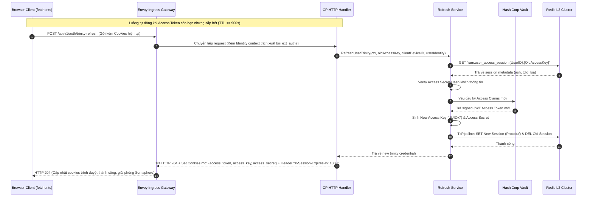
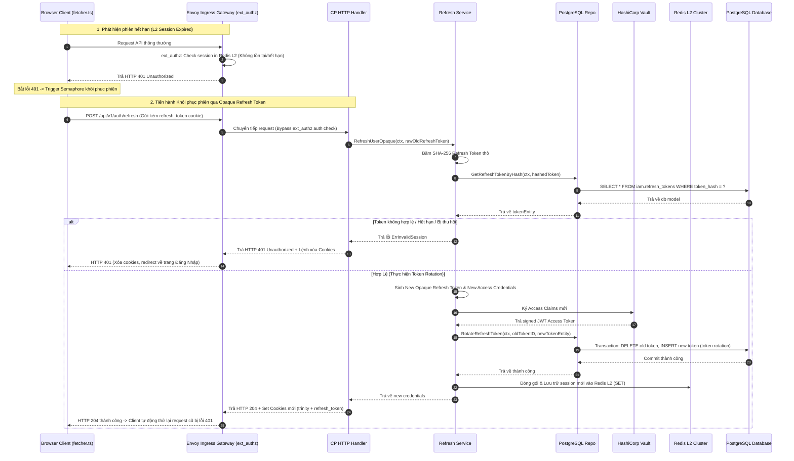

<!-- markdownlint-disable MD033 -->
# End-User Session Refresh & Sliding Session - Workflow God View

> [!NOTE]
> Tài liệu này đóng vai trò là **Source of Truth (SoT) / God View** cho luồng gia hạn và khôi phục phiên chạy (Session Refresh) của End-User.
> Mọi thay đổi về code liên quan đến luồng gia hạn/phục hồi phiên tại Frontend hoặc Controlplane phải tuân thủ nghiêm ngặt đặc tả này.

---

## 🗺️ 1. Giới Thiệu

### 👥 Tài Liệu Này Dành Cho Ai?

Tài liệu dành cho đội ngũ kỹ sư Frontend phát triển HTTP Client (fetcher), và Backend IAM chịu trách nhiệm về cơ chế bảo mật phiên và tối ưu trải nghiệm người dùng (UX) không bị gián đoạn.

### ❓ Phân Hệ Session Refresh là gì?

Hệ thống áp dụng mô hình quản lý phiên hai tầng (Multi-tier session renewal) để cân bằng giữa bảo mật và trải nghiệm người dùng:

1. **Kiểu 1 — Trinity Refresh (Sliding Session)**:
   - Khi người dùng đang hoạt động tích cực, nếu thời gian hết hạn của phiên hoạt động còn lại $\le 900$ giây, hệ thống sẽ thực hiện hoán đổi bộ thông tin xác thực cũ lấy bộ thông tin mới (Xoay vòng JWT, Access Key, Access Secret) để trượt cửa sổ phiên dài thêm 30 phút.
2. **Kiểu 2 — Opaque Refresh Token (Session Recovery)**:
   - Dành cho các thiết bị tin cậy (`TrustDevice = true`). Khi phiên hoạt động (Access Session) đã chết hoàn toàn (nhận HTTP 401), Client tự động dùng token đục dài hạn lưu trong cơ sở dữ liệu để phục hồi phiên hoạt động mới mà không buộc người dùng đăng nhập lại từ đầu.

### 🌐 Sơ đồ Kiến trúc Tổng quan (System Architecture)

Sơ đồ dưới đây mô tả cấu trúc các thành phần tham gia vào luồng Refresh và cách chúng tương tác qua các kết nối đồng bộ (đường nét liền) và bất đồng bộ/tuần tự (đường nét đứt):

```mermaid
graph TD
    classDef client fill:#332244,stroke:#8844ff,stroke-width:2px;
    classDef gateway fill:#112233,stroke:#3388ff,stroke-width:2px;
    classDef edgeService fill:#113322,stroke:#33cc88,stroke-width:2px;
    classDef storage fill:#333311,stroke:#cccc33,stroke-width:2px;
    classDef control fill:#331111,stroke:#ff5555,stroke-width:2px;

    Client["💻 Client (Browser)"]:::client
    Envoy["🛡️ Envoy Ingress Gateway"]:::gateway
    CP["⚙️ Controlplane IAM (Go)"]:::control
    Vault["🔑 HashiCorp Vault"]:::control
    Redis[("⚡ Redis L2 (Runtime Sessions)")]:::storage
    DB[("🗄️ PostgreSQL (Refresh Tokens SoT)")]:::storage

    Client -- "1. POST /api/v1/auth/trinity-refresh OR /api/v1/auth/refresh" --> Envoy
    Envoy -- "2. Check & route" --> CP
    CP -- "3. Sign claims" --> Vault
    CP -- "4. Update session payload (SET/DEL)" --> Redis
    CP -- "5. Check & rotate token family (SQL)" --> DB
```



### 🔑 Mô hình Token (Trinity Credentials)

Chi tiết cấu trúc, vai trò và hành vi của các thông tin xác thực/cookies khi thực hiện quá trình gia hạn phiên:

| Tên Token/Cookie | Loại/Định dạng | Nơi Lưu Trữ Gốc (Server) | Hành động khi Refresh | Mô tả & Vai trò |
| :--- | :--- | :--- | :--- | :--- |
| **`access_token`** | JWT (Vault signed) | Không lưu (Verify stateless) | **Xoay vòng** (Cấp JWT mới khi refresh thành công) | Chứa các định danh claims (`sub`, `role`, `lvl`, `tenant_id`, `zone_id`) và `access_key`. |
| **`access_key`** | UUIDv7 (Plain) | **Redis L2** (Làm khóa phiên) | **Xoay vòng** (Thay thế khóa phiên cũ trên L2 và cập nhật cookie) | Định danh phiên làm việc, dùng để đối chiếu trực tiếp dữ liệu phiên runtime tại lớp L2 Redis. |
| **`access_secret`** | Secure Random String (Plain) | **Redis L2** (Lưu băm `ash`) | **Xoay vòng** (Thay thế khóa bí mật cũ trên L2 và cập nhật cookie) | Khóa bí mật thô giúp client/Envoy kiểm tra tính toàn vẹn phiên làm việc nhanh chóng. |
| **`refresh_token`** | Opaque String | **PostgreSQL** (Lưu băm SHA-256) | **Xoay vòng** (Hủy token cũ, tạo token mới cùng family_id - chỉ áp dụng với Kiểu 2) | Token dài hạn dùng để phục hồi phiên Access Session mới khi phiên cũ đã hết hạn. |
| **`client_device_id`** | UUID (Plain) | **PostgreSQL** | **GIỮ NGUYÊN** (Không thay đổi) | Định danh duy nhất của thiết bị phục vụ kiểm tra bảo mật và Token Family. |

### 🗃️ Các Khóa Lưu Trữ & Bộ Nhớ Được Tương Tác (Storage & Cache Keys Registry)

Dưới đây là toàn bộ các khóa lưu trữ tại mọi phân tầng (L1 Cookies, L2 Redis Cache, DB PostgreSQL) mà luồng Refresh này trực tiếp tương tác và xử lý:

| Phân Tầng Lưu Trữ | Tên Khóa / Bảng | Kiểu Dữ Liệu | Hành Động Xử Lý | Chi Tiết & Vai Trò |
| :--- | :--- | :--- | :--- | :--- |
| **L1: Browser Cookies** | `access_token` | HTTP Cookie (JWT) | **Xoay vòng** (Cập nhật mới) | Xoá/Cấp mới cookie token truy cập tại client trình duyệt khi hết hạn/gia hạn. |
| **L1: Browser Cookies** | `access_key` | HTTP Cookie (UUIDv7) | **Xoay vòng** (Cập nhật mới) | Xoá/Cấp mới cookie khóa truy cập dùng để tra cứu phiên tại L2. |
| **L1: Browser Cookies** | `access_secret` | HTTP Cookie (String) | **Xoay vòng** (Cập nhật mới) | Xoá/Cấp mới cookie secret dùng để xác thực và mã hóa phiên. |
| **L1: Browser Cookies** | `refresh_token` | HTTP Cookie (Opaque) | **Xoay vòng** (Chỉ ở Kiểu 2) | Xoá/Cấp mới cookie token gia hạn phiên dài hạn thông qua Token Family Rotation. |
| **L1: Browser Cookies** | `client_device_id` | HTTP Cookie (UUID) | **GIỮ NGUYÊN** (Không thay đổi) | Giữ nguyên định danh thiết bị để phục vụ kiểm tra Token Family và lưu vết thiết bị. |
| **L2: Redis Cache** | `iam:user_access_session:<UserID>:<AccessKey>` | String (Protobuf) | **Gia hạn / Chuyển tiếp** | Tạo session key mới (TTL 30 phút), session key cũ giảm TTL xuống 15 giây (Grace Period). |
| **L2: Redis Cache** | `iam:user_access_index:<UserID>` | Set | **Cập nhật tập hợp (SADD & SREM)** | Thêm `AccessKey` mới và loại bỏ `AccessKey` cũ khỏi danh sách quản lý phiên của người dùng. |
| **L2: Redis Cache** | `iam:lock:refresh:<OldAccessKey>` | String | **Khóa phân tán (SET NX EX / DEL)** | Tạo khóa Mutex Lock tồn tại 5s để chống race condition khi nhiều widget gọi refresh đồng thời. |
| **DB: PostgreSQL** | Bảng `iam.refresh_tokens` | Hàng dữ liệu (Row) | **Token Rotation (DELETE & INSERT)** | Thu hồi token cũ và lưu token mới có cùng `token_family_id` (Chỉ xảy ra ở Kiểu 2). |

### 🚧 Biên Và Ràng Buộc (Boundaries & Constraints)

- **Bảo mật và Định tuyến**: Client (Browser) gọi trực tiếp đến API Gateway (Envoy) tại các endpoint `/api/v1/auth/trinity-refresh` và `/api/v1/auth/refresh`. Việc loại bỏ trung gian BFF giúp tối ưu độ trễ (hop mạng) và giảm tải CPU. Envoy Gateway chuyển tiếp nguyên trạng HTTP Headers (bao gồm `Set-Cookie`) giữa client và backend.
- **XSSI Prefix**: Mọi API trả về từ Controlplane đều đính kèm tiền tố `)]}',\n` ngăn chặn CSRF đọc trộm dữ liệu JSON. Frontend Client (fetcher) phải tự động stripping tiền tố này trước khi parse JSON.

---

## 🏛️ 2. Chi Tiết Thực Thi Nghiệp Vụ & Sơ Đồ Trình Tự

Quy trình Refresh được chia thành hai nhánh độc lập tùy thuộc vào điều kiện trạng thái phiên làm việc hiện tại của Client:

### Sơ đồ 1: Kiểu 1 — Trinity Refresh (Sliding Session)

Áp dụng khi phiên làm việc hiện tại vẫn còn hiệu lực (chưa bị hết hạn) nhưng chuẩn bị hết hạn (thời gian còn lại $\le 900$ giây). Client UI và Control Plane tự động hoán đổi Trinity Credentials cũ lấy bộ thông tin mới để trượt rộng thời gian phiên hoạt động.

**Các file mã nguồn liên quan (Code References):**

- [cloud-ui/src/lib/api/fetcher.ts](../../cloud-ui/src/lib/api/fetcher.ts): Quản lý cơ chế Semaphore, phát hiện header `X-Session-Expires-In` sắp hết hạn để gửi request gia hạn.
- [controlplane/internal/iam/transport/http/handler/refresh_token_handler.go](../../controlplane/internal/iam/transport/http/handler/refresh_token_handler.go): Đăng ký route HTTP `/api/v1/auth/trinity-refresh`.
- [controlplane/internal/iam/service/session_refresh_service.go](../../controlplane/internal/iam/service/session_refresh_service.go): Hàm core nghiệp vụ `RefreshUserTrinity` thực hiện xác thực và xoay vòng session trên Redis L2.



---

### Sơ đồ 2: Kiểu 2 — Opaque Refresh Token (Session Recovery)

Áp dụng khi phiên làm việc (Access Session) đã chết hoàn toàn và client nhận về phản hồi HTTP 401 Unauthorized. Client sẽ dùng token đục dài hạn `refresh_token` được lưu an toàn trong cookie trình duyệt để thực hiện hồi phục phiên.

**Các file mã nguồn liên quan (Code References):**

- [cloud-ui/src/lib/api/fetcher.ts](../../cloud-ui/src/lib/api/fetcher.ts): Xử lý bắt lỗi 401, tạm dừng các request khác thông qua Semaphore và trigger request hồi phục phiên.
- [controlplane/internal/iam/transport/http/handler/refresh_token_handler.go](../../controlplane/internal/iam/transport/http/handler/refresh_token_handler.go): Đăng ký route HTTP `/api/v1/auth/refresh`.
- [controlplane/internal/iam/service/session_refresh_service.go](../../controlplane/internal/iam/service/session_refresh_service.go): Hàm core nghiệp vụ `RefreshUserOpaque` điều phối băm token, xác thực và thực hiện Token Family Rotation.
- [controlplane/internal/iam/repository/refresh_token_repo.go](../../controlplane/internal/iam/repository/refresh_token_repo.go): Giao tiếp PostgreSQL thực hiện atomic transaction thay thế (delete & insert) cặp token cũ/mới trong DB.



---

## 📋 3. Đặc Tả Hợp Đồng & Cơ Sở Dữ Liệu

### 1. Cookies Attribute Set-Cookie của Refresh Handler

Các cookies được thiết lập tại trình duyệt sau khi refresh thành công:

- `access_token`: JWT Token mới (HttpOnly=true, Secure=true, SameSite=Lax, Path=/).
- `refresh_token`: Opaque Refresh Token mới (HttpOnly=true, Secure=true, SameSite=Lax, Path=/).
- `access_key`: Access Key UUIDv7 mới (HttpOnly=false, Secure=true, SameSite=Lax, Path=/).
- `access_secret`: Access Secret mới (HttpOnly=true, Secure=true, SameSite=Lax, Path=/).

### 2. Service Domain Entities (`iamEntity`)

Các Entity hoạt động tại tầng nghiệp vụ logic (Service layer):

##### RefreshToken Entity

```go
type RefreshToken struct {
    ID            uuid.UUID
    UserID        uuid.UUID
    DeviceID      *uuid.UUID
    TokenHash     string
    TokenFamilyID uuid.UUID
    TenantID      *uuid.UUID
    IssuedAt      time.Time
    ExpiresAt     time.Time
}
```

##### RefreshTokenSession Entity

```go
type RefreshTokenSession struct {
    ID            uuid.UUID
    UserID        uuid.UUID
    DeviceID      *uuid.UUID
    TokenHash     string
    TokenFamilyID uuid.UUID
    TenantID      *uuid.UUID
    ExpiresAt     time.Time
}
```

### 3. Repository DB Models (`iamModel`)

Mô hình ánh xạ trực tiếp cơ sở dữ liệu PostgreSQL:

##### RefreshToken DB Model

```go
type RefreshToken struct {
    ID            uuid.UUID  `db:"id"`
    UserID        uuid.UUID  `db:"user_id"`
    DeviceID      *uuid.UUID `db:"device_id"`
    TokenHash     string     `db:"token_hash"`
    TokenFamilyID uuid.UUID  `db:"token_family_id"`
    TenantID      *uuid.UUID `db:"tenant_id"`
    IssuedAt      time.Time  `db:"issued_at"`
    ExpiresAt     time.Time  `db:"expires_at"`
}
```

### 4. Converter & Mapping Layer (Service $\leftrightarrow$ Repository)

Tại ranh giới giữa Service và Repository, hệ thống thực hiện chuyển dịch kiểu dữ liệu thông qua các hàm converter trước khi thực hiện ghi/đọc xuống/từ CSDL:

```go
func RefreshTokenEntityToModel(input iamEntity.RefreshToken) RefreshToken {
    return RefreshToken{
        ID:            input.ID,
        UserID:        input.UserID,
        DeviceID:      input.DeviceID,
        TokenHash:     input.TokenHash,
        TokenFamilyID: input.TokenFamilyID,
        TenantID:      input.TenantID,
        IssuedAt:      input.IssuedAt,
        ExpiresAt:     input.ExpiresAt,
    }
}

func RefreshTokenModelToEntity(input RefreshToken) iamEntity.RefreshToken {
    return iamEntity.RefreshToken{
        ID:            input.ID,
        UserID:        input.UserID,
        DeviceID:      input.DeviceID,
        TokenHash:     input.TokenHash,
        TokenFamilyID: input.TokenFamilyID,
        TenantID:      input.TenantID,
        IssuedAt:      input.IssuedAt,
        ExpiresAt:     input.ExpiresAt,
    }
}
```

### 5. gRPC Verification Contract (gọi nội bộ từ ACL Service)

Dưới đây là giao thức gRPC để ACL Service xác thực Opaque Refresh Token và phân giải vai trò theo Scope:

```protobuf
service AuthService {
  rpc VerifyOpaqueRefreshToken (VerifyOpaqueRefreshTokenRequest) returns (VerifyOpaqueRefreshTokenResponse);
}

message VerifyOpaqueRefreshTokenRequest {
  string refresh_token = 1;
  string scope = 2;
}

message VerifyOpaqueRefreshTokenResponse {
  bool valid = 1;
  string user_id = 2;
  string tenant_id = 3;
  string role = 4;
  int32 level = 5;
  string zone_id = 6;
  string error_message = 7;
}
```

### 6. PostgreSQL Table Schema

##### Bảng Quản Lý Phiên Refresh `iam.refresh_tokens`

```sql
CREATE TABLE IF NOT EXISTS iam.refresh_tokens (
    id UUID PRIMARY KEY DEFAULT gen_random_uuid(),
    user_id UUID NOT NULL REFERENCES iam.users(id) ON DELETE CASCADE,
    device_id UUID NOT NULL REFERENCES iam.devices(id) ON DELETE CASCADE,
    token_hash TEXT NOT NULL,             -- SHA-256 Hash của opaque refresh token
    token_family_id UUID NOT NULL,        -- Dùng để phát hiện tấn công Replay (Token reuse)
    tenant_id UUID NULL,
    issued_at TIMESTAMPTZ NOT NULL DEFAULT NOW(),
    expires_at TIMESTAMPTZ NOT NULL
);
CREATE INDEX IF NOT EXISTS idx_refresh_tokens_hash ON iam.refresh_tokens (token_hash);
```

---

## 🛡️ 4. Xử Lý Concurrency & Race Condition

### 1. Client-Side Semaphore (Chống Race Request Gia Hạn)

- **Rủi Ro**: Trên Dashboard, 5 widgets thực hiện gọi API đồng thời lúc token gần hết hạn. Cả 5 request đều nhận thấy TTL thấp và gửi yêu cầu `trinity-refresh` song song. Server sẽ xoay vòng liên tục 5 lần, làm 4 trong 5 credentials bị xoá ngay lập tức trên Redis L2, dẫn đến lỗi 401 ngẫu nhiên ở các widget sau.
- **Giải Pháp**:
  - Tầng Frontend HTTP client sử dụng một biến Promise dùng chung làm Semaphore khóa luồng:

    ```typescript
    let trinityRefreshPromise: Promise<void> | null = null;
    ```

  - Khi bắt đầu gọi gia hạn, request đầu tiên gán `trinityRefreshPromise = runRefresh()`.
  - Các request tiếp theo thấy biến này khác NULL sẽ thực hiện `await trinityRefreshPromise` mà không gửi thêm bất kỳ request nào lên server.

### 2. Phát Hiện Tấn Công Sử Dụng Lại Token Cũ (Token Reuse Detection / Replay Attack)

- **Rủi Ro**: Kẻ tấn công đánh cắp được Refresh Token cũ đã qua sử dụng và gửi yêu cầu cấp phiên mới.
- **Giải Pháp**:
  - Hệ thống áp dụng **Token Family**. Mỗi lần Opaque Refresh thành công, token cũ bị xoá và một token mới được sinh ra cùng một `token_family_id`.
  - Nếu server nhận được yêu cầu refresh bằng một token cũ đã bị xoá khỏi DB nhưng Family của nó vẫn còn hoạt động $\rightarrow$ Xác nhận bị rò rỉ hoặc tấn công Replay.
  - Hành động xử lý tức thời: Thu hồi (`Revoke`) lập tức toàn bộ các Refresh Tokens cùng nhóm Family ID đó, buộc tất cả các phiên chạy trên thiết bị liên quan đăng xuất lập tức, triệt tiêu nguy cơ chiếm đoạt phiên.

---

## 📊 5. Giám Sát Và Truy Vết - Grafana Runbook

### 1. Prometheus Metrics Cảnh Báo

- **Service Outcomes**: `iam_service_calls_total{op="refresh_user_opaque" | "refresh_user_trinity", outcome}`
- **PostgreSQL Rotate Latency**: `iam_downstream_call_duration_seconds{op="refresh_user_opaque", kind="repo", destination="RotateRefreshToken"}`

#### 📈 PromQL Cần Thiết

##### A. Tần suất xoay vòng sliding session (Trinity Refresh)

```promql
sum(rate(iam_service_calls_total{op="refresh_user_trinity"}[5m]))
```

##### B. Phát hiện lỗi tấn công sử dụng lại token (Token Reuse / Potential Attack)

```promql
sum(rate(iam_service_calls_total{op="refresh_user_opaque", outcome="invalid_session"}[5m]))
```

### 2. LogsQL (VictoriaLogs) Giám Sát

##### Tìm kiếm các trường hợp thu hồi toàn bộ token family do nghi ngờ replay

```logsql
"token reuse detected" OR "revoking token family" level="warn"
```

---
*Tài liệu kết thúc.*
<!-- markdownlint-enable MD033 -->
