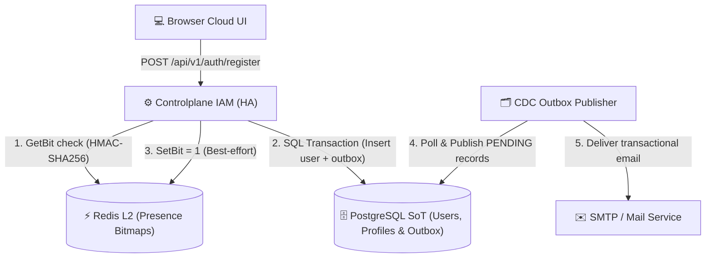
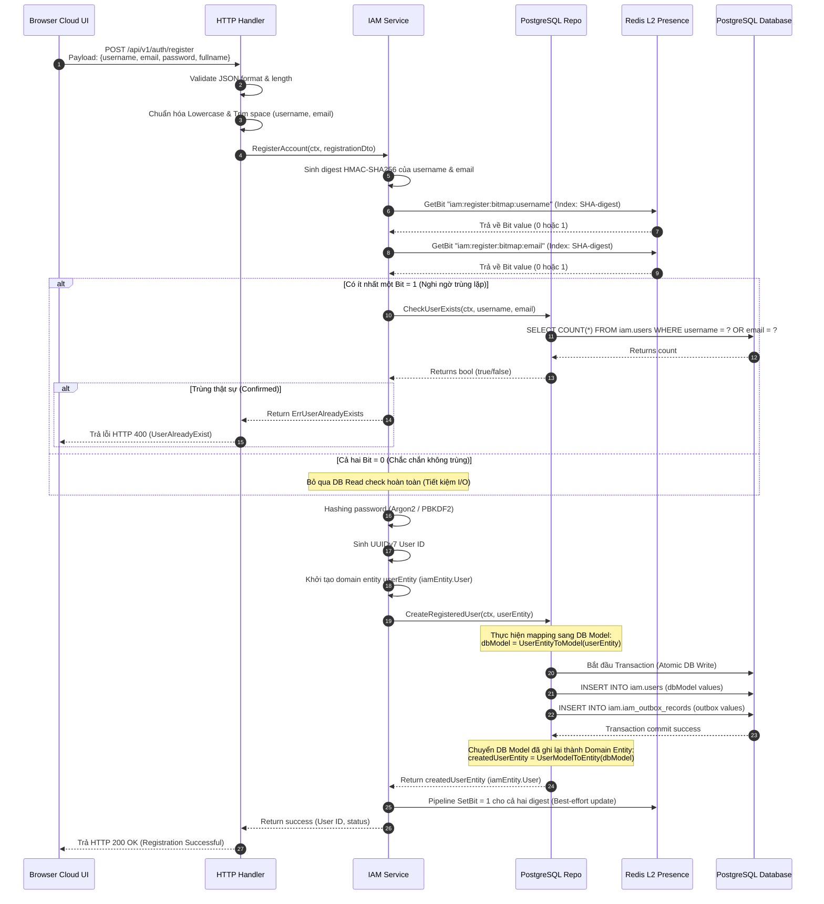

<!-- markdownlint-disable MD033 -->
# End-User Registration & Account Activation - Workflow God View

> [!NOTE]
> Tài liệu này đóng vai trò là **Source of Truth (SoT) / God View** cho luồng Đăng ký và Kích hoạt tài khoản của End-User.
> Mọi thay đổi về code liên quan đến đăng ký và email outbox phải tuân thủ nghiêm ngặt đặc tả này.

---

## 🗺️ 1. Giới Thiệu

### 👥 Tài Liệu Này Dành Cho Ai?

Tài liệu dành cho đội ngũ kỹ sư phát triển backend (IAM Service), kỹ sư phát triển hạ tầng dữ liệu và SRE đảm bảo tính sẵn sàng cao (HA) và hiệu năng tối ưu khi xử lý lượng đăng ký lớn.

### ❓ Nghiệp vụ Đăng ký & Kích hoạt tài khoản là gì?

Luồng cho phép người dùng đăng ký tài khoản mới kèm theo các chốt chặn và tối ưu hóa hệ thống đặc thù:

1. **Presence Bitmap Acceleration (Redis L2)**: Gia tốc kiểm tra tính duy nhất của `username` và `email` trước khi truy vấn xuống DB PostgreSQL, tránh thắt nút cổ chai I/O DB dưới tải lớn.
2. **Transactional Outbox Pattern**: Nhóm việc tạo tài khoản và ghi nhận nhiệm vụ gửi mail kích hoạt tài khoản trong cùng một Database Transaction, giải quyết triệt để lỗi mất mát email (dual-write).
3. **One-Time Token (OTT) Activation**: Phát hành mã kích hoạt ngắn hạn gửi qua Mail Service để chuyển trạng thái tài khoản từ `pending-active` sang `active`.

### 📍 Các Biên Công Nghệ Hoạt Động

- **Frontend Cloud UI (Browser)**: `register` page & [auth.ts](file:///home/phucle/Desktop/New/cloud-ui/src/lib/api/auth.ts).
- **Controlplane HTTP Handler**: `Register` handler in [auth_handler.go](file:///home/phucle/Desktop/New/controlplane/internal/iam/transport/http/handler/auth_handler.go).
- **IAM Core Service**: `RegisterAccount` method in [auth_service.go](file:///home/phucle/Desktop/New/controlplane/internal/iam/service/auth_service.go).
- **Outbox System**: `Create` record in [outbox_repo.go](file:///home/phucle/Desktop/New/controlplane/internal/iam/repository/outbox_repo.go) và Agent CDC chạy nền.
- **Database**: PostgreSQL (Bảng `iam.users`, `iam.user_profiles`, `iam.iam_outbox_records`).
- **Cache Engine**: Redis Cluster L2 (Bitmaps `iam:register:bitmap:username` & `iam:register:bitmap:email`).

---

## 🏛️ 2. Sơ Đồ Hệ Thống & Ranh Giới Phase



### 🚧 Biên Và Ràng Buộc (Boundaries & Constraints)

- **Đầu Vào (Inputs)**: JSON Payload (`username`, `email`, `password`, `re_password`, `fullname`).
- **Đầu Outer (Outputs)**: HTTP `200 OK` (thành công) hoặc HTTP `400 Bad Request` / `503 Service Unavailable`.
- **Ràng Buộc Trạng Thế (Constraints)**: Tài khoản mới đăng ký luôn ở trạng thái mặc định là `pending-active`.

---

## 🔍 3. Chi Tiết Thực Thi Nghiệp Vụ & Ánh Xạ

### 🛡️ Chuỗi Middleware Áp Dụng

1. **`gin.Recovery()`**: Chống panic làm sập node xử lý.
2. **`middleware.RequestID()`**: Gắn correlation ID để debug chéo.
3. **`middleware.OTelTraceContext()`**: Đồng bộ hóa OpenTelemetry span trace.
4. **`Envoy Local Rate Limit & Connection Limit`**: Chặn tấn công spam đăng ký (Rate limit 10 req/min/IP) từ tầng gateway.

### 🔄 Trực Quan Luồng Sequence Diagram



---

## 📋 4. Đặc Tả Hợp Đồng & Cơ Sở Dữ Liệu

### 1. JSON Data Contracts

##### Request DTO: `requestdto.RegisterRequest`

```json
{
  "username": "phucle996",
  "email": "phucle@aurora.local",
  "password": "SuperSecurePassword123!",
  "re_password": "SuperSecurePassword123!",
  "fullname": "Phuc Le"
}
```

### 2. Service Domain Entities (`iamEntity`)

Các Entity hoạt động tại tầng Service để biểu diễn nghiệp vụ logic độc lập với cơ chế lưu trữ:

```go
type UserStatus string

const (
    UserStatusPendingActive UserStatus = "pending-active"
    UserStatusActive        UserStatus = "active"
    UserStatusSuspended     UserStatus = "suspended"
    UserStatusDisabled      UserStatus = "disabled"
)

type User struct {
    ID           uuid.UUID
    Username     string
    Email        string
    Phone        *string
    PasswordHash string
    Status       UserStatus
    CreatedAt    time.Time
    UpdatedAt    time.Time
}
```

### 3. Repository DB Models (`iamModel`)

Mô hình ánh xạ trực tiếp với bảng dữ liệu của hệ quản trị cơ sở dữ liệu (PostgreSQL/GORM):

```go
type User struct {
    ID           uuid.UUID `db:"id"`
    Username     string    `db:"username"`
    Email        string    `db:"email"`
    Phone        *string   `db:"phone"`
    PasswordHash string    `db:"password_hash"`
    Status       string    `db:"status"`
    CreatedAt    time.Time `db:"created_at"`
    UpdatedAt    time.Time `db:"updated_at"`
}
```

### 4. Converter & Mapping Layer (Service $\leftrightarrow$ Repository)

Tại ranh giới giữa Service và Repository, ta thực hiện ánh xạ từ Domain Entity sang DB Model trước khi thực hiện ghi xuống DB:

```go
// Chuyển từ domain entity sang repo model để chuẩn bị lưu xuống DB
func UserEntityToModel(input iamEntity.User) User {
    return User{
        ID:           input.ID,
        Username:     input.Username,
        Email:        input.Email,
        Phone:        input.Phone,
        PasswordHash: input.PasswordHash,
        Status:       string(input.Status),
        CreatedAt:    input.CreatedAt,
        UpdatedAt:    input.UpdatedAt,
    }
}

// Chuyển ngược từ DB Model sang Domain Entity khi đọc từ Repository lên
func UserModelToEntity(input User) iamEntity.User {
    return iamEntity.User{
        ID:           input.ID,
        Username:     input.Username,
        Email:        input.Email,
        Phone:        input.Phone,
        PasswordHash: input.PasswordHash,
        Status:       iamEntity.UserStatus(input.Status),
        CreatedAt:    input.CreatedAt,
        UpdatedAt:    input.UpdatedAt,
    }
}
```

### 5. Protobuf Payload: `mailproto.SendMailConfig`

Lưu tại cột `payload` của bảng outbox dưới dạng byte nhị phân để bảo toàn cấu trúc khi CDC quét:

```protobuf
syntax = "proto3";
package mailproto;

message SendMailConfig {
    string to = 1;
    string subject = 2;
    string body_html = 3;
    map<string, string> template_variables = 4;
}
```

### 6. PostgreSQL Table Schemas

##### Bảng Người Dùng `iam.users`

```sql
CREATE TABLE IF NOT EXISTS iam.users (
    id UUID PRIMARY KEY DEFAULT gen_random_uuid(),
    username VARCHAR(64) NOT NULL,
    email VARCHAR(255) NOT NULL,
    phone VARCHAR(32) NULL,
    password_hash TEXT NOT NULL,
    status VARCHAR(50) NOT NULL DEFAULT 'pending-active',
    created_at TIMESTAMPTZ NOT NULL DEFAULT NOW(),
    updated_at TIMESTAMPTZ NOT NULL DEFAULT NOW()
);
CREATE UNIQUE INDEX IF NOT EXISTS idx_users_username_lower ON iam.users (LOWER(username));
CREATE UNIQUE INDEX IF NOT EXISTS idx_users_email_lower ON iam.users (LOWER(email));
```

##### Bảng Outbox `iam.iam_outbox_records`

```sql
CREATE TABLE IF NOT EXISTS iam.iam_outbox_records (
    id BIGSERIAL PRIMARY KEY,
    event_id UUID UNIQUE NOT NULL,
    zone_id UUID NOT NULL,
    job_topic VARCHAR(100) NOT NULL,
    payload BYTEA NOT NULL,
    user_id VARCHAR(64) NOT NULL,
    status VARCHAR(50) NOT NULL DEFAULT 'PENDING' CHECK (status IN ('PENDING', 'PUBLISHED', 'PROCESSING', 'COMPLETED', 'SUCCEEDED', 'FAILED')),
    completed_at TIMESTAMPTZ,
    job_version INT NOT NULL DEFAULT 1,
    resource_id VARCHAR(64),
    payload_schema_version INT NOT NULL DEFAULT 1,
    trace_id BYTEA,
    idle INT,
    error_code VARCHAR(100),
    error_message TEXT
);
CREATE INDEX IF NOT EXISTS idx_iam_outbox_pending ON iam.iam_outbox_records (status, id ASC) WHERE status = 'PENDING';
```

---

## 🛡️ 5. Xử Lý Concurrency & Race Condition

### 1. Phân Tích Redis Bitmap Collision (Khắc Phục Va Chạm Bit)

- **Rủi Ro**: Do cơ chế băm HMAC-SHA256 ánh xạ chuỗi ký tự thành số nguyên làm chỉ mục (index) bit trong tập dữ liệu $2^{32}$ bits, có tỷ lệ va chạm rất nhỏ làm bit của username mới trùng với bit của username cũ đã đăng ký trước đó.
- **Giải Pháp**:
  - Khi `GetBit` trả về `1`, hệ thống **không** từ chối request ngay lập tức.
  - Nó chỉ chuyển hướng nghi ngờ (Short-circuit disabled) và rơi vào nhánh kiểm tra SoT (`CheckUserExist` qua PostgreSQL). Nếu DB xác nhận không tồn tại $\rightarrow$ Cho phép ghi tiếp. Giải pháp này loại bỏ hoàn toàn khả năng chặn nhầm người dùng hợp lệ.

### 2. Transactional Outbox (Đảm Bảo Gửi Thư Kích Hoạt)

- **Rủi Ro**: Hệ thống lưu thông tin User thành công nhưng sập mạng lúc gọi dịch vụ Mail, dẫn tới tài khoản bị treo vĩnh viễn ở trạng thái `pending-active`.
- **Giải Pháp**:
  - Bắt buộc lưu bản ghi gửi email dạng nhị phân Protobuf vào bảng `iam_outbox_records` chung một Database Transaction với lệnh tạo User.
  - Worker CDC định kỳ quét các hàng `PENDING` có sắp xếp thứ tự và thực thi gửi tin cậy. Tránh race condition khi scale worker bằng cách cập nhật trạng thái UPDATE khoá dòng (`FOR UPDATE SKIP LOCKED`).

---

## 📊 6. Giám Sát Và Truy Vết - Grafana Runbook

### 1. Prometheus Metrics Cảnh Báo

- **Service Outcomes**: `iam_service_calls_total{op="iam.auth.register", outcome}`
- **Outbox Write Latency**: `iam_downstream_call_duration_seconds{op="iam.auth.register", kind="repo", destination="CreateRegisteredUser"}`

#### 📈 PromQL Cần Thiết

##### A. Tốc độ đăng ký tài khoản mới theo thời gian

```promql
sum(rate(iam_service_calls_total{op="iam.auth.register"}[5m]))
```

##### B. Tỷ lệ đăng ký thất bại do trùng lặp (Precondition Failed)

```promql
sum(rate(iam_service_calls_total{op="iam.auth.register", outcome="precondition_failed"}[5m])) / sum(rate(iam_service_calls_total{op="iam.auth.register"}[5m])) * 100
```

### 2. LogsQL (VictoriaLogs) Giám Sát

##### Tìm kiếm lỗi Transaction ghi dữ liệu đăng ký

```logsql
"CreateRegisteredUser" level="error" | select(request_id, error_message, user_id)
```

##### Kiểm tra tiến trình CDC Outbox gửi mail kích hoạt thất bại

```logsql
job_topic="mail.system.verify_account" status="FAILED"
```

---
*Tài liệu kết thúc.*
<!-- markdownlint-enable MD033 -->
