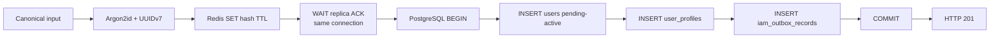
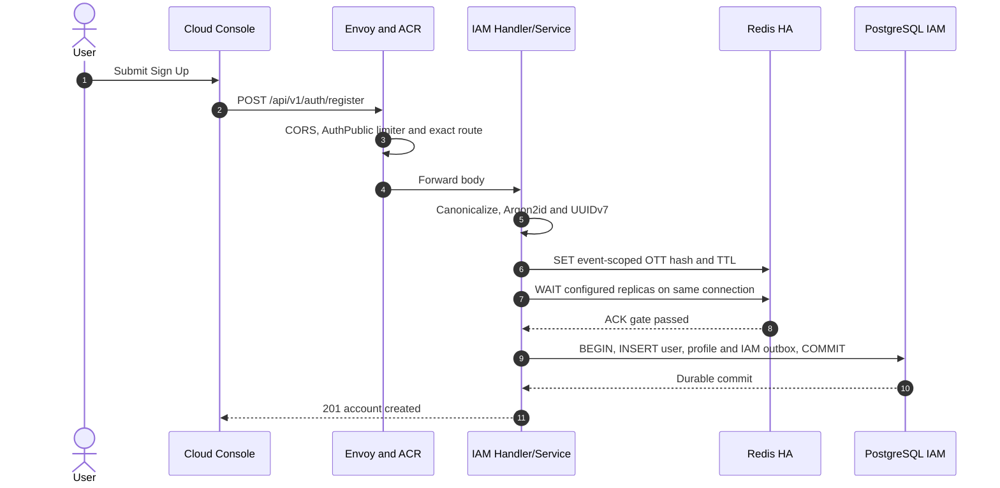
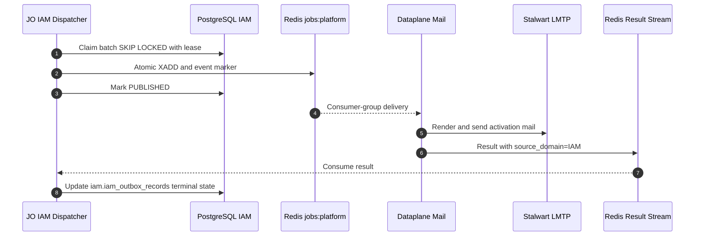
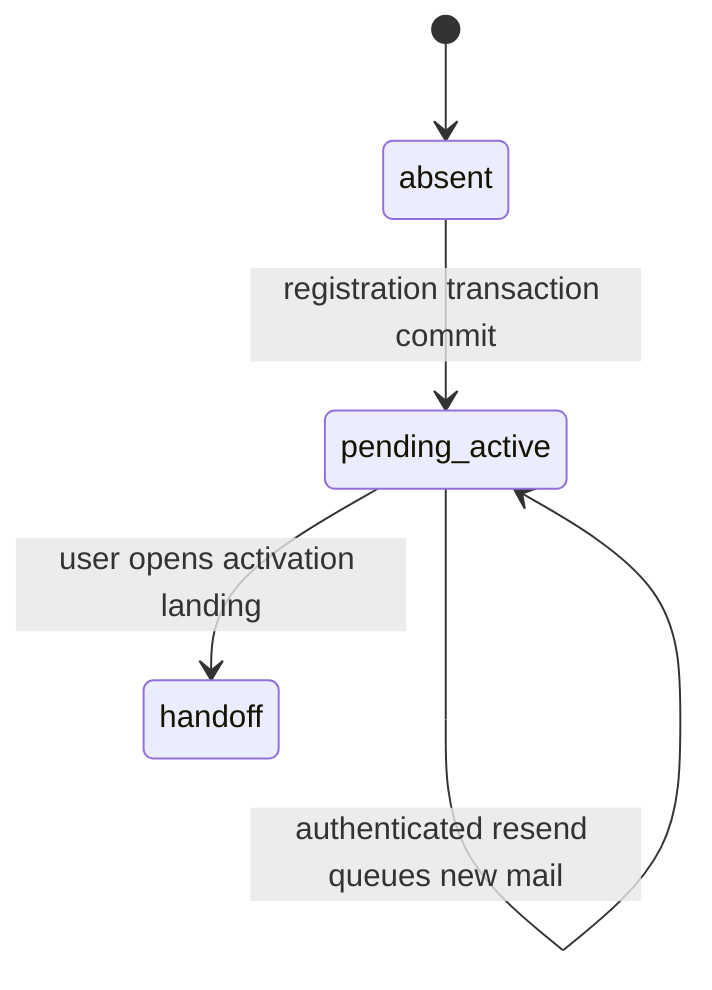
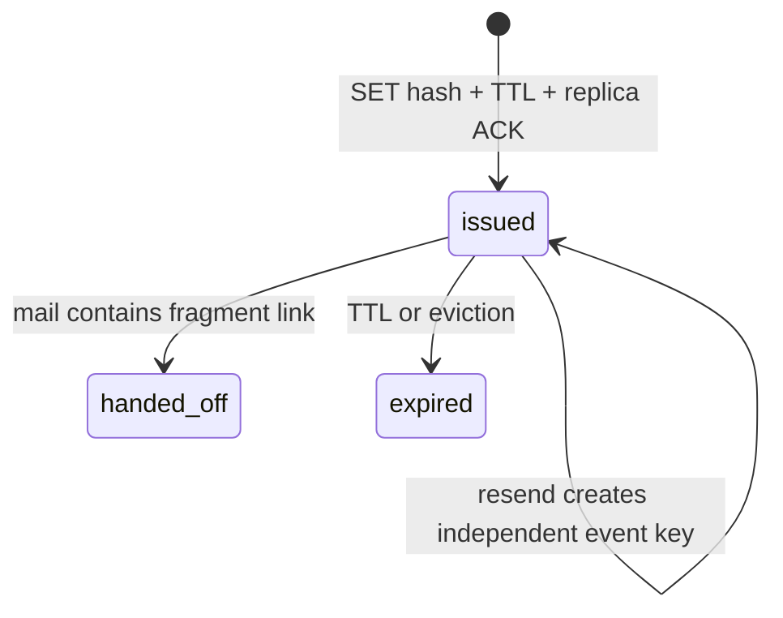
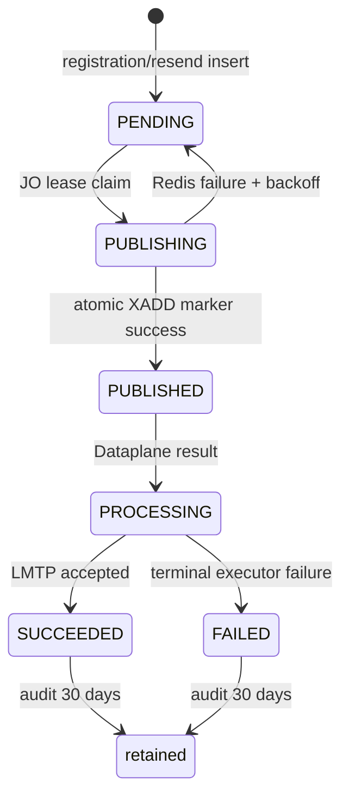

# End-User Registration — God View (Master SoT)

> **SINGLE SOURCE OF TRUTH**
> Tài liệu này chỉ sở hữu workflow tạo tài khoản `pending-active`, phát activation challenge và chuyển mail intent sang Dataplane. Activation, role và Billing wallet thuộc [`account_verification_god_view_workflow.md`](account_verification_god_view_workflow.md).

## 0. Control header

| Thuộc tính | Contract |
|---|---|
| Domain | IAM / End-User Registration |
| Endpoint | `POST /api/v1/auth/register` |
| Resend entry | Pending account đăng nhập lại bằng password đúng |
| UI | Cloud Console Sign Up / Sign In |
| Identity SoT | PostgreSQL `iam.users`, `iam.user_profiles` |
| OTT | Redis HA, key `iam:ott:account_verify:<user_id>:<event_id>` |
| Mail intent | PostgreSQL `iam.iam_outbox_records` |
| Mail execution | JO IAM dispatcher → Redis Stream → Dataplane → LMTP |
| Retention | Kubernetes CronJob `k8s/outbox-retention-cronjob.yaml`, 30 ngày |
| Output state | User `pending-active` + durable mail intent |
| Downstream handoff | `user_id + event_id + plaintext OTT` trong activation URL fragment |

## 1. Boundary và invariant

### 1.1 In scope

- Client validation và Sign Up state.
- Exact public route, CORS và pre-auth abuse limiter.
- Canonical username/email và password hashing.
- Redis OTT issue, TTL và replica durability gate.
- Atomic transaction `user + profile + IAM mail outbox`.
- IAM outbox dispatch/reconciliation và mail delivery result.
- Pending-login resend đã xác thực password.
- Retry, idempotency, retention và failure recovery trước activation.

### 1.2 Out of scope

- OTT validation/consume.
- Chuyển account sang `active`.
- Gán `platform_user`.
- Billing outbox, JetStream, inbox và wallet.
- Zone/Workspace provisioning.

### 1.3 Non-negotiable invariants

| Invariant | Hệ quả |
|---|---|
| PostgreSQL unique index là uniqueness arbiter | Không dùng Redis bitmap/cache để từ chối identity |
| Password là opaque secret | Không trim, log, trace hoặc đưa vào outbox |
| OTT đạt Redis replica ACK trước DB transaction | Replica gate fail thì không được tạo user |
| `users + user_profiles + iam_outbox_records` cùng transaction | HTTP `201` không tồn tại khi thiếu mail intent |
| `201` chỉ chứng minh intent durable | Không khẳng định LMTP/provider đã deliver |
| Mỗi mail có `event_id` và Redis key riêng | Mail đến đảo thứ tự không invalidate link còn TTL |
| Resend yêu cầu password đúng | Không có unauthenticated resend oracle; không cấp session cho pending user |
| JO route result bằng `source_domain` | Topic `mail.*` không được dùng để suy diễn source table |
| Registration không ghi Hierarchy/Billing | Failure ngoài IAM mail không rollback identity creation |

## 2. Public API contract

### 2.1 Edge contract

```text
POST /api/v1/auth/register
Content-Type: application/json
Public route = exact(method, normalized path)
             + allowed-origin policy
             + AuthPublic IP/device limiter
             + body buffer limit
             + no session/tenant/zone requirement
```

Prefix hoặc method khác không được public. Public decision chỉ chạy sau CORS và pre-auth limiter.

### 2.2 Request

```json
{
  "username": "phucle996",
  "email": "phucle@aurora.local",
  "password": "SuperSecurePassword123!",
  "fullname": "Phuc Le",
  "phone": "+84901234567",
  "location": "VN",
  "timezone": "Asia/Ho_Chi_Minh"
}
```

| Field | Normalize/validate | Durable target | Remaining concern |
|---|---|---|---|
| `username` | Trim, lowercase, `^[a-z0-9][a-z0-9_-]{5,63}$` | `users.username` | UI/backend phải giữ regex parity |
| `email` | Trim, lowercase, email validator | `users.email` | Nên thêm max 255 explicit |
| `password` | Không trim; min 8, lower/upper/digit/special | Argon2id hash | Nên thêm field max explicit |
| `fullname` | Trim, required | `user_profiles.fullname` | Nên validate max 120 sau trim |
| `phone` | Optional E.164 | `users.phone` | Không unique |
| `location` | Optional; GeoIP có thể ghi đè | `user_profiles.locale` | Semantics location/locale cần chuẩn hóa |
| `timezone` | Trim, optional | `user_profiles.timezone` | Cần IANA validation |

### 2.3 Response taxonomy

| Condition | HTTP | Meaning/retry |
|---|---:|---|
| Invalid body/canonical/password | `400` | Sửa input |
| Username/email unique conflict | `409` | Không retry cùng identity |
| Redis issue/replica gate unavailable | `500` dependency failure | Không có user; retry sau recovery |
| PostgreSQL failure | `500` | Transaction rollback; retry có kiểm soát |
| OTT durable + DB transaction commit | `201` | Pending account và mail intent durable |

Success body:

```json
{"message":"account created"}
```

Response không trả plaintext OTT, password hash hoặc internal outbox state.

## 3. Data contract

### 3.1 Identity transaction



DB transaction rollback có thể để orphan Redis key. Orphan vô hại vì key chứa random `event_id`, không có user/outbox để phát mail và tự hết TTL.

### 3.2 IAM outbox row

| Field | Contract |
|---|---|
| `event_id` | UUIDv7 mới cho từng mail |
| `routing_scope` | `platform` |
| `job_topic` | `mail.verify_account` |
| `owner_id` | Personal user UUID |
| `owner_type` | `PERSONAL` |
| `actor_user_id` | Personal user UUID |
| `payload` | Protobuf `SendMailConfig` |
| `status` | `PENDING` |
| `job_version` | `1` |
| `resource_id` | `verify_account` |
| `payload_schema_version` | `1` |
| `trace_id` | 16 bytes nếu span hợp lệ |
| `idle` | `60` giây |

### 3.3 Mail payload

| Template variable | Source | Security |
|---|---|---|
| `template_id` | `platform/verify_account` | Constant allowlisted template |
| `to` | Canonical email | PII; không log payload |
| `fullname` | Username hiện tại | Không phải profile fullname |
| `user_id` | User UUID | Public identifier |
| `event_id` | Outbox event UUID | Challenge identity |
| `verify_token` | OTT plaintext | Bearer secret, chỉ tồn tại trong mail payload |
| `from` | `noreply@aurora.system` | Constant sender |

Canonical link:

```text
https://cloud.aurora.local/activate#user_id=<uuid>&event_id=<uuid>&token=<ott>
```

Fragment không được gửi tới Envoy/ACR. Consumer contract nằm trong Account Verification God View.

## 4. End-to-end sequence

### 4.1 Phase 1: Registration and Account Creation (Sync HTTP and Durable Intent)



### 4.2 Phase 2: Async Mail Delivery and Outbox Terminal Update (JO and Dataplane)




## 5. State machines

### 5.1 Account before handoff



Registration không sở hữu transition `pending_active → active`.

### 5.2 OTT



### 5.3 IAM mail outbox



Kubernetes CronJob `outbox-retention` xóa tối đa 200 terminal row/bảng/phút sau 30 ngày. JO không chạy retention cleaner.

## 6. Resend contract

Resend không có endpoint anonymous riêng và không gọi lại Register:

1. UI xóa password sau registration và chỉ nhớ pending username.
2. User chuyển sang Sign In và nhập lại password.
3. IAM lookup user và verify Argon2id trước mọi mail side effect.
4. Nếu status `pending-active`, Redis `SETNX` cooldown theo user trong 60 giây.
5. Winner issue OTT/event mới và insert IAM outbox.
6. ACR trả typed `412 ACCOUNT_VERIFICATION_REQUIRED`, không tạo session/cookie.
7. Password sai không queue mail và không tiết lộ pending state.

Hai request đồng thời chỉ một request thắng cooldown. Mỗi resend thành công vẫn có key per-event độc lập, nên email cũ còn valid tới TTL.

## 7. Race và failure matrix

| Scenario | Durable result | Recovery/control |
|---|---|---|
| Hai registration cùng identity | Một commit, một unique conflict | PostgreSQL unique index quyết định |
| Redis SET fail | Không user/outbox | Retry sau Redis recovery |
| Redis ACK thiếu | Key cleanup best-effort, không DB tx | Fail closed |
| Redis success, DB conflict/fail | Orphan key tới TTL | Không có mail row nên không usable |
| DB commit, HTTP response mất | Pending user + mail row | Client retry có thể `409`; resend qua login |
| JO crash trước claim | Row vẫn PENDING | Polling reconciler claim lại |
| JO crash sau XADD trước DB mark | Redis marker giữ stream entry ID | Lease retry không XADD lần hai trong 30 ngày |
| LMTP success, result mất | Có thể redelivery mail | Dataplane cần durable side-effect inbox |
| Result sai/missing domain | Không fallback theo topic | Alert contract error; không update nhầm table |
| Một outbox table cleanup lỗi | Hai bảng khác vẫn được CronJob thử | Transaction độc lập/batch nhỏ |

## 8. HA và security posture

| Component | HA/control |
|---|---|
| ACR limiter | Distributed Redis counters theo route/IP/device |
| Argon2id | Load-test theo pod CPU/memory; body cap trước handler |
| Redis OTT | AOF, `noeviction`, TLS/ACL, replica ACK và replication-lag alert |
| PostgreSQL | Unique indexes, atomic tx, connection pool/TLS |
| JO dispatcher | Multi-pod SKIP LOCKED, 30s lease, bounded batch; drain nhanh khi có backlog, khi rỗng chỉ reconciliation 30–39s có jitter, không poll DB mỗi 500ms |
| Redis job stream | Consumer group, retention/trim và pending alert |
| Dataplane | At-least-once; cần durable mail side-effect dedupe |
| Cleanup | Kubernetes CronJob `Forbid`, batch 200, lock/statement timeout |

Plaintext password/OTT/email không được dùng làm metric label. Edge/app log không được ghi body hoặc activation secret.

## 9. Runbook

Identity và profile:

```sql
SELECT u.id, u.username, u.email, u.status, u.created_at,
       p.fullname, p.locale, p.timezone
FROM iam.users u
JOIN iam.user_profiles p ON p.user_id = u.id
WHERE lower(u.email) = lower($1);
```

Mail jobs:

```sql
SELECT id, event_id, owner_id, owner_type, actor_user_id,
       job_topic, status, attempts, available_at, lease_until,
       completed_at, error_code, error_message
FROM iam.iam_outbox_records
WHERE owner_id = $1 AND owner_type = 'PERSONAL'
ORDER BY id DESC;
```

Không sửa trực tiếp user/outbox status trong incident. Repair phải idempotent, có operator/reason/timestamp và giữ nguyên `event_id` khi replay cùng logical mail job.

## 10. Acceptance gates

- [ ] Exact `POST /register` public route; route con/method khác bị deny.
- [ ] Limiter chạy trước Argon2id.
- [ ] Password không trim/log/persist raw.
- [ ] Redis SET và WAIT dùng cùng connection.
- [ ] Replica gate fail không tạo user.
- [ ] User/profile/mail intent cùng commit hoặc cùng rollback.
- [ ] Concurrent duplicate chỉ tạo một identity.
- [ ] Pending-login password sai không queue mail.
- [ ] Resend cooldown không tạo session.
- [ ] JO crash/replay không tạo duplicate stream entry trong marker window.
- [ ] Result `source_domain=IAM` update đúng IAM row.
- [ ] CronJob cleanup không overlap và không full-table scan.
- [ ] Browser/E2E không thấy password hoặc OTT trong logs/storage ngoài activation fragment.

## 11. Source map

| Concern | Canonical source |
|---|---|
| Sign Up/resend UI | `cloud-console/src/app/signin/signup-form.tsx`, `signin-form.tsx` |
| Cloud Console API | `cloud-console/src/lib/api/auth.ts` |
| ACR public route/limiter | `acr/src/config.rs`, `gateway/ext_authz.rs`, `gateway/ratelimit.rs` |
| IAM DTO/handler | `controlplane/internal/iam/transport/http/dto/req/auth_request.go`, `handler/auth_handler.go` |
| Registration/resend orchestration | `controlplane/internal/iam/service/auth_service.go` |
| OTT | `controlplane/internal/iam/service/one_time_token_service.go` |
| Atomic registration repository | `controlplane/internal/iam/repository/auth_repo.go` |
| IAM outbox schema/index | `controlplane/internal/iam/migrations/000002_iam_tables.up.sql`, `000003_iam_indexes.up.sql` |
| IAM dispatcher/reconciler | `job-orchestrator/src/reverse_provider/iam/outbox_dispatcher.rs` |
| Result source routing | `job-orchestrator/src/job_result/l1_dispatcher.rs` |
| Dataplane mail | `dataplane/src/executor/mail/send.rs`, `verify_account.rs` |
| Mail template | `controlplane/internal/mail/migrations/000005_seed_verify_account_template.up.sql` |
| Retention scheduler | `k8s/outbox-retention-cronjob.yaml` |
| Downstream activation | `god_view/iam/account_verification_god_view_workflow.md` |
