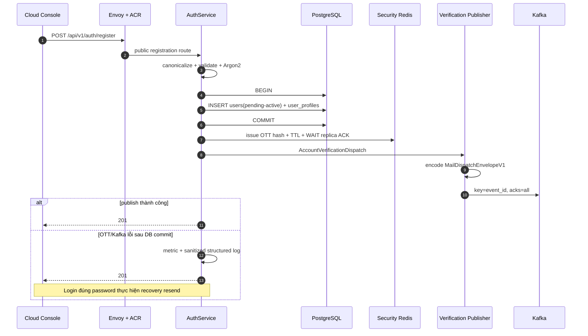
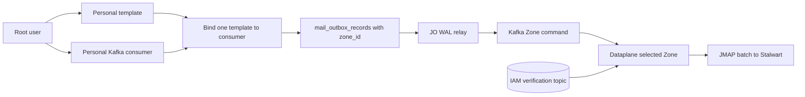
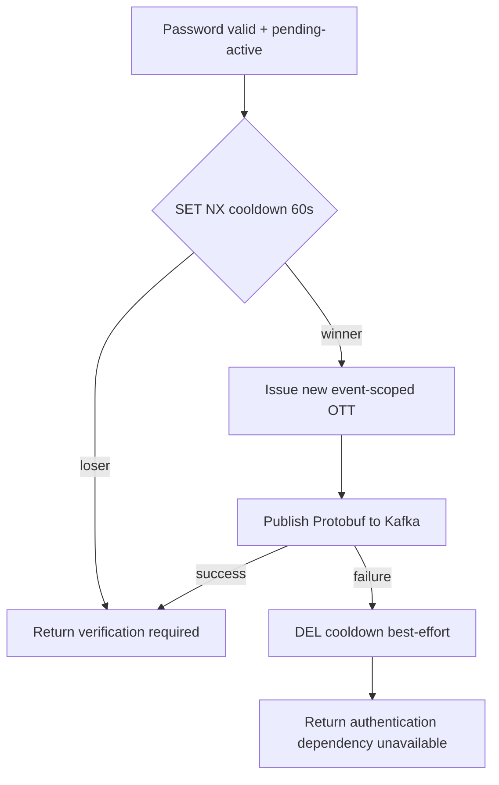

# User Registration and Verification-Mail Dispatch — God View

> [!IMPORTANT]
> Đây là Source of Truth cho việc tạo account `pending-active` và phát mail intent xác minh.
> Account activation, default role và Billing wallet nằm trong
> [`account_verification_god_view_workflow.md`](account_verification_god_view_workflow.md).
> Durable platform transport dùng
> [`kafka_platform_transport_god_view.md`](../platform/kafka_platform_transport_god_view.md).

## 0. Control header

| Thuộc tính | Contract |
|---|---|
| Public API | `POST /api/v1/auth/register` |
| Identity SoT | PostgreSQL `iam.users` + `iam.user_profiles` |
| State sau create | `pending-active` |
| OTT state | Security Redis của IAM, hash-only, TTL + replication `WAIT` |
| Mail transport | Kafka `aurora.iam.account-verification.v1` |
| Wire envelope | Protobuf `MailDispatchEnvelopeV1` |
| Logical render data | `to` + flat `parameter` map + `not_after_unix_ms` |
| Recovery | Login đúng password ở trạng thái pending tự resend; cooldown 60 giây |
| Không tồn tại | IAM verification outbox, system template/sender, ACR Kafka client |
| Activation/Billing | Verify transaction + `iam.billing_outbox_records` ở workflow riêng |

## 1. Ownership và boundary

IAM biết:

- recipient;
- event ID;
- OTT verify parameters;
- thời điểm envelope hết hiệu lực.

IAM không biết:

- Zone, consumer ID, template ID/version;
- sender profile;
- JMAP/Stalwart endpoint;
- cách Mail runtime phân slot, batch hoặc settle message.

`AuthService` phụ thuộc outbound port `AccountVerificationPublisher`. Kafka/Protobuf/topic nằm trong
adapter `internal/iam/transport/pubsub/account_verification_publisher.go`; service không import Kafka.
ACR không kết nối Kafka. ACR xác thực ở edge và gọi IAM qua contract hiện có.

Root user tạo ordinary Personal Mail consumer:

- source type `kafka`;
- topic `aurora.iam.account-verification.v1`;
- consumer group riêng và encrypted broker configuration;
- một ordinary template dùng đúng parameter contract;
- sender profile;
- placement ở Zone mong muốn.

## 2. Invariant

1. User và profile commit cùng một PostgreSQL transaction.
2. Không phát mail trước identity commit.
3. Post-commit mail publish là best-effort. Registration vẫn trả `201` nếu Kafka tạm lỗi.
4. Pending login là recovery path; password phải đúng trước resend để tránh enumeration/abuse.
5. Pending account không được cấp device, access session hoặc refresh token.
6. OTT plaintext chỉ xuất hiện trong token issuer response và transient wire envelope; Redis chỉ giữ hash.
7. Publisher dùng `event_id` làm Kafka key, Protobuf binary, zstd và `acks=all`.
8. Dataplane terminal-reject message khi `not_after_unix_ms` đã qua.
9. Verification mail không provision wallet. Chỉ verify thành công mới ghi Billing outbox atomic với activation.
10. ACR, UI và request payload không được chọn Kafka topic, template, sender, consumer hoặc Zone.

## 3. HTTP contract

Request:

```json
{
  "username": "alice_01",
  "email": "alice@example.com",
  "password": "opaque-user-secret",
  "fullname": "Alice",
  "phone": "+84901234567",
  "location": "VN",
  "timezone": "Asia/Ho_Chi_Minh"
}
```

| Field | Rule |
|---|---|
| `username` | trim + lowercase; 6–64; `^[a-z0-9][a-z0-9_-]{5,63}$` |
| `email` | trim + lowercase; validate email |
| `password` | không trim; policy lower/upper/digit/special |
| `fullname` | trim |
| `phone` | optional E.164 |
| `location`, `timezone` | optional, trim |

| HTTP | Nghĩa |
|---:|---|
| `201` | Identity transaction đã commit; mail publish đã được attempt |
| `400` | Payload/field sai |
| `409` | Canonical username/email conflict |
| `500` | Hash hoặc DB transaction lỗi trước durable commit |

## 4. Registration sequence



Identity repository transaction không chứa verification outbox:

```text
BEGIN
  INSERT iam.users
  INSERT iam.user_profiles
COMMIT
```

## 5. Binary envelope và render parameter

Logical representation:

```json
{
  "event_id": "UUID bytes on wire",
  "schema_version": 1,
  "to": "alice@example.com",
  "parameter": {
    "username": "alice_01",
    "user_id": "018f...",
    "event_id": "018f...",
    "verify_token": "plaintext-ott"
  },
  "not_after_unix_ms": 1784700000000
}
```

Wire là `MailDispatchEnvelopeV1`, không phải JSON text. `parameter` có semantics giống JSON object phẳng
để Dataplane render `{{username}}`, `{{user_id}}`, `{{event_id}}`, `{{verify_token}}`.

IAM không gửi `zone_id`, `template_id`, `sender_profile_id`, `consumer_id`, workspace hoặc owner vào envelope.
Topic/key được adapter chọn từ trusted configuration.

## 6. Root Mail setup và delivery



Template không seed trong migration:

```text
Subject: Verify your Aurora account, {{username}}
HTML:    link chứa user_id, event_id và verify_token
```

Nếu root chưa cấu hình consumer, Kafka giữ message theo retention. Khi consumer được enable, envelope đã hết
deadline bị terminal reject và commit; message còn hạn mới được render/send.

## 7. Pending-login resend



Cooldown key:

```text
iam:account_verify:resend_cooldown:<user_uuid>
```

Mỗi resend sinh event/OTT mới. Link cũ chưa hết TTL vẫn có thể hợp lệ; verify account idempotent theo durable
user state và deterministic Billing event ID.

## 8. Failure/race matrix

| Window | Durable state | Recovery |
|---|---|---|
| Hash/DB lỗi | Chưa có user hoặc rollback toàn transaction | `500`, retry request |
| DB commit, OTT issue lỗi | Pending user | `201`; login resend |
| OTT issue, Kafka publish lỗi | OTT hash còn TTL, message chưa durable | `201`; login resend sinh event mới |
| Broker ACK timeout sau append | Message có thể tồn tại | At-least-once; event key + JMAP submission idempotency |
| Hai pending login đồng thời | Một cooldown winner | Một publish; cả hai không có session |
| Kafka duplicate/rebalance | Cùng event ID | Mail runtime contiguous commit + deterministic submission ID |
| Consumer start sau deadline | Expired envelope | Reject terminal, không gửi |
| Verify đua với mail cũ | User đã active | Verify idempotent; Billing outbox không nhân đôi |
| Kafka outage lúc Controlplane boot | Identity service vẫn boot | Publish fail per request; resend sau recovery |

## 9. Security và observability

- Kafka production dùng TLS/mTLS hoặc SASL over TLS và ACL exact topic; plaintext chỉ cho isolated dev.
- IAM producer chỉ được write verification topic; root Mail consumer chỉ được read topic/group đã cấp.
- Không log password, OTT, envelope hoặc full email.
- Metrics low-cardinality: operation, dependency, outcome, latency; không label theo user/email/event.
- DLQ không được vô tình trở thành nơi lưu plaintext OTT lâu dài. Expired verification envelope nên được
  terminal reject với sanitized metadata; access DLQ bị hạn chế cho SRE.
- Mail verification best-effort; identity/Billing durability vẫn thuộc PostgreSQL transaction/outbox.

## 10. Production checklist

- [ ] Kafka topic được provision declarative, RF `>=3`, min ISR `>=2`, auto-create off.
- [ ] IAM principal chỉ write `aurora.iam.account-verification.v1`.
- [ ] Root template dùng đúng bốn parameter key.
- [ ] Root Kafka consumer dùng group riêng và được placement vào một Zone.
- [ ] Dataplane decode Protobuf và reject expired envelope.
- [ ] Register trả `201` sau identity commit dù publish lỗi.
- [ ] Pending login không cấp session trong mọi branch.
- [ ] Không còn IAM verification outbox hay ACR Kafka dependency.
- [ ] Verify transaction vẫn atomic activation + role + `billing_outbox_records`.

## 11. Code map

| Responsibility | File |
|---|---|
| Registration/resend | `controlplane/internal/iam/service/auth_service.go` |
| Outbound port | `controlplane/internal/iam/domain/service/auth_service.go` |
| Dispatch entity | `controlplane/internal/iam/domain/entity/account_verification_dispatch.go` |
| Kafka adapter | `controlplane/internal/iam/transport/pubsub/account_verification_publisher.go` |
| Kafka producer | `controlplane/infra/kafka/kafka.go` |
| Identity transaction | `controlplane/internal/iam/repository/auth_repo.go` |
| OTT hash/TTL | `controlplane/internal/iam/service/one_time_token_service.go` |
| Binary envelope parser | `dataplane/src/executor/mail/processor/stream.rs` |
| Ordinary Kafka Mail runtime | `dataplane/src/executor/mail/runtime/kafka.rs` |
