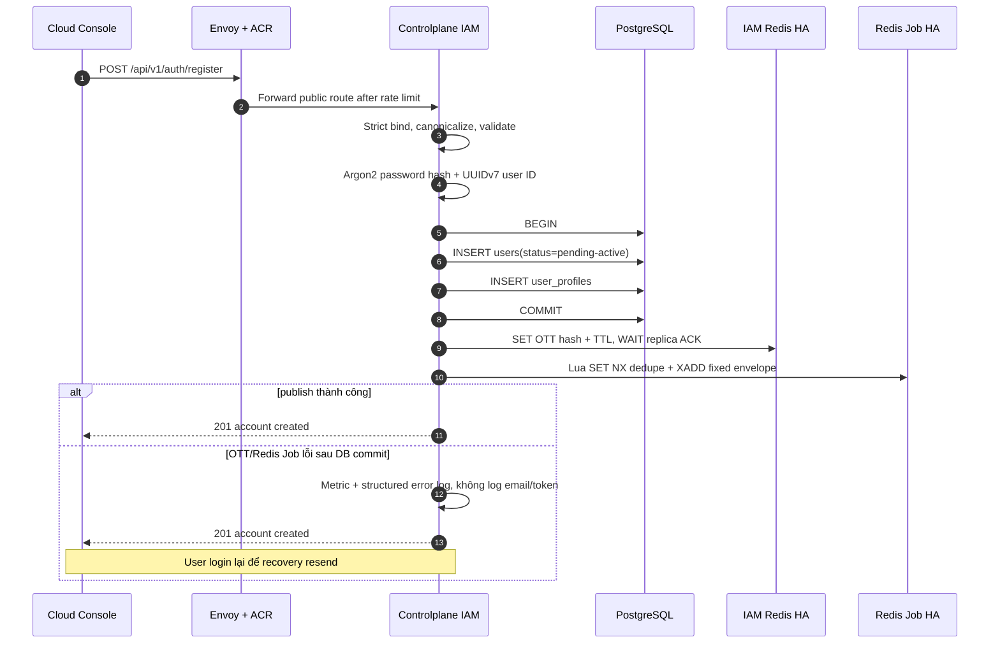
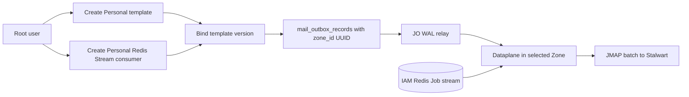
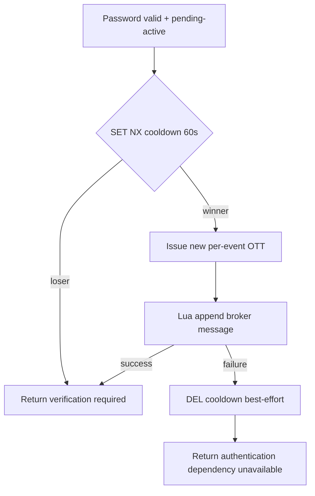

# User Registration and Verification-Mail Dispatch — God View

> [!IMPORTANT]
> Đây là Source of Truth cho việc tạo account `pending-active` và phát message xác minh vào broker.
> Việc consume broker, render template và gửi JMAP là ordinary Mail workflow; việc activate account,
> gán role và provision Billing wallet thuộc
> [`account_verification_god_view_workflow.md`](account_verification_god_view_workflow.md).

## 0. Control header

| Thuộc tính | Giá trị |
|---|---|
| Public API | `POST /api/v1/auth/register` |
| Identity SoT | PostgreSQL `iam.users` + `iam.user_profiles` |
| Account state sau create | `pending-active` |
| OTT state | Redis HA chính của IAM, hash-only, TTL cấu hình, replication `WAIT` |
| Verification broker | Redis Job Stream `{iam-account-verification-v1}:messages` |
| Mail envelope | Fixed JSON `{to, parameter, not_after_unix_ms}` |
| Recovery | Pending-user login đúng password tự resend, cooldown 60 giây |
| Không tồn tại | IAM mail outbox, system template, system sender, `jobs:platform` mail job |
| Activation/Billing | Verify transaction + `iam.billing_outbox_records` ở God View riêng |
| Verified against | Working tree, 2026-07-22 |

## 1. Architectural decision

IAM chỉ biết rằng cần phát một message xác minh vào broker. IAM không biết:

- Zone nào sẽ chạy consumer.
- Consumer ID, template ID/version hoặc sender profile.
- JMAP/Stalwart endpoint.
- Cách Dataplane phân slot, batch hoặc settle broker message.

Root user cấu hình một **ordinary Personal Mail consumer** ở Zone mong muốn. Consumer đó bind:

- `source_type=redis_stream`;
- stream key `{iam-account-verification-v1}:messages`;
- credential tới Redis Job trung tâm;
- một ordinary Personal template có các placeholder trong bảng contract;
- một ordinary sender profile.

Nhờ vậy account verification không tạo đường gửi mail đặc biệt. Cùng Mail runtime, template COW,
NATS Zone KV, batching và JMAP path của customer workload được tái sử dụng nguyên trạng.

## 2. Boundary và invariant

1. User và profile phải cùng commit trong một PostgreSQL transaction.
2. Không publish broker trước DB commit: mail không được trỏ tới identity chưa tồn tại.
3. Broker publish sau commit là best-effort. Publish lỗi không rollback được identity và không đổi `201` thành
   lỗi giả; pending-login resend là recovery path.
4. Pending account không bao giờ được cấp device/session/refresh token.
5. Password phải được verify trước resend để broker không trở thành user-enumeration API.
6. OTT plaintext chỉ xuất hiện trong response nội bộ của token issuer và fixed mail payload; IAM Redis chỉ lưu hash.
7. Stream append và event dedupe phải atomic trên Redis; hai key dùng cùng Redis Cluster hash tag.
8. Message hết `not_after_unix_ms` là terminal reject + ACK; backlog cũ không được gửi link đã hết hạn.
9. Stream phải bounded; publisher dùng approximate `MAXLEN` để không tăng vô hạn khi consumer chưa được cấu hình.
10. Verification mail không tạo hoặc provision wallet. Chỉ verify thành công mới ghi Billing outbox atomic với activation.

## 3. HTTP contract

Request:

```json
{
  "username": "alice_01",
  "email": "alice@example.com",
  "password": "opaque-user-secret",
  "fullname": "Alice",
  "phone": "+84901234567",
  "location": "VN",
  "timezone": "Asia/Ho_Chi_Minh"
}
```

Handler behavior:

| Field | Canonicalization/validation |
|---|---|
| `username` | trim + lowercase; 6–64; regex `^[a-z0-9][a-z0-9_-]{5,63}$` |
| `email` | trim + lowercase; Gin email validation |
| `password` | không trim; tối thiểu 8 và có lower/upper/digit/special |
| `fullname` | trim |
| `phone` | optional E.164 |
| `location` | optional; GeoIP có thể thay bằng quốc gia resolve từ trusted client IP |
| `timezone` | optional, trim |

Canonical responses:

| HTTP | Nghĩa |
|---:|---|
| `201` | Identity transaction đã commit; mail publish đã được attempt nhưng không phải durability proof |
| `400` | JSON hoặc field contract sai |
| `409` | Lowercase username/email unique conflict |
| `500` | Hashing hoặc PostgreSQL transaction thất bại trước durable identity commit |

## 4. Registration sequence



Repository transaction chỉ sở hữu identity data:

```text
BEGIN
  INSERT iam.users
  INSERT iam.user_profiles
COMMIT
```

Không có `iam.iam_outbox_records` trong schema hoặc transaction này.

## 5. Direct broker contract

### 5.1 Stream and dedupe keys

```text
stream:  {iam-account-verification-v1}:messages
dedupe:  {iam-account-verification-v1}:event:<event_uuid>
```

Hai key có cùng hash tag `{iam-account-verification-v1}`, nên Lua chạy hợp lệ trên Redis Cluster.
Publisher dùng một Lua invocation:

```text
SET dedupe_key 1 NX EX 604800
XADD stream MAXLEN ~ 1000000 * event_id <uuid> payload <json-bytes>
```

`SET NX` thua nghĩa là event đã được append trước đó và retry là no-op. Lua không giải quyết duplicate do
một request resend mới chủ động sinh event ID mới; trường hợp đó là business resend hợp lệ.

### 5.2 Fixed envelope

Redis Stream entry có field `payload`:

```json
{
  "to": "alice@example.com",
  "parameter": {
    "username": "alice_01",
    "user_id": "018f...",
    "event_id": "018f...",
    "verify_token": "plaintext-ott"
  },
  "not_after_unix_ms": 1784700000000
}
```

| Field | Rule |
|---|---|
| `to` | Một recipient hợp lệ; không CR/LF |
| `parameter` | Flat scalar map; root template phải dùng đúng các key trên |
| `not_after_unix_ms` | Bằng OTT expiry; Dataplane terminal-reject nếu deadline đã qua |
| Stream `event_id` | Observability/dedupe metadata; authoritative verify input vẫn nằm trong mail parameter |

IAM không gửi `zone_id`, `template_id`, `sender_profile_id`, `consumer_id` hoặc ownership vào payload.

## 6. Root-user Mail setup



Template ví dụ phải do root quản trị như business data, không seed trong migration:

```text
Subject: Verify your Aurora account, {{username}}
HTML:    link chứa user_id, event_id và verify_token
```

Nếu root chưa tạo/enable consumer, message nằm trong bounded stream. Khi consumer được enable sau đó,
expired message bị ACK với `MAIL_MESSAGE_EXPIRED`; message còn TTL mới được render/send.

## 7. Pending-login resend

Login state machine verify username/password trước. Với `pending-active`:



Cooldown key:

```text
iam:account_verify:resend_cooldown:<user_uuid>
```

Mỗi resend có `event_id` và OTT key riêng. Các link chưa hết TTL có thể cùng hợp lệ; verify transaction vẫn
idempotent theo durable user state và deterministic Billing event ID. Đây là semantics hiện tại, không được
mô tả nhầm là resend vô hiệu hóa link cũ.

## 8. Failure and race matrix

| Window | Durable state | Recovery/behavior |
|---|---|---|
| Hash lỗi | Chưa có user | `500`, retry toàn request |
| User insert thành công, profile insert lỗi | Transaction rollback | Không user mồ côi |
| DB commit, OTT issue lỗi | Pending user tồn tại, chưa có message | `201`; login đúng password resend |
| OTT issue thành công, broker lỗi | OTT hash tồn tại tới TTL, chưa chắc có message | `201`; login resend sinh event mới |
| Lua reply timeout sau server commit | Message có thể đã append | Dedupe bảo vệ retry cùng event; resend mới có thể tạo mail thứ hai |
| Hai login pending đồng thời | Một cooldown winner | Chỉ winner publish; cả hai không có session |
| Broker delivery duplicate | Cùng broker coordinate/event | Source suite + deterministic JMAP submission ID xử lý at-least-once |
| Consumer tạo sau OTT expiry | Expired backlog | Permanent reject + ACK, không gửi mail vô dụng |
| User verify trong lúc mail khác đang queue | User active | Verify API idempotent; mail cũ có thể đến nhưng không tạo wallet thứ hai |

## 9. Security and abuse controls

- Edge rate-limit register/login trước khi Argon2 để giảm CPU exhaustion.
- Không log password, OTT, fixed payload hoặc full email.
- Redis Job bắt buộc TLS/auth/network policy; chỉ IAM publisher và configured Mail runtime được quyền truy cập.
- Root consumer credential là encrypted business configuration; plaintext chỉ được Dataplane giữ trong memory.
- Stream key là reserved contract; customer không được mutate IAM publisher config qua register API.
- `MAXLEN` giới hạn memory nhưng không thay thế monitoring consumer lag và stream trimming.
- Direct mail là best-effort có chủ đích; identity và Billing wallet vẫn dùng PostgreSQL durability boundaries.

## 10. Observability

Low-cardinality signals:

| Signal | Labels |
|---|---|
| IAM downstream duration | `kind=broker`, `destination=PublishAccountVerification`, `outcome` |
| Registration service call | `op=iam.auth.register`, `outcome` |
| Pending resend failures | dependency/outcome, không user/email label |
| Redis stream lag | consumer group + deployment, không recipient |
| Mail processing outcome | `MAIL_MESSAGE_EXPIRED`, decode/render/JMAP classes |

Structured registration log khi post-commit publish lỗi chỉ chứa `user_id` và error class/message đã sanitize;
không chứa envelope.

## 11. Production checklist

- [ ] `REDIS_JOB_*` trỏ Redis Job HA, không trỏ IAM session Redis hoặc Zone NATS KV.
- [ ] Redis ACL của IAM chỉ cho `EVAL`, `SET`, `XADD` trên reserved hash tag.
- [ ] Root Personal template dùng đúng bốn parameter key.
- [ ] Root Redis Stream consumer dùng exact stream key và group riêng.
- [ ] Consumer được placement vào một Zone qua ordinary Mail API/outbox `zone_id UUID`.
- [ ] Dataplane reject + ACK expired fixed envelope.
- [ ] Register trả `201` sau identity commit kể cả mail publish lỗi; alert theo metric/log.
- [ ] Pending login không cấp refresh/access token trong mọi cooldown/publish branch.
- [ ] `iam_outbox_records`, system template seed và direct Mail job executor không còn trong code/schema.
- [ ] Verify transaction vẫn atomic activation + default role + `billing_outbox_records`.

## 12. Code map

| Responsibility | File |
|---|---|
| HTTP route/handler/DTO | `controlplane/internal/iam/route.go`, `transport/http/handler/auth_handler.go`, `transport/http/dto/req/auth_request.go` |
| Registration + direct publisher + pending resend | `controlplane/internal/iam/service/auth_service.go` |
| Identity transaction | `controlplane/internal/iam/repository/auth_repo.go` |
| OTT hash/TTL/replication gate | `controlplane/internal/iam/service/one_time_token_service.go` |
| Redis Job bootstrap/DI | `controlplane/internal/app/app.go`, `internal/app/module.go`, `internal/iam/module.go` |
| Fixed envelope expiry | `dataplane/src/executor/mail/processor/stream.rs` |
| Ordinary Redis Stream runtime | `dataplane/src/executor/mail/runtime/redis_stream.rs` |
| Mail configuration SoT | `god_view/mail/controlplane_mail_configuration_god_view.md` |
| Activation and wallet outbox | `god_view/iam/account_verification_god_view_workflow.md` |
