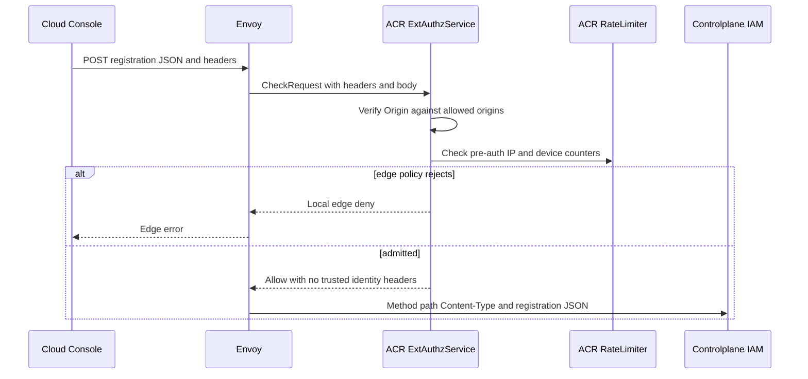
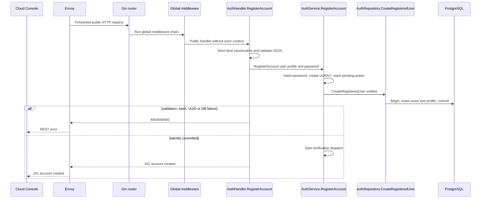
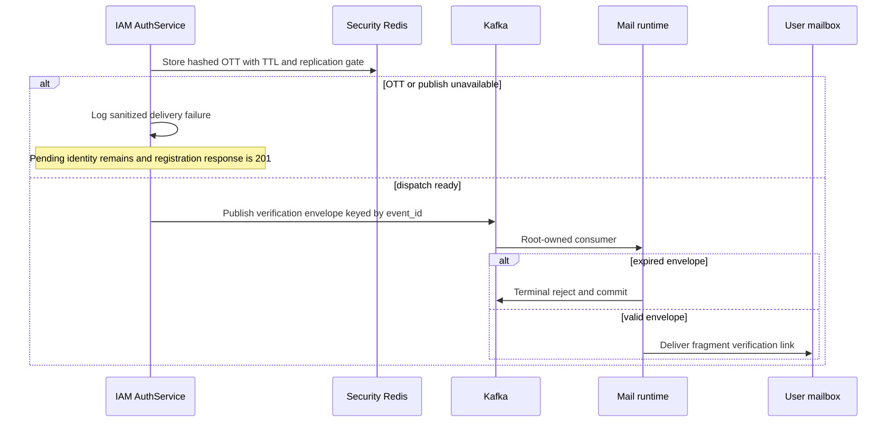

# User Registration — God View (Master SoT)

Workflow này chỉ tạo self identity `pending-active` và attempt gửi verification
mail. Nó không activate user, không gán role, không tạo wallet, session, device,
Zone, tenant hay workspace. Những state đó chỉ xuất hiện sau public verification
request thành công.

| Phase | Owner | Input | Output |
|---|---|---|---|
| 1. ACR admits public registration | Client → Envoy/ACR | Public REST registration JSON | CORS/rate-limit decision then exact request forwarding |
| 2. IAM registers pending identity | ACR → Controlplane IAM | Forwarded public REST registration JSON | Durable `users` + `user_profiles` in `pending-active` hoặc `400`/`409`/`500` |
| 3. IAM dispatches verification mail | IAM → Security Redis → Kafka → Mail runtime | Newly committed pending identity | Event-scoped OTT envelope; pending login can resend |

## Phase 1 — ACR admits public registration

ACR only applies CORS and public rate limit before forwarding the exact public
route. The browser cannot choose mail transport, token, role, wallet owner,
Zone or tenant.

### REST input

| Part | Contract |
|---|---|
| Method/path | `POST /api/v1/auth/register` |
| Headers used | `Content-Type: application/json`; `X-Forwarded-For` for edge rate-limit and GeoIP only |
| Body | One JSON object; password is opaque and never trimmed |

```json
{
  "username": "alice_01",
  "email": "alice@example.com",
  "password": "opaque-user-secret",
  "fullname": "Alice",
  "phone": "+84901234567",
  "location": "VN",
  "timezone": "Asia/Ho_Chi_Minh"
}
```

| Field | Contract |
|---|---|
| `username` | trim/lowercase; `^[a-z0-9][a-z0-9_-]{5,63}$`; no `@` |
| `email` | trim/lowercase and HTTP email validation |
| `password` | >=8 and lower/upper/digit/special; never logged or trimmed |
| `fullname` | Required, trimmed |
| `phone` | Optional E.164 |
| `location` | Optional; successful GeoIP lookup takes precedence |
| `timezone` | Optional, trimmed |

### ACR processing and output

### Client → Envoy → ACR processing and forward

| Boundary | What it receives or does |
|---|---|
| Client → Envoy | Public method/path, `Content-Type`, registration JSON including opaque password, optional browser device cookie and edge-visible origin. No client identity header is authoritative. |
| Envoy → ACR | ExtAuthz `CheckRequest` with method, path, bounded body, request headers and `X-Forwarded-For`; Envoy waits for ACR before Controlplane routing. |
| ACR local | Enforces allowed origin and pre-auth IP/device rate limit. It does not parse, canonicalize, hash, log or persist registration fields/password. Rejection returns local edge denial. |
| ACR → Envoy/IAM | Forwards original method/path, `Content-Type` and JSON unchanged. ACR injects no verified identity, tenant, Zone, device or proof header for this public route; any client copy is non-authoritative and the public handler must ignore it. |



## Phase 2 — IAM creates pending identity

### IAM processing and REST output

1. Handler has a five-second request budget and rejects malformed JSON, username
   syntax and password policy before service.
2. Service hashes password, creates UUIDv7 user ID, sets `pending-active` and
   initializes profile fields.
3. Repository atomically inserts `iam.users` and `iam.user_profiles`. Canonical
   PostgreSQL unique indexes decide username/email conflict.
4. After commit, IAM starts Phase 3. There is still no role, Billing event,
   device, refresh credential or runtime session.

### Controlplane processing

Gin matches the public route and runs its global middleware chain. Public
registration carries no verified identity, so ContextInjector supplies no actor
authority. `AuthHandler.RegisterAccount` applies the handler budget, strict
binds and canonicalizes the request, then calls `AuthService.RegisterAccount`.
The service hashes the password and builds user/profile entities; only
`AuthRepository.CreateRegisteredUser` writes the joint transaction.

#### Response headers

| Result | Headers |
|---|---|
| `201`/`400`/`409`/`500` | `Content-Type: application/json` |

#### Response payload

| Result | Meaning |
|---|---|
| `201` | `{"message":"account created"}`; pending identity committed, including when mail dispatch later fails |
| `400` | Payload/canonicalization/password invalid |
| `409` | Canonical username or email already exists |
| `500` | Hash/UUID/PostgreSQL transaction failed before durable identity commit |

### Key contract

| Record | Store | Operation | Owner / purpose |
|---|---|---|---|
| `iam.users` | PostgreSQL | Insert `pending-active` user with password hash | IAM identity SoT |
| `iam.user_profiles` | PostgreSQL | Insert in same transaction | IAM profile SoT |
| `users_email_lower_uidx`, `users_username_lower_uidx` | PostgreSQL | Unique conflict fence | Canonical identity uniqueness |



## Phase 3 — Issue verification intent and mail dispatch

Mail is a recovery-capable delivery side effect, not registration authority. A
post-commit OTT/Kafka failure is logged and still returns `201`; the account
remains pending and correct-password login owns resend under cooldown.

### IAM processing and transport output

1. Service creates UUIDv7 `event_id` and one plaintext 43-character OTT.
2. One-Time Token service stores only SHA-256 in Security Redis using `SET EX`
   and configured replication `WAIT` on one dedicated connection.
3. IAM creates `AccountVerificationDispatch` with flat parameters `username`,
   `user_id`, `event_id`, `verify_token`. Kafka adapter encodes protobuf
   `MailDispatchEnvelopeV1` and selects trusted topic.
4. Root-owned Mail runtime consumes, terminal-rejects expired envelopes, or
   renders/delivers the verification fragment link. IAM never sets template,
   sender, consumer or Zone in the envelope.

### Key contract

| Key / transport | Store | Operation / TTL | Owner / purpose |
|---|---|---|---|
| `iam:ott:account_verify:{user_id}:{event_id}` | Security Redis | SHA-256 OTT; `SET EX` + optional `WAIT` | Event-scoped proof for later verification |
| `iam:account_verify:resend_cooldown:{user_id}` | Security Redis | `SET NX EX 60s` | Pending-login resend serialization |
| `aurora.iam.account-verification.v1` | Kafka | `MailDispatchEnvelopeV1`, key `event_id`, `acks=all` | IAM outbound adapter → Mail runtime |



### Pending-login resend

A password-valid `pending-active` account receives no device, session, refresh
credential or cookie. The cooldown winner creates a fresh event-scoped OTT and
dispatch attempt; a failed attempt best-effort clears cooldown so a later valid
login can retry. Multiple unexpired event links can coexist safely because their
OTT keys are distinct.

## Security and code map

- Password, plaintext OTT, full email, envelope and token hash never enter logs,
  analytics, client storage or URL query.
- Pre-commit failure returns `500`; after identity commit delivery failure is
  recoverable and returns `201`.
- Registration does not activate the account and never emits a Billing outbox
  record; activation is a separate public verification mutation.

| Responsibility | Source |
|---|---|
| Public registration route/handler | `controlplane/internal/iam/route.go`, `transport/http/handler/auth_handler.go` |
| Registration and pending-login resend | `controlplane/internal/iam/service/auth_service.go` |
| User/profile transaction | `controlplane/internal/iam/repository/auth_repo.go` |
| OTT issue | `controlplane/internal/iam/service/one_time_token_service.go` |
| Kafka envelope adapter | `controlplane/internal/iam/transport/pubsub/account_verification_publisher.go` |
| Mail runtime consumer | `dataplane/src/executor/mail/processor/stream.rs` |
