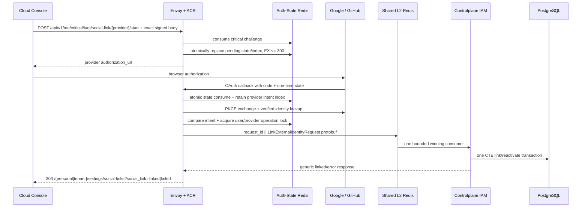

# User Settings — God View (Master SoT)

> Tài liệu này là Source of Truth cho self-user Settings của Cloud Console. Mọi thay đổi route,
> trường profile, social-link callback, critical proof hoặc durability boundary phải cập nhật
> tài liệu này trong cùng change-set.

## 1. Contract và ownership

| Phạm vi | Owner / SoT | Invariant |
|---|---|---|
| Settings UI | Cloud Console | Chỉ giữ UI state; không tự tạo user/tenant/Zone identity |
| Session và critical proof | ACR + Auth-State Redis DB0 | Challenge one-time, session-bound; fail-closed |
| Profile và social identity | Controlplane IAM + PostgreSQL | Durable business state |
| OAuth provider verification | ACR | PKCE/state/nonce, token exchange và provider parsing không đi xuống IAM |
| OAuth Central request/reply | Shared L2 Redis Pub/Sub | Bounded transport, không phải durable identity SoT |
| MFA pending/replay | Auth-State Redis DB0 | TTL/recoverable state |
| MFA secret và recovery hashes | PostgreSQL | Durable encrypted/hashed state |
| Device/session revocation | Controlplane IAM + ACR runtime indexes | PostgreSQL quyết định ownership; ACR xóa runtime session |

Settings là self-identity UI không phụ thuộc renderer và không cần
permission từ Render Context. UI có thể trình bày nó khi bất kỳ renderer
nào đang active, nhưng mọi request vẫn chỉ dùng một self contract `/me`;
không có personal/tenant API variant. Bốn tab hiện có các URL trình bày:

```text
/personal/settings/personalization
/personal/settings/mfa
/personal/settings/social-links
/personal/settings/devices
/tenant/settings/personalization
/tenant/settings/mfa
/tenant/settings/social-links
/tenant/settings/devices
```

Không có tab đổi mật khẩu hoặc API key giả. Username, account email và password không thể sửa
từ Settings. Password chỉ thay đổi qua workflow quên mật khẩu/recovery riêng.

## 2. Public API matrix

| Method/path | Auth | Kết quả |
|---|---|---|
| `GET /api/v1/me/iam/profile/read` | User session trong một Zone cụ thể | Account identifiers + editable profile |
| `PATCH /api/v1/me/iam/profile` | User session | Cập nhật profile atomically |
| `GET /api/v1/me/iam/mfa` | User session | Enrollment status + recovery count |
| `POST /api/v1/me/iam/mfa/setup/start` | User session | Pending Redis + one-time secret response |
| `POST /api/v1/me/iam/mfa/setup/:setup_id/confirm` | User session + TOTP | Persist enrollment + one-time recovery codes |
| `POST /api/v1/me/iam/mfa/recovery/regenerate` | User session + current TOTP | Replace recovery set atomically |
| `DELETE /api/v1/me/iam/mfa` | User session + current TOTP | Hard-delete enrollment and recovery hashes |
| `GET /api/v1/me/iam/social-link` | User session | Fixed Google/GitHub state list |
| `POST /api/v1/me/critical/iam/social-link/:provider/start` | User session + critical proof | ACR local authorization URL |
| `DELETE /api/v1/me/critical/iam/social-link/:provider` | User session + critical proof | Idempotent unlink |
| `GET /api/v1/me/iam/device/read` | User session | Owned devices |
| `POST /api/v1/me/iam/device/delete/:device_id` | User session | Revoke one non-current owned device |
| `POST /api/v1/me/iam/device/delete-others` | User session | Revoke all other devices |

Public `/api/v1/critical/*` không đi thẳng tới Controlplane. ACR verify proof rồi rewrite theo
session hiện tại thành `/api/v1/personal/critical/*` hoặc `/api/v1/tenant/critical/*`. Backend
chỉ nhận marker đã được Envoy/ACR strip-and-inject lại.

## 3. Profile contract

`users.username`, `users.email` và `users.password_hash` là immutable trong workflow này.
`users.email` là account identifier; provider email không bao giờ thay thế nó.

| Trường | Storage | Validation tại HTTP handler |
|---|---|---|
| `fullname` | `user_profiles.fullname` | trim, required, tối đa 120 |
| `phone` | `users.phone` | empty hoặc E.164-like `+[1-9][0-9]{6,14}` |
| `address` | `user_profiles.address` | trim, tối đa 500 |
| `avatar_url` | `user_profiles.avatar_url` | empty hoặc HTTPS, không credentials/query/fragment |
| `bio` | `user_profiles.bio` | trim, tối đa 500 |
| `locale` | `user_profiles.locale` | BCP-47 parse được, tối đa 16 |
| `timezone` | `user_profiles.timezone` | IANA location load được, tối đa 64 |

Handler parse strict một JSON object với body tối đa 16 KiB. Service và repository nhận entity
đã canonicalize, không validate lặp lại. Repository dùng một CTE statement để update `users`
và `user_profiles`; lỗi giữa hai bảng không tạo partial profile.

## 4. Social-link end-to-end



Link state binds `user_id`, `zone_id`, `tenant_id`, `client_device_id` và session proof public
key. Callback phải còn chính browser session; cookie/session replacement, Zone/tenant switch,
state replay hoặc unlink fence đều fail. Login và link dùng cùng provider verification nhưng là
hai workflow độc lập: public login không tạo/link user; authenticated link không cấp session mới.

ACR gửi IAM chỉ canonical identity đã verify:

```text
schema_version, operation_id, user_id,
provider, provider_subject, provider_email,
email_verified_at, display_name, avatar_url
```

Controlplane Pub/Sub handler là parse/validation boundary cuối của binary contract. Service và
repository tin entity đã canonicalize. PostgreSQL giữ:

- unique `(provider, provider_subject)`, nên một provider identity không thể thuộc hai users;
- partial unique active `(user_id, provider) WHERE revoked_at IS NULL`, nên một user chỉ có một
  active identity cho mỗi provider;
- `provider_email` chỉ là metadata verified snapshot;
- `linked_at` là lần explicit link/re-link mới nhất;
- `revoked_at` giữ soft unlink để bảo toàn subject ownership và ngăn account takeover bằng rebind.

Link persistence và unlink dùng chung lock
`iam:oauth:link:{sha256(user_id)}:{provider}:lock` TTL 15 giây. Callback chỉ acquire lock nếu pending
index vẫn trỏ đúng state đã consume, rồi xóa index trước khi gọi IAM. Unlink acquire lock trước,
xóa pending index rồi CTE set `revoked_at`. Vì vậy một unlink thành công không thể bị callback
đã inflight relink sau lưng:

- callback giữ lock trước thì link DB kết thúc trước; unlink đang concurrent fail/busy và phải
  retry rõ ràng, không báo success giả;
- unlink giữ lock trước thì callback không thể qua intent fence và trả generic failure;
- process chết giữ lock thì TTL giải phóng; không có local unlock/fail-open.

Nếu Redis lỗi, unlink fail-closed và durable link không đổi. Nếu DB lỗi sau khi index đã xóa,
link hiện tại vẫn tồn tại nhưng callback cũ đã bị vô hiệu; client retry unlink bằng critical
challenge mới. DELETE là desired-state idempotent, vì response success bị mất có thể retry an toàn.

Không password re-entry, reauth form hoặc MFA prompt cho link/unlink. Critical proof chứng minh
browser đang giữ private Ed25519 key bind với session và chống replay cho chính mutation.

## 5. MFA và recovery-code presentation

MFA durability và login gate thuộc
[Username Login](username_login_god_view_workflow.md) và
[Social Login](social_login_god_view_workflow.md). Settings áp dụng thêm UI invariants:

- pending setup/step replay ở Auth-State Redis; active encrypted secret/recovery hashes ở PostgreSQL;
- raw setup secret và raw recovery codes chỉ tồn tại trong response và React component memory;
- không đưa raw codes vào React Query cache, localStorage, IndexedDB, URL, log hoặc analytics;
- regenerate thay toàn bộ set; consume xóa row; remove hard-delete enrollment;
- UI không gọi trạng thái này là soft-disabled.

## 6. Device UX và cache fence

Device list query key luôn chứa auth generation, Zone hint và workspace selection để dữ liệu của
principal/context cũ không sống qua logout hoặc switch. Backend derive user và current
`client_device_id` từ trusted session/header rồi trả presentation field `is_current`; UI không
đọc cookie để tự tạo authorization claim.

Mutation revocation không auto-retry. Sau success UI invalidate scoped query. ACR/Controlplane
device workflow phải chịu duplicate theo desired state và không cho current device tự revoke
qua endpoint single-device. Repository so sánh bằng `client_device_id` (không phải primary key
`devices.id`) và mỗi workflow revoke chạy trong một CTE statement để DB device/refresh-token
state không bị partial.

## 7. HA, backpressure và failure semantics

- OAuth callback budget: Envoy 15 giây, ACR nội bộ 13 giây, tối đa 64 callback đồng thời mỗi pod.
- Shared L2 Pub/Sub có thể mất reply; request ID + SETNX winner chặn nhiều Controlplane replicas
  cùng xử lý. PostgreSQL uniqueness vẫn là concurrency authority cuối.
- Per-user/provider Redis lock serialize link persistence với unlink; TTL dài hơn callback budget
  và compare-and-delete release ngăn pod cũ xóa lock của operation mới.
- Link state token mang prefix `sha256(user_id)` để state key, intent index và operation lock có
  cùng Redis Cluster hash tag. Lua không cross-slot; raw user ID không bị lộ sang provider state.
- Mất Auth-State Redis làm critical challenge, link state và MFA pending fail-closed; không fallback
  bỏ proof/state. Durable profile/social/MFA state trong PostgreSQL không mất.
- Provider, Shared Redis, PostgreSQL hoặc Vault lỗi chỉ hiện generic link failure ở browser; raw
  subject/email/token không được log.
- UI GET có thể retry/refetch; mutation one-time proof/OAuth không tự retry mù.
- User activity append sau DB commit là best effort. Lỗi activity stream không đảo ngược durable
  link/unlink và không biến callback đã commit thành retryable side effect.

## 8. Code map

- UI routes/screens: `cloud-console/src/app/(console)/settings`,
  `cloud-console/src/features/settings`
- UI critical base: `cloud-console/src/shared/api/critical.ts`
- ACR OAuth/critical enforcement: `acr/src/user/oauth.rs`, `acr/src/gateway/ext_authz.rs`
- Shared protobuf: `proto/iam_auth.proto`
- Controlplane HTTP/PubSub: `controlplane/internal/iam/transport/http/handler/user_handler.go`,
  `controlplane/internal/iam/transport/pubsub/handler/auth.go`
- Durable repository/migration: `controlplane/internal/iam/repository/user_repo.go`,
  `controlplane/internal/iam/migrations/000002_iam_tables.up.sql`
