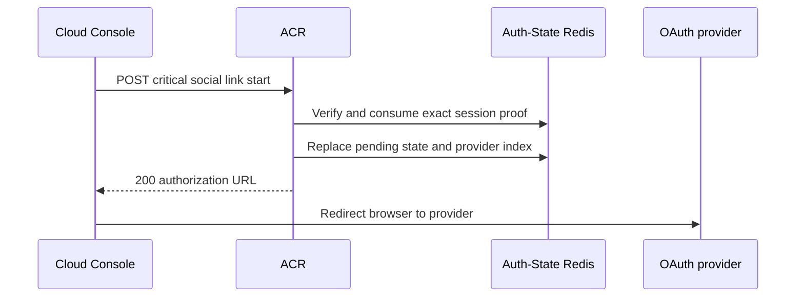
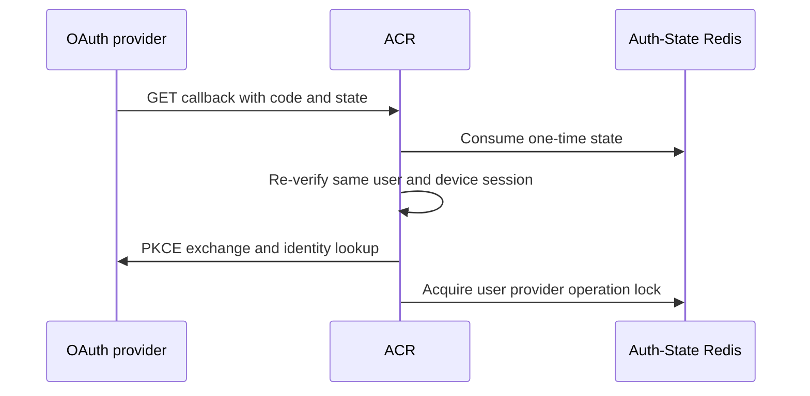
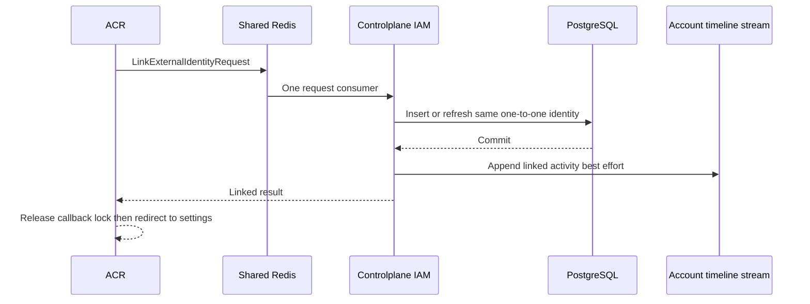

# User Social Link — God View (Master SoT)

This workflow attaches one verified Google or GitHub identity to the current
`/me` user. A user has at most one live identity per provider and a provider
subject belongs to at most one user. It does not create a session, tenant,
workspace or Zone.

| Phase | Owner | Output |
|---|---|---|
| 1. Authorize link start | Console → ACR | One provider authorization URL and one short-lived state |
| 2. Verify callback | Provider → ACR | Canonical verified provider identity bound to the same user and device |
| 3. Persist one-to-one link | ACR → IAM → PostgreSQL | Live identity row and best-effort account timeline event |

## Phase 1 — Authorize link start

### REST input and output

| Part | Contract |
|---|---|
| Method/path | `POST /api/v1/me/critical/iam/social-link/{google|github}/start` |
| Headers used | Session cookies and session-proof challenge ID, timestamp and signature |
| Payload | `{"return_to":"/personal/settings/social-links"}` or tenant settings equivalent |
| Success | `200` JSON with HTTPS `authorization_url` and `expires_in` |
| Failure | Invalid proof, session, provider, body or return path fails closed |

ACR consumes the one-time critical proof before it accepts the start. It derives
user and device from the verified session, creates PKCE verifier, nonce and an
operation ID, then atomically replaces an earlier pending state for the same
user/provider. Zone and tenant are only runtime-session lookup context and are
not carried in OAuth state or IAM identity ownership.

### Key contract

| Key | Store | Operation / TTL |
|---|---|---|
| `iam:session_proof:critical:{access_key}:{challenge_id}` | Auth-State Redis | Lua consume once, 60 seconds |
| OAuth state key | Auth-State Redis | Encrypted/serialized link state, at most 300 seconds |
| `iam:oauth:link:{sha256(user_id)}:{provider}` | Auth-State Redis | Pending-state index in same hash slot |

## Phase 2 — Verify provider callback

The provider callback consumes state once. ACR re-verifies the current browser
session and requires the same user ID, client device ID and session proof public
key captured at start. It then performs PKCE exchange, nonce and provider claim
validation locally. Provider tokens, authorization code and raw provider JSON
never reach IAM.

### Key contract

| Key | Store | Operation |
|---|---|---|
| OAuth state | Auth-State Redis | Consume once while retaining the provider index for Phase 3 fencing |
| `iam:oauth:link:{sha256(user_id)}:{provider}:lock` | Auth-State Redis | Callback lock, 15 seconds |

## Phase 3 — Persist the unique identity

ACR sends only `operation_id`, user ID and canonical identity fields in
`LinkExternalIdentityRequest` over bounded Shared Redis request/reply. IAM uses
one PostgreSQL statement. `external_identities_provider_subject_uk` prevents one
provider account from serving two users; `external_identities_user_provider_uk`
prevents two Google or two GitHub accounts for one user. A different provider
may coexist.

Timeline append to `stream:{user_activity}` uses action
`user.social_link.linked` after the identity transaction. It is best effort:
stream failure is logged and never changes an already committed link result.

## Security and code map

- A new start is possible after a completed unlink. An unlink that holds the
  same lock invalidates pending state, so an older callback cannot link after it.
- Account identifier email and password never change. Social login never creates
  or links an account implicitly.
- Sources: `acr/src/user/oauth.rs`, `acr/src/user/session_proof.rs`,
  `proto/iam_auth.proto`, `controlplane/internal/iam/transport/pubsub/handler/auth.go`,
  `service/user_service.go`, `repository/user_repo.go`.
